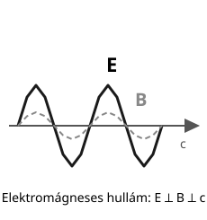
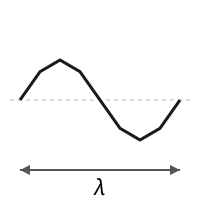
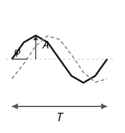

# Rádióelmélet

---

# Elektromos alapok

| Elektromos mennyiség | Vízanalógia |
|---|---|
| töltés (Q) | vízmennyiség |
| feszültség (U) | nyomáskülönbség |
| áram (I) | vízáramlás sebessége |
| ellenállás (R) | csővezeték szűkülete |

---

# Ohm-törvény

- $U = I \cdot R$
- áram nő, ha feszültség nő
- áram csökken, ha ellenállás nő

---

# Teljesítmény

- $P = U \cdot I$
- egység: watt
- energia és munka kapcsolata

---

# Elektromágneses tér

- elektromos mező
- mágneses mező
- rádióhullámok

---

# Frekvencia és hullámhossz

- $c = f \cdot \lambda$
- $c \approx 3 \cdot 10^8\;\mathrm{m/s}$
- frekvencia: Hz
- hullámhossz: m

---

# Szinuszos jel

- periodikus változás
- amplitúdó
- frekvencia
- fázis

---

# Összefoglalás

- alapjelenségek ismerete kell
- képletek egyszerűek, de fontosak
- rádióhullám = elektromágneses jel
