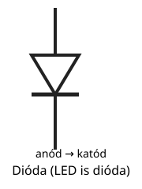
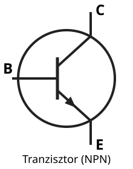

# Alkatrészek

---

# Ellenállás

- akadályozza az áramfolyamot
- jele: R
- mértékegysége: Ω (ohm)
- $R = \dfrac{U}{I}$

---

# Kondenzátor

- töltés tárolása
- kapacitás
- jele: C
- mértékegysége: F (farad)
- gyakori: nF, µF

---

# Induktivitás

- mágneses mező tárolása
- tekercs
- jele: L
- mértékegysége: H (henry)
- szerep: szűrés, rezonancia

---

# Dióda

- egyirányú vezetés
- javítás, egyenirányítás
- LED is dióda

---

# Tranzisztor

- erősítés
- kapcsolás
- alapvető elektronikai elem

---

# Fontos megjegyzés

- a műszaki felépítés egyszerű
- a gyakorlati használat számít
- az alaptermékek ismerete alap

---

# Összefoglalás

- ellenállás: korlátozza az áramot
- kondenzátor: tárolja a töltést
- tekercs: tárolja a mágneses mezőt
- dióda és tranzisztor: alapvető működés
