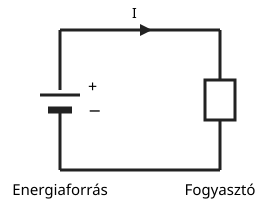
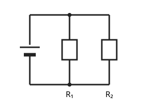
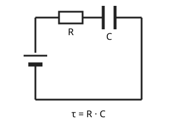

# Áramkörök

---

# Mi az az áramkör?

- energiaforrás
- fogyasztó
- vezetés
- zárás

---

# Soros kapcsolás

- ugyanaz az áram folyik rajta
- ellenállások összeadódnak
- $R_{e} = R_1 + R_2 + ...$

---

# Párhuzamos kapcsolás

- ugyanaz a feszültség
- áramok eloszlanak
- $\dfrac{1}{R_e} = \dfrac{1}{R_1} + \dfrac{1}{R_2} + ...$

---

# RC tag

- ellenállás + kondenzátor
- töltés és kisülés
- időállandó: $\tau = R \cdot C$

---

# Rezgőkör

- L + C
- rezonancia
- hangolás

---

# Alapvető feladat

- felismerni a kapcsolást
- kiszámolni az eredő értéket
- értelmezni a jelenséget

---

# Összefoglalás

- soros: áram egyenlő
- párhuzamos: feszültség egyenlő
- RC és LC: dinamikus viselkedés
