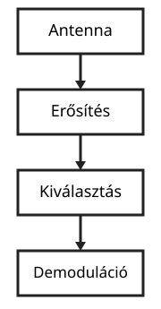
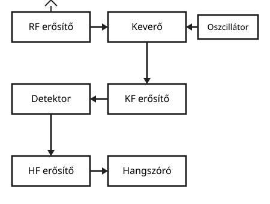
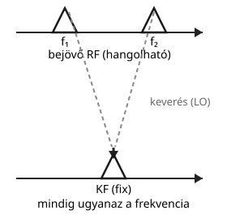
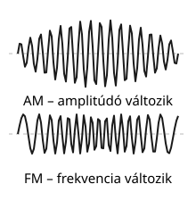

# Vevők

---

# A vevő feladata

- jel felvétele
- erősítése
- kiválasztása
- demodulálása

---

# Alapvető blokkok

- RF erősítő
- oszcillátor
- keverő
- középfrekvenciás erősítő
- detektor
- hangfrekvenciás erősítő

---

# Superhet szerkezet

- fix középfrekvencia
- könnyebb szűrés
- jobb szelektivitás

---

# Vevőjellemzők

| Jellemző | Mit jelent |
|---|---|
| érzékenység | milyen gyenge jelet tud még feldolgozni |
| szelektivitás | mennyire különíti el a szomszédos csatornákat |
| stabilitás | mennyire tartja meg a hangolást |
| zaj | mennyi zajt tesz hozzá a jelhez a vevő maga |

---

# Demoduláció

- AM
- SSB
- FM
- digitális jelek

---

# Fontos szempont

- a vevőben a jel és a zavar elkülönítése a lényeg

---

# Összefoglalás

- vevő = jelgyűjtés + feldolgozás
- szűrés és erősítés a kulcs
- superhet a leggyakoribb felépítés
