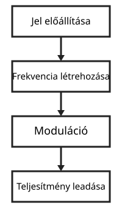
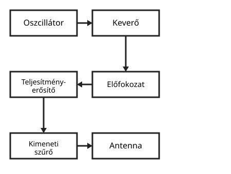
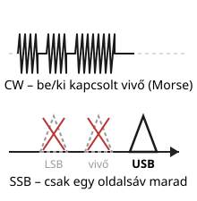
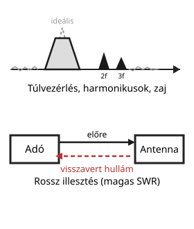

# Adók

---

# Az adó feladata

- jel előállítása
- frekvencia létrehozása
- moduláció
- teljesítmény leadása

---

# Alapvető blokkok

- oszcillátor
- keverő
- előfokozat
- teljesítményerősítő
- kimeneti szűrő

---

# Adó típusok

| Típus | Jellemző |
|---|---|
| CW | kulcsolt, folytonos hullám (Morse) |
| SSB | egysávos, gazdaságos sávszélesség |
| FM | frekvenciamoduláció, jó zajtűrés |
| digitális módok | pl. FT8, PSK31 – számítógépes feldolgozás |

---

# Fontos jellemzők

| Jellemző | Mit jelent |
|---|---|
| frekvenciastabilitás | mennyire tartja meg a beállított frekvenciát |
| kimenő teljesítmény | mekkora energiát ad le az adó |
| sávszélesség | mekkora frekvenciasávot foglal el a kibocsátott jel |
| torzítás | mennyire tér el a jel a tiszta, kívánt alaktól |

---

# Moduláció

- AM
- FM
- SSB
- CW

---

# Gyakori hibák

- túlvezérlés
- rossz illesztés
- zajos kibocsátás
- szennyezett spektrum

---

# Összefoglalás

- az adó a jel előállítója
- a stabilitás és az illesztés nagyon fontos
- a szabályos kibocsátás a kulcs
