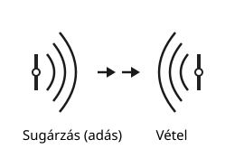
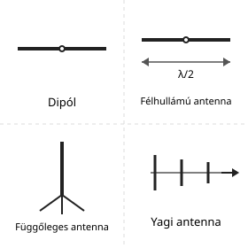
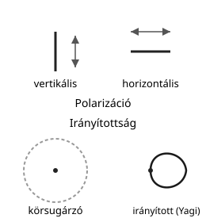
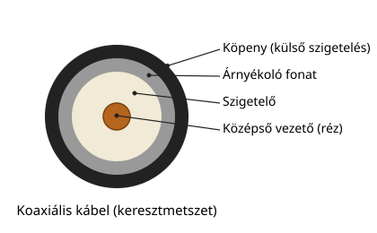

# Antennák és tápvonalak

---

# Antennák feladata

- sugárzás
- vétel
- átalakítás elektromágneses térre

---

# Alapvető típusok

- dipól
- félhullámú antenna
- függőleges antenna
- Yagi antenna
- hosszú drót

---

# Jellemzők

- impedancia
- polarizáció
- nyereség
- irányítottság

---

# Tápvonal

- kábel kapcsolja az adót és az antennát
- veszteség és illesztés fontos
- koaxiális kábel a leggyakoribb

---

# SWR

- állóhullámarány
- minél kisebb, annál jobb
- $SWR \approx 1$ ideális

---

# Illesztés

- antenna és adó illesztése
- rossz illesztés miatt veszteség és hő

---

# Összefoglalás

- az antenna a rádió „ablaka”
- a tápvonal és az illesztés is fontos
- az SWR jelzi az állapotot
