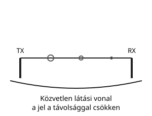
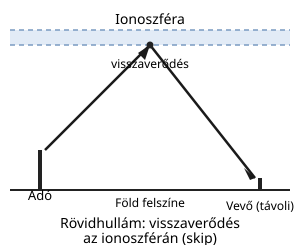
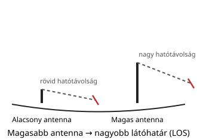
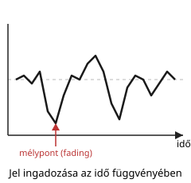

# Hullámterjedés

---

# Mi befolyásolja a terjedést?

| Tényező | Hatása |
|---|---|
| frekvencia | frekvencia ↑ → elnyelődés,  hatótávolság ↓ |
| antenna magassága | nagyobb látóhatár |
| eső, köd | a magasabb frekvenciás jeleket jobban gyengíti |
| ionoszféra | rövidhullámon visszaverheti a jelet, nagy távolságot áthidalva |
| terep | hegyek, épületek árnyékolják vagy eltérítik a hullámot |

---

# Földi terjedés

- közvetlen látási vonal
- távolság növekedésével csökken a jel

---

# Ionoszféra

- rövidhullámoknál fontos
- visszaverődés
- MUF, fading

---

# VHF és UHF

- line of sight
- néhány száz km és több
- időjárási hatás is lehet

---

# Fading

- jel ingadozása
- változó körülmények között
- terjedési zavarok

---

# Összefoglalás

- a terjedés nem mindig egyforma
- a környezet és a frekvencia döntő
- a hullámterjedés megértése alapvető
