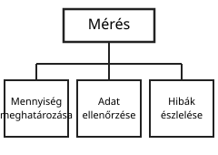
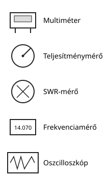
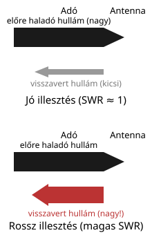
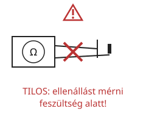

# Mérések

---

# Mérés célja

- mennyiség meghatározása
- adat ellenőrzése
- hibák észlelése

---

# Mérendő mennyiségek

| Mennyiség | Jelölés | Mértékegység |
|---|---|---|
| feszültség | U | V |
| áram | I | A |
| ellenállás | R | Ω |
| teljesítmény | P | W |
| frekvencia | f | Hz |

---

# Mérőeszközök

- multiméter
- teljesítménymérő
- SWR-mérő
- frekvenciamérő
- oszcilloszkóp

---

# SWR

- állóhullámarány
- $1$ közel ideális
- túl nagy érték rossz illesztést jelez

---

# Fontos szabályok

- ne mérj ellenállást feszültség alatt
- a műszer legyen a megfelelő tartományon
- a helyes bekötés lényeges

---

# Összefoglalás

- mérés = adat és kontroll
- a helyes műszer és bekötés fontos
- az SWR és a teljesítmény gyakori mérési pontok
