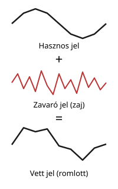
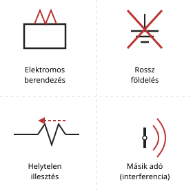
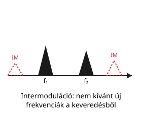
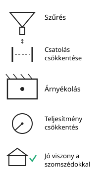
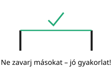
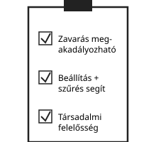

# Zavarás és védelem

---

# Mi a zavarás?

- hasznos jelhez nem kívánt jel társul
- ronthatja a vételt
- okozhat interferenciát

---

# Zavarforrások

- elektromos berendezések
- rossz földelés
- helytelen illesztés
- másik adó

---

# Intermoduláció

- különböző jelek keverednek
- új, nem kívánt frekvenciák keletkeznek

---

# Védekezés módjai

- szűrés
- csatolás csökkentése
- árnyékolás
- teljesítmény csökkentés
- jó viszony a szomszédokkal

---

# Alapvető szabály

- ne zavarjunk másokat
- a jó gyakorlat a legfontosabb

---

# Összefoglalás

- a zavarás megakadályozható
- a helyes beállítás és a szűrés segít
- a társadalmi felelősség is fontos
