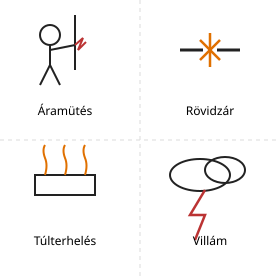
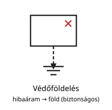
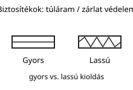
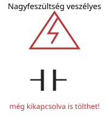
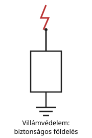
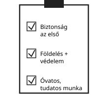

# Villamos biztonságtechnika

---

# A veszély forrása

- áramütés
- rövidzár
- túlterhelés
- villám

---

# Védőföldelés

- a veszély csökkentése
- megfelelő vezetés
- biztonságos építés

---

# Biztosítékok

- túláram védelem
- zárlat elleni védelem
- gyors és lassú típusok

---

# Nagyfeszültség

- veszélyes lehet
- kondenzátorok is veszélyesek
- mindig óvatosan kell dolgozni

---

# Villámvédelem

- antennák és villámvédelem
- megfelelő földelés
- csökkenti a károkat

---

# Összefoglalás

- a biztonság az első
- a földelés és a védelem alapvető
- mindig óvatosan és tudatosan dolgozzunk
