# 1. Rádióamatőr alapismeretek

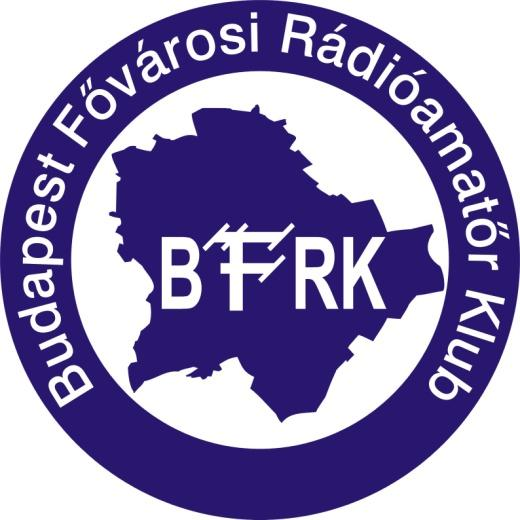

*Logo of the Budapest Fővárosi Rádióamatőr Klub (BFRK).*

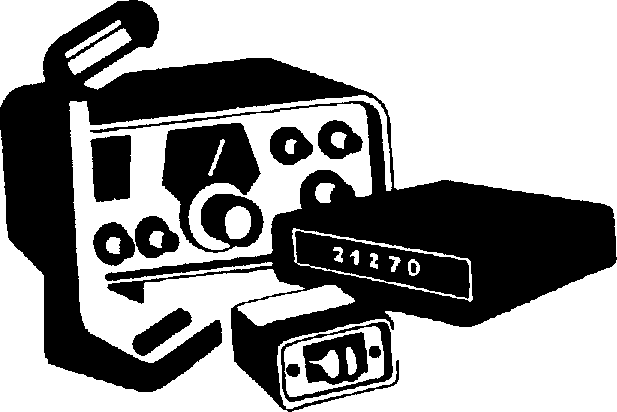

*Illustration of an amateur radio transceiver with a matching power supply/S-meter unit.*

## 1.1. Bevezetés

### 1.1.1. A jegyzet megszületésének okai

A rádióamatőr mozgalomhoz való csatlakozás hazánkban viszonylag egyszerű folyamat, le kell tenni a hatóságnál a rádióamatőr vizsgát, és az engedély birtokában lehet rádiózni. Ez tényleg egyszerűen hangzik, de a vizsga letételéhez szükséges ismeretanyag beszerzése és elsajátítása nem ilyen egyszerű folyamat. A hatóság minden érdeklődőnek azt tanácsolja, hogy forduljon a rádióamatőr klubokhoz, ahol megfelelő ismeretanyagot szerezhetnek és felkészülhetnek a vizsgára… Sajnálatos módon a mai rádióamatőr klubok nagy része alig fordít valami erőfeszítést az utánpótlásra, vizsgára készülők segítésére. Tömegével tűnnek el a klubok, még azok is, amelyek annak idején nagyok voltak, és sikeresek. Ezt a problémát elsősorban napjainkban a szabadidő hiánya, hobbi célra fordítható források hiánya okozza, továbbá az Internet és mobil világ térhódításának is köszönhető. Ezt a jegyzetet a HA5KDR klub tagjai azért készítették, hogy segítse a kezdő amatőrök beilleszkedését az amatőr társadalomba és a jelenleg hatásos jogszabályoknak megfelelő vizsga letételében segítse őket. Nagyon fontos, hogy ez a jegyzet egy felkészülést segítő anyag, ami nem tartalmazza a rádióamatőr tevékenységhez szükséges átfogó ismeretanyagot, hanem csak a vizsgához szükséges alapismeretek vannak benne összeszedve. Ez két okból van így: elsősorban terjedelmi korlátok, másrészt ez a jegyzet a HA5KDR rádióklub tanfolyamán használt „tankönyv”. A jegyzet alapja az 1978-ban megjelent „Rádióamatőrök kézikönyve" című mű, amely – ugyan – nem ma íródott anyag, de a benne leírt forgalmazási és műszaki ismeretek többsége a mai napig jól használható ismeret. További célunk, hogy a magasabb kategóriás vizsgák anyagával kibővítjük eme jegyzetet, és akkor talán adhatjuk ugyanezt a címet művünkhöz. Sok ábrát kölcsönöztünk a fent említett könyvből, és még többet újrarajzoltunk, hogy színesebbé és érthetőbbé tegyük a leírt anyagot. A tanfolyam hallgatói részére levelező listát is működtetünk, ahol lehetőség nyílik a tananyaggal kapcsolatban felmerült kérdések megbeszélésére. A jegyzet digitális melléklete, az aktuálisan frissített tartalommal, a hallgatóink részére klubunk honlapjáról letölthető: http://www.ha5kdr.hu/projektek/oktatas/anyagok A HA5KDR rádió klub nevében a jegyzet készítői bíznak abban, hogy ez a jegyzet megkönnyíti a felkészülést a vizsgára, továbbá, hogy kellő alapot nyújt a magasabb szintű vizsgák letételére vállalkozó amatőröknek; végezetül kívánjuk, hogy sikeres rádióamatőr legyen e jegyzet olvasója!

A jegyzet szerkesztői (HA5OGL, HG5OJG)

### 1.1.2. A Rádióamatőr mozgalomról

Mielőtt, a jegyzet ismeretanyagában elmélyülve azon gondolkodnánk, hogy „miért kell ezt mind megtanulni és hol hasznosítható ez a tudás?”, szeretnék pár mondatot írni arról, hogy "Kik azok a rádióamatőrök." A köznapi nyelvhasználatban az amatőr szó jelentése alatt olyan személyt értenek, aki egy adott dologgal nem hivatásszerűen foglakozik, esetleg szakképesítés nélkül hódol szenvedélyének. Viszont a rádióamatőrök azok a szabályszerűen jogosított személyek, akik a híradástechnikával csupán személyes érdeklődésből, anyagi érdek nélkül foglalkoznak, sokszor csak a szabadidejük hasznos eltöltése céljából, hobbiból. A kísérletező kedvű rádióamatőrök sok időt, pénzt és energiát áldozva kedvtelésüknek, keresik az új lehetőségeket. Tevékenységük közben sok ismeretre tesznek szert, sőt kísérleteik eredményét helyenként még ma is hasznosítják a professzionális kutatók. Ez nem csak öncélú kikapcsolódás, hanem igen komoly szakmai tanulmány is lehet. Azon fiatalok, akik már gyermekkorban érdeklődnek az elektronika, rádiótechnika, számítástechnika iránt, vagy már művelői valamely területnek, később kiváló szakemberekké válhatnak. A rádióamatőr mozgalom történetében külön fejezetet érdemelne azoknak az eseményeknek a sora, amikor a rádióamatőr mindenkori segítőkészségét példázzák. Vészhelyzetek, természeti katasztrófák (árvízveszély, földrengés, hóvihar, légi, tengeri balesetek) esetén hírháló létrehozásával is együttműködnek a nemzeti és nemzetkőzi hivatalos szervekkel. Történelmi oldalról tekintve a rádióamatőrizmus egyidős magával a rádióval, létezését Marconi kísérleteitől számíthatjuk. A XX. század elején sok szakember és rádióamatőr kísérletezett a rádiózással, vállvetve dolgoztak mind jobb berendezések kifejlesztésén és az éter meghódításán. A kezdeti kísérletek után a kormányzatok bevezették az engedélyezési eljárást és szétválasztották a rádióamatőr- és műsorszóró sávokat. Az I. világháborúban a rádióamatőrök a kísérletezést kénytelenek voltak mellőzni és híradósként tevékenykedtek. Ez időszak alatt sok tapasztalatot szereztek a rádióhullámok terjedéséről és egyre nagyobb távolságokat voltak képesek áthidalni rádióhullámok segítségével. A 20-as évek elején, belátva a rádióamatőrök tevékenységének hasznosságát, nemzetközi konferencián jelölték ki a rádióamatőrök által használható frekvenciasávokat (160 m, 80 m, 40 m, 20 m, 10 m). Ezekhez a sávokhoz azóta számos további társult, elsősorban a rövidebb hullámsávok használatának köszönhetően. A magyarországi rádióamatőrizmus a 20-as évek elején jelent meg, majd 1927-es évben alakult az első klub (Műegyetemi Rádió Klub). A 30-as években már több mint 500 rádióamatőr és további néhány rádióamatőr klub működött az országban. Megalakult a hivatalos szervezet is (MRAE), amely 1937-ben MRAOE-re változtatta a nevét. A II. világháború után nehéz idők következtek a rádióamatőrök számára is: többször próbáltak szövetséget létrehozni, működtetni, amelyek több politikai csata áldozataivá váltak. Végül a mozgalmat beolvasztották az MHSZ-be (Magyar Honvédelmi Szövetség), így a rádióamatőrizmus hazánkban a rendszerváltásig az MHSZ keretein belül működött. 1989-ben sok változás mellett átalakult a mozgalom is és teljesülhetett sok rádióamatőr vágya: megalakították az első önálló szervezetet a Magyar Rádióamatőr Szövetséget (MRASZ). A ’90-es évek elején már több mint 4000 engedélyes rádióamatőr volt hazánkban, tevékenységüket szabadabban folytathatták, mint a rendszerváltás előtti időszakban. Így olyanok is engedélyt szerezhettek, akiknek azelőtt erre nem volt lehetőségük. Végül a 2000-ben született KHVM rendelet (7./2000 KHVM rendelet) értelmében pedig a rádióamatőr tevékenység jogi szabályozása is valóban „rendszerváltáson” mehetett keresztül. A rendeletben számos rádióamatőröket érintő probléma szabályozottá vált, többek között a vizsgáztatás, az engedély megszerzése is. A 8/2002 (XII. 25) IHM rendelet megszületése nem hozott sok új jogi szabályozást, de sikerült egy-két igen elhibázott jogi lépést elkövetni, amely az amatőrök között nem okozott osztatlan sikert, továbbá a vizsgáztatás és engedélykiadás is hasonlóképp „fejetlenné” vált néhány területen. Ezt a rendeletet váltotta fel a 6/2006. (V. 17.) IHM rendelet. Ennek a rendeletnek a megszületését hosszú egyeztetés előzte meg a rádióamatőrök képviselőivel, továbbá a rendelet megszületését az EU jogharmonizáció is szükségessé tette. Így letisztult a vizsgakövetelmény rendszere, az engedélyek rendszere átvette a nemzetközi (EU) formát, továbbá feloldásra került az RH sávok használatának távíróvizsgához való kötése! Így letisztult a távíróvizsga funkciója: csak távíróvizsgával használható a távíró üzemmód, minden sávon! További apró módosításokkal a `15/2013. (IX.25.) NMHH rendelet` érvényes jelenleg a rádióamatőr szolgálatok részére. A rádióamatőröknek kőtelezően előirt forgalmi, és műszaki vizsgát kell tenni, (úgynevezett rádiós KRESZ-t). A "szabályszerű jogosítványt" az adóengedélyt a Nemzeti Média és Hírközlési Hatóságnál (közismertebb nevén NMHH-nál) vizsgával lehet megszerezni. A vizsga követelményeiről bővebben a fejezet végén található írásunk. A rádióamatőr elnevezés nemzetközileg elfogadott hivatalos minősítés. Azon személy, aki rendelkezik rádióamatőr vizsgával, rádióadó berendezést üzemeltethet a kijelölt frekvencia sávokban, különböző üzemmódokban, rádióamatőr célra. A közismert CB (PMR)-rádiózáshoz vizsga nem szükséges. Az amatőrrádiózás és a CB (PMR)-rádiózás két különböző dolog és "fogalom". Az egész világon népszerű ez a hobbi, napjainkban közel 3 millió a kiadott engedélyek száma, évi 7%-os növekedés tapasztalható. (Hazánkban 3 ezer engedélyes rádióamatőr van jelenleg). A Földön szinte nincs olyan ország, ahol ne lenne rádióamatőr. Olyan kis szigeten, ahol kevés vagy egyáltalán nincs lakosság, oda expedíciókat szerveznek a rádióamatőrök. Azonban már a világűrben keringő űrállomáson is megtalálható a rádióamatőr készülék. A rádióamatőröknek saját műholdjuk is kering a világűrben (nem is egy). Nemzetközi együttműködés keretein belül készítik a részegységeket a világ számos Műszaki Egyetemein tanuló diákok, s tanárok. A rádióamatőrök munkájuk során legtöbbször az összeköttetés útján találkoznak egymással. A rádióamatőr életében viszont fontos a szakmai fejlődés, önképzés, az ismeretek bővítése. Ebben nagy segítséget nyújtanak a rádióamatőr klubok, melyekben lehetőség nyílik a kollektív munkára, konzultációkra, utánpótlás képzésére. A rádióamatőrré válás általában hosszabb folyamat. Koronként és személyenként is változó lehet. Rádióklubjainkat nap, mint nap mind több érdeklődő keresi fel az örök kérdéssel: "Hogyan lehetek rádióamatőr?". Nos, hazánkban hivatalos rádióamatőr tanfolyam és képzés - a hatóság által szervezett formában - nem létezik. Az utánpótlás nevelésével elsősorban a rádióamatőr klubok foglalkoznak. Tehát, célszerű az utánpótlás neveléssel foglakozó klubokat megkeresni, ahol általában lehetőséget adnak arra, hogy rádióamatőr tanfolyamra beiratkozzunk. A Budapest Fővárosi Rádióamatőr Klub is szervez vizsgára felkészítő tanfolyamokat, mely tananyagát a `15/2013. (IX.25.) NMHH rendelet` témakörei szerint összeállított Rádióamatőr Vizsgára Felkészítő jegyzet képezi. Ezen jegyzetet a HA5KDR klub tagjai azért készítették, hogy segítse azokat, akik rádióamatőrökké szeretnének válni, abban, hogy sikeres vizsgát tegyenek. Egyben hiánypótlásnak is tekinthető, mivel kevés "jó minőségű" felkészítő anyag létezik, nem beszélve azokról, amik az új jogszabálynak megfelelnek.

## 1.2. Rádióamatőrökkel fogalakozó nemzetközi és nemzeti szervezetek

### 1.2.1. Nemzetközi Távközlési Egyesület (ITU)

Az International Telecommunication Union (ITU) koordinációs feladatokat lát el a nemzetközi távközlési szervezetek, kormányok és a magánszektor között a globális távközlési hálózatok és szolgáltatások területén. Az ITU székhelye jelenleg Genfben van. Az ITU egységei:

- ITU-R: távközlési ajánlásokat készít,

- ITU-T: távközlési szabványokat alkot,

- ITU-D: távközlési fejlesztési iroda.

### 1.2.2. Nemzetközi Rádióamatőr Szövetség (IARU)

Az International Amateur Radio Union (IARU) országokat képviselő tagszervezetekből épül fel. Az IARU 1925-ben Párizsban jött létre azért, hogy a világ rádióamatőr közösségét összefogja és érdekeit képviselje. Magyarországi tagszervezete a MRASZ. Az IARU tevékenysége:

- Tagszervezetek koordinálása, tevékenységük nemzetközi felügyelete,

- QSL irodák nemzetközi szintű koordinálása és felügyelete,

- WRC (World Radiocommunication Conference) konferenciákon az amatőr érdekképviselet ellátása (az IARU-nak köszönhető a: 10, 18 és 24 MHz-es sáv, továbbá a 7 MHz kiterjesztése (2003-ban)),

- Rádióamatőr aktivitás növelése (versenyek szervezése), pl.: IARU contests,

- Számos rádióamatőr projekt menedzselése (jeladók stb.)

### 1.2.3. Magyar Rádióamatőr Szövetség (MRASZ)

A Magyar Rádióamatőr Szövetség a szervezett rádióamatőr tevékenység feladatainak ellátására létrehozott országos sportági szövetség, mely önkormányzati elv alapján az Alapszabálya szerint tevékenykedő, nyilvántartott tagsággal rendelkező szövetsége a bíróság által bejegyzett sportági társadalmi szervezeteknek. A szövetség szervezi, irányítja és ellenőrzi a rádióamatőr sportágban és a szervezett rádióamatőr tevékenységben megjelenő feladatok végrehajtását, képviseli a sportág és tagjainak érdekeit, közreműködik az állami sportfeladatok ellátásában, részt vesz a nemzetközi rádióamatőr szervezetek munkájában, továbbá kapcsolatokat épít ki és tart fenn a külföldi rádióamatőr szövetségekkel. A szövetség tagja a Nemzeti Sportszövetségnek, valamint a nemzetközi rádióamatőr szervezetnek, az IARUnak, a területileg illetékes IARU Region 1 szervezeti tagságon keresztül. A szövetség célja:

- A rádióamatőr sportági versenyzők és a rádióamatőrök összefogása, tevékenységük szervezése, összehangolása és irányítása. 
Megteremti (a társadalom minél szélesebb rétegei számára) a rádióamatőr sportban és tevékenységben való részvétel és a versenyzési tevékenység lehetőségét: 
a.) versenysport tevékenységek, 
b.) önképzési,     szervezett   szakmai     továbbképzési,   oktatási   és   utánpótlás-nevelési tevékenységek, 
c.) műszaki fejlesztési, konstrukciós, tervezési és kísérletezési tevékenységek, 
d.) általános és speciális rádióforgalmi tevékenységek feltételeinek biztosításával. 
Elősegíti ezzel a rádióamatőrök szakmai általános és speciális műszaki műveltsége szintjének emelését, a sportolók eredményességének növelését a rádióamatőr tevékenység folyamatos fejlesztését és társadalmi elismertségének növelését.

- Képviseleti és érdekvédelmi feladatok ellátása hazai és nemzetközi szervezetekben, államigazgatási szerveknél, hivataloknál, egyéb fórumokon.

- A megszerzett elvi ismeretanyagok, gyakorlati tudás és a rádiótechnikai eszközállomány felhasználásával a társadalom érdekében végzett munkák kiszélesítése, valamint segíteni az élet és vagyonbiztonság megóvását, a rendezvényi, készenléti, segély- és vészhelyzeti hírszolgálatokban való aktív részvétellel.

- Törekvés a professzionális híradástechnika munkáiba való bekapcsolódásra, a tudományos és fejlesztő szervezetek, intézetek és vállalatok feladatainak megfigyelésekkel és kísérletekkel való támogatása által.

- Tagként való részvétel az International Amateur Radio Union (IARU) Region 1 munkájában. A szövetség megbízottainak, tisztségviselőinek részvételével, az IARU egyes munkacsoportjaiban vagy szerveiben tagként vagy tisztségviselőként sportdiplomáciai tevékenység folytatása.

- A népek közötti megértés és barátság elősegítése.

## 1.3. Rádióamatőrökre vonatkozó jogszabályok

### 1.3.1. Hazai szabályozás

A rádióamatőrökre elsősorban a nemzeti szabályozások az elsődlegesek, hazánkban a jelenleg hatályos jogszabály: `15/2013. (IX.25.) NMHH rendelet`, és a nemzeti szabályozások után a nemzetközi szabályok következnek.

### 1.3.2. A Nemzetközi Távközlési Egyesület (ITU) Rádiótávközlési Szabályzatából

Rádióamatőr szolgálat

Amatőrszolgálat: olyan távközlési szolgálat, amelynek célja az önképzés, az információcsere, a műszaki fejlődés, és amelyet erre szabályszerűen felhatalmazott amatőrök végeznek, akik a rádiótechnikával csak személyes érdeklődésből és anyagi érdek nélkül foglalkoznak.

Műholdas amatőrszolgálat: rádiótávközlési szolgálat, amely a Föld műholdjain elhelyezett űrállomásokat használja fel ugyanarra a célra, mint az amatőrszolgálat.

Rádióamatőr állomás

A rádióberendezés (a rádióadó, adó-vevő berendezés), a tápellátását szolgáló tápegység, az antenna és tartozékai (pl. antenna kábel) együttesen alkotják a rádióállomást, amatőr szolgálat esetén a rádióamatőr állomást.

#### 1.3.2.1. A Nemzetközi Rádiószabályzat 25. cikkelye a rádióállomások azonosításáról

A Nemzetközi Rádiószabályzat 25. Cikkelye szerint minden rádióadást azonosítani kell. Az amatőr szolgálatban minden adásnak tartalmaznia kell az azonosító jelet, amely amatőrállomás esetében a hívójel. Tilos hamis vagy félrevezető azonosító jelet adni.

Az azonosító jel adható beszéddel (egyszerű amplitúdó- vagy frekvenciamoduláció használatával), kézi ütemmel adott nemzetközi Morse-kóddal, a hagyományos távgépíró kóddal, vagy más, a CCIR által javasolt formában.

Az adott Cikkely határozza meg a hívójelek képzésének módját is. A hívójel az ABC 26 betűjéből továbbá számjegyekből állhat (ékezetes betűk nem használhatók). Nem alkalmazhatók hívójelként olyan kombinációk, amelyek pl. vészjelekkel téveszthetők össze, vagy a rádiószolgálatnál rendszeresített rövidítésekkel egyeznek meg. (Amatőr állomások hívójele nem lehet olyan kombináció, amely számokkal kezdődik és második jegye O vagy I betű.) Az első két jelnek két betűnek, vagy egy betűnek kell lennie, amelyet egy számjegy követ, vagy egy számjegynek, amit egy betű követ. A hívójel első két (egyes esetekben első) jele képezi a nemzeti azonosítót. A magyar rádióamatőr hívójelek HA vagy HG betűkkel kezdődnek.

### 1.3.3. Rádióamatőr frekvenciasávok

Az ITU megfelelő régiójában kijelölt frekvenciatartományban az egyes országok nemzeti hatóságai határozzák meg az amatőrök által használható frekvenciákat. (A vizsga, illetve az engedély fokozatától függően az engedélyezett frekvenciatartományok, vagy üzemmódok különbözőek lehetnek).

Magyarországon valamennyi rádiósáv felosztásáról rendelkezik a Frekvenciasávok Nemzeti Felosztási Táblázatának (FNFT) megállapításáról szóló 304/2011.(XII. 23) Kormányrendelet módosítás, valamint a frekvenciasávok felhasználási szabályainak megállapításáról szóló 7/2011. (X.6) NMHH rendelet

(A sávok listáját lásd később.)

### 1.3.4. A rádióamatőr szolgálatok jogállása

Egyes esetekben ugyanazt a frekvenciasávot több, különböző rádiószolgálatnak is kiadják. Az FNFT ebben az esetben meghatározza, hogy az adott sávban melyik szolgálat az elsődleges, és melyik a másodlagos jogállású.

Az ilyen, más szolgálattal megosztott frekvenciasávban a másodlagos jogállású állomás köteles tűrni az elsődleges jogállású állomástól származó zavartatást, ugyanakkor ő nem okozhat zavart az elsődleges szolgálatnak.

A rádióamatőrök a részükre kijelölt frekvenciasávok egy részét kizárólagosan használhatják, más részét másokkal megosztva, utóbbi esetben a sáv különböző tartományaiban elsődleges ill. másodlagos felhasználóként.

Az amatőrszolgálat jogállását is tartalmazó részletes frekvenciatáblázat a rádióamatőrökre vonatkozó jogszabályban `15/2013. (IX.25.) NMHH rendelet` megtalálható.

### 1.3.5. A Postai és Távközlési Igazgatások Európai Értekezlete (CEPT) által kiadott szabályozások

A `T/R 61-01` és `T/R 61-02` Ajánlások

A CEPT (European Conference of Postal and Telecommunications Administrations) tagállamai megállapodtak abban, hogy egységes rádióamatőr képzési és vizsgáztatási rendszert (Harmonized Amateur Radio Examination Certificate = HAREC) vezetnek be, és a HAREC alapú amatőrvizsgát kölcsönösen elismerik. A T/R 61-02 Ajánlás a HAREC vizsga követelményeit tartalmazza.

Ugyancsak megállapodtak abban, hogy azoknak a rádióamatőröknek, akik a T/R 61-02 ajánlás szerinti HAREC vizsgát tettek, a tagállamok CEPT kategóriájú amatőr rádióengedélyt állíthatnak ki, és az ilyen engedéllyel rendelkező amatőrök egymás országaiban tett rövid látogatásaik alkalmával – a vendéglátó ország szabályait betartva – minden további előzetes engedély beszerzése nélkül forgalmazhatnak. Mindezt a T/R 61-01 Ajánlás tartalmazza.

A T/R 61-01 Ajánlás alapján tevékenykedő nem CEPT tagországok helyzete

A CEPT szabályai a CEPT ajánlásait elfogadó nem CEPT tagországokra is vonatkoznak. Így pl. Magyarországon is elismerik a nem CEPT tagországban kiadott, HAREC jelzésű amatőr vizsgabizonyítványt, és annak alapján magyar amatőr rádióengedély kérelmezhető.

### 1.3.6. Nemzeti törvények, szabályozások, engedélyezési feltételek

Rádióengedély, amatőrvizsga

Magyarországon a rádióamatőr szolgálatról a `15/2013. (IX.25.) NMHH rendelet` rendelkezik. A jogszabály leszögezi, hogy amatőr rádióállomást üzemeltetni (vagy azon rádióforgalmat lebonyolítani) csak amatőr rádióengedély birtokában szabad. Az amatőr rádióállomás lehet a kereskedelemben beszerzett, a hatályos műszaki követelményeknek megfelelő rádióberendezés, vagy amatőr által, amatőr számára készített, vagy átalakított berendezés.

Önállóan csak az forgalmazhat, aki rádióengedéllyel rendelkezik.

Közösségi rádióállomáson önálló engedéllyel nem, de vizsgabizonyítvánnyal rendelkező személy CEPT fokozatú rádióengedéllyel rendelkező személy felügyelete mellett forgalmazhat.

Vizsgabizonyítvánnyal nem rendelkező, rádióamatőr vizsgára felkészülő személy (tanulási céllal) CEPT fokozatú rádióengedéllyel rendelkező oktató közvetlen irányítása mellett, az oktató vagy a közösségi rádióállomás hívójelét használva forgalmazhat.

Rádióengedélyt az a természetes személy kaphat, aki Magyarországon kiállított rádióamatőr vizsgabizonyítvánnyal (vagy külföldön kiállított HAREC vizsgabizonyítvánnyal) rendelkezik. Olyan személy is folyamodhat (ideiglenes, NOVICE) magyar rádióengedélyért, aki külföldön kiadott (nem CEPT megjelölésű) rádióengedéllyel rendelkezik.

Magyarországon a rádióamatőr vizsgát három fokozatban (kezdő, alap, HAREC) lehet letenni, melyek alapján kezdő, CEPT novice, illetve CEPT kategóriájú engedély kérelmezhető.

Sikeres vizsga esetén a hatóság kiadja jogszabály mellékletének megfelelő, többnyelvű vizsgabizonyítványt. A vizsgabizonyítvány birtokában, a jogszabály mellékletét képező űrlap kitöltésével és elküldésével kérelmezhető az amatőr rádióengedély. A rádióengedély Magyarország területén, a jogszabályban meghatározott ideig érvényes (hosszabbítását az érvényesség lejárta előtt legalább 60 nappal lehet kérni). Az engedélyben kijelölik az állomás – a jogszabályban megadott módon képzett – hívójelét.

Ha a közösségi engedélyes QTH-ja 60 napnál nem hosszabb időre megváltozik, azt előzetesen be kell jelentenie a hatóságnak. Hosszabb idő esetén az engedély módosítását kell kérni.

#### 1.3.6.1. Hatósági ellenőrzés

Az amatőr rádióállomások üzemét a hatóság ellenőrizheti, magát a berendezést (legfeljebb 15 napig tartó) laboratóriumi mérésnek vetheti alá. Előírhatja, hogy az engedélyes megadott ideig az állomás működésének bizonyos (a hatóság által meghatározott) adatait naplószerűen rögzítse (lásd a 14. fejezetben).

#### 1.3.6.2. A rádióengedély visszavonása

A hatóság visszavonja a rádióengedélyt attól, aki:

- QTH-ja változását nem jelenti be a hatóságnak, és ezt a hatóság felszólításában közölt határidőre sem pótolja,

- akivel szemben ezt a bíróság jogerős ítélettel elrendelte,

- aki ellen harmadik alkalommal hoztak a rádióamatőr tevékenységgel kapcsolatos, jogerős, elmarasztaló szabálysértési döntést.

Az engedély nélkül működő rádióállomás üzemeltetője ellen szabálysértési eljárást indítanak, magát a berendezést a hatóság lepecsételheti vagy elkobozhatja.

### 1.3.7. Rádióamatőr állomásokra vonatkozó egyéb jogszabályi kötelezettségek

A rádióamatőr állomásokon használható frekvenciasávokat, legnagyobb adóteljesítményeket és adásmódokat a rádióamatőr engedélyének szintje határozza meg, amelyről a `15/2013. (IX.25.) NMHH rendelet`ben (a jogszabályban) szereplő táblázatból (milyen sávokon, milyen teljesítmény és üzemmód használható) tájékozódhatunk. Rádióamatőr állomásnak a forgalmazás során törekedni kell arra, hogy a kisugárzott teljesítmény a legnagyobb megengedett szinten belül ne lépje túl az összeköttetés biztonságos fenntartáshoz szükséges értéket. A rádióamatőr köteles betartani a 0Hz-300GHz közötti frekvenciatartományú elektromos, mágneses és elektromágneses terek lakosságra vonatkozó egészségügyi határértékeiről szóló miniszteri rendeletben foglaltakat. Az amatőrállomás által okozott, illetve tűrt rádiózavarokra vonatkozóan az Eht. 68. §-a és a polgári frekvenciagazdálkodás egyes hatósági eljárásairól szóló miniszteri rendelet rendelkezéseit kell alkalmazni. A rádióamatőr állomások adó és adóvevő berendezésein végzendő beállítási, javítási és mérési feladatokat lezáró ellenálláson (műantennán) kell elvégezni. Rádióamatőr állomásnak forgalmazás során az alábbi iratokat a rádióamatőr állomás helyén kell tartani: 

1.     Általános követelmény: 

	1.a.   rádióamatőr engedély, 
	
	1.b.   forgalmi napló, 
	
	1.c.   rádióamatőr állomás műszaki leírása, tömbvázlata, saját készítésű berendezések kapcsolási rajza.

2.   Továbbá különleges állomások esetén: 

	2.a.    Közösségi és különleges engedéllyel rendelkező rádióamatőr állomás esetében az állomás helyén kell tartani a felsoroltakon kívül az állomáson rádióamatőr tevékenységet folytató személyek névjegyzékét, működési jogosultságuk sávhasználat és adásmód szerinti feltüntetésével. 
	
	2.b.    Mozgó rádióamatőr állomás és a nem telepítési helyen történő forgalmazás esetén a rádióamatőr engedélyt, vagy a rádióamatőr igazolványt, továbbá a személyazonosságot igazoló iratokat kell kéznél tartani, 
	
	2.c.    Személyzet nélkül működő állomás esetén az iratokat az állomáson vagy az üzemben tartó címén kell tartani.

## 1.4. Az amatőrállomás fajtái

A kiadott amatőr engedély szerint az amatőrállomás lehet:

- egyéni,

- közösségi, vagy

- különleges amatőrállomás. Egyéni amatőrállomást egy természetes személy tart üzemben. Közösségi amatőrállomást rádióamatőr közösség tart üzemben. Különleges amatőrállomás az egyéni, illetve közösségi üzemben tartástól függetlenül:

- a rádióamatőr átjátszó állomás, amely alkalmas a különféle adásmódú, rádióamatőr célt szolgáló adás automatikus továbbítására azonos rádióamatőr sávon belül vagy különböző rádióamatőr sávok között;

- a rádióamatőr jeladó állomás, amely általában folyamatos működésű, felügyelet nélküli amatőrállomás egy adott helyen, és amely meghatározott időnként azonosító információt (a köztes időszakban modulálatlan vivőt) sugároz az elektromágneses hullámok terjedésének tanulmányozására, vizsgálatára, az amatőrállomás berendezéseinek ellenőrzésére vagy egyéb rádióamatőr tevékenység elősegítésére;

- a rádiós tájfutó versenyen elhelyezett amatőrállomás;

- a rádióamatőr kapuállomás, amely rádióamatőr átjátszó állomások összekapcsolását megvalósító amatőrállomás;

- a rádióamatőr információt sugárzó amatőrállomás;

- a rádióforgalmi versenyen működtetett amatőrállomás (a továbbiakban: versenyállomás);

- a nemzeti ünnep, történelmi évforduló, közismert személyről való megemlékezés, vagy egyéb rendezvény alkalmából működtetett amatőrállomás (a továbbiakban együtt: alkalmi amatőrállomás).

## 1.5. Hívójelek

A rádióamatőr állomásokat fontos, hogy azonosítani lehessen. Továbbá fontos, hogy ez az azonosító szabványos legyen, és egyedi. Mivel csak ezzel biztosítható az, hogy a világ bármely rádióamatőr állomása megkülönböztethető legyen. Ez az azonosító a rádióamatőr hívójel. A hívójelek képzésének nemzetközi rendszerét az ITU határozta meg a Nemzetközi Rádiószabályzat 19. pontjában. A hívójelek országokhoz rendelése a szabályzat 42. mellékletében illetve az európai prefixek itt a jegyzetben is szerepelnek.

### 1.5.1. Hívójelek formája

A hívójel angol betűk és/vagy arab számjegyek nem üres véges sorozata. Részei:

- előtag, prefix: a hívójel első része, általában a hívójelben szereplő számjegy(ek) végéig tart. A prefix első, általában 1-3 karaktere arra az országra utal, ahol az állomás üzemel. Ezeket az ország-kijelölő jelzéseket az ENSZ távközléssel foglalkozó szervezete, az ITU jelöli ki; a prefix további részét az egyes nemzetek saját hatáskörben osztják ki,

- utótag, suffix: a hívójel prefixet követő része, a prefixszel együtt egyedi azonosítást tesz lehetővé. Például: A HA5KDR hívójelből a HA5 a prefix, a KDR pedig a suffix.

### 1.5.2. Magyar hívójel rendszer

Magyarországon az ITU ajánlásoknak megfelelően az NMHH hoz nemzeti szabályozást arra, hogy a jogszabályban előírt módon `15/2013. (IX.25.) NMHH rendelet` miként képzi a hívójeleket. A szabályozás időről-időre változik, jelenleg az alább leírt módon képezik a hívójeleket. Magyarországi állomások számára a HA (HA0-HA9, HAA-HAZ) és a HG (HG0-HG9, HGA-HGZ) tartományokból jelölhető ki hívójel előtag. A hívójel – az alkalmi amatőrállomás, a versenyállomás és a rádiós tájfutó versenyen elhelyezett amatőrállomás esetének kivételével − legalább 5 és legfeljebb 7 karakterből áll. Az alkalmi amatőrállomás hívójele legalább 5 és legfeljebb 10 karakterből áll. A versenyállomás hívójele 4 karakterből áll. Különleges hívójelképzési szabály:

- HG?RV?            VHF (2 méteres) fónia átjátszó, pl.: HG5RVA,

- HG?RU?            UHF (70 cm-es) fónia átjátszó, pl.: HG5RUA,

- HG?BH?            HF (rövidhullámú) jeladó,

- HG?BV?            VHF jeladó,

- HG?BU?            UHF jeladó,

- HG?P??            csomagrádió csomópont, pl.: HG5PBD,

- HA?K??            hívójeleket általában közösségi állomások (rádióklubok) kapják, pl.: HA5KDR,

- HG?[A-Z]          (HG + 1 szám + 1 betű), versenyállomás, pl.: HG2T. 

A prefixben szereplő szám régebben hazánkban körzetszámot jelölt, napjainkban 0-9-ig bármi kérhető. A suffix-nál egyéni engedély esetében a „különleges hívójelképzési szabályaitól” eltérő bármely kombináció kiadható, amennyiben azt egy magasabb szintű (nemzetközi) ajánlás nem tiltja (kivéve: SOS). A természetes személy egyéni amatőr engedély szerint egy hívójellel rendelkezhet, de különleges amatőr engedélyek alapján további hívójelekkel is rendelkezhet. Közösségi amatőr engedély szerint a rádióamatőr közösség amatőrállomás telepítési helyenként egy-egy hívójellel rendelkezhet. A közösség különleges amatőr engedélyek alapján további hívójelekkel is rendelkezhet.

### 1.5.3. Hívójel használata

A rádióamatőr csak a saját egyéni, közösségi vagy különleges amatőr engedélye szerinti hívójelet használhatja. Közösségi állomásról forgalmazni, illetve annak a hívójelét használni csak a közösségi állomás irányító kezelőjének engedélye és felügyelete alatt lehet. A hívójel az állomást egyértelműen azonosítja, így azt a rádióamatőr a forgalmazása során, QSL lapján és az amatőr gyakorlatban mindenhol használja, ahol az állomás azonosítására van szükség (napló stb.)

### 1.5.4. Hívójel használata nem az engedély szerinti telephelyről

Ha az amatőrállomás telepítési helye ideiglenesen megváltozik, az új telepítési helyről történő forgalmazás során a hívójelet a következők szerint kell kiegészíteni:

- hívójel/M földi mozgó amatőrállomás esetén;

- hívójel/MM belvízi vagy tengeri mozgó amatőrállomás esetén;

- hívójel/AM légi mozgó amatőrállomás esetén;

- hívójel/P minden más esetben.

### 1.5.5. Hívójel használata más országban

Abban az esetben rádiózhatunk más ország területéről, ha a rádióamatőr engedélyünk abban az országban arra feljogosít minket (CEPT országok). Adott ország területén az országban alkalmazott szabályokat vagyunk kötelesek betartani. Minden CEPT ország meghatározta, hogy területén milyen sávokat és teljesítményeket használhatnak a CEPT engedélyes külföldi rádióamatőrök! Más ország területéről való forgalmazás esetén hívójelünk elé kell rakni az ország által meghatározott karaktersorozatot, általában a prefixet. Ausztria:              OE/HA5KDR    (mobil: OE/HA5KDR/M) Olaszország:           IK/HA5KDR    (mobil: IK/HA5KDR/M)

### 1.5.6. Fontosabb prefixek (Európa)

```
CT             Portugália                                    ON          Belgium
DL             Németország                                   OZ          Dánia
EA             Spanyolország                                 PA          Hollandia
EI             Írország                                      S5          Szlovénia
ER             Moldávia                                      SM          Svédország
ES             Észtország                                    SP          Lengyelország
EU,EV,EW       Belorusszia                                   SV          Görögország
F              Franciaország                                 T7          San Marino
G              Anglia                                        T9          Bosznia – Hercegovina
HA, HG         Magyarország                                  TF          Izland
HB             Svájc                                         TK          Korzika
HB0            Liechtenstein                                 UA1         Oroszország (EU része)
HV             Vatikán                                       ÚR          Ukrajna
I              Olaszország                                   YL          Lettország
IS             Szardínia                                     YO          Románia
LA             Norvégia                                      YU,YT,YZ    Szerbia
LX             Luxemburg                                     Z3          Macedónia
LY,UP          Litvánia                                      ZA          Albánia
LZ             Bulgária                                      ZB2         Gibraltár
OE             Ausztria                                      3A          Monaco
OH             Finnország                                    9A          Horvátország
OK             Csehország                                    9H          Málta
OM             Szlovákia
```

Forgalmi napló (LOG) A rádióamatőr forgalmi naplót köteles vezetni, és azt az utolsó bejegyzéstől számított legalább 5 évig megőrizni. A forgalmi naplóban legalább az alábbi adatokat kell naprakészen feltüntetni összeköttetésenként: 

a.   sorszám, 

b.   dátum, 
c.   forgalmazás megkezdésének ideje UTC-ben, 

d.   ellenállomás hívójele, 

e.   frekvencia, adásmód, 

f.   összeköttetés minőségi jellemzői (R S T). 

Átjátszó állomás használata esetén elegendő az átjátszón való forgalmazás tényét, kezdetét és végét a forgalmi naplóba beírni. Mozgó rádióamatőr állomás használata esetén nem kell forgalmi naplót vezetni.

### 1.5.7. A forgalmi napló szerepe

- zavar, vagy más jellegű bejelentés esetén a hatóság visszamenőleg adatokat nyerhessen a rádióamatőr tevékenységéről.

- a rádióamatőr vissza tudja keresni összeköttetéseit és ezek alapján sor kerülhessen a rádióamatőr összeköttetések igazolására, akár évek, évtizedek elteltével is.

- versenyek után a beküldött LOG alapján értékeli a versenyszervező bizottság a rádióamatőr versenyben nyújtott teljesítményét. A LOG-ok felhasználásával nyílik lehetőség az értékelésre, rangsorolásra, eredményszámításra, szúrópróba-szerű ellenőrzésre. Az ellenőrzés a LOG-ok adatainak összehasonlításával történik. Ezért nem csak a versenyben értékelésre törekvő résztvevőknek kell beküldenie LOG-ot, erősen ajánlatos a versenyben résztvevő összes rádióamatőnek LOG-ot küldenie. Azon állomások, akik nem kívánják értékeltetni magukat, kontroll LOG - CHECKLOG-ot küldjenek.

### 1.5.8. A forgalmi napló formája

A forgalmi napló formájára vonatkozóan nincs előírás, a LOG lehet papír alapú vagy számítógépen vezetett (elektronikus).

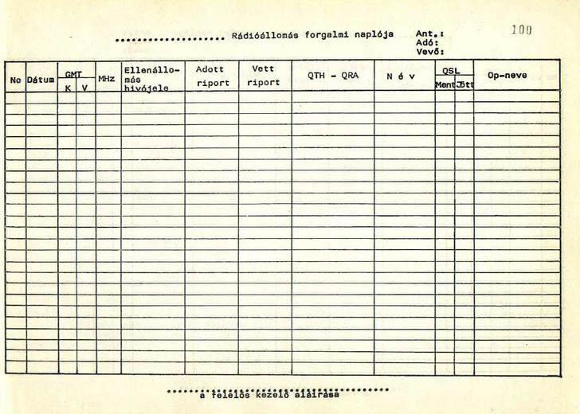

*Blank amateur radio logbook (forgalmi napló) template with columns for date, time, callsign, report, QTH.*

0-1. ábra Klasszikus papír alapú LOG (MRASZ-nál beszerezhető)

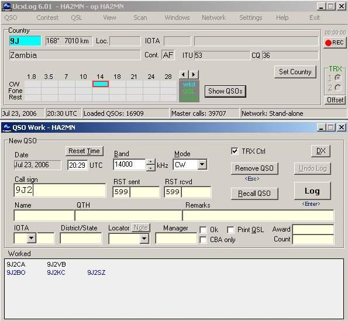

*Screenshot of HAMlog logging software showing a QSO entry window.*

0-2. ábra Számítógépes LOG programok (számos program beszerezhető az Internetről)

### 1.6. QSL-lap

A QSL-lap a rádióamatőr összeköttetések igazolására, illetve megfigyelések vételjellemzésére szolgáló, rendszerint előrenyomtatott kártya.

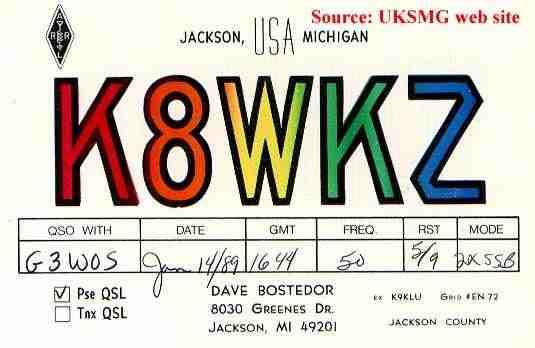

*Example QSL card received from station K8WKZ (Jackson, Michigan, USA).*

*1.6-1. ábra K8WKZ állomás QSL lapja (G3WOS éllomással folytatott összeköttetésről)*

A QSL-lap igazolja, hogy egy adott összeköttetés valóban létrejött, az összeköttetés megtalálható az ellenállomás forgalmi naplójában (LOG) is. Ugyan egyre terjednek az elektronikus QSL-rendszerek is, ma még a QSL-lap az az igazolás, amelyet a rádióamatőr diplomákhoz mindenképpen elfogadnak. A QSL-lapon mindenképpen szerepelnek az alábbiak:

- saját állomás hívójele, amellyel az összeköttetés létrejött

- az operátor neve

- saját állomás földrajzi helye (QTH lokátor)

- a partner hívójele (To radio:, Confirming QSO with:)

- az összeköttetés dátuma

- az összeköttetés időpontja (UT / GMT-ben)

- frekvencia vagy sáv (Band, Freq, kHz, MHz, GHz )

- alkalmazott adásmód(ok) (Mode, Type)

- ellenállomás jeleinek vételjellemzése az adott adásmódnak megfelelő skálán (pl. RS / RST / RSV stb.)

- annak jelölése, hogy az összeköttetés mindkét irányban ugyanazon a sávon és üzemmódban történt (two-way, 2-way, 2x) vagy esetleg keresztsávos összeköttetés volt (crossband).

- az igazolás hitelesítése (aláírás, digitális aláírás, hitelesítő bélyegző) 

A QSL-lap gyakorta fényképes képeslap-jellegű, de a célnak egyszerű egyoldalas, az összeköttetés adatainak igazolására szorítkozó lapok is megfelelnek. 
A QSL-lap méretére, formájára vonatkozóan nincs megkötés, azonban leggyakoribb, és de facto sztenderdnek mondható a 90x140 mm méretű, vagy ekkora méretre hajtott lap. Az ettől eltérő méretű lapok kezelése, illetve továbbítása nehézségeket okoz (pl. lap meggyűrődik vagy más lapok között eltűnik). A QSL-lapot az amatőr maga is megtervezheti rajzoló, szövegszerkesztő programmal. Célszerű előtte alaposan megismerni a már forgalomban lévő lapokat (ezek interneten, könyvekben, amatőrtársaknál, rádióklubokban fellelhetők).

A címkék használata esetén úgy kell megtervezni a felragasztás helyét, hogy az aláírás érintse a címkét is és egy része az alap QSL lapra essen. Használható kisméretű körbélyegző is a címke hitelesítésére.

Az adatok beírhatók kézzel, golyóstollal, filctollal, de sohasem ceruzával. Jól olvashatóan, "szépen" célszerű írni, hiszen a partnerek, valamint a lapok továbbításában résztvevő önkéntesek és QSL intézők idejét rabolja, amikor a nehezen olvasható írást kell megfejteniük. Soha nem szabad javítani az adatokon, a hívójelen. A javított QSL lapokat nem fogadják el diplomakérvényekben, így felesleges elküldeni, hiszen csak egy értéktelen papírdarab a partner számára. Új lapot kell kitölteni. A QSL-lapokat postai úton (Direkt lapküldés) QSL-irodán vagy interneten (eQSL) keresztül szokás elküldeni, illetve rádióstalálkozókon személyesen átadni. Egy partnernek általában elegendő sávonként és üzemmódonként egy lapot küldeni, azonban a partner kifejezett kérésére illendő olyankor is lapot küldeni, ha adott sávú és üzemmódú összeköttetésről már kapott korábban igazolólapot. Rádióstalálkozókon szokás - névjegy helyett/mellett - lapot cserélni.

## 1.7. Amatőrsávok

A rádióamatőr használatra kijelölt rádiósávokat nevezzük amatőrsávoknak. Az amatőrsávok kijelölését szigorú nemzetközi egyezmények szabályozzák, mely amatőrsávok nemzeti használatát befolyásolhatja (korlátozhatja) a nemzeti hatóság. A rádióamatőrök részére az első igazi amatőrsávokat az ITU osztotta ki 1927-ben (RH sávok). Ezt kibővítve további sávokat kaptak az amatőrök 1938-ban, 1947-ben és 1959-ben. Az addig kijelölt sávok alkotják jelenleg is az amatőrsávok gerincét. 1979-ben tartottak egy WARC (the World Radiocommunication Conference) konferenciát Genfben, ahol újabb RH sávokat kaptak az amatőrök (10, 18, 24 MHz), amelyet az amatőrök csak „WARC”sávoknak emlegetnek. A Földünket három rádiós körzetre osztották fel: Region 1-2-3, ami célja, hogy az egyes szolgálatok ne zavarják egymást. Magyarország a Nemzetközi Rádióamatőr Szövetség 1-es körzetébe (IARU REGION 1) tartozik, így ránk az IARU 1-es sávfelosztási ajánlás vonatkozik. A kiosztott amatőrsávokat három csoportba sorolhatjuk:

- kizárólagos amatőrsáv: kizárólag rádióamatőr használatra kiosztott sáv.

- elsődleges amatőrsáv: rádióamatőr használatra. (elsődleges jelleggel). Más célú felhasználás is elképzelhető.

- másodlagos amatőrsáv: osztott sáv, más szolgálatok is dolgoznak a sávban, akik elsőbbséget élveznek. A rádióamatőrök másodlagos jelleggel használhatják a sávot.

### 1.7.1. A rádiósávok felosztása és elnevezése

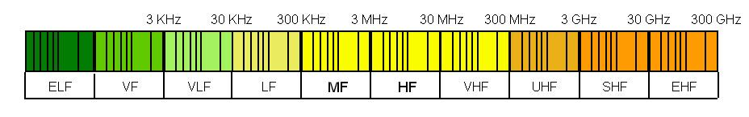

*Full electromagnetic spectrum bar chart from ELF to EHF, colour-coded by frequency band.*


```
                 Neve                          Frekvenciája          Hullámhosszra utaló         Hullámhossza (λ)
                                                                           neve
ELF: Extremly Low Frequency = extrém            3 Hz - 30 Hz                                    100000 km .. 10000
alacsony frekvencia                                                                                    km
SLF: Super Low Frequency = szuper             30 Hz - 300 Hz                                   10000 km .. 1000 km
alacsony frekvencia
ULF: Ultra Low Frequency = ultra              300 Hz - 3 kHz                                    1000 km .. 100 km
alacsony frekvencia
VLF: Very Low Frequency = nagyon            3 kHz - 30 kHz                                   100 km .. 10 km
alacsony frekvencia
LF: Low Frequency = alacsony frekvencia   30 kHz - 300 kHz        LW: Long Wave =           10000 m .. 1000 m
                                                                   hosszúhullám
MF: Middle Frequency = közepes             300 kHz - 3 MHz       MW: Middle Wave =           1000 m .. 100 m
frekvencia                                                         középhullám
HF: High Frequency = nagy frekvencia       3 MHz - 30 MHz         SW (Short Wave =               100 m .. 10 m
                                                                    rövidhullám)
VHF: Very High Frequency = nagyon         30 MHz – 300 MHz          méteres hullám                10 m .. 1 m
nagy frekvencia
UHF: Ultra High Frequency = ultra         300 MHz - 3 GHz         deciméteres hullám             1 m .. 100 mm
nagy frekvencia
SHF: Super High Frequency = szuper         3 GHz - 30 GHz         centiméteres hullám       100 mm .. 10 mm
nagy frekvencia
EHF: Extremly High Frequency =            30 GHz - 300 GHz        milliméteres hullám            10 m .. 1 mm
extrém nagy frekvencia
```

### 1.7.2. Rádióamatőr sávok

Az alábbiakban leolvasható a rádióamatőr sávok elhelyezkedése a frekvenciasávokban, továbbá: -   kezdetének frekvenciája -   (Hz)sávszélessége (Hz) -   hullámhossza (m)

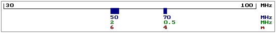

*Frequency-scale diagram marking the 6 m (50 MHz) and 4 m (70 MHz) amateur bands within 30-100 MHz.*

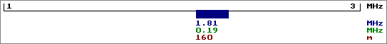

*Frequency-scale diagram marking the 160 m (1.8 MHz) amateur band within 1-3 MHz.*

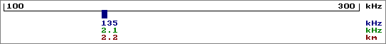

*Frequency-scale diagram marking the 2200 m (135 kHz) amateur band within 100-300 kHz.*

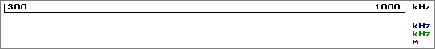

*Frequency-scale diagram for the 300-1000 kHz range, with no amateur allocation marked.*

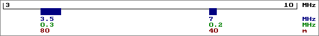

*Frequency-scale diagram marking the 80 m (3.5 MHz) and 40 m (7 MHz) amateur bands within 3-10 MHz.*

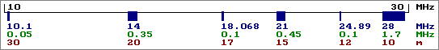

*Frequency-scale diagram marking the 30, 20, 17, 15, 12 and 10 m amateur bands within 10-30 MHz.*

Frekvenciasávok felosztása A rádióamatőr sávokat az IARU úgynevezett sávszegmensekre osztja. Ez a felosztás azért történik, hogy a különböző üzemmódok ne keveredjenek. A sávok felosztásáról általánosságban elmondható, hogy a keskeny sávokban csak a kissávszélességű üzemmódok használhatók, pl.: 160m-en (40 kHz-es sáv) csak távíró (CW), 1 MHz-es sávszélesség alatti sávoknál távíró és SSB, míg 1 MHz-es sávszélesség felett egyéb üzemmódok is (pl.: FM.) használhatók. További általános szabály, hogy a sáv legelejére kerül a morze sávrész, azt követi az SSB. Az összes többi üzemmód csak ezeket követheti. Az RH sávok felosztása megtalálható a függelékben (angolul).

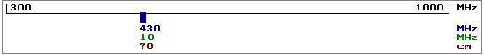

*Frequency-scale diagram marking the 70 cm (430 MHz) amateur band within 300-1000 MHz.*

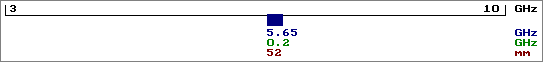

*Frequency-scale diagram marking the 3 cm (10 GHz) amateur band within 3-10 GHz.*

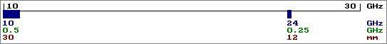

*Frequency-scale diagram marking mm-band amateur allocations within 10-30 GHz.*

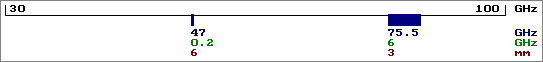

*Frequency-scale diagram marking amateur mm-wave allocations within 30-100 GHz.*

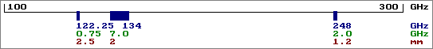

*Frequency-scale diagram marking amateur allocations within 100-300 GHz.*

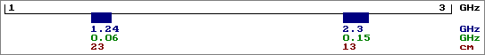

*Frequency-scale diagram marking the 13 cm and 9 cm amateur bands within 1-3 GHz.*

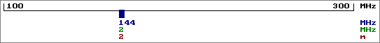

*Frequency-scale diagram marking the 2 m (144 MHz) amateur band within 100-300 MHz.*

### 1.7.3. Magyarországon engedélyezett rádióamatőr sávok és teljesítmények

```
Sáv              Jelleg   Frekvencia                kezdő     CEPT        CEPT
                                                              Novice
2000 méter       M        135-137         kHz          -         -         1W
160 méter        E        1810-1850       kHz          -       10W       1500W
160 méter        M        1850-2000       kHz          -         -         10W
80 méter         E        3500-3800       kHz        25W       50W       1500W
40 méter         E        7000-7100       kHz          -       25W       1500W
40 méter         M        7100-7200       kHz          -       25W       1500W
30 méter         M        10100-10150     kHz          -         -       1500W
20 méter         E        14000-14350     kHz          -         -       1500W
17 méter         E        18068-18168     kHz          -         -       1500W
15 méter         E        21000-21450     kHz          -       25W       1500W
12 méter         E        24890-24990     kHz          -         -       1500W
10 méter         E        28000-29700     kHz        25W       50W       1500W
6 méter          M        50 – 52         MHz          -         -         10W
4 méter          M        70 – 70,5       MHz          -         -         10W
2 méter          E        144-146         MHz        10W       25W       1000W
70 centiméter    E        430-440         MHz       10W*      25/10W     1000W
23 centiméter    M        1240-1300       MHz      10W**      10W**       500W
13 centiméter    M        2300-2450       MHz          -         -        150W
6 centiméter     M        5650-5850       MHz          -         -         75W
3 centiméter     M        10-10.5         GHz          -         -         75W
12 milliméter    E/M      24-24.25        GHz          -         -         30W
6 milliméter     E        47-47.2         GHz          -         -         30W
4 milliméter     E/M      75.5-81.0       GHz          -         -         30W
3 milliméter     M        119.98-120.02   GHz          -         -         30W
2 milliméter     E/M      142-149         GHz          -         -         30W
1.2 milliméter   M/E      241-250         GHz          -         -         30W
* CSAK FM (átjátszó és szimplex) használható: 433-433,4 MHz és 433,4 – 433,6 MHz között.
** CSAK FM (átjátszó és szimplex) használható: 1291-1291,5 MHz és 1297,5-1298 MHz között.
```

## 1.8. Tájékoztató a rádióamatőr vizsgáról

Vizsgázni a jelentkezők számának függvényében általában 2 havonta lehet a NMHH Visegrádi utcai Központjában (Budapest, XIII. kerület, Visegrádi u. 106.) A vizsga szintje kezdőfokozat, alapfokozat vagy HAREC fokozat lehet. Minden 16. évét be nem töltött és 60. évét betöltött személy kezdő fokozatú, valamint minden 14. életévét betöltött személy alap vagy HAREC fokozatú rádióamatőr vizsgát tehet. Önállóan, vagy bármely fokozatú vizsga keretében morze vizsga is tehető. A vizsgázónak a sikeres vizsgához minden tárgykörből a követelmények legalább 75 %-át teljesítenie kell. A vizsgabizottság a vizsga végén tájékoztatást ad a vizsgázónak az elért eredményéről. Aki a vizsgán legfeljebb egy tárgykörből nem felelt meg, abból a tárgykörből pótvizsgát tehet egy éven belül. Morze vizsgából pótvizsga nem, csak ismételt vizsga tehető. A rádióamatőr vizsgára az NMHH oldaláról letölthető jelentkezési lapon lehet jelentkezni. A kitöltött jelentkezési lap a hatóságnak elektronikus úton aláírás nélkül is megküldhető! A morze vizsga nélküli teljes vizsga (minden fokozatban) 4000 Ft, a morze vizsga díja 2000 Ft. (A nyugdíjasokat, rokkantakat és diákigazolvánnyal rendelkező nappali tagozatos hallgatókat 50 százalékos kedvezmény illeti meg.) A vizsga időpontról szóló értesítést csak az kap, aki a vizsga díját befizette. 
Az egyéni amatőr engedély érvényességi ideje:

- kezdő fokozatú engedély esetén: 
	- 5 év, addig az időpontig, amíg a kérelmező nem töltötte be a 18. évét, 
	- 5 év, ha a kérelmező a 60. évét betöltötte.

- CEPT Novice fokozatú engedély esetén 5 év

- CEPT fokozatú engedély esetén 5 év. 

A gyakorlati vizsga egy forgalmazási bemutatóból áll. A távíró vizsgán a jelöltek a morze kódolási ismeretekből adnak számot.

### 1.8.1. Rádióamatőr engedélyek ügyintézése

Nemzeti Hírközlési Hatóság Hivatala, Frekvenciagazdálkodási Igazgatóság Frekvencia engedélyezési Osztály 

Cím: 1133 Budapest, Visegrádi utca 106. 

Levelezési cím: 1376 Budapest, Pf. 997. 

Ügyintéző: Kiss Nándor József 

Tel.: (1) 468-0551
