# 3. Villamosság-, elektromágnesesség-, és rádió-technika alapjai

Villamosság-, elektromágnesesség-, és rádióelmélet 
Jónap Gergő HG5OJG, Kovács Levente HA5OGL

## 3.1. Elektromos alapjelenségek

Mint a fizika számos jelenségének, az elektromosságnak a felfedezése is tapasztalati megfigyeléseken alapul: tudjuk, hogy már az ókorban felfigyeltek arra, hogy dörzsölés hatására a borostyánkő (görögül elektron) és számos más test sajátos állapotba kerül, és sajátos környezetet alakít ki maga körül: a környezetébe kerülő anyagokra vonzó- vagy taszítóerő hat. Az ilyen testekre azt mondjuk, hogy elektromos állapotban vannak, illetve, ha egy test az előbbi tulajdonságokkal nem rendelkezik, akkor azt elektromosan semlegesnek nevezzük. A testek elektromos állapotát tehát valamilyen közvetlenül nem érzékelhető "anyag" hozza létre, amelyet elektromos töltésnek nevezünk. Az elektromos töltés hordozója az elektron. Valójában azonban nem létezik önálló elektromos töltés, hanem az mindig az anyag elválaszthatatlan tulajdonsága. A töltéssel rendelkező anyagot nevezzük töltéshordozónak. A kísérletek szerint kétféle elektromos töltés van, az egyiket nevezzük pozitívnak, a másikat pedig negatívnak. Azt is megállapíthatjuk, hogy az azonos nemű töltések taszítják, míg az ellentétes előjelű töltések vonzzák egymást. Az elektromosan feltöltött testek között tehát erőhatás tapasztalható anélkül, hogy azok egymással közvetlenül érintkeznének illetve, hogy közöttük bármilyen ezen erőhatást közvetítő közeg lenne jelen. Ennek szemléletes magyarázatát elsőként Faraday fogalmazta meg, mely szerint az elektromos állapotban lévő test maga körül elektromos mezőt, vagy más néven erőteret hoz létre, amely a benne lévő elektromosan töltött testekre erőt fejt ki.

### 3.1.1. Vezetőképesség

Anyagi minőségtől függően az anyagokat három csoportba soroljuk: 
1.   Vezető 
2.   Félvezető 
3.   Szigetelő 

Ezek a besorolások az adott anyag töltéshordozók létére utalnak. Fémekben, a szabad elektronok könnyen mozdulnak el, így azok jól vezetik az elektromos áramot. Amely anyagokban kevés szabad töltéshordozó van, szigetelőknek nevezzük. Ilyen anyagok a polietilén, száraz fa, stb. Ezeket, az anyagokat az üzemileg feszültség alatt lévő testek elszigetelésére használjuk, például vezetékek elszigetelésére. A félvezetők olyan csoportba tartoznak, melyek vezetőképességük nem jók, így azokat nem lehet használni elektromos vezetők alapanyagaként. Ezeknek az anyagoknak a tulajdonságait idegen anyagok adalékolásával erősen meg lehet változtatni. Félvezető anyagok például a `Si`, `Ge`, `Ga`. Ezen anyagok felhasználásáról a félvezető technika részben térünk ki.

### 3.1.2. Elektromos tér

Elektromos teret elektromos töltések hoznak létre maguk körül. A statikus elektromos tér forrása az elektromos töltés. Az elektromos töltést leíró fizikai mennyiség előjeles, skaláris mennyiség. 

Jele: `Q` 

mértékegysége: `[Q] = 1 C (coulomb) = 1 As`

Elektromos tér önmagában, a mágneses tér jelenléte nélkül csak akkor létezik, ha időben nem változik. A statikus elektromos tér örvénymentes, potenciálos, konzervatív erőtér.

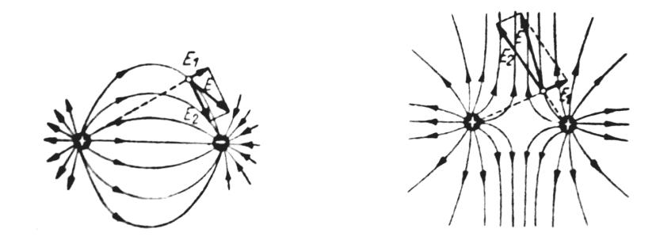

*Hand-drawn diagrams of electric field lines around single and multiple point charges.*

*3.1-1. ábra. Nyugvó töltések által keltett erőtér.*

Minden töltés erőteret létesít maga körül. Két nyugvó töltés között a Coulomb-féle törvénnyel leírt kölcsönhatást: 
$F = k \dfrac{Q_1 \cdot Q_2}{r^2}$ (ahol: k = $9 \cdot 10^9 \dfrac{\text{Vm}}{\text{C}}$) 
az erőterek kölcsönhatásával jellemezhetjük. Az erőteret térerősséggel jellemezhetjük (jele: `E`). 
$E = \dfrac{F}{Q}$ és mértékegysége: $[E] = \dfrac{V}{m}$. 
A térerősség vektormennyiség, iránya megegyezik a pozitív töltésegységre ható erő irányával.

3.1.2.1. Elektromos terek árnyékolása Mivel a fémek vezető anyagok, az elektromos tereket megzavarják. Kimutatható, hogy minden vezető anyaggal körülvett terület mentes minden kívülről érkező elektromos tér hatásaitól. A jelenség azzal magyarázható, hogy a térben haladó töltések a fémbe csapódva a fém elvezeti azt.

### 3.1.3. Mágneses tér

A vezetőben folyó áram (mozgó elektromos töltés) maga körül mágneses erőteret gerjeszt. A keletkező mágneses teret (mezőt) vektor jellegű fizikai mennyiséggel, a mágneses indukcióval (jele: B) jellemezzük, és az indukcióvonalakkal szemléltetjük. Ezek olyan görbék, amelyeknek bármely pontjában az érintő megadja az indukcióvektor irányát, sűrűségük pedig az indukció nagyságával arányos. Az egyenes áramvezető indukcióvonalai – amint azt a köréje helyezett kis mágnestűk is mutatják – a vezetőre merőleges síkban kialakuló koncentrikus körök, amelyeknek sűrűsége a vezetőtől mért távolságtól függően csökken.

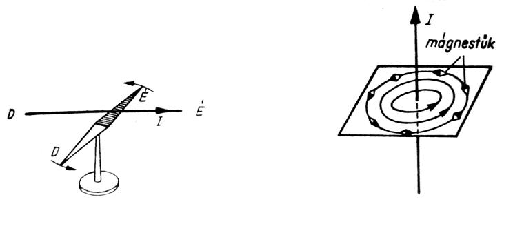

*Diagram illustrating the force on a moving charge in a magnetic field, and magnetic field lines through a loop.*

*3.1-2. ábra. Mágneses tér bemutatása*

#### 3.1.3.1. Mágneses terek árnyékolása 

Hasonlóan a elektromos terekhez, vezető anyagok által elkerített terekbe nem, vagy csak kis mértékben hatol be a külső mágneses tér. Mivel nincsenek mágneses töltések, ezért ez a jelenség nem magyarázható a elektromos erőtérhez hasonlóan. Azonban itt is kimutatható, hogy a mágneses tér nehezen hatol át vezető felületeken. Ez azért történik, mert a mágneses térerősség ún. örvényáramokat gerjesztenek a fémekben, melyek a fémben záródnak.

### 3.1.4. Áramerősség

A töltések áramlását villamos áramnak nevezzük. Az áramló villamos töltések munka végzésére képesek. Azokat a készülékeket, amelyek villamos energia előállítására képesek, villamos energiaforrásoknak nevezzük. A galvánelem és az akkumulátor vegyi energiát alakít át, a fény- és hőelemek fény- és hőenergiát, a generátorok pedig mechanikai energiát alakítanak át villamos energiává. A fogyasztók azok a készülékek, amelyekben az áramló villamos töltések hatására a villamos energia más energiává alakul át. A legegyszerűbb áramkör (3.1.3 ábra) energiaforrásból, fogyasztóból és ezeket összekötő vezetőből áll. A villamos energiaforrás elektromos ereje által szétválasztott töltések az energiaforrás kapcsait összekötő vezetőben áramlanak. Fémekben az áramló töltéseket negatív töltésű elektronok hordozzák. A vezető keresztmetszetén az időegység alatt átáramló töltésmennyiséget áramerősségnek nevezzük. Jele: `I`. Iránya a negatív töltést hordozó részecske morgásirányával ellentétes (tehát a pozitív sarkok felől a negatív felé tart.) Az áramerősség egysége az amper (`A`).

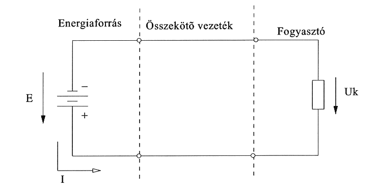

*Simple circuit: energy source (E), connecting conductor and load (Uk) with current I.*

*3.1-3. ábra. Egyszerű áramkör*

A villamos áram töltésáramlást jelent. A villamos töltés jele: Q. Az áram meghatározásából következik, hogy:

`I = Q / t`

Ebben az összefüggésben Q jelenti a vezető keresztmetszetén t idő alatt átáramló villamos töltést. A villamos töltés egysége (Q = I * t egyenletből) amperszekundom azaz As.

### 3.1.5. A feszültség

Az energiaforrás elektromos ereje a pozitív és negatív töltéseket szétválasztja. Az energiaforrás kapcsain összegyűlt, különnemű töltések vonzzák egymást. Ezt a vonzó hatást nevezzük feszültségnek. Jele: `U`. A feszültség hajtja át a fogyasztón a töltéseket. A feszültség egysége a `V` (Volt). A feszültség az egységnyi töltés munkavégző képességét jelenti. 

`W = Q * U`

### 3.1.6. Az ellenállás

Ellenállásoknak nevezzük az anyagoknak azon fizikai tulajdonságát, hogy az anyagra jellemző mértékben megakadályozza az elektromos áramlást az anyagban, miközben az elektromos áram energiája hővé alakul át. Az Ohm törvénye kimondja, hogy az áram a feszültséggel egyenesen, az ellenállással fordítottan arányos. Jele: `R`, egysége: `Ω` (Ohm).

`R = U / I`

### 3.1.7. A teljesítmény

Tapasztalat szerint a villamos áram melegíti a vezetéket, tehát munkát képes végezni, azaz energiája van. A villamos munkát szokás villamos fogyasztásnak is nevezni. A teljesítmény az időegység alatt végzett munka: 

`P = W / t = U * I`

A villamos teljesítmény a feszültség és az áramerősség szorzata. Egysége a `W` (Watt).

1 MW = 1 000 kW = 1 000 000 W 1 W = 1000 mW

A fenti képletekből a következő hasznos képleteket nyerjük:

`P = I² * R`

`P = U² / R`

### 3.1.8. Kirchhoff törvények

#### 3.1.8.1. Csomóponti törvény

Ez a törvény a töltésmegmaradás elvét alkalmazza. A csomópontban (áram-elágazási pont) találkozó áramok algebrai összege nulla, mert ha ez nem így lenne, akkor itt töltések (Q) halmozódnának fel (2.1.4. ábra). Mivel Q az áram az időegység alatt áramló töltés (I = Q/t), így a törvény az alábbi, közismert alakban is felírható: t Σ(k=1..n) Ik = 0

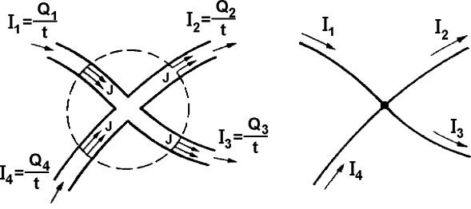

*Diagram illustrating Kirchhoff's current law at a node, with four currents I1-I4 defined as charge/time.*

*3.1-4. ábra. Kirchhoff I. törvénye – a csomópontban találkozó áramok algebrai összege nulla.*

#### 3.1.8.2. Huroktörvény

A huroktörvényben közvetve az energia megmaradás törvénye jelenik meg. A huroktörvény szerint a villamos hálózatban egy tetszőleges irányított, zárt görbe mentén körülhaladva a feszültségek algebrai összege nulla: `Σ(k=1..n) Uk = 0`

A körüljárási irányt önkényesen jelöljük ki. Azok a feszültségek, melyeknek iránya a körüljáráséval megegyezik pozitív, melyeknek ellentétes, negatív előjelűek.

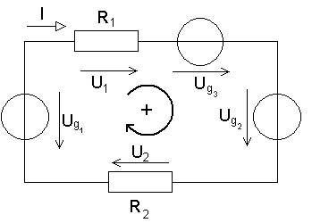

*Circuit with two resistors and two voltage sources in a loop, illustrating Kirchhoff's voltage law variables.*

*3.1-5. ábra. Kirchhoff II. törvénye – huroktörvény (a csomópontban a feszültségek összege nulla)*

## 3.2. Villamos források

### 3.2.1. Galvánelemek és akkumulátorok

Általánosságban elmondható hogy a galvánelem vegyi áramforrás, kémiai energiát elektromos energiává átalakító eszköz. Elektrolitba merülő két különböző anyagból – általában fémből – készült elektródból áll. Az egyik elektródon pozitív ionok semlegesítődnek – redukció – a másikon pozitív ionok keletkeznek, vagy negatív ionok semlegesítődnek – oxidáció. Ez a két, térbelileg elválasztott elektródfolyamat az elektródokat összekötő vezetékben elektromos áramot tart fenn. A galvánelemek csak addig használhatók, amíg a bennük felhalmozott és áramot szolgáltató anyagok el nem fogynak. Aszerint, hogy kocsonyásított vagy folyékony anyagot tartalmaznak szárazelemnek, vagy nedveselemnek nevezzük őket. A galvánelemeket „primer” elemeknek nevezzük, mivel kimerülésük után nem tölthetők újra, így az elhasználás után eldobhatóak. Galvánelemeket és telepeket többnyire olyan kis teljesítményű készülékek (hordozható adóvevő, rádiósmagnó, számológép) tápellátására használnak, amelyeknek teljesítményfelvétele legfeljebb néhány Watt.


*Photo of a 9V Kodak "Long Life" zinc-chloride battery.*

*3.2-1. ábra. 9V-os szárazelem képe*

A galvánelemekkel szemben az akkumulátorok, kimerülésük után egyenárammal feltölthetőek, és így bizonyos töltésszám után (> 1000 töltés), vagy elöregedés következtében válnak használhatatlanná. Az akkumulátoroknál a betáplált energia alakul át kémiai energiává, amely aztán visszaalakítható elektromossá. Az akkumulátort szekunder elemnek is szokták nevezni, mert csak akkor tud áramot leadni, ha előzőleg egyenárammal feltöltötték őket. Kis belső ellenállásuk miatt nagy áramerősség leadására képesek. Ez azért is fontos, mert kis belső ellenállás esetén nincs káros mértékű visszahatás. Akkumulátorok termékskálája igen széles, rengeteg típusa létezik, pl.: 
Savas, Lúgos, Li-Ion, NiCd, NiMH. 
Méret és kapacitásban is széles a skála: a ceruzaelem és a gombelem (akku) nagyságtól a több tíz kilós (savas, lúgos) monstrumokig nagy a választék.


*Blank battery/cell outline placeholder graphic.*


*Photo/logo of a GP 2000 rechargeable battery.*

*3.2-2. ábra. Ceruzaakkumulátor képe*

Minden villamos energiaforrásnak van belső ellenállása, így jellemző rájuk az üresjárási és kapocsfeszültségük (3.2.3. ábra).

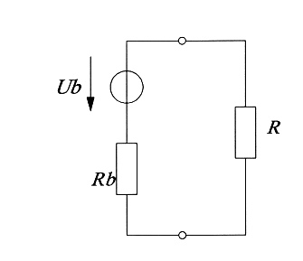

*Real voltage source with internal resistance Rb driving load R, showing terminal voltage Ub.*

*3.2-3. ábra. Galvánelem helyettesítő képe terheléssel*

Az áramforrások kapocsfeszültsége és a forrásfeszültsége akkor egyezik meg, ha az áramforrás nincs terhelve, mivel az áramforrások belső ellenállásán feszültségesés lép fel a külső terhelés rákapcsolásakor. A kémiai áramforrásoknál a kapocsfeszültségen kívül fontos jellemző a kapacitás is (akkuknál: tárolóképesség). A kémiai áramforrás kapacitásának mértékegysége: az amperóra (Ah). Amely érték megmondja, hogy a névleges feszültséghez rendelt feszültségtolerancián belül hány órán keresztül nyerhetünk 1 A áramerősséget az illető áramforrásból. (Pl.: 2,2 Ah → 1A terhelés mellett: 2,2 óra.) Az áramforrások rövidzárlati áramát úgy tudjuk meghatározni, hogy a két kapcsát összezárjuk, és ekkor mérjük az átfolyó áramot, amelynél a zárlati áram értékét a forrásfeszültség és a belső ellenállás hányadosa határozza meg. (Ezt a gyakorlatban viszont tilos megtenni! Az ilyen művelet az áramforrás tönkretételét, súlyosabb esetben balesetet okozhat (akkumulátor rövidzárása esetén robbanás!))

### 3.2.2. Dinamók és generátorok

Áramforrásoknak nevezzük azokat a gépi berendezéseket is, amelyek mechanikai munkából, rendszerint forgó mozgásból állítanak elő elektromos áramot. A dinamó megnevezést, az egyenáramot előállító áramfejlesztőkre, a generátor megnevezést rendszerint váltakozó áramot előállító gépekre szoktuk alkalmazni. A dinamók és generátorokra jellemző a kapocsfeszültségük és a terhelhetőségük, ez utóbbi az esetek többségében VA-ben megadott érték, pl.: 230V, 800 VA.

### 3.2.3. Feszültségforrások soros és párhuzamos kapcsolása

A kémiai áramforrások (galvánelemek, akkumulátorok) kapocsfeszültsége sokszor nem elegendő az elektromos készülékek táplálásához, így több elemi cella sorbakapcsolásával előállíthatunk nagyobb feszültséget is. Az elemi cellák megfelelő soros kapcsolása esetén ugyanis a cellákból alkalmazott telep eredő feszültsége az alkalmazott cellák számával arányos módon növekszik. A sorba kapcsolás feltétele az, hogy az elemi cellák egymással ellentétes polaritású kapcsait kössük össze. (3.2.4. ábra). Általános szabály, hogy csak azonos típusú és azonos kapacitású cellákat ajánlott sorba kapcsolni.

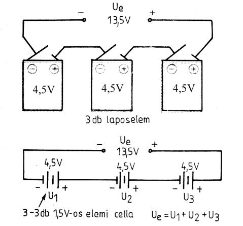

*Batteries in series (top) and cells in series (bottom), each showing the summed voltage.*

*3.2-4. ábra. Feszültségforrások soros kapcsolása*

Gyakran előfordul azonban az olyan eset is, hogy valamely elem, akkumulátor vagy telep feszültsége elegendő ugyan számunkra, de a maximális kivehető áramerősség vagy a kapacitás (Ah) nem elegendő. Ilyen esetben az azonos feszültségű cellák vagy telepek párhuzamosan kapcsolhatók (3.2.5-ös ábra). Ebben az esetben ügyeljünk arra, hogy csak szigorúan azonos feszültségű cellákat (azonos típus, azonos fajta) és azonos állapotú cellákat (töltöttség) kapcsoljunk össze egymással párhuzamosan, mert ellenkező esetben jelentős kiegyenlítő áramok folyhatnak a cellák között, amely a teleprendszer belső önkisülését meggyorsítja.

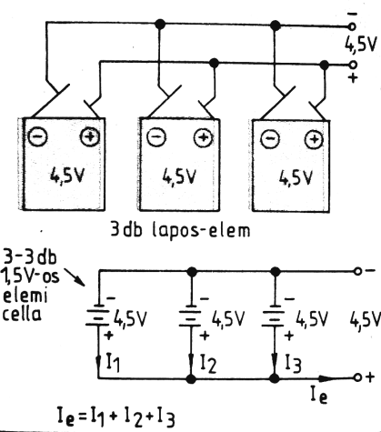

*Batteries and cells connected in parallel, showing the combined current.*

*3.2-5. ábra. Feszültségforrások párhuzamos kapcsolása*

## 3.3. Elektromágneses tér

### 3.3.1. Frekvencia

Ha egy áramkörben olyan generátor üzemel, amelynek kapocsfeszültsége az idő függvényében folyamatosan nő, majd csökken, és a nulla érték elérése után ellenkező irányban nő, majd csökken, és ez periodikusan ismétlődik, akkor váltakozófeszültséget előállító generátorról beszélünk. A terhelésen ilyenkor váltakozóáram folyik. Az egymás után periodikusan bekövetkező árammaximumok és minimumok között eltelt idő (periódusidő, jele: `T`) alatt lejátszódó periódusok számát frekvenciának nevezzük. Közöttük reciprok összefüggés van: `1/f = T` 1 Hz annak a jelnek a frekvenciája, ahol 1 s alatt 1 periódus játszódik le.

### 3.3.2. Szinuszos jelek

A szinuszos lefolyású váltakozóáram (3.3.1. ábra) azonos idő alatt kevesebb munkát képes végezni, mint a csúcsértékkel azonos nagyságú egyenáram. A váltakozó áram azon értékét, amely megmutatja, hogy ugyanannyi idő alatt a csúcsértékének hányadrészénél végez azonos munkát, mint az ennek megfelelő nagyságú egyenáram, a váltakozóáram négyzetes középértékének vagy effektív értékének nevezzük. Az effektív értéket úgy tudjuk meghatározni, ha csúcsértéket osztjuk 2 négyzetgyökével (3.3.2. ábra).

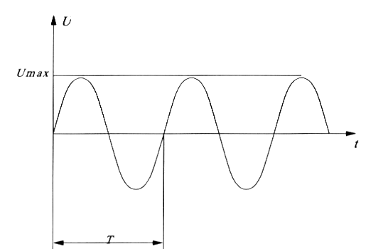

*Graph of a sinusoidal voltage over time, showing period T and peak voltage.*

*3.3-1. ábra. Szinuszos jel tulajdonságai*

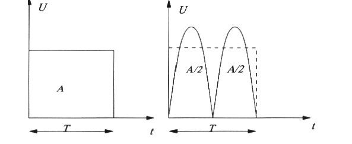

*Comparison of a square wave's average area (A) versus a rectified sine wave's average areas (A/2).*

*3.3-2. ábra. Szinuszos jel effektív értéke*

A szinuszos váltakozóáramú rendszereknél a feszültséget effektív értékben szokás megadni, és a mérőműszerek is ezt a feszültséget mutatják. Tehát p1. a 230 V-os hálózatnál a feszültség csúcsértéke:

√2 * 230 = 325.26V 

Szinuszos jeleknél a szinusz függvény amplitúdójának pillanatértéke egy periódus alatt bármilyen értéket felve- het a szélsőértékek között (a szinuszgörbének megfelelően, lásd: 3.3.1. ábra).

### 3.3.3. Nem szinuszos jelek

A váltakozóáram nem csak szinuszos jelből állhat, létezik többek között: négyszög (3.3.3. ábra), fűrész, háromszög és egyéb jelalak. A négyszögjel a két szélsőértékében vesz föl feszöltséget, a két érték között nem. A nem szinuszos jelek, többek között a négyszögjel is tartalmaz a névleges frekvenciánál magasabb frekvenciás komponenseket, úgynevezett felharmónikusokat is. A négyszögjel kifejezetten sok felharmónikus tartalmaz. A nem szinuszos jelek egyaránt lehetnek periodikusak és nem periodikusak.

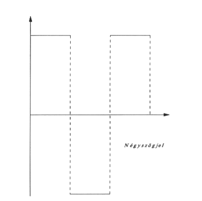

*Symmetric square-wave ("Négyszögjel") waveform alternating between positive and negative levels.*

*3.3-3. ábra. Négyszögjel*

A hangfrekvenciás jelek: azaz a hallható tartományba eső 20 Hz - 20 kHz-ig terjedő jelek is általában a nem szinuszos jelek közé sorolhatóak.

## 3.4. Teljesítmény és energia

A rádiótechnikában a teljesítményviszonyokat un. `dB`-ben adják meg. A dB skála nem lineáris, hanem logaritmikus. Értelmezünk relatív, és abszolút dB értékeket.

### 3.4.1. Relatív szintek

Relatív szint azt jelenti, hogy 2 mennyiségnek a viszonyát fejezzük ki. Tegyük fel, hogy egy erősítőfokozat bemenő jel: U be kimenő jele: U ki . Ebből származtathatjuk a jól ismert feszültségerősítést:

`Au = Uki / Ube` Ez érték a két feszültség szint aránya. Ugyancsak származtathatunk teljesítményerősítést a kimeneten valamint a bemeneten fellépő teljesítményekből.

`Ap = Pki / Pbe` Ha a kimeneti feszültség vagy teljesítmény szintet akarjuk megkapni, akkor értelem szerűen szorozni kell a bementi szintet az erősítéssel. `U ki = U be * Au` valamint `Pki = Pbe * Ap`

Látható, hogy a szorzás műveletét kell használni, ami sok esetben nem előnyös. Ezért használjuk a logaritmikus dB [decibel] szinteket.

`au[dB] = 20 * lg (Uki / Ube)`

`ap = 10 * lg (Pki / Pbe)`

Így az erősítés szintek eredményeit már dB-ben kapjuk. A logaritmus művelet tulajdonsága az, hogy ha pl. két erősítőfokozat van egymás után, akkor az eredő erősítés a két erősítés összege lesz, és nem a szorzatuk! Ez nagymértékben megkönnyíti a tervező munkáját.

### 3.4.2. Abszolút szintek

Az előzőekben 2 szint közötti összefüggést definiáltunk. Abszolút szint azt jelenti, hogy egyértelműen megadhatjuk egy jelnek valamilyen villamos mennyiségét (általában a teljesítményt). Önkényesen is megválaszthatunk egy kitüntetett mennyiséget, amihez viszonyíthatjuk az összes értéket. Ez az eljárás terjedt el, mégpedig mindent az 1mW-teljesítményhez viszonyítunk. Az abszolút szint mértékegysége azonban dB helyett dBm. Ennek nincs fizikai tartalma, csupán azért jelöljük más módon, hogy megkülönböztethető legyen a relatív szintektől. Vegyünk egy példát. Készítünk egy végerősítőt, amely 2W-os bemenő teljesítményre 50W-os kimenő teljesítményt produkál. A következő összefüggéseket írhatjuk fel: 
`ap = 10 * lg(Pki/Pbe) = 10 * lg(50W/2W) = 10 * lg25 = 13.9 dB`
a bemenő teljesítmény abszolút szintje: 
`sbe = 10 * lg(Pbe/1mW) = 10 * lg(2W/1mW) = 10 * lg2000 = 33 dBm`

a kimenő teljesítmény abszolút szintjét kétféle módon is megkaphatjuk: 

1.   Ha összeadjuk a bemenő abszolút szintet és a teljesítményerősítést

```
 s ki = sbe + a p = 13.9dB + 33dBm = 46.9dBm
```

2.   Ha kiszámoljuk a kimenő teljesítményhez tartozó abszolút szintet

```
  s ki = 10 lg Pki/1mW = 10 lg 50W / 1mW = 10 lg 50000 = 46.9dBm
``` 

Látható, hogy a fenti két eredmény azonos.
A fentiekből már könnyedén lehet számítani bármilyen szinteket.
