# 4. Alkatrészek

Kovács Levente HA5OGL 

Ebben a fejezetben bemutatjuk a híradástechnikában alkalmazott alapvető alkatrészeket.

## 4.1. Ellenállás

A vezetőkben (általában a fémekben) az elektronok áramlása akadályoztatva van a molekulákkal való ütközések következtében. Az akadályoztatás a mechanikai súrlódáshoz hasonlóa n hatást fejt ki, energiát emészt fel. Amely fémben kevés súrlódó ellenállással találkoznak az elektronok, azok jó vezetők (p1. ezüst, arany, réz). A villamos ellenállás az összefüggő kapocs a feszültség és az áram között. A törvényt, amely a mennyiségi viszonyokat fejezi ki Ohm törvénynek nevezzük (4.1). Az ellenállás jele az R (az angol Resistance szóból), mértékegysége az Ω (Ohm).

`R = U / I  [Ω]`

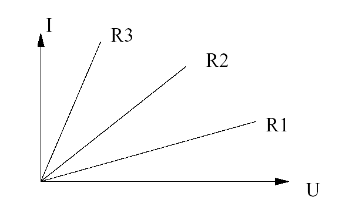

*Current-vs-voltage graph for three resistors of different resistance (R1, R2, R3), illustrating Ohm's law slopes.*

*4.1-1. ábra. Három különböző értékű ellenállás karakterisztikája*

Látható, hogy a (4.1) összefüggés egy lineáris összefüggés. Ebből következik, hogy az ellenálláson az áram-feszültség karakterisztika is lineáris (4.1.1. ábra.)

### 4.1.1. Hődisszipáció

A mozgó elektronok a vezető anyagában lévő molekulákkal való ütközésük során energiát vesztenek. Ezt az energiaveszteséget az ellenállásnak le kell adnia a környezetnek. Ezt az energiát hőenergia formájában sugározza ki az ellenállás (áram hatására melegszik) Ezt az ún. hődisszipációs teljesítményt el kell vezetni. Minden ellenállás jellemző értéke a maximális disszipációs teljesítmény. Az ellenálláson fellépő disszipációs teljesítmény a szokásos képletekből számíthatóak. A (4.2) képletből kifejezhető az ellenállásra maximálisan rákapcsolható feszültség és áramerőség. 

`P = U * I`

Az Ohm-törvényt (4.1) behelyettesítve a (4.2) képletbe, akkor olyan összefüggéseket kapunk, melyeket a gyakorlatban sokkal jobban lehet alkalmazni (4.3 és 4.4). A disszipált teljesítmény hőmérsékletnövekedést okoz.

`P = U² / R`

`P = I² * R`

### 4.1.2. Az ellenállás értékének hőmérsékletfüggése

Mint minden a fizikában, a villamos ellenállás sem állandó. Többek között a hőmérsékletétől is függ az ellenállás értéke. Természetesen az ellenállás akkor ideális, ha értéke nem függ a hőmérsékletétől. Néhány esetben azonban ezt a tulajdonságát használjuk ki. (Pl. hőmérő áramkörökben). A hőmérsékletfüggés tekintetében kétféle ellenállást különböztetünk meg: 

1.     Pozitív hőmérsékleti tényezővel rendelkező ellenállások, valamint 

2.     Negatív hőmérsékleti tényezővel rendelkező ellenállások. 

Általánosságban el lehet mondani, hogy az ellenállás értéke hőmérsékletváltozás esetén a (4.5) képlettel írható le, ahol α a hőmérsékleti tényező, Δt a hőmérsékletváltozás. 
`RΔt = R( 1 + αΔt )`

#### 4.1.2.1. Negatív hőmérsékleti tényezővel rendelkező ellenállások

Ezek olyan eszközök, amik ellenállása csökken, ha növeljük a hőmérsékletet.

#### 4.1.2.2. Pozitív hőmérsékleti tényezővel rendelkező ellenállások

Ezek olyan eszközök, melyek ellenállása nő, ha a növeljük a hőmérsékletet

### 4.1.3. Ellenállásértékek kódolásai

Régebben az ellenállásra számokkal és betűkkel nyomtatták rá az ellenállás értékét. Ma már ez az eljárás nem használatos. A hagyományos kivitelű alkatrészekre egy színkód segítségével jelzik az aktuális értéket. Az ellenálláson 4 vagy 5 gyűrű található, melyből egyértelműen meg lehet határozni az ellenállás értékét. Ha az ellenálláson 4 színgyűrű van, akkor az első 2 gyűrű mindig az ellenállás számszerű értékére vonatkozik. A 3. gyűrű pedig megmutatja, hogy hányszor kell megszorozni az előző 2 számjegyet ahhoz, hogy megkapjuk az ellenállás helyes értékét. A 4. gyűrű az ellenállás tűrésére vonatkozik, tehát a itt tüntetik fel a tűrés értékét százalékban. Lásd a 4.1.2-es ábrán Ha 5 gyűrűt látunk az ellenálláson, akkor az ellenálláson nem 2 gyűrű, hanem 3 gyűrű vonatkozik az ellenállás számszerű értékére (értéksáv).

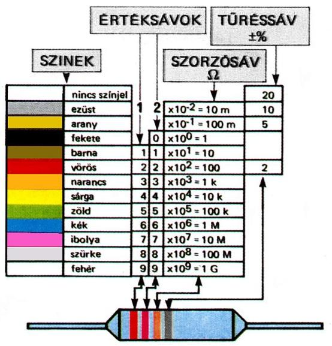

*Resistor colour-code reference chart (colour bands, value/multiplier/tolerance) with an example resistor.*

*4.1-2. ábra. Ellenállásértékek kódolásai*

### 4.1.4. Ellenállások összekapcsolása

Gyakran fordul elő olyan helyzet, amikor nem egy ellenállás (vagy ellenállást képviselő impedancia) hanem kettő, vagy több alkatrész van összekapcsolva. Az ellenállásokat többféle módon lehet összekapcsolni: 

1.     soros kapcsolás 

2.     párhuzamos kapcsolás 

3.     vegyes kapcsolás 

Bármilyen módon összekapcsolt ellenállásokat (tetszőlegesen bonyolult hálózatot) egyetlen ellenállással helyettesíthetjük. Ennek az ellenállásnak az értéke az eredő ellenállás. Természetesen ez egy fiktív ellenállás, csak elméletben létezik.

#### 4.1.4.1. Soros kapcsolás

Az ellenállások soros kapcsolásánál az ellenállás eredő értéke az ellenállások összegével egyenlő (4.6).

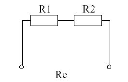

*Two resistors R1, R2 connected in series with combined resistance Re.*

*4.1-3. ábra. Két ellenállás soros kapcsolása*

A 4.1.3. ábrán látható kapcsolásnál két ellenállást kapcsoltunk sorba. N darab ellenállás sorba kapcsolása esetén a (4.6) összefüggés adja meg az eredő ellenállást. `Re = R1 + R2 + ... + Rn`

#### 4.1.4.2. Párhuzamos kapcsolás

Ellenállásokat párhuzamosan is kapcsolhatunk. Ekkor az eredő ellenállás a (4.7) összefüggés alapján számítható.

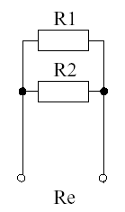

*Two resistors R1, R2 connected in parallel with combined resistance Re.*

*4.1-4. ábra. Két ellenállás párhozamos kapcsolása*

A 4.1.4. ábrán két ellenállás párhuzamos kapcsolását ábrázoltuk. N darab ellenállás esetén a (4.7) összefüggés alapján számítható az eredő ellenállás.

`Re = 1 / (1/R1 + 1/R2 + ... + 1/Rn)`

Két ellenállás esetében ennél a képletnél egy egyszerűbbel (4.8) szoktunk számolni. Természetesen a két képlet ekvivalens. 

`Re = (R1 * R2) / (R1 + R2)`

## 4.2. Kondenzátor

A kondenzátort legegyszerűbben úgy képzelhetjük el, mint egy akkumulátort. Ha feszültséget kapcsolunk rá, feltöltődik, ha fogyasztót kapcsolunk rá, akkor kisül. Persze egyelőre nem alkalmaznak akkumulátor helyett kondenzátort, mert vannak lényegi eltérések. Például az akkumulátorral szemben a kondenzátor a feltöltődést és kisülést igen rövid idő alatt (kapacitástól függően, akár 1 ms is lehet) végzi el.

### 4.2.1. A kapacitás jele és mértékegysége

A kondenzátorok kapacitásának jele: `C`, mértékegysége: `F` (Farad). 1 F meglehetősen nagy kapacitást jelent, rendszerint piko-, nano- és mikrofaraddal dolgozunk.

1 pF = 10^-12 F 

1 nF = 10^-9 F 

1 µF = 10^-6 F 

A kapacitás értéke függ a fegyverzetek közös felületétől (A), a fegyverzetek távolságától (d), és a dielektrikum anyagi minőségétől ( ε0 εr ). 

`C = ε0*εr*(A/d)`

### 4.2.2. A kondenzátorok típusai

A kondenzátorok lényegében két fémlemezből, vagy fémfóliából állnak, amelyeket szigetelőanyag választ el egymástól. A szigetelőréteget dielektrikumnak, a fémlemezeket fegyverzeteknek nevezzük. A kondenzátorok fizikai többféle lehet, az elektronikai ipar számos különféle kondenzátort gyárt, pl: kerámia-, üveg-, csillámpala-, papír-, polikarbonát-, poliészter-, polisztirol-, elektrolit-, levegős-, olajtöltésű kondenzátor. Az alábbiakban bemutatjuk a leggyakrabban használt típusokat.

#### 4.2.2.1. Papírkondenzátorok

A legolcsóbban előállítható a papírkondenzátor, amely készítésénél vékony vezető fóliából (alumínium, ón) és kondenzátorpapírból készült csíkokat hengeres alakúra csévélnek fel. A felcsévélt kondenzátor a csévélés következtében az egymással szembe kerülő felületek miatt kétszeres kapacitású lesz, mintha hagyták volna sík elrendezésben. A jobb minőségű papírkondenzátorokat olajjal itatják át. Főbb jellemzőik:

- 1-10μF névleges kapacitás;

- 63-1600V üzemi feszültség;

#### 4.2.2.2. Kerámiakondenzátorok

A kerámiakondenzátorok dielektrikuma nagy hőmérsékleten tömörített oxidkerámia. A fegyverzeteket a kerámiára égetik, ehhez forrasztják a kivezetéseket. Az alkalmazott dielektrikum szerint lehetnek:

- 1. típusú kerámiakondenzátorok: melyekre jellemző a stabil kapacitás (0,5-800 pF), kis kapacitástűrés (5-10%), lineáris hőmérsékletfüggés, nagy szigetelési ellenállás, üzemi feszültség: < 50 V vagy 50- 500V. Elsődleges felhasználási területük: rezgőkörökben, oszcillátorokban, szűrőkben és egyéb nagyfrekvenciás áramkörökben.

- 2. típusú kerámiakondenzátorok: nagy fajlagos kapacitás (100-40000 pF), kis kapacitás stabilitás (> 20%), nagyobb veszteségi tényező, nemlineáris hőmérsékletfüggés. Üzemi feszültség: 50-500V. Elsődleges felhasználási terület: szűrés, csatoló áramkörök, ahol a stabilitás nem fokozott követelmény. A kerámiakondenzátorokon az esetek többségében a gyártók kódolva tüntetik fel a paramétereket. A kód értelmezése hasonló az ellenállásoknál tárgyalt jelölésrendszerrel: amennyiben a kondenzátoron 2 digites számérték található, pl.: 47, akkor az egy kódolás nélküli érték és pF-ban értendő, amennyiben 3 digites

számérték akkor az első kettő a kapacitásérték, amelyet a 3. értékkel együtt kell értelmezni (meg kell szorozni), pl.: 

104 → 10 * 10000 = 100000 pF = 0,1 μF. 

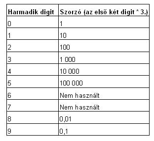

*Table of resistor colour-code third-digit multiplier values.*

A 3. digit jelentése az alábbi táblázatból kiolvasható:

| Harmadik digit | Szorzó (az első két digit ^ harmatik digit) |
| :-- | :--------- |
| 0 | 1            | 
| 1 | 10           | 
| 2 | 100          | 
| 3 | 1 000        | 
| 4 | 10 000       | 
| 5 | 100 000      | 
| 6 | Nem használt | 
| 7 | Nem használt | 
| 8 | 0,01         | 
| 9 | 0,1          |

#### 4.2.2.3. Elektrolit kondenzátorok

Az elektrolit kondenzátor működési elve nem különbözik a normál kondenzátortól. Felépítése azonban igen. A nagy kapacitást a két fegyverzet közötti szigetelés (dielektrikum) vékonyságával érik el. Az elektrolit kondenzátorban a két alumínium fólia fegyverzet közti papírszerű anyag van átitatva elektrolittal, és az egész fel van tekercselve. Bár felépítése hasonló a sima papírkondenzátoréhoz, itt nem a papír a dielektrikum, hanem az alumínium fegyverzet felületén kiképzett szigetelő oxid réteg. Ebből következik, hogy az elektrolit kondenzátorok polarizáltak: csak a megfelelő irányú feszültség esetén szigetel, ellenkező irányban a kondenzátor átvezet, sőt a szigetelő réteg az elektrokémiai reakciók miatt lebomlik (a kondenzátor tönkremegy). Ez a réteg azonban magától is bomlik, ha a kondenzátor sokáig nincs használva. De nem csak ez a veszély leselkedik az ilyen típusú kondenzátorokra. Egy régi elektrolit kondenzátor kiszáradhat, szakadt vagy zárlatos lehet és biztos, hogy a fent említett okok miatt leromlott állapotban van. Legveszélyesebb a zárlatos kondenzátor, mert az áramkörben károsíthatja az alkatrészeket (egyenirányító, tápegység stb.) Kevésbé veszélyes a kiszáradt, kapacitását vesztett, vagy teljesen szakadt kondenzátor, ebben az esetben egyszerűen nem teljesíti feladatát. Ha viszont csak a dielektrikum van leromolva, akkor a kondenzátor egyszerűen regenerálható: az üzemi feszültégre kell tölteni a kondenzátort, és egy darabig úgy hagyni, ennek hatására a szigetelő réteg újra felépül. 
Főbb jellemzőik:

- 0,4 - 100 000 μF névleges kapacitás

- 6,3 - 500 V üzemi feszültség

#### 4.2.2.4. Változtatható kapacitású kondenzátorok

A változtatható kapacitású kondenzátorok általában lemezelt állórészbe tengely körül beforduló forgórészből állnak, forgókondenzátor kivitelűek. Lehet egy tengellyel párhuzamosan működő több forgókondenzátor kapacitását változtatni (3.2.1-es ábra).

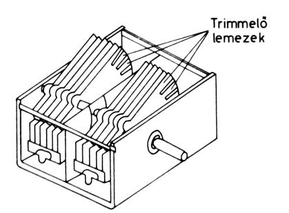

*Illustration of a trimmer/variable capacitor's internal rotating plates.*

*4.2-1. ábra. Forgókondenzátor (kettős forgó)*

A változtatható kapacitású kondenzátorokat felhasználás szempontjából két csoportba oszthatjuk:

- a működés során többször folyamatosan változtatható kapacitású kondenzátor;

- egyszeri beállításra, trimmelésre használt kivitel. A forgókondenzátort leggyakrabban rezgőkörök hangolására használják. A forgókondenzátorok az alkalmazott dielektrikum szerint készülhetnek: levegő, csillám, bakelit, kerámia és teflon dielektrikummal.

### 4.2.3. Kapacitások kapcsolási lehetőségei

A kondenzátorokat – mint az ellenállásokat – lehet sorba és párhuzamosan kötni. Az eredő kapacitás kiszámítása megegyezik az ellenállásoknál tanult módszerekkel, de a soros és párhuzamos szabályok felcserélésével.

#### 4.2.3.1. Soros kapcsolás

Tehát a sorba kapcsolt kondenzátorok eredő kapacitását a (4.10) egyenlőség szerint számíthatjuk.

`1/Ce = 1/C1 + 1/C2 + ... + 1/Cn`

Két kapacitás sorba kapcsolásánál itt is használható az egyszerűbb (4.11) képlet.

`Ce = (C1 * C2) / (C1 + C2)`

#### 4.2.3.2. Párhuzamos kapcsolás

Párhuzamosan kapcsolt kondenzátorok eredő kapacitását a (4.12) képlettel számíthatjuk ki. `Ce = C1 + C2 + ... + Cn`

### 4.2.4. Kondenzátorok egyenáramú áramkörben

A kondenzátorok egyenáramú áramkörben elméletileg szakadásként viselkednek. A gyakorlatban azonban mindig van valamekkora átvezetés a két fegyverzet között. Továbbá a kondenzátorok bekapcsoláskor (minden gyors elektromos változás hatására) ellenállásuk lecsökken.

#### 4.2.4.1. Soros RC tag működése

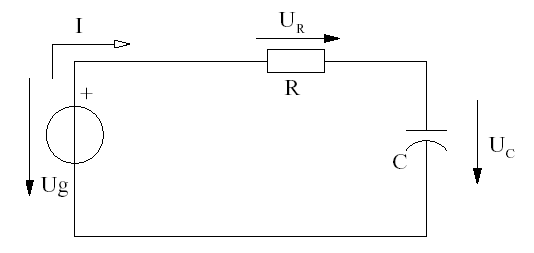

*RC charging circuit with source Ug, resistor R, capacitor C, showing voltages UR and UC.*

*4.2-2. ábra. Soros RC tag viselkedése*

Technológiai kialakításuk miatt a kis kapacitású (pF, nF) kondenzátoroknál mindegy, hogy milyen polaritással kötjük be éket (ez váltakozó áramú áramkörben fontos, mint majd látni fogjuk), de a nagyobb, µF-os és afölötti elektrolit kondenzátoroknál (röv.: ELKO) figyelnünk kell a helyes bekötésre. Ez utóbbi kondenzátoroknál a kapcsolási rajzon mindig feltűntetik a kondenzátor polaritását, de csak a pozitív kivezetést. (Ami lehet egy "+" jel, mint a rajzon, vagy a pozitív fegyverzet megvastagítása)

Tegyük fel, hogy a tápegység ki van kapcsolva és a kondenzátor is teljesen kisütött állapotban van. Próbáljuk meg végigkövetni, hogy mi történik, amikor feszültséget kapcsolunk a kondenzátorra. A generátorból töltések elkezdenek vándorolni a kondenzátor felé. Az áramkör a még kisellenállású kondenzátoron át záródik. A töltések polarizálják a kondenzátort, tehát egyre nagyobb lesz a kondenzátor ellenállása, és így a rajta eső feszültség is. Mivel a kondenzátor feszültsége közelit a generátor feszültségéhez, az áramkörben folyó áram egyre kisebb lesz. Elmondhatjuk tehát, hogy kezdetben a kondenzátor rövidzárként viselkedik, majd egyre nagyobb ellenállást képvisel. Stabil (feltöltött) állapotban szinte egyáltalán nem fol yik áram, és a kondenzá tor feszültsége megegyezik a generátor feszültségével. Ekkor a kondenzátor teljesen fel van töltve. A fent ismertetett folyamatot a 4.2.2. ábra mutatja. Következő lépésként vegyük le a generátorról a feltöltött kondenzátort és az ellenállást, majd zárjuk rövidre a generátor helyén a kapcsolást (4.2.3. ábra). Ekkor az áramkört a kondenzátorban tárolt energia (feszültség) fogja táplálni. Mivel a kapcsolás egy párhuzamos kapcsolás, az ellenálláson és a kondenzátoron lévé feszültség minden időpillanatban meg fog egyezni. Kezdetben a feszültség megegyezik a kondenzátor töltési feszültségével. Az ellenállás kisüti a kondenzátort, tehát a feszültség fokozatosan csökkenni fog. Kezdetben az áramerősség I = UC / R értékű, majd folyamatosan csökken. Felhívjuk a figyelmet, hogy az áramerőség ellentétes irányba folyik, tehát a kondenzátorból az áramkör többi része felé!!!

A feszültség és áram viszonyokat a 4.2.4. ábra mutatja.

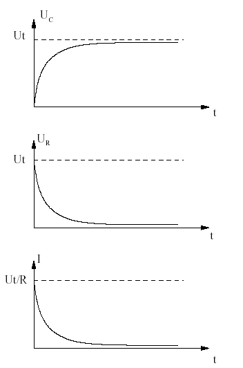

*Three stacked graphs of capacitor-charging curves over time for UC, UR, and current I.*

*4.2-3. ábra. Az áramkörben eső feszültségek és az áramkörben folyó áram időbeli függvényei*

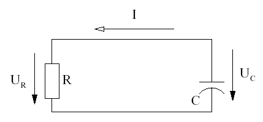

*RC discharging circuit with resistor R and capacitor C, showing current I and voltage UC.*

*4.2-4. ábra. A kondenzátor kisütése*

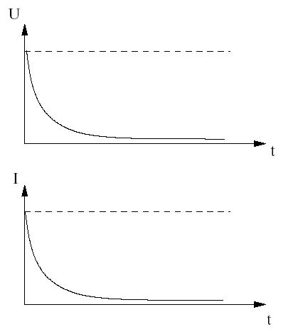

*Two stacked graphs of capacitor-discharge curves over time for voltage U and current I.*

*4.2-5. ábra. Kisütésnél eső feszültség és az áramkörben folyó áram időbeli függvényei*

#### 4.2.4.2. Párhuzamos RC tag működése

Figyeljük meg a 4.2.6. ábrán látható kapcsolást!

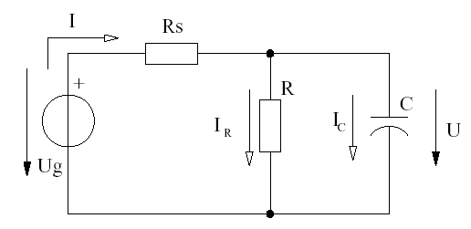

*RC circuit with source Ug, series resistor Rs, and parallel R-C branch, showing IR, IC and U.*

*4.2-6. ábra. Párhuzamos RC tag*

Kövessük végig az eseményeket! Kezdetben a töltetlen kondenzátor rövidzárként viselkedik, tehát söntöli az R ellenállást, ami következtében nem fog folyni rajta áram. Tehát az áramkörben folyó összes áram a kondenzátoron keresztül fog folyni, ami tölti azt. (Jelen esetben a kondenzátor rövidre zárná a generátort, ezért beiktatunk a kondenzátor és az áramfor rás közé egy soros ellenállást! (Rs) )

Ahogyan a kondenzátor elkezd töltődni, növekszik az ellenállása, így az R ellenálláson egyre nagyobb áram kezd el folyni. Végül, amikor a kondenzátor feltöltődött és szakadásként jelentkezik, minden áram az R ellenálláson folyik át. Ennek megfelelően az R ellenállás feszültség/áram idő karakterisztikái a 4.2.7. ábrán láthatóak.

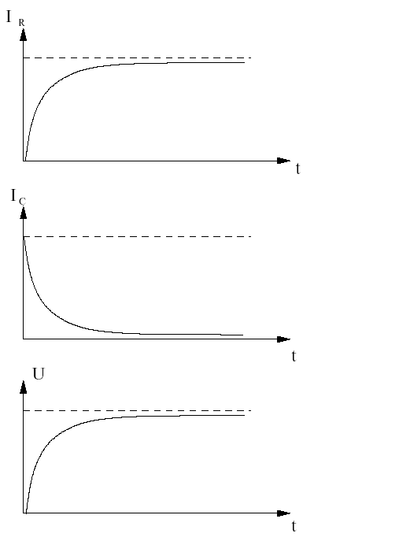

*Three stacked graphs of transient IR, IC and U as a capacitor charges through a series resistor.*

*4.2-7. ábra. Párhuzamos RC tag időfüggvényei*

#### 4.2.4.3. Párhozamos RC kör kisülése

Most iktassuk ki az áramforrást úgy, mint a soros kapcsolásnál, de itt ne zárjuk rövidre az áramforrás helyét, mert azzal a kondenzátort zárnánk rövidre. Helyette csak egyszerűen szakítsuk meg (4.2.8. ábra).

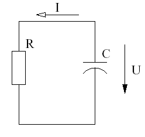

*RC circuit (R and C in parallel) with current I and voltage U, for a discharge time-constant example.*

*4.2-8. ábra. Párhuzamos RC tag kisülése*

Észrevehetjük, hogy a kondenzátor megint az R ellenálláson keresztül fog kisülni, mint a soros kapcsolásnál. Így a kisülés karakterisztikája megegyezik a soros kapcsolás kisülésének karakterisztikájával, azzal a különbséggel, hogy az áramirány nem fordul meg, hiszen a fegyverzetek ugyanabba az irányba fognak kisülni, mint amerre a generátoros üzemben az áram folyt (4.2.4. ábra).

### 4.2.5. Kondenzátorok váltakozó áramú körökben

Láttuk, hogy statikus körülmények között a kondenzátor egyenáramon szakadást képvisel, tehát ellenállását végtelennek foghatjuk fel. Mivel a váltakozó áramú körökben nem beszélhetünk statikus állapotról, a kondenzátor valamilyen véges nagyságú ellenállást (reaktancia) fog képviselni. Ez az ellenállás érték függ a frekvenciától, és a kapacitás nagyságától. Mivel ez az ellenállás nem egy Ohmos ellenállás, ezért nem Rel, hanem Xc -vel jelöljük.

`Xc = 1 / 2π * f * C`

A 4.13. képlet számszerű eredményének mértékegysége szintén: Ω mint az ellenállásnak. Az Ohm törvénnyel is számolhatunk, de csak akkor, ha csak kondenzátor van az áramkörben. Mivel a kapacitás ellenállása nem valós értékű, ezért reaktanciának hívjuk. Egy soros RC kör impedanciáját (eredő ellenállását) nem lehet összegezni úgy, ahogy azt az egyenáramú körökben megszokhattuk. Későbbiekben ezzel részletesen foglalkozunk. Vizsgáljunk meg egy soros RC kört váltakozófeszültséggel táplálva. Tudjuk, hogy nagyfrekvencián a kondenzátor rövidzárként fogható fel, míg kisfrekvenciákon szakadásként viselkedik. Köztes frekvenciákon véges impedanciát képvisel a kör. Van egy kitüntetett frekvencia, ahol a kapacitás impedanciája pontosan megegyezik az ellenállás értékével. Ez a pont a határfrekvencia. Ezt a frekvenciát mindig a 4.14. képlet alapján kell kiszámítani. 

`f = 1 / ( 2π * R * C )`

## 4.3. Induktivitás

Tekercsnek nevezzük azokat az elektromos eszközöket, melyek huzal feltekercselésével keletkeztek. Ha egy vezetőben villamos áram folyik, akkor a vezető körül elektromágneses tér keletkezik. Ez igaz fordítva is, ha egy vezetőt körül megváltozik a mágneses térerősség, akkor a vezetőben áram indukálódik. Ezekre a huzalból tekercseléssel készült alkatrészekre a váltakozó áramú körökben való alkalmazás a jellemző. A tekercs ugyanis egyenáramon nagyon jó és relatív kis ohmos ellenállást képviselő átvezetést ad, míg a rajta lévő jel frekvenciájával lineárisan növekvő váltakozó áramú ellenállást – más néven impedanciát – képvisel.

### 4.3.1. A tekercs jele, és mértékegysége

A tekercs jele az `L`, mértékegysége a `H` (Henry). 1H nagyon nagy érték, ezért nH, vagy µH értékeket szoktunk használni.

### 4.3.2. A tekercs induktivitása

A tekercs induktivitása függ a fizikai adataitól, tehát a tekercs keresztmetszetétől (A), a tekercs menetszámától (n), a tekercs hosszától (1), valamint a vasmag anyagi minőségétől ( μ0 μr ). (4.15. egyenlet)

`L = μ0 * μr * n^2 * (A / l)`

### 4.3.3. A tekercs reaktanciája

A tekercs -a kondenzátorhoz hasonlóan- nem valós ellenállást képvisel, hanem reaktanciát. Ezt az értéket Xl -el jelöljük. A tekercs reaktanciája egyenes arányban van a frekvenciával. (4.16. egyenlet) 

`Xl = ωL = 2πfL`

A tekercsek fizikai megvalósítását tekintve rendelkeznek soros, ohmos veszteségi ellenállással is (a huzal ellenállása). Az ohmos veszteségi ellenállás következtében egy valóságos tekercs impedanciája már nemcsak tisztán relatív, jωL (j a képzetes részre utal) nagyságú impedanciát képvisel, hanem sok esetben figyelembe kell venni a tekercs soros ellenállását (Rs) is: 

`Xl = Rs + jωL`

`|Xl| = √(Rs² + (ωL)²)`

A 4.16a-s egyenlet második részében feltüntettük az eredő kiszámításának menetét is.

### 4.3.4. A tekercs jósági tényezője

A tekercsekre jellemző a jósági tényező is (`Q`), amely megadja a tekercs impedanciája képzetes és valós részének arányát egy adott frekvencián: 

`Q = ωL / Rs` 

A nagy jóságú tekercsek tehát kis soros veszteségi ellenállással rendelkeznek az impedancia relatív összetevőjéhez képest.

### 4.3.5. Tekercsek alkalmazása nagyfrekvenciás körökben

A tekercsek a rajtuk átfolyó áram által keltett mágneses tér révén tárolják a beléjük vezetett elektromos energiát. A mágneses térnek a tekercs belsejébe való koncentrálása előnyös, mert ezáltal növekszik a tekercs induktivitása azonos menetszám mellett és nő az energiabefogadó képessége. A mágnese tér koncentrálására szolgáló eszközök a vasmagok. A vasmag alkalmazása egyben a tekercs mágneses szórását is jelentősen csökkenti. A különböző frekvenciájú áramkörökben a tekercsek vasmagja a következő:

- 20 Hz…20 kHz: vas;

- 20 kHz…100 MHz: ferrit vasmagok;

- 100 MHz fölött: légmagos tekercsek. 

A nagyfrekvenciás vasmagos tekercsek vasmagja az esetek nagy többségében úgy van kialakítva, hogy valamely szerszámmal (pl. csavarhúzó) állítható legyen. Ily módon a tekercs induktivitása ±5…30% toleranciahatárok között finoman beállítható. A tekercsbe helyezett vasmag jelentősen növeli a tekercs induktivitását, és ezért azonos induktivitásérték mellett a vasmagos tekercsre lényegesen kevesebb menetszám és ezzel rövidebb huzal szükséges. A vasmagos nagyfrekvenciás tekercsek jósági tényezője Q = 50…500 értékek között szokott lenni, a tekercs felépítésétől és a vasmagtól függően.

### 4.3.6. Tekercsek soros és párhuzamos kapcsolása

A tekercsek az ellenállásokhoz hasonlóan egymással sorba, ill. párhuzamosan kapcsolhatóak. Ilyenkor az eredő induktivitás – ha a tekercsek között nincs csatolás – a következő képletekkel számítható ki. Soros kapcsolás: 

`Le = L1 + L2 + ... + Ln`

Párhuzamos kapcsolás: 

`Le = 1 / (1/L1 + 1/L2 + ... + 1/Ln)`

## 4.4. Transzformátorok alkalmazása és használata

Ha két tekercset ugyanazon magra tekerünk, akkor a két tekercsben lévő térerősség megegyezik. Ha az egyik tekercsre (primer tekercs) áramot kapcsolunk, akkor az megváltoztatja a térerőséget. Ez a megváltozott térerő a másik tekercsben (szekunder tekercs) áramot indukál. Ezt az elrendezést transzformátornak hívjuk.

### 4.4.1. Ideális transzformátor

Ideális transzformátor a gyakorlatban nem létezik. Ideális transzformátornak nevezzük azt, a transzformátort, melynek nincsenek veszteségeik. Ez azt jelenti, hogy a primer tekercsben keletkezett térerőség maradéktalanul eljut a szekunder tekercsbe.

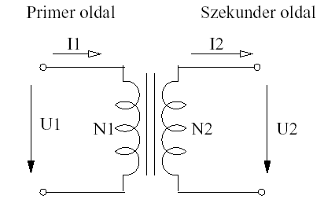

*Transformer schematic: primary winding (N1, U1, I1) and secondary winding (N2, U2, I2).*

*4.4-1. ábra. Transzformátor jelölése, valamint a feszültségei és áramai*

A primer és a szekunder oldali feszültségek aránya megegyezik a menetszámok arányával. Mivel teljesítményt nem erősíthet a transzformátor, ezért az áramok fordítottan arányosak egymással. (4.17., 4.18., 4.19. képletek) 

`N1 / N2 = U1 / U2`

`N1 / N2 = I2 / I1`

`P1 = P2`

### 4.4.2. Kialakítás szerinti típusok

#### 4.4.2.1. Toroid transzformátor

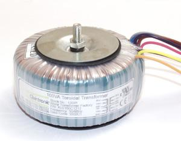

*Photo of a toroidal transformer.*

*4.4-2. ábra Toroid transzformátor*

Egy gyűrű alakú magra tekercselik fel a primer valamint a szekunder tekercseket. Előnye ennek a módszernek a nagy hatásfok (a hagyományos vasmagos megoldáshoz képest ugyanaz a teljesítmény kisebb transzformátort igényel). Ezzel szemben nagyon nehézen kivitelezhető.

#### 4.4.2.2. Hagyományos lemezelt és tekercselt vasmagos transzformátor

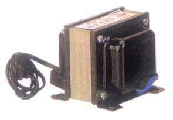

*Photo of a laminated-core mains transformer with wire leads.*

*4.4-3. ábra Hagyományos lemezelt transzformátor*

Tekercselt vasmag: Az örvényáramok kiküszöbölésére ferromágneses lemezszerű anyagból tekercselnek. A feltekercselt magot középen elfűrészelik, majd teljesen simára köszörülik, hogy azokat tökéletesen össze lehessen illeszteni. Lemezelt vasmag: Többféle kialakítás létezik (EI,M, stb). A lemezeket egymástól elszigetelve kell a csévébe helyezni, majd azokat csavarral egymáshoz rögzíteni. Olcsó kivitel, kevésbé jó hatásfok jellemzi.

### 4.4.3. Alkalmazási típusok

Transzformátort akkor használunk, ha feszültség, áram vagy impedancia illesztést kell elvégeznünk. A feszültség- és áramillesztésre példa a hálózati transzformátor, mely a 230V-os hálózati feszültséget például 12Vra alakítja át. Impedancia illesztést pedig nagyfrekvenciás körökben szoktak alkalmazni. A másik alkalmazási terület a leválasztás. Mivel a primer és a szekunder tekercsek nem érintkeznek galvanikusan, a két áramkör között teljes leválasztás érhet el. Ez akkor jelentős, ha p1. két olyan áramkör között kell váltóáramú kapcsolatot teremteni, amelyek nem kerülhetnek galvanikus kapcsolatba. Erre is jó példa a hálózati transzformátor.

#### 4.4.3.1. Impulzustranszformátor 

Alkalmazása főleg kapcsolóüzemű tápegységekben. Bemenetére nagyfrekvenciás négyszög-impulzusok kerülnek.

#### 4.4.3.2. Szóró-transzformátorok 

A primer valamint a szekunder tekercsek között nincs nagy csatolás. Kisteljesítményű, nagyfeszültségű tápegységekben használatos.

## 4.5. Dióda

A diódák olyan félvezető eszközök, melyek két rétegből állnak. Ezek az eszközöket általában egyenirányításra használjuk. Jelentős szerepük van modulátorokban, stabilizátorokban. Vannak olyan diódák, melyek rezgéskeltésre is alkalmasak oszcillátorokban. A dióda két félvezető rétegből állnak; tehát egy P-N átmenetet valósítanak meg. A diódákat szilíciumból készítik, de léteznek különleges diódák, melyek `GaAs`-ből készítenek. Ilyen anyagokat használnak a fénykibocsátó LED diódáknál, valamint a nagyfrekvenciás eszközöknél.

### 4.5.1. A dióda működése; karakterisztikája

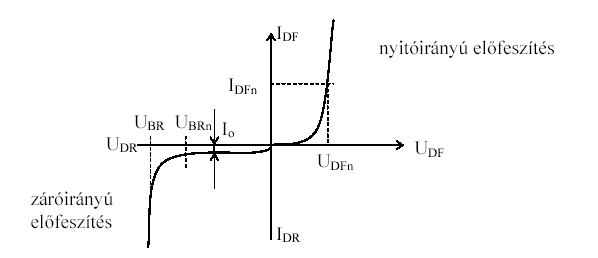

*Diode current-voltage characteristic curve, showing forward and reverse bias regions.*

*4.5-1. ábra. Dióda karakterisztikája*

Látható, hogy a diódák a rájuk kapcsolt feszültség polaritásától (és nagyságától) függően vezetnek vagy sem. A dióda nyitóirányban (UDF,IDF) akkor van előfeszítve, ha az anódján a feszültség pozitívabb, mint a katódján. Záróirányban (UDR,IDR) az előfeszítés iránya ellentétes. A záróirányú karakterisztika áram tengelyének (IR) léptékezése eltér a nyitóirányú karakterisztikáétól a záróirányú áram bemutatása érdekében (a záróirányú áram a nyitóirányú áramhoz képest több nagyságrenddel kisebb).

### 4.5.2. Diódák tulajdonságai, paraméterei

A diódákra jellemző statikus paraméterek:

- nyitóirányú névleges áramerősség (IDF)

- nyitóirányú névleges feszültség (UDFn),

- maximális disszipációs teljesítmény,

- visszáram (záróirányú normál működés esetén – I0),

- záróirányú névleges letörési feszültség (UBR). 

A dióda jellemző dinamikus paraméterei: 

Bekapcsolási idő, amely a felfutási és a késleltetési időből tevődik össze, valamint a kikapcsolási idő, amely a töltéstárolási időből és a lefutási időből tevődik össze. A töltéstárolási idő döntően befolyásolja a dióda gyorsaságát. Oka a nyitóirányban a rétegben felhalmozott jelentős mennyiségű szabad töltéshordozó, amelynek kisütése időt igényel, különösen akkor, ha a dióda nyitóból záróirányba kerül és így a töltésáramlás lecsökken. 
A gyorskapcsoló diódák esetén ezt az értéket a szennyezés beállításával és a megfelelő réteg konstrukcióval szorítják le. Különösen nagy sebességű diódákat vagy Shottky-diódával vagy PIN diódával valósítunk meg. A nagyfrekvenciás diódák eltérő kialakításúak a GHz tartományban fellépő jelenségek miatt pl. Gunn, IMPATT, stb. diódák. Az egyenirányító és teljesítmény diódák esetében a melegedési problémák jelentősebbek, így azokat arra konstruálják.

### 4.5.3. Egyenirányító diódák

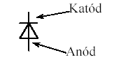

*Diode circuit symbol with cathode and anode labelled.*

*4.5-2. ábra. Egyenirányító dióda jelölése és kivezetései*

Az egyenirányító diódákra jellemző, hogy nyitóirányban nagyon kicsi (szilíciumnál tipikusan 0.6V) nyitófeszültséggel rendelkeznek. Ez azt jelenti, hogyha a diódán ennél a feszültséghatárnál nagyobb esik, akkor a dióda vezetővé válik. Záróirányban a diódák csak nagy záróirányú feszültség esetén vezetnek (rendellenes működés, a dióda tönkremegy!)

### 4.5.4. Zener dióda

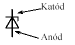

*Zener diode circuit symbol with cathode and anode labelled.*

*4.5-3. ábra. Zener dióda jelölése és kivezetései*

A Zener-diódák olyan kétrétegű félvezetők, amelyek tartósan a letörési tartományban dolgoznak. A legtöbb félvezető elérve a letörési feszültség határértékét tönkremegy, elsősorban a jelenség hatására a rétegekben egyre növekvő hőmérséklettől. A Zener-dióda esetében azonban az ilyenkor keletkező hőmennyiség elvezetését megoldották és az eszköz A Zener diódára jellemző, hogy a záróirányú letörési feszültsége alacsony. Ezt a feszültséget a lapka adagolásával állítják be a gyártók. Nyitóirányban a Zener dióda kisteljesítményű diódaként viselkedik, míg záróirányban előfeszítve a Zener dióda áramváltozás hatására is megtartja a zárófeszültséget, tehát feszültségstabilizáló hatást ér el. A Zener dióda maximális áramát a névleges disszipációs teljesítménye határozza meg (általában < 2W).

### 4.5.5. Shottky-dióda

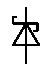

*Diode circuit symbol (unlabelled).*

*4.5-4. ábra. Shottky dióda jelölése*

Fém-félvezető dióda (pl. `AlSi`), amelynek jellemzője a `Si` diódáknál lényegesen kisebb nyitóirányú feszültség. Ezt a tulajdonságát felhasználva elsősorban gyorskapcsoló diódaként a digitális áramkörök fontos alkatrésze.

### 4.5.6. Varicap-dióda (kapacitás dióda)

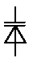

*Diode circuit symbol variant (unlabelled).*

*4.5-5. ábra. Varicap-dióda jelölése*

A varicap diódák a pn átmenet kiürített rétegének feszültséggel változó kapacitását használják ki. A záróirányba kapcsolt pn réteg kiürített rétegében csak kisebbségi töltéshordozók halmozódnak fel, a p rétegben n az n rétegben p megoszlásban. Így tulajdonképpen egy sík kondenzátort kapunk. Mivel a réteg vastagsága a szennyezésen és a hőmérsékleten túl a rákapcsolt feszültségtől függ, egy feszültséggel vezérelt kapacitáshoz jutunk. A félvezető speciális kialakításával és szennyezésével ez a hatás fokozható. A kapcsolat a vezérlő feszültség és a kapacitás között nemlineáris. Tipikus kapacitások a 10..300 pF tartományba esnek. Elsősorban feszültséggel hangolt rezgőkörökben alkalmazzák rádiótechnikai célokra.

### 4.5.7. Fénykibocsátó dióda (LED)

A fénytartományba sugárzó eszközök a direkt félvezetők, amelynek jellemző alapanyagai a `GaAs`, `GaN`. A direkt félvezetők által kisugárzott fény spektruma a láthatófény vagy az IR tartományba eshet.

A spektrumot a láthatófény tartományba szennyezéssel tolják el, így `GaAsP` vörös diódát, `GaAsP:N` sárga és `GaP:N` zöld diódát eredményez. A hideg színek felé haladva a hatásfok egyre romlik. 

Létezik kék és fehér színű LED is, azonban a hatásfok további romlása következik be. 

A LED-ekre jellemző a sugárzási szögük, a maximális kibocsátható fényteljesítmény (fényerő) és a sugárzási fényspektrum (szín).

### 4.5.8. Diódák soros és párhuzamos kapcsolása

Diódákat sorosan kapcsolva egy olyan diódát kapunk, melynek nyitó irányú feszültsége az összekapcsolt diódák nyitófeszültségeinek összegével lesz egyenlő. Tehát ha két Si diódát kapcsolunk össze, akkor annak nyitófeszültsége 1.4 V körüli lesz. Párhuzamos kapcsolásnál csak az antiparalell kapcsolás jöhet szóba. Ekkor egy olyan kapcsolást kapunk mely bárhogyan előfeszítve 0.6V körüli nyitó valamint záróirányú feszültséget ejt.

### 4.5.9. Tranzisztor

A tranzisztorok két csoportba sorolhatók:

- bipoláris tranzisztorok

- térvezérlésű tranzisztorok (Field Effect Transistor – FET)

### 4.5.10. Bipoláris tranzisztor 

A bipoláris tranzisztor működése az úgynevezett pn-átmeneten alapul. Az egyszerű tranzisztor három, egymáson elhelyezkedő rétegből - egy p-, egy n- és ismét egy p-vezető zónából (pnp tranzisztor), illetve npn tranzisztor esetén fordított sorrendű rétegekből - áll. A külső két réteget (a trióda anódjának és katódjának megfelelően) kollektornak (`C`) és emitternek (`E`) nevezik, a középsőt az elektroncső rácsának megfelelően bázisnak (`B`) hívják. Az egyes rétegeket kezdetben germánium alapra építették fel, ma elsősorban az olcsóbb szilícium alapra készül. A bázis jóval vékonyabb, mint a másik két réteg. Ha a bázison nincs megfelelő bázisfeszültség, akkor a tranzisztor nem vezet a kollektor és az emitter között. Amennyiben a bázisra feszültséget kapcsolnak, a tranzisztor a feszültség értékének megfelelő mértékben vezetővé válik. Mivel a bázisáram rendkívül kicsi a kollektor-emitter áramhoz képest, nagy áramerősítés érhető el az eszközzel, s erősítőként, valamint kapcsolóeszközként egyaránt jól használható.

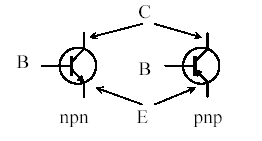

*Bipolar transistor symbols for NPN and PNP types, showing base (B), collector (C), emitter (E).*

*4.5-6. ábra. NPN és PNP tranzisztor áramköri jele és kivezetései*

#### 4.5.10.1. Tranzisztorok működése

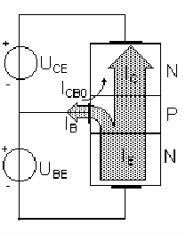

*Internal NPN junction structure of a bipolar transistor, showing IB, IC, ICB0, UCE, UBE.*

*4.5-7. ábra. NPN bipoláris tranzisztor működése*

A fenti ábra segítségével kívánjuk szemléltetni a tranzisztorhatást, továbbá az alábbiakban ismertetésre kerül a működés definíciója: Az NPN tranzisztorra kapcsolt UBE feszültség nyitja a DBE diódát, az UCB feszültség pedig zárja a DCB diódát. Az UBE feszültség hatására meginduló IE áramnak csak egy része folyik IB áramként, az elektronok többsége a Bázisban felgyorsulva, és a pozitív Kollektor feszültség szívó hatására a Kollektoron folyik át. Ez az IC kollektoráram. A záróirányban előfeszített DCB diódán ICB0 visszáram is folyik, amelynek nagysága a gyakorlatban elhanyagolható. Tehát a tranzisztorra az IE=IB+IC+ICB0 csomóponti egyenlet érvényes. Konstans UBE és UCB feszültségek mellett az IB és IC áram aránya is konstans. Statikus áramerősítési tényező:

`B = Ic / Ib`

Dinamikus áramerősítési tényező: 

`β= ΔIc / ΔIb`

Korszerű tranzisztoroknál: B ≈ β , továbbá a nagy értéke miatt az Ic ≈ Ie közelítés nagyon gyakran megfelelő.

#### 4.5.10.2. Tranzisztor alapkapcsolások

Attól függően, hogy a tranzisztor három csatlakozási pontja közül melyiket csatlakoztatjuk állandó potenciálú pólusra, megkülönböztetünk:

- földelt emitteres,

- földelt bázisú,

- földelt kollektoros alapkacsolásokat. 

A felsoroltak mindegyike rendelkezik egy megadott felhasználási eset szemszögéből nézve előnyösebb vagy hátrányosabb adottságokkal, ezért a gyakorlatban mindhárom alkalmazásra kerül.

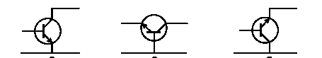

*Circuit symbols for NPN and PNP transistors in different orientations.*

*4.5-8. ábra. Tranzisztor alapkapcsolások (földelt emitteres, -bázisú, -kollektoros)*

#### 4.5.10.3. Tranzisztorok típusai

Sokfajta tranzisztort gyártanak és hoznak forgalomba. A tranzisztorok frekvencia és teljesítmény szerint osztályozhatók. A frekvencia szerinti osztályozás alapján megkülönböztetünk hangfrekvenciás, középfrekvenciás és nagyfrekvenciás tranzisztorokat. A terhelhetőség szempontjából megkülönböztetünk: kis, közepes, és nagy teljesítményű tranzisztorokat. Külön csoportokat képeznek a kapcsolótranzisztorok és egyéb különleges felépítésű bipoláris tranzisztorok.

#### 4.5.11. Térvezérlésű tranzisztorok (FET-ek) 

A térvezérlésű tranzisztorok (Field Effect Transistor = FET) működési elve alapjaiban eltér a bipoláris tranzisztoroktól. Itt az áramvezetés mértéke statikus feszültséggel befolyásolható, továbbá mivel nincs vezérlőáram, a vezérléshez teljesítmény sem szükséges, így a bementi ellenállása közel végtelen. A FET-ek alábbi típusait különböztetjük meg: 
1.     JFET 
2.     MOSFET 
Mindegyik típusnál megkülönböztetünk N-, és P- csatornás változatot.

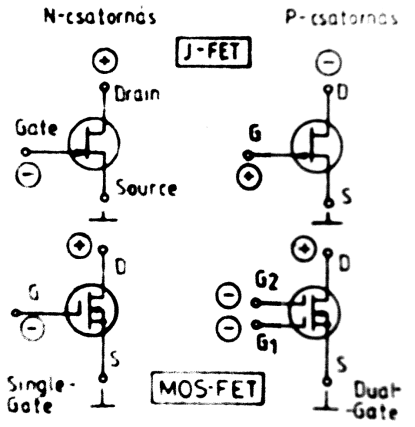

*Circuit symbols for JFET and MOSFET transistors (N-channel/P-channel, single-gate/dual-gate).*

*4.5-9. ábra. FET-ek típusai*

#### 4.5.11.1. JFET család

Történelmileg a JFET családot fejlesztették ki először. Felépítése: a gate vezérlőelektródát egy záróirányban előfeszített félvezető réteg (Junction) választja el az áram útjától. Működése: vezérlés nélküli állapotban a JFET vezet, azaz maximális áram folyik D és S között, míg a vezérlőfeszültség (UGS) növekedésével az áram csökken D és S között.

#### 4.5.11.2. MOSFET család

A később kifejlesztett MOSFET-ek két típusát különböztetjük meg: a kiürítésest és a növekményest. Felépítése: a fémből kialakított vezérlő gate elektródát egy, a szilíciumkristályon kialakított oxidréteg választja el az áramúttól. Működése: A kiürítéses MOSFET-eknél vezérlés nélküli állapotban, mikor UGS = 0 maximális áram folyik S és D között, majd a vezérlőfeszültség növekedésével az áramerősség csökken (nullához tart). A növekményes MOSFET-eknél vezérlés nélkül (UGS = 0) nem folyik áram az S és D között, a feszültség növekedésével egy bizonyos szint felett indul meg az áramlás S és D között (IDS max-hoz tart).

#### 4.5.11.3. A FET-ek alkalmazási területei

A FET tranzisztorok tipikus alkalmazási területe részben megegyezik, részben eltér a bipoláris tranzisztorétól. Tipikus alkalmazási területek:

- lineáris erősítőkben,

- digitális kapcsolóáramkörökben;

- feszültségvezérelt ellenállásként;

- feszültségvezérelt áramforrásként.

### 4.5.12. Tranzisztor, mint erősítő elem 

A tranzisztor gyakorlatilag egy vezérelt áramgenerátor. Láthattuk, hogy a bázison folyó áram nagyságrendekkel kevesebb, mint a kollektoron átfolyó áram. Továbbá elmondható, hogy a tranzisztor kollektor áramát a BE diódával lehet szabályozni; vagyis a BE elektródák közötti feszültséggel. A kollektor általában egy ellenállásra dolgozik, mely a kollektor áramot feszültséggé alakítja. Így az eredő kapcsolásból egy feszültségerősítőt nyerhetünk. Ezeket a kapcsolásokat a rádiótechnikában nagyon sokat használjuk.

Belátható, hogyha egy erősítő kimenetét valamilyen visszacsatoló hálózaton keresztül visszacsatoljuk a bemenetre, akkor így egy olyan állapotba kerülhet az erősítő, melyben bemenő gerjesztés nélkül is kimenő jelet produkál. Ezt a jelenséget oszcillációnak nevezzük. A jelenség lehet káros is, amikor nemkívánatos utakon kerül az erősítőnk bemenetére a kimenetén lévő jel. Ekkor azt mondjuk, hogy az erősítő begerjed. Ebben a helyzetben az erősítőt nem lehet tovább erősítésre használni. Ha tudatosan hozunk olyan állapotba egy erősítőt, hogy az oszcillálni kezdjen, akkor oszcillátor kapcsolásról beszélünk. Ezekben a kapcsolásokban általában egy vagy több frekvencia-meghatározó elem van, mely az oszcilláció frekvenciáját az általa meghatározott frekvenciára hangolja.

## 4.6. Elektroncsövek

Az elektroncsövek voltak az erősítőelemek úttörői. Az elektroncsöveket egy évszázada találták fel. Eleinte csak a hangfrekvenciás tartományban használták.

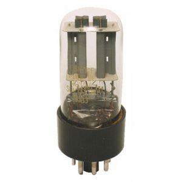

*Photo of a vacuum tube with visible internal electrodes and pin base.*

*4.6-1. ábra Elektroncső*

Ma elmondhatjuk, hogy az elektroncsövek minden frekvenciatartományban, szélsőséges teljesítmény viszonyok mellett is képesek üzemelni. Máig használnak elektroncsöveket rádió-adóberendezésekben, radar berendezések oszcillátoraiban, és végül, de nem utolsó sorban professzionális audiótechnikában, valamint az egyre kevésbé elterjedt CRT típusú TV készülékekben, valamint monitorokban. Elmondható azonban, hogy az elektronikának a része volt mindig.

### 4.6.1. Elektroncsövek felépítése, működése

A felépítése nagyon egyszerű. A katódot izzítani kell, hogy belőle kiléphessenek elektronok. Az elektronok az anód feszültség függvényében gyorsulnak, majd az anódba ütköznek. Az anód és a katód között egy harmadik elektróda is elhelyezkedik. Ezt az elektródát rácsnak hívják. A rácsot, ahogy neve is sugallja, egy rácsként kell elképzelni, mely szerkezetei között az elektronok el tudnak suhanni. Azonban ha feszültséget kapcsolunk a katód és a rács közé, a fellépő térerő befolyásolja a katód felé áramló elektronok intenzitását. Ez a hatás lehet erősítő és csillapító hatású. Ez a vezérlés erősítést eredményez.

### 4.6.2. Elektroncsövek tulajdonságai

Az elektroncsövek rácsellenállása a FET tranzisztorokhoz hasonlóan nagyon magas. Ezért nagyon jó előerősítőt lehet belőlük készíteni. Az elektroncsöveket azért szorította ki a tranzisztor, mert nagyon magas anódfeszültséget követelt meg. Ez a feszültség néhány száz volt nagyságrendben van. Továbbá gondoskodni kellett a csövek katódjainak fűtéseiről. Amíg a katód hideg volt, a cső nem működött. A bemelegedési idő akár néhány percet is igénybe vehetett.

## 4.7. Integrált áramkörök

### 4.7.1. A digitális technika alapjai

Az integrált áramkörök a modern elektronika talán legfontosabb építőelemei, nélkülük a mai elektronikai ipar elképzelhetetlen lenne. Az integrált áramköröket az eredeti angol elnevezésüknek megfelelően IC-knek (Integrated Circuit) hívják. Integrált áramkörök gyakorlatilag diszkrét elemek összezárása egyetlen tokban. Az első integrált áramkörök valós ellenállásokból, kondenzátorokból, félvezetőkből álltak. Kézzel szerelték össze, majd egy tokba helyezték őket és kiöntötték gyantával. Ma azonban lehetőség van a félvezető lapkán létrehozni ezeket az alkatrészeket. Manapság néhány négyzetcentiméteren több millió tranzisztort képes megvalósítani. Az IC-ket ma már számtalan helyen és célra alkalmazzák. Léteznek univerzális típusok, de vannak csak egy egészen speciális célra szolgáló IC-k is. 
Az integrált áramkörök két típusát különböztetjük meg:

- digitális IC-k,

- analóg IC-k.

### 4.7.2. Az integrált áramkörök előnyei

Sok minden szól az integrált áramkörök használata mellet. A négy legfontosabb érv: 

1. Megbízhatóság: A modern, bonyolult kapcsolások jóval terjedelmesebbek lennének, ha önálló – „diszkrét” – alkatrészek összeállítással készülnének. Az IC használata csökkenti a hibalehetőségek számát, s ezáltal növeli az összetettebb kapcsolások megbízhatóságát. 

2. Gazdaságosság: Egy integrált áramköri elem ára jóval alacsonyabb, mint ha az áramkört diszkrét elemek sokaságából építenénk fel. 

3. Helytakarékos szerelés: Az integrált áramköri elemekből felépített áramkörök kis helyigénnyel rendelkeznek, így könnyű és jól hordozható adó-vevők készíthetők. Ugyanez diszkrét alkatrészekkel nagyobb méretű és nehezebb eszközt eredményez. 

4. Könnyű javíthatóság: Az esetleges fellépő hibákat egy IC-kkel megépített kapcsolásban könnyebben behatárolhatjuk, tokokat használva pedig könnyen cserélhetjük azokat.

### 4.7.3. Műveleti erősítők

Az integrálási technika lehetővé teszi olyan többfokozatú, általános célú és felhasználású erősítők kialakítását is, amelyek diszkrét elemekkel nem, vagy nem azonos minőségben állíthatók elő. Az áramkörök kialakítása során kihasználják azt a lehetőséget is, amit a közel egyforma, azonos paraméterű és nagy számban integrálható aktív elemek kínálnak. Hátrányt jelent azonban, hogy néhány passzív alkatrész egyáltalán nem vagy csak korlátozott értékben integrálható, pl. közepes és nagy kapacitású kondenzátorok, induktivitások, transzformátorok. Alapvetően a műveleti erősítőkkel közvetlenül csatolt (egyenáramú erősítők, DC csatolt) valósíthatók meg minimális külső alkatrész igénnyel. Jele:

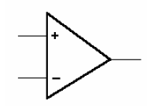

*Operational-amplifier circuit symbol with + and - inputs and a single output.*

*4.7-1. ábra Műveleti erősítő jele*

A műveleti erősítő bemeneteinek tulajdonsága:

- A ‘+’ -al jelölt bemenet neve nem invertáló bemenet, mert az ide kapcsolt jel a kimeneten a bemenetivel azonos fázisban jelenik meg.

- A ‘-’ -al jelölt bemenet neve invertáló bemenet, mert az ide kapcsolt jel a kimeneten a bemenetihez képest 180 fokos fázisfordítással jelenik meg.

- A bemenetekre egyidejűleg is kapcsolhatunk jelet, ekkor a kimeneten a jelek előjeles különbségét kapjuk.

A műveleti erősítőkkel az alábbi kapcsolások valósíthatók meg:

- lineáris erősítő (negatív visszacsatolással)

- nem-invertáló erősítő

- invertáló erősítő

- összeadó áramkör

- kivonó áramkör

- integráló áramkör

- differenciátor

- késleltető áramkör

## 4.8. Hődisszipáció

Mint ahogy azt már korábban részleteztük, az áramnak hőhatása is van. Általánosságban elmondható, hogy minden elemen a P = U I képlettel lehet kiszámolni a rajta fellépő hőteljesítményt. Ezt a teljesítményt megfelelő hűtő eszközökkel (hűtőcsillag, hűtőborda) el kell vezetni.

### 4.8.1. Hődisszipáció diódákon

Nyitó irányban a diódán 0.6V esik. A rajta fellépő hőteljesítmény a 

Pd = 0.6V * I 

képlettel számítható, ahol I a diódán átfolyó áramerősség. Zártirányban p1. Zener diódáknál a diódára jellemző zárófeszültség és a rajta átfolyó áram szorzata adja meg a disszipált teljesítményt.

### 4.8.2. Hődisszipáció tranzisztoroknál

Tranzisztoroknál az kollektoráram, valamint a kollektor és az emitter között eső feszültség szorzata adja a disszipált teljesítményt.
