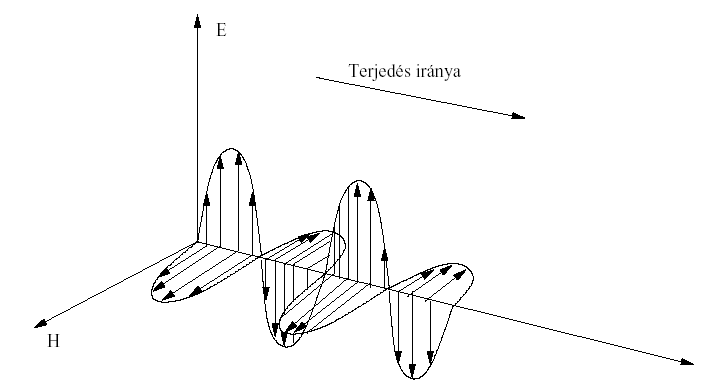
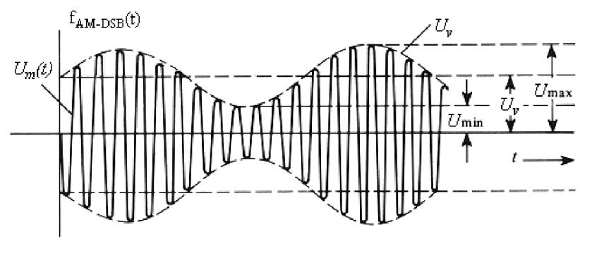
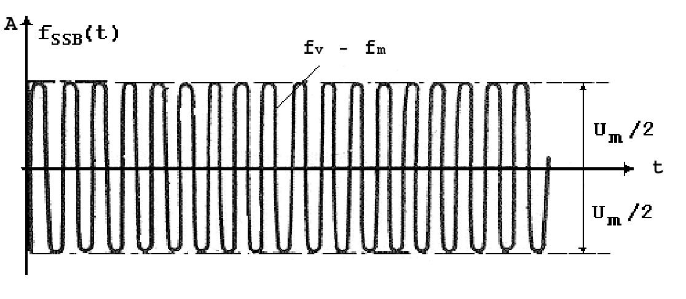
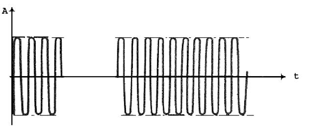
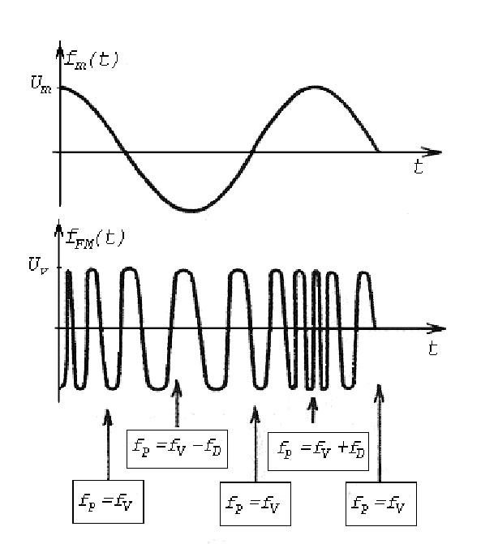
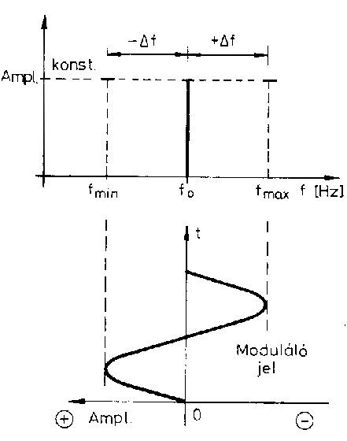

# 5. Rádióhullám és moduláció

Jónap Gergő HG5OJG

## 5.1. Rádióhullámok

Az elektromágneses hullámok keletkezése mindig az elektronok mozgására vezethető vissza. Rádióhullámoknak nevezzük azokat az elektromágneses hullámokat, amelyek frekvenciája 30 kHz - 3000 GHz közé esik. Legfontosabb fizikai tulajdonságai, hogy energiát és információt hordoznak, valamint térben közel fénysebességgel terjednek (300000 km/s). Az elektromágneses hullámok a tér egy-egy pontjában az elektromos és mágneses terek átalakulásából keletkeznek. Az elektromágneses hullámokat egy energiaforrásból gerjeszteni kell. Az így kapott energiát az elektromágneses hullám átviszi az adott közegen keresztül és a tér minden egyes pontjának átadja. Ha a szétterülő elektromágneses hullámokkal információt akarunk továbbítani, akkor egyes jellemzőit időben változtatnunk kell. Ilyen jellemzők lehetnek: amplitúdó, frekvencia és a fázis. Az elektromágneses hullámok frekvenciája és hullámhossza között az alábbi összefüggés van, ahol a c a hullám terjedési sebessége, λ a hullámhossz, melynek mértékegysége m (méter).

f = c / λ Az elektromágneses teret szemléletes módon vektorokkal is jellemezhetjük (5.1.1. ábra). Az elektromágneses hullámok egyik legfontosabb jellemzője a polarizáció. Polarizációnak nevezzük az elektromágneses hullámok elektromos vektorának (E) végpontja által végzett rezgések irányát. Viszonyításnak mindig a földfelszínt vesszük vízszintesnek. Háromféle polarizációt különböztetünk meg: lineáris, körkörös és elliptikus polarizációt. Lineárisnak nevezzük a polarizációt, ha az E vektor végpontja egyenes mentén rezeg. A földfelszínhez viszonyítva beszélhetünk függőleges (vertikális) és vízszintes (horizontális) polarizációról. Az elliptikus polarizáció esetén az elektromos komponens iránya körmozgást végez. A körforgás irányától függően beszélünk jobbra vagy balra forgó körpolarizációról. Az elliptikus polarizációt elsősorban magasabb frekvenciákon alkalmazzák (pl. űrtávközlés).

*5.1-1. ábra. Elektromágneses hullám terjedése*



*3D diagram of an electromagnetic wave: perpendicular electric (E) and magnetic (H) fields propagating through space.*

## 5.2. Modulált jelek

A rádiófrekvenciás közeg (éter) jól alkalmazható hírközlési csatornaként, amely segítségével információ továbbítható nagy távolságra és egyszerre több vételi helyre egyaránt. Az információ (kép, hang, adat) rádiófrekvenciás csatornákon történő átvitelénél a legfontosabb cél az, hogy az információ továbbítási helyéről (adó) a fogadási helyéig (vevő) változatlan formában megérkezzen (vagyis értelmezhető legyen, a lehető legkisebb információveszteséget szenvedje el). A rádiófrekvenciás átvitelnél az üzenetjelet az adó a csatorna bemenetére csatolja, ahol az üzenetjel átalakítása is megtörténik. Az üzenetjel átalakítása azért szükséges, mert azt közvetlenül a hírközlő (rádiós) csatornán átvinni nem lehet. Az üzenetjel átalakításának főbb lépései: erősítés, szűrés és a moduláció. Ezek közül a legfontosabb a moduláció, amely egy olyan eljárás, amelyben egy alkalmasan választott vivőhullámmal a továbbítandó jel tulajdonságait úgy változtatja meg, hogy az jól illeszkedjék az átviteli csatorna tulajdonságaihoz. A moduláció során egy nagyfrekvenciás jel elektromágneses jellemzőit változtatjuk meg. Ilyen jellemzők: pl. az amplitúdó, a frekvencia, a fázis és a nulla átmenetek távolsága. Bármilyen jellemző megváltozatását is tűzzük ki célul, a nagyfrekvenciás jelnek az alábbi követelményeket kell kielégítenie: periodikus jelnek kell lennie, jó hatásfokkal továbbíthatónak és más elektromágneses jeltől megkülönböztethetőnek, szétválaszthatónak kell lennie. Továbbá az információátvitel szempontjából olyan jellemzőkkel kell rendelkeznie, amelyek nem hatnak egymásra. Az ilyen tulajdonsággal rendelkező elektromágneses jelet vivőnek nevezzük. A vivő hullámformájának és modulációs rendszerének megválasztása (adott esetben melyik módszert alkalmazzák) függ a megengedett sávszélességtől, és teljesítményétől, a csatorna jel/zaj viszonyától stb. A vivők legtöbb esetben végig jelen van az átvitelben, más esetben részben vagy egészben el van nyomva. A modulációs eljárással előállított jelet modulált jelnek, míg az eredeti információt hordozó jelet modulálójelnek nevezzük. A modulálandó jel (vivő) frekvenciája mindig nagyobb, mint a moduláló jel (eredeti információ) legnagyobb frekvenciájának kétszerese. Pl: 4 kHz-es jel átviteléhez minimum 8 kHz-es nagyfrekvenciás jel kell. A rádiófrekvenciás átvitelnél a vevő fő funkciója, hogy kitermelje a csatorna kimenetén vett leromlott paraméterű átvitt jelből a bemeneti üzenetjelet. A vevő ezt a feladatot a moduláció inverz műveletével a demoduláció alkalmazásával oldja meg. A modulációs eljáráson, illetve az információforrás kimenő üzenetének formáján alapulva a hírközlési rendszereket három fő csoportra oszthatjuk: 

1.     Analóg hírközlő rendszerek, amelyeket analóg információk analóg modulációval való továbbítására terveztek (a fejezet további részében ezzel foglalkozunk bővebben); 

2.     Digitális hírközlő rendszerek, amelyeket digitális információk digitális modulációval való továbbítására terveztek; 

3.     Hibrid hírközlő rendszerek, amelyeket analóg jellegű üzenetjelek mintavételezett és kvantált értékeinek digitális modulációval való átvitelére terveztek.

### 5.2.1. Amplitúdó moduláció (AM)

Ha egy szinuszos lefolyású vivőhullám amplitúdóját a moduláció ütemének megfelelően változtatjuk, a frekvencia változatlanul hagyása mellett, akkor amplitúdómodulációról beszélünk (5.2.1. ábra). Tehát az AM esetén az információt a vivőhullám amplitúdója tartalmazza. A moduláló jelet p1. a mikrofon, a vivőhullámot az adó állítja elő.

#### 5.2.1.1. Két oldalsávos amplitúdómoduláció (AM-DSB)

A hagyományos értelemben vett AM esetében egyetlen moduláló jel esetén is két jel keletkezik a vivőhullám mellett. Ez a típusa az amplitúdómodulációnak az AM-DSB (két oldalsávos amplitúdómoduláció). Természetesen, ha nem egyetlen jel a moduláció, hanem egy hangfrekvenciás spektrum, akkor ennek megfelelően nem oldaljelek, hanem két oldalsáv keletkezik.

Az AM jel jellemzésére használjuk a modulációs mélység fogalmát. Ez a moduláló- és vivőhullám amplitúdójának hányadosa, amit %-ban adnak meg. Ezt m hányadossal kifejezve:

m = Um / Uv



*Waveform of a double-sideband AM (AM-DSB) signal showing the modulating envelope and carrier.*

*5.2-1. ábra. Két oldalsávos AM (AM-DSB) jel*

A 5.2.1-es ábrán feltüntettük az AM-DSB jel függvényeit. Látható, hogy a vivőhullám burkolója pontosan megegyezik a moduláló jel alakjával. A feltételek szerint az U v (burkoló) legfeljebb éppen eléri a nulltengelyt, vagy felette marad, ezért a modulációs mélység m értéke 0 és 100 % közötti lehet. Így 0% a modulálatlan vivőt, míg 100% a maximálisan megengedett modulációt jelenti. (100%-nál nagyobb modulációs mélység esetén a jel túrvezérelt lesz és torzul). A rendszer sávszélessége: B = 2 f m (a moduláló jel maximális frekvenciájának kétszerese).

A vivő frekvenciája legalább a moduláló jel maximális összetevőjének kétszerese kell, hogy legyen, mert ellenkező esetben a moduláló jel alapsávi spektruma átlapolódik, összekeveredik a modulált jel spektrumával és azok többé már nem szétválaszthatók.

#### 5.2.1.2. Egy oldalsávos elnyomott vivős amplitúdómoduláció (AM-SSB/SC)

Mint a fentiekben bemutattuk az AM-DSB jel kétszer akkora sávszélességet foglal el, mint a moduláló jel sávszélessége. A kialakult két oldalsáv ugyanazt az információt hordozza – feleslegesen – a vivő pedig nem hordoz információt. Az elmondottakból következik, hogy az AM-DSB eléggé pazarló modulációs eljárás. Nagy a sávszélesség igénye és a legkedvezőbb modulációs mélység (100 %) esetén is a kisugárzott teljesítménynek csak egynegyedét fordítja az információt tartalmazó egy oldalsávjára. A másik negyedet, az ugyanazt az információt tartalmazó másik oldalsáv, további kétnegyed teljesítményt a vivő kisugárzása emészti fel. Az AM-DSB előnye viszont az egyszerű előállíthatósága, vagyis nem igényel bonyolult technológiai folyamatokat. Az AM-DSB hátrányait orvosoló megoldás a következő: meg kell szabadulni az egyik oldalsávtól és a vivőtől, azok elnyomásával, így a kisugárzott teljesítmény egésze az információt tartalmazó megmaradt oldalsávra fordítódik. Az egy oldalsávos elnyomott vivős AM jelölése az AM-SSB/SC vagy rövidebben SSB. Ennek a modulációnak az előállítása az AM-DSB-ből történik a következő módon: a vivőt teljesem elnyomják, azaz amplitúdóját nullára csökkentik, továbbá a két oldalsávú elnyomott vivőjű jelet átvezetik egy nagy oldalmeredekségű, keskenysávú szűrőn, ahol az egyik oldalsáv kiesik. Az így kapott jel már csak az egyik oldalsávot tartalmazza. Amennyiben a felsőt, abban az esetlen (Upper Side Band) USB, ha az alsót akkor (Lower Side Band) LSB-nek szokták hívni (Lásd: 8.3.3. ábra).



*Waveform of a continuous constant-amplitude SSB signal.*

*5.2-2. ábra. Egy oldalsávos elnyomott vivős AM (AM -SSB/SC) jel SSB esetén, ha nincs moduláció, nincs modulált jel sem. A 5.2.2-es ábráról szembetűnő továbbá, hogy a modulált jel amplitúdója állandó és a moduláló jel amplitúdójának fele, tehát nincs értelme burkológörbéről beszélni.*

### 5.2.2. Távíró üzemmód (CW)

A rádiófrekvenciás átviteli üzemmódok legrégebbi változata a távíró üzemmód. Távíró üzemmódú adatátvitelhez olyan csatornát kell alkalmazni, amely két állapotot meg tud különböztetni (klasszikus esetben, pl. vezeték (van feszültség, nincs feszültség). Az egyik, nyugalmi állapotot szünetnek (space), míg a másik állapotot jelnek (mark) nevezik. Az egymást váltó jelek és szünetek hosszának aránya a távírás lényege. Az előbb említett 2 állapot könnyen előidézhető: jel (adás) és szünet (nincs adás). A távíró üzemmód az AM speciális esete, ahol segédvivő (moduláló jel – hangfrekvenciás jel) alkalmazása nélkül egy nagyfrekvenciás jel (vivő) megléte vagy hiánya a kommunikáció alapja. A távíró üzemmódhoz kell a legkisebb sávszélesség az összes üzemmód közül, továbbá egyszerűsége miatt nagyon könnyű adó- és vevőberendezést építeni hozzá, ezért régen kizárólag ezt az üzemmódot használták a hírközlés minden területén (hőskor). A 5.2.3. ábrán látható egy távíró jel alakja. Az ábra akár egy „a." betű kódja is lehetne.



*Waveform of a keyed/pulsed signal showing on/off envelope bursts.*

*5.2-3. ábra. Távíró (CW) jel alakja – egy „A” betű esetén*

### 5.2.3. Frekvenciamoduláció (FM) és fázismoduláció (PM)

A frekvenciamoduláció az URH frekvenciák használatbavételével jelent meg, mint új modulációs megoldás, amely az amerikai Edwin Armstrong nevéhez fűződik (1939). A módszer a második világháború után vált népszerűvé. A frekvenciamoduláció lényege a következő: egy szinuszos vivőhullám pillanatnyi frekvenciáját a moduláció ütemében úgy változatjuk, hogy közben az amplitúdója változatlan marad. A frekvenciamoduláció és a fázismoduláció között az a különbség, hogy a moduláció során FM esetében a frekvenciát, míg fázismoduláció (PM) esetén a φ-fázisszöget befolyásoljuk, amely vételi szempontból nem lényeges (a két eljárás demodulálása egyformán történik). A frekvenciamoduláció gyakrabban alkalmazott eljárás, így a továbbiakban ezt részletezzük. Az FM rendszerben (az amplitúdómodulációval ellentétben) a vivőfrekvencia nem marad állandó, hanem a moduláló frekvencia amplitúdójának megfelelően változik. (5.2.4-es ábra). Az ábrából jól látható, hogy a moduláló hangfrekvenciás szinuszos jel pillanatnyi amplitúdó-értékei szerint a konstans amplitúdójú vivőhullám frekvenciája a nyugalmi érték körül szinuszosan változik egy pozitív és egy negatív szélső érték között. A vivőfrekvenciától számított maximális frekvencia-eltérést frekvencialöketnek nevezzük. Jelölése: Δf. Nagysága azonos a moduláló jel amplitúdójával és megadja a maximális frekvencia-eltérést a modulálatlan vivőhöz képest. (5.2.5-ös ábra). A löket dimenziója: Hz. A frekvencialöket olyan elsődleges jellemzője az FM üzemmódnak, mint az AM-nél a modulációs mélység. A két jellemző között a legfontosabb különbség, hogy az AM mélység – amely azonos a modulációs indexszel – értéke legfeljebb 0 és 1 között (0-100%) között változhat, míg az FM löket mértéke elvileg tetszőleges nagyságú lehet. Az FM üzemmódnál is meghatároztak egy modulációs indexet, amely a löket és a moduláló frekvencia hányadosa:

m = Δf / f_mod



*Modulating signal fm(t) and the resulting FM carrier fFM(t), with sideband-frequency relations noted.*

*5.2-4. ábra. FM moduláció bemutatása (moduláló jel és a modulált jel időfüggvényei)*



*Frequency modulation diagram: frequency deviation over time (top) and the modulating signal (bottom).*

*5.2-5. ábra. Frekvencialöket alakulása és moduláló jel amplitúdójának összefüggése*

A fent leírtakból könnyen belátható, hogy a különböző frekvenciájú, de azonos amplitúdójú jelek esetén a frekvencialöket állandó értékű. A frekvenciamodulációnál fontos paraméter a sávszélesség, amely elsősorban a löket nagyságától függ, másodsorban a moduláló jel vagy spektrum maximális frekvenciájától. Ha a löket állandó, de a moduláló frekvenciát változtatjuk meg, akkor a spektrum-amplitúdók sűrűsége változik meg. Az FM jel sávszélessége min. f B = 2 f m max , ahol f m max a moduláló jel maximális frekvenciája. Az alábbiakban felsoroljuk az FM előnyeit és hátrányait az AM-hez képest. Az FM előnyei:

- kevésbé érzékeny a külső eredetű zajokra, mert azok az amplitúdót befolyásolják, míg most az információt a frekvencia változása hordozza;

- az adó hatásfoka jobb;

- a vett állomás hangereje nem függ az adó teljesítményétől (pl.: 5 vagy 50 W), csak a löket nagyságától. Az FM hátrányai:

- nagyobb sávszélesség Az FM üzemmód sávszélességétől függően két típusát különböztetjük meg: keskenysávú (NBFM) és szélessávú (WFM) változatát. Az NBFM változat esetén a löket értéke: Δf = 2..5kHz lehet. Rádiós összeköttetések alkalmával (rádióamatőr összeköttetések esetében is) a keskenysávú változatát alkalmazzuk, amelynél a csatornatávolság – frekvencialöket és maximális modulációs frekvencia összefüggéseket az alábbi táblázatból olvashatjuk le:

```
	Csatorna-      Maximális         f m max
	távolság       frekv.löket      [kHz]
	 [kHz]            [kHz]
		25             ±5              3
		20             ±4              3
	   12,5           ± 2,5          2,5
		10             ±2            2,5
   5.2-6. ábra. NBFM sávszélességi táblázata
```

### 5.2.4. Analóg modulációk előnyei és hátrányai (összefoglalás)

1.   AM (DSB) moduláció:
	- előnye: könnyű előállítás és demodulálhatóság,
	- hátránya: rossz jel/zaj viszony, a vivő és a két oldalsávból az egyik nem hordoz plusz információt (felesleges energia).
2.   AM-SSB moduláció:
	- előnye: a kisugárzott teljesítmény 100%-a információt hordoz,
	- hátránya: bonyolult a jel előállítása és demodulálása.
3.   CW moduláció:
	- előnye: a moduláció lényegében a vivő megléte, vagy hiánya, így könnyű előállítani és detektálni. Zajtűrő, kis sávszélességet igényel;
	- hátránya: nem fónia üzemmód.
4.   FM moduláció:
	- előnye: kitűnő jel/zaj viszony jellemzi; kevésbé érzékeny a külső eredetű zajokra, mert azok az amplitúdót befolyásolják, míg most az információt a frekvencia változása hordozza; a vett állomás hangereje nem függ az adó teljesítményétől, csak a löket nagyságától.
	- hátránya: a kisugárzott teljesítmény nagy része nem hordoz információt. Rádióamatőr felhasználás esetén nagy sávszélességet kíván (a többi modulációhoz képest).

### 5.2.5. Digitális modulációk

A digitális modulációk analóg csatornán digitális jelek átvitelét biztosítják. A digitális információ általában kettes számrendszerben áll elő. Ha ez nem így lenne, akkor a rádióhoz (DCE) kapcsolódó berendezés (DTE) – általában számítógép - ezt kettes számrendszerré alakítja. Fontos megjegyezni, hogy kettes számrendszer bitjeit elég átvinni a csatornán. Ahogyan a fónia átvitelnél is, több lehetséges moduláció típus jöhet számításba. Ezek közül csak néhánnyal foglalkozunk:

- FSK - Frequency Shift Keying

- BPSK - Bit Phase Shift Keying

- QPSK - Quadrature Phase Shift Keying

- QAM - Quadrature Amplitudo Modulation Ezek az eljárások hasonlítanak a AM, FM valamint a fázis-modulációkhoz. Lényeges különbség, hogy ezeknél a moduláció típusoknál a modulálandó jel diszkrét értékeket vehet csak fel.

5.2.5.1. FSK FSK modulációnál egy szinuszos vivőjelnek a frekvenciáját billentyűzzük. Tehát pl. logikai 0 és logikai 1 értékeknél különböző frekvenciaértékeket bocsátunk ki. A vevő pedig a különböző frekvencia értékekhez a megfelelő logikai szintet adja ki.

5.2.5.2. BPSK Ennél a modulációnál egy szinuszos jelnek a fázisát billentyűzzük. Általában két állapot lehetséges, így a 0 és a 180 fok. Ez egy fokkal bonyolultabb, mint az FSK, de nem kell két különböző frekvenciát alkalmazni, így kisebb a jel sávszélessége.

5.2.5.3. QPSK Ennél a moduláció fajtánál a kettő darab szinusz jelet billentyűzünk, melyek azonos frekvenciájúak, bár egymástól 90 fokra helyezkednek el. Mind a két szinusz jel általában két fázis értéket vehet fel, mint a BPSK eljárásnál. Így a rendszernek négy állapota lehet. (Innen az elnevezés Quadrature). Egy állapotot quad-nak hívunk. Ennek az eljárásnak az az előnye, hogy egy időpillanatban 4 bit értékét képes átvinni. Ez azonban jelentősen megbonyolítja az eljárást (A moduláció előtti vivő jelet fázishelyesen elő kell állítani a vevőben.).

5.2.5.4. QAM Hasonlóan quad-ok kerülnek átvitelre. A különbség a QPSK-tól, hogy itt a szinusz jelek amplitúdóját moduláljuk, és nem a fázisát. Ennél a modulációnál is igaz, hogy a demodulátorban szükség van a szinusz jelek pontos fázishelyes létére. Léteznek olyan rendszerek, melyeknél az egyes szinusz jelek nem csak 4 állapotot vehetnek fel, hanem többet. Így létezik QAM-16, QAM-64, valamit QAM-256. Ez utóbbi egyetlen állapota egy teljes byte-ot képes kódolni.

5.2.5.5. Digitális modulációk jellemzői Bitsebesség: az adott csatornán a másodpercenkénti bit sebesség mértéke. Baud-sebesség: ez a szám azt mutatja meg, hogy egy másodperc alatt hány szimbólumot (állapotot) vehet fel a rendszer.

## 5.3. Analóg jelek átvitele digitális csatornákon

Analóg jeleket közvetlenül nem lehet digitális csatornákon továbbítani. Mivel a digitális csatorna csak diszkrét időpillanatokban diszkrét amplitúdójú értékékeket (számokat) képesek átvinni, ezért az átvitelre szánt analóg jelekből meghatározott időpillanatokban mintákat kell venni. Ezeket mintáknak az értékeit valamilyen eljárás (függvény) szerint kódolni kell, majd a kapott kódokat kell a csatornán átvinni. A csatorna másik oldalán a kódokat a megfelelő mintákra kell dekódolni. Felvetődik a kérdés, hogy milyen sűrűn, és milyen precizitással kell mintákat venni. A mintavételezés utáni számszerűsítést kvantálásnak nevezzük. Ez a folyamat gyakorlatilag megfelel a bejövő jelfolyam bizonyos időközönkénti mérésével. A mért értékeket eltároljuk. A kérdés csupán az, hogy milyen pontosan mérünk? Azaz milyen pontosan kvantálunk, és milyen sűrűn végezzük a méréseinket. Ez utóbbit a mintavételezési frekvencia jellemzi. Belátható, hogy ha nagyon sűrűn veszünk mintákat (nagy mintavételi frekvencia), akkor az eredeti jelünket nagyon precízen tudjuk majd visszaállítani, de ehhez nagysebességű csatorna szükséges. Ha viszont kisebb frekvenciával mintavételezünk, bizonyos részletek eltűnhetnek. Elméletileg bebizonyítható hogy az az analóg jelünkben megtalálható legmagasabb frekvenciakomponens kétszeresével történő mintavételezés után még elméletileg visszaállítható a digitalizált jel. A valóságban azonban ennél a határnál magasabb frekvenciával kvantálunk. Például a nemzetközi telefonhálózatban az átvitt 100Hz-3.1kHz hangfrekvencia sávot 8kHz-en mintavételezik. (és 8bit-en kódolják). Egy jó minőségű zenei műsor átvitelére érdemes biztosítani az emberi fül teljes érzékelési tartományát, tehát a 20Hz-20kHz-et. Mégis például a CD lemezen a minták 44.1kHz-el vannak kódolva 16biten.
