# 6. Áramkörök

Jónap Gergő HG5OJG, Kovács Levente HA5OGL

### 6.1. Rezgőkörök

A 3-as fejezetben bemutatásra került a tekercs és a kondenzátor. A rezgőkör ezeknek az elemeknek a kombinációja, mely kombináció határozza meg a rezgőkör fajtáját: így beszélhetünk párhuzamos és soros rezgőkörről.

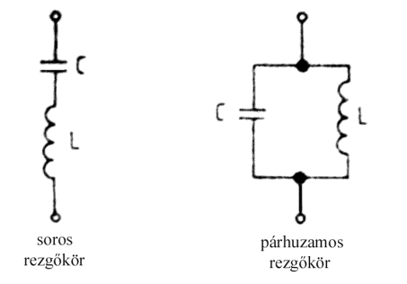

*Series LC resonant circuit compared with a parallel LC resonant circuit.*

*6.1-1. ábra. Rezgőkörök típusai*

A rezgőkör működése a következő folyamaton alapul: a rezgőkör két eleme között energiacsere, -átadás zajlik le. A kondenzátor elektromos energiája mágneses energiává alakul a tekercsen, amely önindukciós feszültséget kelt. Ez az energia ellentétes polaritással feltölti a kondenzátort. A kondenzátorban tárolt elektromos energia ismét átalakul a tekercsen és így tovább. A rezgőkör feszültsége és árama szinuszos lefolyású. Amennyiben nem számolunk a veszteségekkel, akkor megállapíthatjuk, hogy a kondenzátorban tárolt energia teljes mértékben átalakul mágneses energiává, tehát az alábbi ábrán látható első eset következik be, folyamatos csillapítatlan szinuszos hullám keletkezik. Vizsgáljuk azonban azt az esetet, amikor a veszteségek nem nullák. A valóságos rezgőkörnél soha nem számíthatunk veszteségmentes állapotot. Ilyenkor egy véges értékű veszteségi ellenállással kell számolnunk, amely ellenállás megjelenik a körben, mint konstans érték. Ebben az esetben a veszteségi ellenállás hatására exponenciálisan csillapodó szinuszos hullámot kapunk, tehát egy rezgőkör szabad rezgései (magára hagyott állapotban) lecsillapodnak.

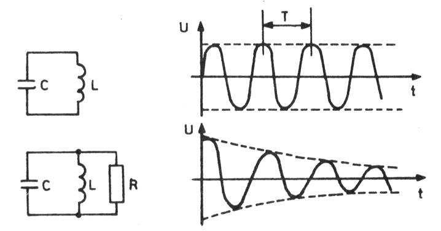

*Series/parallel LC circuits with resistor, alongside a graph of damped vs undamped oscillation amplitude.*

*6.1-2. ábra. Rezgőkör feszültsége és árama (veszteség nélkül, veszteséggel számolva)*

### 6.1.1. Rezgőkör rezonanciafrekvenciája

A rezgőköröket alkotó kondenzátorok és tekercsek váltakozó áramú körökben, mint tudjuk látszólagos ellenállást képviselnek, amely mint tudjuk frekvenciafüggő. A rezgőkör rezonanciafrekvenciája az a frekvencia lesz, amelyeken a tekercs és a kondenzátor reaktanciája egyenlő.

`XL = ωL = 2πfL`  (tekercs)

`XC = 1/(ωC) = 1/(2πfC)`  (kondenzátor) 

Rezonanciafrekvencián:

`XL = XC  →  2πf0L = 1/(2πf0C)`

Amennyiben a fenti egyenletet f0-ra átrendezzük, felírhatjuk a rezonanciafrekvencia kiszámításának képletét (Thomson képlet):

`f0 = 1 / (2π√(LC))`

### 6.1.2. Ideális soros és párhuzamos rezgőkörök

A rezgőkörök látszólagos ellenállása, impedanciája (Z0) rezonanciafrekvencián szélsőértéket (minimumot, ill. maximumot) mutat és tiszta ohmos jellegű. Az ideális soros rezgőkör rezonanciafrekvencián rövidzárként viselkedik. Az ideális soros rezgőkör impedancia menetében a rezonanciafrekvencián minimumot (Z0=0) találunk.

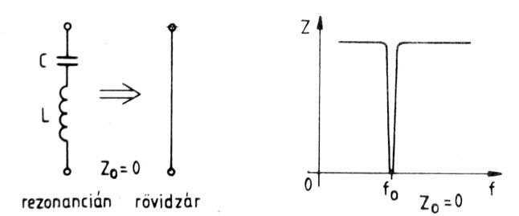

*Series LC circuit and its impedance-vs-frequency graph, showing a short circuit (Z=0) at resonance.*

*6.1-3. ábra. Ideális soros rezgőkör viselkedése rezonanciafrekvencián.*

Az ideális párhuzamos rezgőkör rezonanciafrekvencián szakadásként viselkedik, az impedancia menetében itt szakadást találunk. A párhuzamos rezgőkör kiválóan alkalmazható modulátorkörben, így a kívánt frekvencia (rezonanciafrekvencia) bevezethető a vevőkészülékbe, a többi kiszűrésre kerül. A párhuzamos rezgőkör ilyen alkalmazásánál a rezgőkör rezonanciafrekvenciáját hangolhatóvá teszik egy változtatható értékű kondenzátorral. (6.1.5-ös ábra).

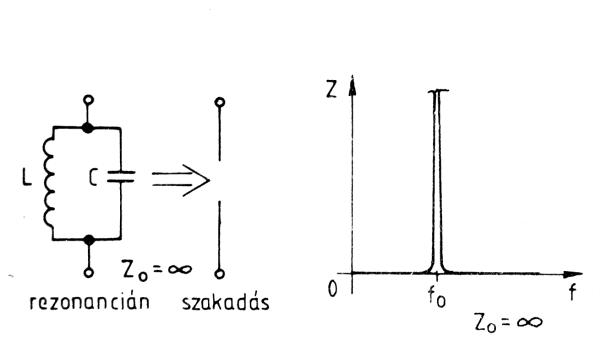

*Parallel LC circuit and its impedance-vs-frequency graph, showing an open circuit (Z=infinite) at resonance.*

*6.1-4. ábra. Ideális párhuzamos rezgőkör viselkedése rezonanciafrekvencián.*

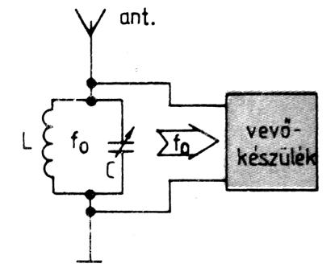

*Antenna, tuned LC input circuit and receiver block, illustrating frequency selection.*

*6.1-5. ábra. Párhuzamos rezgőkör alkalmazása a vevőkészülék modulálókörében.*

### 6.1.3. Valóságos soros és párhuzamos rezgőkörök

A valóságos rezgőkörök közelítik az előzőekben felvázolt eseteket. Az alábbi ábrán látható a valódi rezgőkör áramköri képe, veszteségi ellenállással.

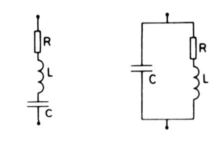

*Series RLC circuit diagram.*

*6.1-6. ábra. Soros és párhuzamos rezgőkör veszteségi ellenállással*

A soros rezgőkör rezonancián alacsony (Ω nagyságrendű) rezisztív ellenállást képvisel; a párhuzamos pedig nagy értékű (kΩ nagyságrendű) rezonancia-ellenállást mutat f0-án.

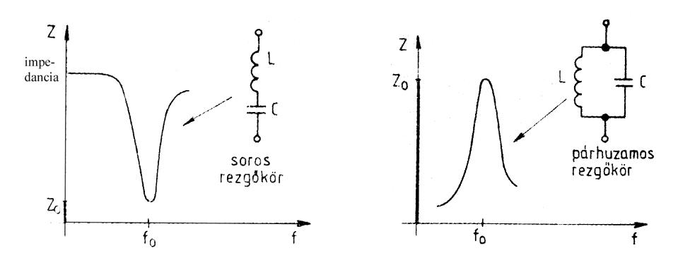

*Parallel RLC circuit diagram.*

*6.1-7. ábra. Soros és párhuzamos rezgőkör impedanciája*

A soros körnél az elemeken mérhető feszültségek, a párhuzamos körnél az elemeken folyó áramok összegeződnek, és így egymás megfelelői.

Soros rezgőkör impedanciája (RLC): 

`Z = R + j * (ω * L − 1/(ω * C))`

Párhuzamos rezgőkör impedanciája:

`Z = (R + j * ω * L) / (1 - ω^2 * L * C + j * ω * C * R)`

### 6.1.4. Rezgőkör jósági tényezője és a sávszélesség fogalma

A valóságos rezgőköröknél a veszteségi ellenállás mértéke határozza meg az ún. jósági tényező értékét, vagyis a rezgőkörök rezonancia-ellenállása annál jobban közelíti az ideális esetet, a rövidzárat vagy a szakadást, minél nagyobb a rezgőkör jósági tényezője (Q0). Gyakorlatban a veszteségek szempontjából a tekercs a meghatározó, így jó közelítéssel a rezgőkör Q0-ját a tekercs jósági tényezője korlátozza. 1 A rezgőkörök csillapítása a jósági tényező reciproka: D0 = 1 / Q0; A rezgőkörök jóságától nemcsak a rezonanciagörbe „magassága” ill. „mélysége” függ, hanem az is, hogy az f0 környezetében mekkora a görbe sávszélessége. Ez a szélesség határozza meg az átvitt ill. lezárt frekvenciatartományt. A Sávszélességet értelmezhetjük az átviteli szakasz átviteli görbéből, úgy, hogy kivonjuk a felső határfrekvenciából az alsó határfrekvenciát. Mind a két határfrekvencia a -3dB -es pontoknál van értelmezve. Az ábrán p1. egy soros rezgőkör átviteli függvényét láthatjuk, és ebből a sávszélességet a következő módon számíthatjuk ki:

`B = f0 / Q0 = fm - fa`

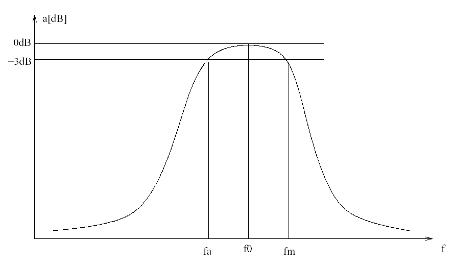

*Bandpass response curve of a resonant circuit, marking the -3dB bandwidth points (fa, f0, fm).*

*6.1-8. ábra. Soros rezgőkör feszültségmenete (sávszélessége)*

### 6.2. Szűrők

### 6.2.1. Sáváteresztő szűrő

Az előző fejezetrészből nyilvánvalóan belátható, hogy a rezgőkör sáváteresztő vagy sávzáró tulajdonságokkal rendelkezik. Ezt alkalmazzuk most ebben a fejezetrészben, tehát a rezgőköröket, mint szűrőket mutatjuk be. A 6.1.8. ábrán egy sáváteresztő szűrő átvitelét (frekvenciamenetét) láthatjuk. Mint a neve is mutatja a határfrekvenciák közötti frekvenciasávot engedi át. Ezeket a szűrőket röviden sávszűrőknek hívjuk. A szűrő (6.2.1 ábra) a következőképpen működik: a szűrő alapja egy párhuzamos rezgőkör, amelynél nagyfrekvencián a C kapacitás zárja rövidre a kört, kisfrekvencián az L tekercs rövidzár. Rezonanciafrekvencián az elemek eredő impedanciája végtelen, tehát az áramkör bemenetéről a jel akadálytalanul haladhat át.

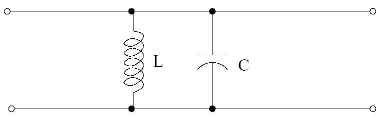

*Impedance-vs-frequency graphs for series and parallel resonant circuits side by side.*

*6.2-1. ábra. Szávszűrő LC párhuzamos rezgőkörrel*

### 6.2.2. Sávzáró szűrő

Mint a neve is mutatja a sávzáró szűrő egy bizonyos frekvenciasávot (rezonanciafrekvencia körüli frekvenciatartományt) nem engedi át. Ilyen tulajdonságú szűrőt készíthetünk soros LC rezgőkörből és párhuzamos LC rezgőkörből is. Az alábbiakban az utóbbit mutatjuk be, ahol a párhuzamos LC-kört befordítva (záró-irányban) alkalmazzuk. A szűrő (6.2.2 ábra) a következőképpen működik: a szűrő alapja itt is egy párhuzamos rezgőkör, amelynél a rezonanciafrekvencia közelében az LC kör impedanciája maximális, tehát szakadásként viselkedik. A szűrő a 2 határfrekvencia közötti jeleket nem engedi át.

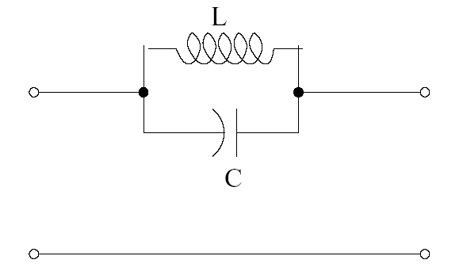

*Parallel LC circuit used as a bandpass filter between input and output.*

*6.2-2. ábra. Sávzáró szűrő párhuzamos LC rezgőkörrel*

### 6.2.3. Aluláteresztő szűrő

Az aluláteresztő szűrő minden frekvenciát átereszt, mely rá jellemző ún. sarokfrekvencia (határfrekvencia) alatt van. Jellemzője, hogy soros ágában tekercsek, párhuzamos ágaiban kondenzátorok vannak. (Így az egyenáramot is átereszti a kapcsolás).

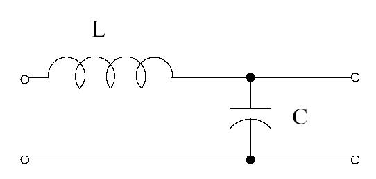

*Series LC circuit used as a bandpass filter between input and output.*

*6.2-3. ábra. Aluláteresztő szűrő*

Az alábbi ábrán feltüntettük az aluláteresztő szűrő frekvenciamenetét és egy kibővített (több fokozatú) aluláteresztő szűrő kapcsolást.

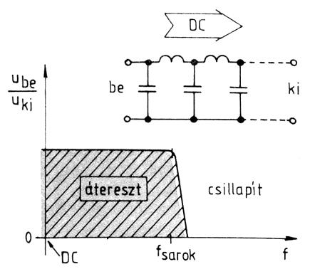

*LC low-pass filter with frequency-response graph showing the passband up to a corner frequency.*

*6.2-4. ábra. Aluláteresztő szűrő frekvenciamenete*

### 6.2.4. Felüláteresztő szűrő

A felüláteresztő szűrő mindenben ellentettje az aluláteresztőnek. Itt is fontos jellemző a határfrekvencia mely frekvenciaérték felett van kis csillapítású jelátvitel. Felépítésére a soros ági kondenzátorok és a párhuzamos ági tekercsek jellemzők.

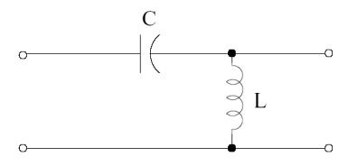

*Simple LC low-pass filter (series L, shunt C).*

*6.2-5. ábra. Felüláteresztő szűrő*

Az alábbi ábrán feltüntettük az felüláteresztő szűrő frekvenciamenetét és egy kibővített (több fokozatú) felüláteresztő szűrő kapcsolást.

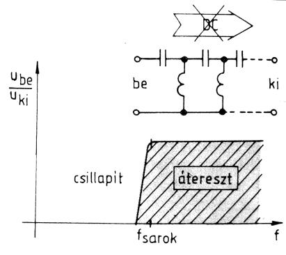

*High-pass filter circuit with frequency-response graph showing attenuation below the corner frequency.*

*6.2-6. ábra. Felüláteresztő szűrő frekvenciamenete*

### 6.2.5. Sávszűrő kialakítása alul- és felüláteresztő szűrőkkel

Sávszűrőt készíthetünk alul- és felüláteresztő szűrők összekacsolásával is. Az ilyen kapcsolásra jellemző a két sarokfrekvencia közötti átvitel (fa és fm).

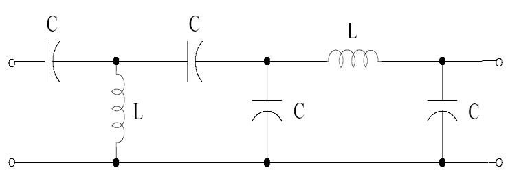

*Multi-stage LC low-pass filter with an additional series inductor and capacitors.*

*6.2-7. ábra. Sávszűrő kialakítása alul- és felüláteresztő szűrőkkel*

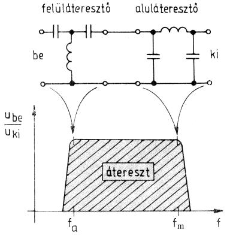

*Combined high-pass/low-pass (bandpass) filter with response graph showing the passband between fa and fm.*

*6.2-8. ábra. Sávszűrő frekvenciamenete (alul- és felüláteresztő kombináció)*

### 6.3. Tápegységek

Az elektronikus rendszerek egyik fontos és kritikus eleme a tápegység. A tápegységeket rádiók, és egyéb törpefeszültségű eszközük táplálására használjuk. A tápegységek nagyobb részt feszültség kimenetűek, de ritkábban alkalmaznak áram stabilizált kimenetű tápegységeket is pl. akkumulátortöltők esetén. Ebben a fejezetben a feszültség kimenetű tápegységekkel foglalkozunk. A tápegységek a hálózati feszültségből vagy más feszültségforrásból alakítanak át a készülékek üzemeltetéséhez szükséges feszültséget a megfelelő áramellátás mellett. Tehát a tápegységekre jellemző paraméter a kimeneti feszültség és a terhelhetőség, pl.: 12V, 6A. A tápegységek többsége DC kimeneti feszültséget produkál, így ebben a fejezetben a DC kimeneti feszültségű tápegységeket vesszük nagyító alá. Tápegységeket sokféle megközelítés szerint csoportosíthatjuk, az alábbi lista egy lehetséges csoportosítás: 

1.  Stabilizálatlan kimeneti feszültségű tápegységek 

	a.   Fix kimeneti feszültségű kialakítás 
	
	b.   Változtatható kimeneti feszültségű kialakítás 
	
2.  Stabilizált kimeneti feszültségű tápegységek 

	a.   Visszacsatolás nélküli kialakítás 
	
	b.   Visszacsatolással stabilizált tápegységek 
	
A fejezet további részében a fenti lista szerint végighaladunk az egyszerű felépítésű (stabilizálatlan) tápegységektől a visszacsatolt stabilizált tápegységekig terjedő kapcsolásokon és elvi kialakításokon.

### 6.3.1. Stabilizálatlan tápegységek

A stabilizálatlan AC-DC tápegységek legfontosabb fajtái a diódás egyenirányítós transzformátor leválasztású tápegységek. A kimeneti jel hullámosságának csökkentésére simító/szűrő elemeket alkalmazunk, ahol a kondenzátoros szűrés terjedt el.

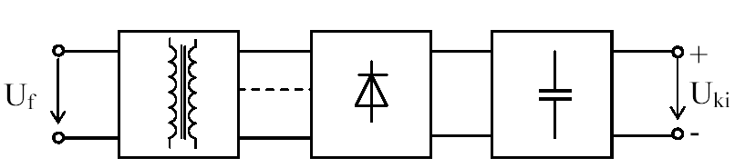

*Block diagram of a power supply: transformer, rectifier, filter, and output.*

*6.3-1. ábra. Stabilizálatlan AC-DC tápegységek megvalósítása diódás egyenirányítóval*

#### 6.3.1.1. Diódás egyenirányító alkalmazása

A legegyszerűbb egyenirányító kapcsolás az egyetlen diódát tartalmazó ún. egyutas egyenirányító. Itt a váltófeszültség pozitív fél periódusában folyik áram a terhelő ellenálláson, amely egy lüktető egyenáram. Az ilyen jellegű egyenfeszültség általában alkalmatlan elektronikus kapcsolások működtetésére, ezekhez igazi, sima (időben állandó) egyenfeszültségre van szükség.

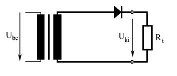

*Half-wave rectifier circuit (single diode) with transformer, load Rt, and output Uki.*

*6.3-2. ábra. Egyutas egyenirányítás*

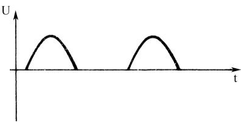

*Waveform of a half-wave rectified signal, showing only positive pulses.*

*6.3-3. ábra. Egyutas egyenirányító kimeneti feszültsége*

Látható, hogy a dióda csak a pozitív félhullámokat engedi át. A megoldás hátránya a gyenge hatásfok (maximum 50% lehet), és a hiányzó szinuszos félperiódus miatt nagyon erős lüktetést eredményez a kimeneten, tehát nagyon erős szűrést igényel.

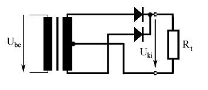

*Full-wave rectifier circuit using a center-tapped transformer and two diodes.*

*6.3-4. ábra. Kétutas egyenirányítás*

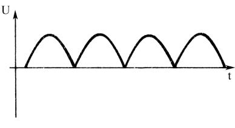

*Waveform of a full-wave rectified signal, showing continuous positive pulses.*

*6.3-5. ábra. Kétutas egyenirányító kimeneti feszültsége*

Két dióda alkalmazásával a hálózati feszültség mindkét félperiódusát kihasználhatjuk, ha olyan transzformátort alkalmazunk, amelynek két egyforma féltekercsén a középkivezetéshez képest ellenkező fázisú feszültség jelenik meg. Így a két tekercsvéghez kötött diódák egyike az egyik félperiódusban vezet míg a másik dióda ilyenkor zárva van, majd a másik félperiódusban szerepet cserél a két dióda, és emiatt minden félperiódusban van kimeneti feszültség. Hátránya, hogy csak középleágazásos tekercsű transzformátorral működik.

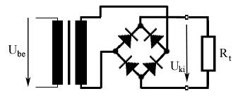

*Full-wave bridge rectifier circuit using four diodes.*

*6.3-6. ábra. Graetz hidas egyenirányítás*

*Waveform of a bridge-rectified signal.*

*6.3-7. ábra. Graetz egyenirányító kimeneti feszültsége*

A másik lehetőség az (középleágazásos transzformátor hiányában), amikor megfelelően összekötött dióda négyessel ún. Graetz kapcsolással hozzuk létre a kétutas egyenirányítást. A dupla nyitó feszültségtől eltekintve ugyanazt az eredményt kapjuk, mint az előző kapcsolásnál.

#### 6.3.1.2. Kondenzátoros szűrés

Az egyutas és kétutas egyenirányítók esetében a kimeneti egyenfeszültség tartalmaz váltakozófeszültségű komponenseket is. A búgófeszültség (brumm feszültség) periodikus, de nem szinuszosan periodikus váltakozó feszültség. A brummfeszültség értékének csökkentése céljából a tápegységekben szűrőköröket használunk. A legegyszerűbb szűrőkör a pufferkondenzátor használata. Az egyenirányítókban alkalmazott szűrő-simító kondenzátorok feladata az egyenirányított jel hullámosságának csökkentése (simítás) és energiatárolás/leadás a fogyasztó felé, amikor a diódák nem vezetnek (bár ez is a simításhoz köthető). A kondenzátor értékének növelésével a brummfeszültség csökkenthető (a feszültség hullámalakja simítható), azonban ez a diódák vezetési idejének lecsökkenéséhez és a periodikus csúcsáram növekedéséhez is vezethet, így a kondenzátort egy megadott hullámosságra méretezik (tipikus és a gyakorlatban bevált méretezési érték, hogy a brummfeszültség csúcsértéke 5%-a a névleges kimeneti feszültségnek).

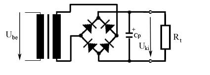

*Bridge rectifier circuit with an added smoothing capacitor Cp across the load.*

*6.3-8. ábra. Graetz hidas egyenirányítás*

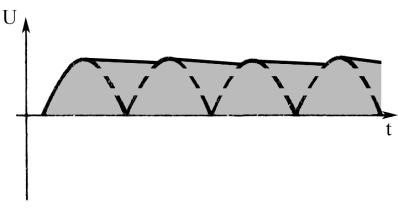

*Graph of a smoothed (filtered) rectified DC voltage showing residual ripple over time.*

*6.3-9. ábra. Graetz egyenirányító kimeneti feszültsége*

### 6.3.2. Stabilizált tápegységek

#### 6.3.2.1. Visszacsatolás nélküli stabilizált tápegységek

A visszacsatolás nélküli tápegység egyszerűbb igényeket elégítenek ki, mivel stabilitásuk alacsony. Tipikus képviselőjük a Zener-stabilizált tápegységek. A legegyszerűbb Zener diódás stabilizátort az alábbi ábra szemlélteti.

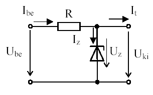

*6.3-10. ábra. Zener-diódás stabilizátor felépítése*

A 6.3.10-es ábrán feltüntetett stabilizátor kimeneti feszültsége egyenlő a Zener diódán eső feszültséggel, terhelhetősége pedig `I t max = I z max - I z min`. A kapcsolás stabilitása nagyban függ a Zener tulajdonságaitól (pl.: hőmérsékletfüggés). A kapcsolás stabilitása és kimeneti terhelhetősége növelhető egy tranzisztoros kiegészítéssel. Az alábbi ábrán feltüntetett kapcsolás egy áteresztő-tranzisztoros stabilizátor legegyszerűbb megvalósítását szemlélteti.

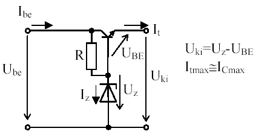

*Simple series-transistor voltage-regulator circuit.*

*6.3-11. ábra. Zener diódás stabilizátor, áteresztő tranzisztorral kiegészítve*

A fenti kapcsolás terhelhetőségét az áteresztő tranzisztor maximális kollektorárama határolja be, a kimeneti feszültség pedig a Zener diódán eső feszültség és a bázis-emitter feszültség különbsége. A stabilitást csak a Zener-feszültség változása határozza meg (éppen emiatt gyakran alkalmaznak ellenállásos Zener táplálás helyett áramgenerátoros megoldást). A terhelési érzékenység a fenti kapcsolás esetében jobb, mint az egyszerű Zener diódás stabilizátornál, de még mindig elég nagy. Ezen lényegesen javítani csak visszacsatolással lehet.

#### 6.3.2.2. Visszacsatolást alkalmazó stabilizált tápegységek

A visszacsatolást tartalmazó tápegységek esetén a kimeneti feszültség (vagy azzal arányos feszültség) és egy referencia feszültség összehasonlításából nyert hibajel alapján szabályozzák a beavatkozó szerv működését (az áteresztő elemet).

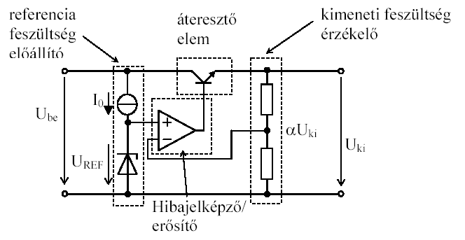

*Block diagram of a regulated power supply: reference voltage, error amplifier, feedback sensing.*

*6.3-12. ábra. Szabályzott üzemű visszacsatolt tápegység elvi felépítése*

Az áramkör működése a következő: a bemeneten lévő referenciafeszültség előállító (általában egy ellenállás és Zehner dióda páros) a referenciagenerátor. A hibajelképző erősítő végzi a kimeneti és a bemeneti jel összehasonlítását (hibadetektor). A hibadetektor kimenete vezéreli az áteresztőtranzisztort. Ha a kimenő feszültség alacsonyabb lesz a. referenciafeszültségnél, akkor a hibajelképző erősítő kimenő feszültsége növekedni kezd, ami az Uki kimeneti feszültség növekedését okozza. Ez a folyamat fordítottan is igaz, tehát így demonstrálható az áramkör stabilizációs működése.

#### 6.3.2.3. Monolitikus integrált tápegységek (stabilizátor „kockák”)

A leggyakoribb pozitív és negatív feszültségekre különböző áramtartományokban gyártanak fix kimeneti feszültségű integrált tápegységeket. Ennek megfelelően ezek az áramkörök általában három csatlakozó lábbal rendelkeznek csak (be- és kimeneti, valamint közös láb).

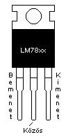

*Pinout diagram of an LM78xx series linear voltage regulator IC (TO-220 package).*

Az áramkörök előnye az alacsony külső alkatrész igény, a kézben tartható és jó stabilizálási paraméterek, széles beépített védelmi lehetőségek. 
A leggyakoribb feszültségek: ±5, ±6, ±9, ±12, ±15, ±18, ±24 V. 
A leggyakoribb áramkategóriák, amelyre integrált tápegység áramköröket gyártanak: 0.1-5A.

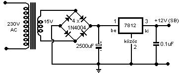

*Practical +12V regulated power supply using a 7812 regulator, transformer, bridge rectifier and filter caps.*

*6.3-13. ábra. 12V-os stabilizált tápegység megvalósítása integrált stabilizátor elemmel*

A fenti ábrán egy 12V-os stabilizált tápegység kapcsolási rajza látható, melyben egy 12V-os (7812-es) stabilizátor „kockát” alkalmazunk, az áramkör maximális terhelhetősége 1A.

### 6.3.3. Túláram-védelem

A tápegységek tartós túláram-védelmét olvadóbiztosítókkal oldják meg. Az olvadóbiztosítók különböző kiolvadási karakterisztikával és sebességgel rendelkeznek (lomha, gyors). Méretezésük a tápegység különböző paraméterei szerint történik.

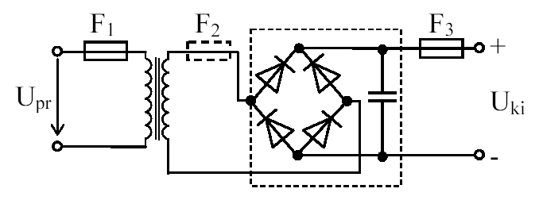

*Block diagram of a multi-fuse power-supply protection scheme (F1, F2, F3) with transformer, rectifier, filter.*

*6.3-14. ábra. Túláram-védelem alkalmazása tápegységeknél*

Az F1 biztosító feladata a tápláló hálózat megvédése a tápegység hibájától. Méretezése:

- lomha biztosító esetén a periodikus csúcsáramra

- gyors biztosító esetén a bekapcsolási csúcsáramra.

Az F2 biztosító opcionális, feladata a transzformátor védelme az egyenirányító és a tápegység hibájától. Méretezése:

- lomha biztosító esetén a periodikus csúcsáramra

- gyors biztosító esetén a bekapcsolási csúcsáramra. 

Az F3 biztosító a terhelésből származó túlterheléstől véd. A statikus védelem miatt általában lomha biztosítót használunk. Méretezése az egyenirányító kapcsolás maximális kimeneti árama alapján: `Ih≥1,1…1,2*Ikimax`

### 6.4. Erősítők

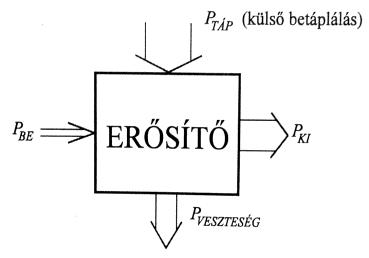

*Generic amplifier block diagram: input power PBE, output power PKI, supply power PTAP, loss PVESZTESEG.*

Az erősítő működése: a PBE úgy „csapolja meg” a PTÁP-ot, hogy a kimenetre jutó PKI alakulása utánozza a PBE változásait. A PKI > PBE relációhoz szükséges többlet-energiát a PTÁP fedezi. Az erősítő működése során többféle okból teljesítményveszteség is fellép, de ezt is a PTÁP kompenzálja. Az erősítőket csoportosíthatjuk erősített jellemzőjük alapján, mint:

- feszültségerősítők,

- áramerősítők,

- teljesítményerősítők. 

Az erősítő kapcsolásokra jellemző:

- típusuk (mit erősít, mire használjuk),

- átviteli karakterisztikájuk (lineáris ill. nem lineáris) és a frekvenciamenetük,

- erősítési tényezőjük,

- be- és kimeneti paramétereik (be- és kimeneti ellenállás és feszültség, teljesítmény, áram továbbá a tápfeszültség). 

Az erősítés (az elektronikai gyakorlatban gyakrabban alkalmazott skalár mennyiségekkel kifejezve) attól függően, hogy mi az erősített jellemző:

Au = uki / ube

Ai = iki / ibe

Ap = Pki/Pbe = (uki*iki)/(ube*ibe)

Az ideális erősítő nagy bemeneti ellenállású, hogy ne terhelje a megelőző, meghajtó hálózatot és kis kimeneti ellenállású, hogy az általa meghajtott fokozat működési feltételei legkedvezőbbek lehessenek. Ideális erősítő természetesen a gyakorlatban nem létezik, így a gyakorlati megvalósításnál csupán törekedhetünk az ideális állapot megközelítésére (jó erősítő). Az erősítők sokféle megoldásban léteznek: létezik tranzisztoros, FET-es és műveleti erősítős kialakítás. Tranzisztoros esetében megkülönböztetünk földelt emitteres, földelt kollektorú és földelt bázisú erősítőket.

### 6.4.1. Kisfrekvenciás erősítők

Kisfrekvenciás erősítőket általában hangfrekvenciás jelek erősítésére használunk. Ezek az erősítők általában tranzisztorokból állnak, de nagyon elterjedt a FET-ek és műveleti erősítők alkalmazása is. A következőkben egy nagyon elterjedt tranzisztoros ún. földelt emitteres alapkapcsolást ismertetünk.

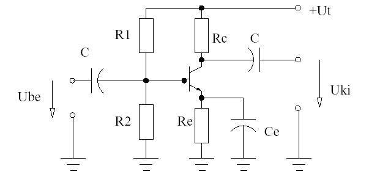

*Common-emitter transistor amplifier with biasing resistors R1, R2, Re and coupling/bypass capacitors.*

*6.4-1. ábra. Földelt emitteres erősítő alakpacsolás*

#### 6.4.1.1. Egyenáramú működés

Mint látható, az áramkör +Ut feszültség táplálja. Ez a feszültség rákerül az R1 és R2-ből kialakított bázisosztóra, mely az egyenáramú munkapontot biztosítja a tranzisztornak. C kondenzátorokra azért van szükség, hogy leválassza a fokozat ki- és bemenetéről az egyenfeszültséget. Ezeket a kondenzátorokat csatoló kondenzátoroknak nevezzük. A tápfeszültség szintén rákerül az Rc ellenállásra, mely a tranzisztor munkaellenállása. Ez az ellenállás (és az Re emitter ellenállás) állítja be a kollektoráramot. Az Re-nek munkapontstabilizációs szerepe van.

#### 6.4.1.2. Váltóáramú működés

Ha az áramkör bemenetére váltófeszültséget kapcsolunk, akkor a kondenzátorok is részt vesznek a működésben. Mint ismeretes, a kondenzátorok váltóáram hatására rövidzárként viselkednek. Ezért az Re ellenállást a Ce kondenzátor lesöntöli, és így a tranzisztor emittere közvetlenül földpotencián lesz. Tételezzük fel, hogy a bemenő jel egy szinuszos jel. A kondenzátoron áthaladva rászuperponálódik a bemeneti jel a bázisosztó által leosztott tápfeszültségre. Amikor a jel a pozitív félperiódusban van, akkor jobban zárja a tranzisztort, tehát a tranzisztor Kollektor-Emitter-ellenállása kisebb lesz. Ezáltal a kimenő feszültség csökken. Negatív félperiódusban a tranzisztor Bázisán kisebb feszültség lesz, így a kimeneten a feszültség növekedni kezd. A tranzisztor Kollektorán lévő jelnek is van egyen komponense, melyet a kimeneten lévő kondenzátor választ le.

### 6.4.2. Nagyfrekvenciás erősítők

Nagyfrekvenciás erősítőket gyakran alkalmazunk a rádiótechnikában előforduló áramkörökben. A nagyfrekvenciás erősítő lehet: szélessávú, és szelektív. Felépítését tekintve lehet FET-es, tranzisztoros, vagy integrált áramkörből felépített fokozat. Vannak olyan erősítők, amelyeknek lehet szabályozni az erősítését. Ilyen erősítőket egyszerűen lehet építeni un. dual-gate-MOS-FET eszközökből.

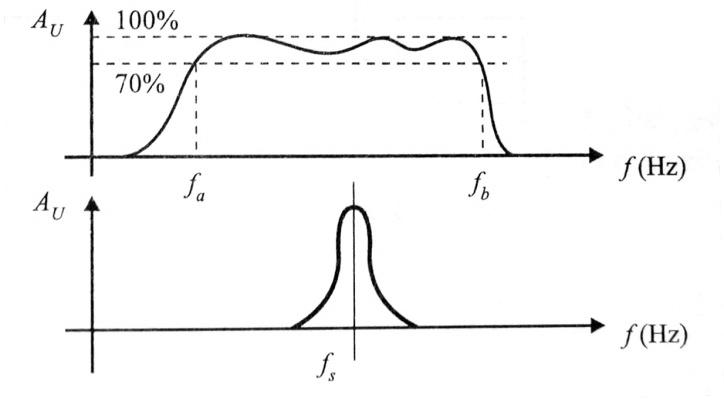

*Amplifier frequency-response graph showing -3dB bandwidth between lower cutoff fa and upper cutoff fb.*

*6.4-2. ábra. Szélessávú és szelektív erősítők átviteli karakterisztikája*

#### 6.4.2.1. Szélessávú erősítők

A tranzisztoros (FET-es) alapkapcsolások nagyfrekvenciás tulajdonságait az erősítés és a visszacsatoló szórt kapacitás határozta meg. Nagy sávszélesség esetén alacsony erősítést lehetett megengedni. A nagy sávszélesség előállításához speciális kapcsolásokat –általában erősítő láncokat- hoznak létre. Kedvező sávszélességű kapcsolások, pl. a KE+KK kapcsolásokkal.

#### 6.4.2.2. Szelektív erősítők

A szelektív erősítők a frekvenciatartomány egy meghatározott tartományát erősítik. Nagyfrekvenciás szelektív erősítők hangolt LC köröket tartalmazó erősítők, tulajdonképpen ezek aktív sávszűrők, amelyek behatárolják az erősítő üzemi frekvenciatartományát (alsó és felső határfrekvenciáját).

### 6.4.3. Teljesítményerősítők (A,B és C osztály)

A teljesítményerősítők a nagyjelű erősítők kategóriájába tartoznak és az erősítő láncban elfoglalt helyük alapján gyakran nevezik őket végerősítőknek is.

`Ap = PKI / PBE` 

A teljesítményerősítőket osztályokba sorolják, amelynek alapja, hogy a végerősítő tranzisztor / MOSFET üzemidejének hány százalékában vezet. (Egy más megfogalmazás szerint a végerősítő tranzisztort / MOSFETet szinusz jellel vezérelve az hány fok tartományban vezet -folyási szög-.) Ennek megfelelően vannak `A, B, AB, C` osztályú erősítők. Az analóg technikában elsősorban az A, B és az AB osztályú erősítőknek van különösen nagy jelentőségük, lineáris átvitelük miatt. A rádiótechnikában egyes üzemmódok esetében alkalmazható a C osztályú erősítő is, amely ugyan nem lineáris átvitelű, de nagyon jó hatásfokkal rendelkezik. Teljesítményerősítők tulajdonságai:

- `A` osztályú: a bemeneti jel 100% kerül felhasználásra (vezérlési szög: α = 360°, azaz 2π)

- `AB` osztályú: a bemeneti jel több mint 50%-a, de kevesebb mint 100%-a kerül felhasználásra (fordítási vezérlési szög: 181°-359°, π < α < 2π)

- `B` osztályú: a bemeneti jel 50%-a kerül felhasználásra (vezérlési szög: α = 180°, azaz π)

- `C` osztályú: a bemeneti jel kevesebb mint 50%-a kerül felhasználásra (vezérlési szög: 0°-179°, α < π)

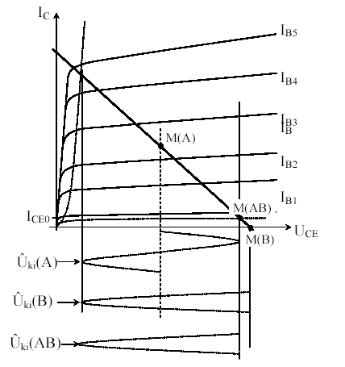

*Transistor output characteristics (IC vs UCE) for different base currents, illustrating class A/AB/B points.*

*6.4-3. ábra. A, B és AB osztályú erősítő átviteli karakterisztikája*

#### 6.4.3.1. A osztályú erősítő

Az A osztályú erősítők végtranzisztorai optimális munkapontba állítva üzemelnek (a munkapont a lineáris karakterisztika felére vannak állítva), így a tranzisztorok 100%-ban vezetnek (folyási szög 360°). Az A osztályú erősítők nyugalmi áramfelvétele nagy, így hatásfokuk hatásfoka nagyon alacsony (kb. 50%), kivezérlés nélkül akár nulla is lehet. Az A osztályú teljesítményerősítők legfontosabb előnye a nagyon kedvező torzítási tényező, amely elsősorban hangfrekvenciás erősítőknél fontos.

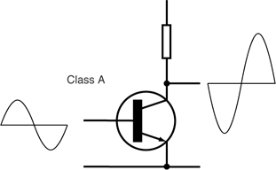

*Class A amplifier circuit and waveform, showing a full sinusoidal output.*

*6.4-4. ábra. A osztályú erősítő*

#### 6.4.3.2. B osztályú erősítő

A B osztályú erősítő munkapontja a bemeneti karakterisztika zárókönyökébe kerül (lásd az ábrán). Nyugalmi állapotban a tranzisztoron nem folyik áram. Szinuszos jelet feltételezve ez azt jelenti, hogy egy végtranzisztorral egy fél periódust lehet erősíteni, tehát a másik fél periódus erősítéséhez egy az előzővel ellentétes fázisban működő másik végtranzisztorra van szükség. A B osztályú erősítőket olyan alkalmazásokban használjuk elsősorban, amikor lényeges a jó hatásfok, de nem kritikus a torzítás. A B osztályú erősítők hatásfoka megközelítőleg 70-75%.

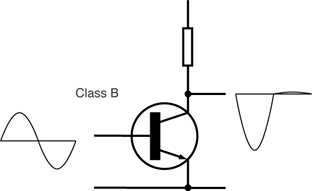

*Class B amplifier circuit and waveform, showing a half-wave clipped output.*

*6.4-5. ábra. B osztályú erősítő*

#### 6.4.3.3. AB osztályú erősítő

Az AB osztályú üzem a nullpont körüli nemlinearítás okozta torzítások (B osztály) kivédésére szolgál. A tranzisztorokat a nyitás határáig előfeszítjük (U0 egyenfeszültség alkalmazásával). Ez azt eredményezi, hogy a kapcsolás kivezérlés nélküli esetben is vesz fel teljesítményt (bár lényegesen kisebbet, mint A osztályú üzem esetén), így hatásfoka akár nulla is lehet. A maximális kivezérlésnél elérhető hatásfok is csökken (bár nem jelentősen) a B osztályúhoz képest. Hatásfoka: 60-65%. A rádiótechnikában a leggyakrabban alkalmazott lineáris erősítők AB osztályban dolgoznak.

#### 6.4.3.4. C osztályú erősítő

A C osztályú erősítők munkapontja a bemeneti karakterisztika zárókönyökétől eltolva (nagyobb negatív előfeszítéssel) helyezkedik el. Tehát a kollektoráram egy félperiódus idejénél is rövidebb ideig folyhat, így a C osztályú erősítők lineáris erősítésre nem alkalmasak. Azonban nagyon jó hatásfokkal rendelkeznek (75%-85%).

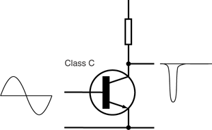

*Class C amplifier circuit and waveform, showing a pulsed/narrow output.*

*6.4-6. ábra. C osztályú erősítő*

### 6.4.4. Erősítők visszacsatolása

Az erősítők nemlineáris elemeket tartalmaznak, amelyek általában hőmérsékletfüggők is, ami instabil működést, valamint torzítást eredményez. A negatív hatások csökkentésére visszacsatolást alkalmazunk. A visszacsatolások lehet negatívak vagy pozitívak aszerint, hogy a visszacsatolt jel a bemeneti jelhez képest azonos vagy ellentétes fázisban kerül hozzáadásra. Pozitív visszacsatolást valamely jelenség felnagyítására, míg a negatív visszacsatolást annak csökkentésére használjuk, így lineáris erősítőkben csak a negatív visszacsatolás alkalmazható.

### 6.4.5. Erősítők nemlinearitása (torzítása)

Az aktív elemek alapvetően nemlineáris elemek. Kapcsolási megoldásokkal (pl. negatív visszacsatolás) a nemlienarítás csökkenthető, azonban - különösen a nagyjelű erősítőknél - teljesen nem szüntethető meg. A nemlinearítás hatására az erősített jellemző torzul. A torzulás bekövetkezhet amplitúdóban, fázisban és frekvenciában is. Szinuszos vezérlő jelet feltételezve a torzulás lehet harmonikus torzulás, amikor a szinusz jel amplitúdójának torzulása következtében megjelennek a felharmonikusok (a nemszinuszos periodikus jeleknek megfelelően). Az erősítő karakterisztikájának nemlinearitása következtében két frekvencia létrehozhat egy harmadik (az eredeti jelben nem szereplő) frekvenciát is (intermodulációs torzítás). Az erősítő fázis-karakterisztikájának nemlinearítása azt eredményezheti, hogy a különböző frekvenciájú jelek eltérő fázishelyzetben jelennek meg az erősítő kimenetén.

### 6.4.6. Automatikus erősítésszabályozás (AGC)

Automatic Gain Control. Ez az áramkör biztosítja az erősítő kimenetén az optimális szintet (pl.: KF optimális erősítését). A működése igen egyszerű. KF esetében: a detektált hangnak a szintjével vezérelünk egy a KF fokozatban elhelyezett feszültségvezérelt erősítőt. Természetesen invertáló üzemmódban. Tehát minél nagyobb a kimenő jel, az AGC annál alacsonyabbra állítja a KF erősítését. Ezzel természetesen a kimenő szint is kevesebb lesz. A szabályzás tehát a KF erősítőnk erősítését a kellő szintre állítja. Modern rádiókban az AGC bemenetén egy kikapcsolható, hangolható sávszűrő található, melyet CW üzemben ráállíthatunk az ellenállomásunk hangszínére. Tehát az AGC a kiválasztott állomás jelére szabályozza vevőnk KF erősítését.

### 6.4.7. Többfokozatú erősítők

A gyakorlati esetek jelentős részében egy erősítő fokozat nem elegendő a kívánt erősítés eléréséhez. A stabilitás, a zavarérzékenység csökkentése és a szükséges határfrekvencia érdekében egy erősítő fokozattal reálisan csak 10..50-szeres erősítés érhető el (közelebb az alsó határhoz). A többfokozatú erősítők kialakításának célja lehet a nagyobb erősítés (ált. feszültségerősítés elérése, pl. egyenáramú erősítők, jelkondicionálók), de lehet egy nagyobb teljesítményű erősítő fokozat meghajtása is (előerősítő és főerősítő). Az erősítő láncok több szempont szerint is csoportosíthatók. Az egyik ilyen lehetőség a fokozatok közötti csatoláson alapul. Az egyes fokozatok közötti csatolás lehet: 

a) Közvetlen csatolás 

b) RC csatolás 

c) Transzformátoros csatolás 

d) Optoelektronikai csatolás 

A többfokozatú erősítőknél az egyes fokozatok általában láncba kapcsolódnak, így az eredő erősítésre a következők írhatók fel n fokozat esetében: `A = Σ Ai i=1…n`

### 6.5. Oszcillátorok

Oszcillátornak nevezzük azokat az áramköröket, amelyek elektromos rezgések keltésére alkalmasak. Alapvetően két fajta oszcillátort különböztetünk meg: a hangolható (VFO), és a stabil frekvenciás oszcillátorokat. Az általunk tárgyalt oszcillátorok szinuszos jel előállítására alkalmasak, továbbá mindegyik tartalmaz egy frekvencia-meghatározó elemet, továbbá jellemző rájuk a szolgáltatott jel amplitúdójának nagysága és annak időbeni állandósága.

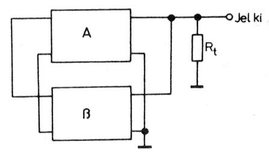

*Push-pull amplifier block diagram with two parallel stages (A, B) driving a common load Rt.*

*6.5-1. ábra. Oszcillátor tömbvázlata*

A fenti ábrán látható az oszcillátor tömbvázlata. Az egyszerű oszcillátor az alábbi elemeket kell, hogy tartalmazza:

- erősítő,

- visszacsatoló áramkör,

- frekvencia-meghatározó elem,

- amplitúdó-szabályozó áramkör. 

Észrevehető az ábrán, hogy az oszcillátor nem rendelkezik bemeneti kapcsokkal, mert a felvázolt rendszer Aβ = 1 érték elérésekor vezérlés nélkül is jelet szolgáltat. Fontos, hogy ez az egyenlőség fennmaradjon, hiszen Aβ > 1 esetben a visszacsatoláson keresztül az amplitúdó növekedés elvileg végtelen, Aβ < 1 esetben pedig az amplitúdó nullára csökken (lecseng a rezgés). A stabil frekvenciás oszcillátort létrehozhatunk rezgőkör vagy rezgőkvarc segítségével. A változtatható frekvenciájú oszcillátorok legegyszerűbb változatában szintén egy rezgőkör a frekvencia-meghatározó elem.

Az oszcillátor legfontosabb jellemzője a frekvenciastabilitás. Az oszcillátorok frekvencia ingadozását a külső környezeti hatások válthatják ki. Ilyenek a hőmérséklet, változása, és a tápfeszültség változása is. Az oszcillátorokat mindenféleképpen stabilizált tápegységről kell üzemeltetnünk. Nagyon elterjedt a kétszeres stabilizálás alkalmazása, mely egy kimondottan csak az oszcillátornak fenntartott külön stabilizátor beiktatásával érhetűnk el. Fokozottan ügyelnünk kell az oszcillátorok mechanikai stabilitására is, mivel a frekvencia meghatározó elem érzékeny a mechanikai hatásokra is. Általában a rádiók vezéroszcillátorát külön dobozban helyezik el, külön árnyékolással, és nagyon gyakori a termosztát alkalmazása is. Ekkor az egész oszcillátor egy 'kemencében' van, ahol egy automatika (szabályozó) gondoskodik a pontos hőmérsékletről.

### 6.5.1. LC oszcillátorok

Az LC oszcillátorok legalább egy csatolt rezgőkörből és egy aktív elemből állnak. A rezgőkör határozza meg az oszcillátor frekvenciáját, a keltett rezgés nagysága az aktív elemtől függ. Az egyes LC oszcillátor-kapcsolások a csatolt rezgőkör kialakításában térnek el egymástól. Az alábbi ábra mutatja a két legismertebb kapcsolást: a Hatley jellegzetessége az induktívan, a Colpitts- kapcsolásé a kapacitívan csatolt rezgőkör.

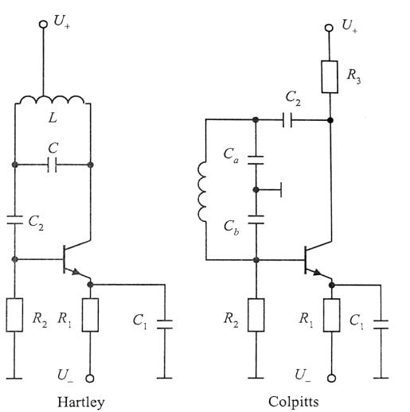

*Schematics of Hartley and Colpitts oscillator circuits.*

*6.5-2. ábra. LC oszcillátorok*

Az LC oszcillátor frekvencia-stabilitása nem túl jó, így fix-frekvenciájú oszcillátorok esetében előnyösebb a kvarcoszcillátor alkalmazása.

### 6.5.2. Kvarcoszcillátorok

A hagyományos LC rezgőköröknél két nagyságrenddel jobb frekvenciastabilitású oszcillátorok építhetőek rezgőkristályokkal. A kvarcoszcillátorokat olyan helyen alkalmazzuk, ahol stabil frekvenciájú jelre van szükségünk. A nagyobb stabilitás érdekében a kristályt kemencébe szokták rakni, melynek hőmérsékletét szabályozzák. A megfelelően csiszolt kvarckristály úgy viselkedik elektromosan, mint egy soros rezgőkör:

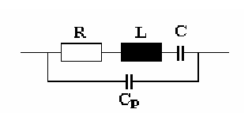

*Parallel resonant tank circuit (R, L, C, parasitic Cp) used in an oscillator.*

*6.5-3. ábra. A kvarckristály helyettesítő képe*

A kvarcoszcillátor frekvencia stabilitása:

`Δf / f ≈ 10^-6 ... 10^-10` 

Az alábbi ábrán egy kvarckristállyal stabilizált, klasszikus hárompontos kapcsolású oszcillátort rajzolunk fel szemléletesen:

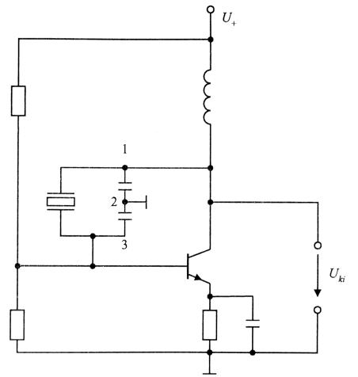

*Crystal (or LC) oscillator circuit with a transistor.*

*6.5-4. ábra. Kvarccal stabilizált oszcillátor*

### 6.5.3. VFO (Változtatható Frekvenciájú Oszcillátor)

A VFO olyan oszcillátor, melynek a frekvenciáját változtatni lehet. Ezt úgy érjük el, hogy egy oszcillátor frekvenciameghatározó elemeként rezgőkört alkalmazunk, és ennek az egyik tagját (álitalában a kondenzátort) változtatjuk.

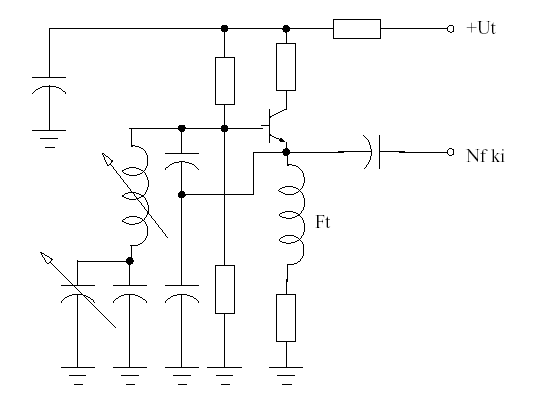

*Variable-frequency oscillator (VFO) circuit with tuning capacitor and transistor.*

*6.5-5. ábra. Egyszerű VFO kapcsolási rajza*

A 6.5.5. ábrán egy nagyon egyszerű VFO kapcsolási rajzát láthatjuk. Ez a kapcsolás is lényegében egy visszacsatolt erősítő, melyben frekvencia-meghatározó elem helyezkedik el a visszacsatoló láncban. Látható, hogy a soros rezgőkör olyan elemekből vannak felépítve, melyek értékei változtatni tudjuk. Ezeket az áramköröket általában leválasztó fokozattal is ellátják a nagyobb stabilitás miatt.

### 6.5.4. PLL (Fáziszárt hurok)

Napjainkban rohamosan nő az igény rádióösszeköttetések kialakítására. A rádiófrekvencia nagyon drága erőforrás. A rádiócsatornákat tehát igyekeznek minél jobban kihasználni, ennek megfelelően a szomszédos rádiócsatornák között igen csekély védősávok maradnak Ezért egy-egy rádióátvitelnél a vivőfrekvenciát nagy pontossággal a névleges értéken kell tartani, mert a legkisebb eltérés esetén már zavarnánk a szomszédos rádiócsatornát. Bizonyos alkalmazásokban már a megfelelő minőségű átvitel biztosításához is nagy stabilitású vivőfrekvenciára van szükség. A kérdés az, hogy állítsunk elő ilyen nagy stabilitású vivőfrekvenciát. Hagyományos R, L, C elemekből nyilván nem lehet olyan oszcillátort készíteni, mely ezeknek az előírásoknak megfelelne. A kvarcoszcillátorok is igen jó stabilitással rendelkeznek, de sajnos kimenő frekvenciájuk általában még a 100MHz-et sem éri el. Így pont a jelenleg a figyelem középpontjában álló 100MHz-10GHz frekvenciatartomány lefedése okoz gondot. A problémát úgy oldhatnánk meg, hogy kifejlesztették a PLL szintézereket. A PLL (Phase Locked Loop=fáziszárt hurok) alapú jelszintézis az integrált PLL áramkörök megjelenésével olcsóvá és a legtöbb alkalmazás számára megfelelő minőségűvé vált.

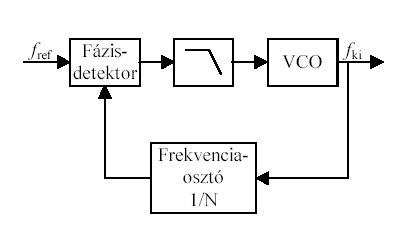

*Block diagram of a PLL frequency synthesizer: phase detector, filter, VCO, frequency divider.*

*6.5-6. ábra. PLL szintézer blokkvázlata*

A PLL egy VCO-ból (feszültségvezérelt oszcillátorból), egy frekvenciaosztóból, egy fázisdetektorból és egy aluláteresztő szűrőből kialakított szabályozási folyamat, mely képes a VCO kimenő jelét fázisban és frekvenciában egy referenciajelhez szinkronozni. Igen sok alkalmazási területe ismeretes, jelenlegi feladatunk szempontjából azonban a PLL frekvenciaszintézerként való alkalmazása a legfontosabb. PLL alkalmazási területei:

- frekvencia-moduláció/-demoduláció

- amplitudó-demoduláció

- vivőszinkronizáció

- frekvenciaszintetizálás

- fordulatszám-szabályozás

#### 6.5.4.1. A PLL szintézer működése

Egy PLL szintézer blokkvázlata látható a 6.5.6. ábrán. A referenciajelet tipikusan egy nagy stabilitású, kis fáziszajú kvarcoszcillátor állítja elő. A fázisdetektor e referenciajel fázisát összehasonlítja a frekvenciaosztó kimenő jelének fázisával, és a fáziskülönbségnek megfelelő szabályozójelet képez. Ez a jel szűrés után úgy módosítja a VCO kimenő jelét, hogy az a frekvenciaosztás után azonos fázisban legyen a referenciajellel. A kimenőjel frekvenciája (N·fref) elvileg tetszőlegesen nagy lehet, a frekvenciaosztó osztásarányának változtatásával pedig diszkrét lépésekben hangolható. A kimenő jel stabilitása megegyezik a referenciajel stabilitásával, fáziszaját pedig alapvetően a referenciajel fáziszaja és a frekvenciaosztó osztási aránya határozza meg.

### 6.6. Detektorok

A demoduláció vagy detektálás az az eljárás, amivel az információt tartalmazó kisfrekvenciás jelet leválsztjuk a nagyfrekvenciás hordozóról. Az előzőekben ismertetett amplitúdómodulált és frekvenciamodulált különböző detektorokkal állítjuk vissza a moduláló hangfrekvenciás jelet.

### 6.6.1. AM jel demodulálása

Egy AM-DSB/SC (röviden AM) jel demodulálásához nagyon egyszerű kapcsolás is elegendő. Ez a kapcsolás egyetlen diódából, és egy RC tagból áll (6.6.1. ábra).

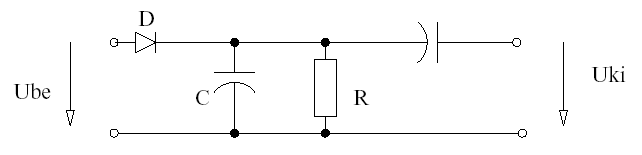

*Simple diode detector/demodulator circuit.*

*6.6-1. ábra. AM demodulátor rajza*

A kapcsolás működése is nagyon egyszerű. A D dióda egyenirányítja a nagyfrekvenciás jelet, majd az RC-kő kiszűri a nagyfrekvenciát, és így megmarad a hangfrekvenciás jel. A csatolókondenzátor pedig leválasztja az egyenáramú komponenseket. Ezt a folyamatot a 6.6.2. ábrán lehet jól követni. Látható, hogy a nagyfrekvenciás jelben az információ a burkológörbe.

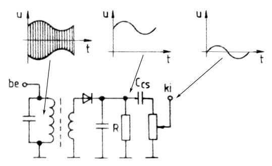

*AM demodulator stage with input and output waveforms.*

*6.6-2. ábra. Diódás AM demodulátor működése*

### 6.6.2. SSB és CW jelek demodulálása

Az SSB jelek demodulálása bonyolultabb, mint az egyszerű AM jel detektálása. Mivel itt nincsen vivő, ezért a demodulátor részét kell képezze egy beat oszcillátor. Az SSB demodulátor tulajdonképpen egy keverőből, egy BFO-ból és egy aluláteresztő szűrőből áll. A beat oszcillátort (más néven üttető, vagy lebegtető) SSB és CW jelek demodulátorában alkalmazunk. Mivel ezeknél a modulációknál nincs kisugárzott vivő, nekünk kell a vevőben előállítani.

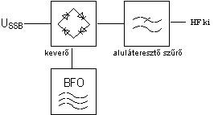

*SSB demodulator block diagram: mixer, low-pass filter, BFO (beat-frequency oscillator).*

*6.6-3. ábra. SSB és CW demodulátor blokkvázlata*

Az ábrán a keverő végzi az SSB jel és a BFO keverését, felépítését tekintve diódákból áll. A beat oszcillátor általában egy kvarcoszcillátor, melynek a frekvenciáját kis mértékben el lehet hangolni (USB és LSB vételnél a KF frekvencia fölé vagy alá kell hangolnunk 1.5 kHz-el). Távíró jelek vételénél teljesen mindegy, hogy felül vagy alul van a BFO jele, bár itt kb. 1 kHz az eltérés.

### 6.6.2.1. Produkt detektor 

Ez az áramköri elem gyakorlatilag egy keverő, melyhez az SSB valamint CW üzemmódú vevők KF fokozatai kapcsolódnak. Továbbá ezeknél az adásmódoknál szükséges a nem kisugárzott vivő jelenléte is. Ezt a jelet egy helyi BFO biztosítja. Ennek a jelnek a frekvenciája általában 1.5kHz-el tér el a KF frekvenciától. USB/LSB adásmódokat a +1.5Khz, valamint -1.5kHz nagyságúra kell hangolni a BFO-t.

### 6.6.3. FM jel demodulálása

Az FM jeleknél az információt a frekvencia változása hordozza. Ezek demodulálása kissé bonyolultabb, mint az AM rendszerekben megszokott módszer.

Az FM jel demodulálására alkalmazott eljárások:

- FM-AM átalakítás,

- fázisátalakítás,

- impulzusszámlálás,

- PLL (fáziszárt hurok) segítségével

Az FM jel detektálása legegyszerűbben egy FM-AM átalakítással történik, ahol a jelet egy félrehangolt rezgőkörre vezetik, ezáltal a frekvencia változása amplitúdó változást is eredményez. Az így kapott jelet egy egyszerű AM demodulátorral demodulálhatjuk.

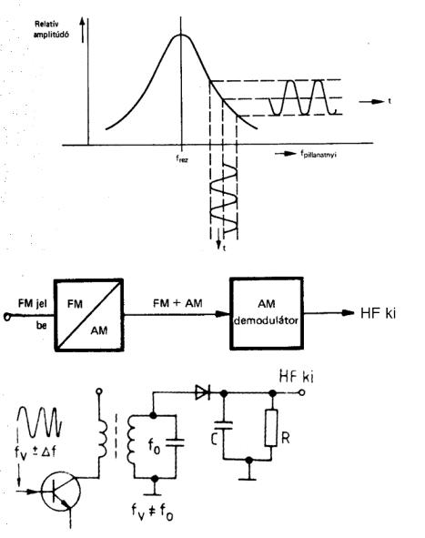

*FM and AM demodulator block diagrams, including a discriminator curve graph.*

*6.6-4. ábra. FM demodulátor FM-AM átalakítással*

FM jel detektálásánál általános elv, hogy a frekvenciamodulált jelet detektálás előtt limitálni kell. Az erősen limitált frekvenciamodulált szinuszjel FM-elt négyszögjelnek tekinthető. A limitálás az FM-jelre ült zavaramplitúdókat távolíthatjuk el.

#### 6.6.3.1. Fázisdiszkriminátoros FM detektor

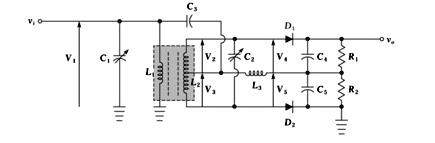

*Multi-stage LC bandpass/crystal filter circuit with several resonant sections and diodes.*

*6.6-5. ábra. Foster-Seely diszkriminátor*

Az ábrán látható diszkriminátor működési elve: az induktív csatolt hangolt körnek rezonanciafrekvencián a primer és a szekunder feszültség fáziseltérése 90°, míg rezonancia alatt e fázisszög nő, felette pedig csökken (vagy ennek a fordítottja, a tekercselési irányoktól függően). A szekunder kör két végére egy-egy soros diódás burko1ódemodulátor csatlakozik. A primer és a fél szekunder feszültség fázishelyes összeadásával az FM jel pillanatnyi frekvenciájával közel arányosan változó, AM jel jön létre. Előnye: viszonylag jó a linearitása és aránylag nagy kimeneti feszültséget ad.
