# 7. Vevők

Kovács Levente HA5OGL, Jónap Gergő HG5OJG 

Napjainkban alkalmazott legolcsóbb vevőkészülékek (zseb-, táskarádiók) is mind szuperheterodin elv alapján működnek, a hőskorban használt egyenes vevőkészülékeket már csak muzeális tárgyaknak tekinthetjük. Ezért a fejezet elején említett egyenes vevőkészülékek ismertetése elméleti jelentőségű.

## 7.1. Az egyenes vevők

### 7.1.1. A detektoros vevő

A detektoros vevő a legrégebbi és a legegyszerűbb egyenes rádió-vevőkészülék. Az egyenes vétel azt jelenti, hogy az antennától a demodulátorig azonos vivőfrekvencián megy végbe a jelátvitel.

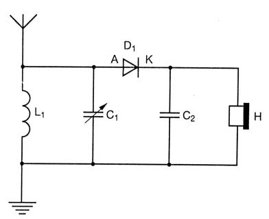

*Simple crystal-diode receiver: antenna, tuned LC circuit, diode detector, headphones.*

*7.1-1. ábra. A legegyszerűbb detektoros egyenes vevő*

A legegyszerűbb detektoros vevő kapcsolási rajza a 7.1.1-es ábrán látható. Működéséhez nagyszintű NF jel szükséges, amit pl.: egy helyi AM adó biztosíthat. A szelekciót egy párhuzamos rezgőkör adja. A rezgőkör után a jel egy germániumdiódán halad keresztül. A hangfrekvenciás egységet egy nagyimpedanciás fejhallgató képviseli. A nagyfrekvenciás szűrést a fejhallgatóval párhuzamosan kötött C2-es kondenzátor végzi. A vétel a dióda bekötésétől független, mivel a kétoldalsávos AM-nál mindkét oldalsáv ugyanazt az információt hordozza. A készülék nem erősít, így a jelamplitúdó kizárólag az antenna jelfeszültségétől függ.

### 7.1.2. Audion kapcsolás

A detektoros vevőkészülékkel erősítés hiányában maximum 1-2 helyi állomás fogható, így szükséges egy nagyfrekvenciás erősítőfokozatot beépíteni a vevőkészülékünkbe ahhoz, hogy megfelelő vételi eredményeket tudjunk elérni. A nagyfrekvenciás erősítőfokozatot az audion kapcsolásban egy tranzisztoros visszacsatolt erősítőfokozat képviseli, továbbá az olyan visszacsatolt erősítőfokozatot, amely a bemenetére kerülő AM jelből a kimenetén közvetlen hangfrekvenciás jelet szolgáltat, audion kapcsolásnak nevezzük.

### 7.1.3. Távolsági egyenes vevőkészülékek

Aktív erősítőelemek felhasználásával érzékeny vevőkészülékek építhetőek. A távolsági egyenes vevő tömbvázlata az alábbi ábrán látható:

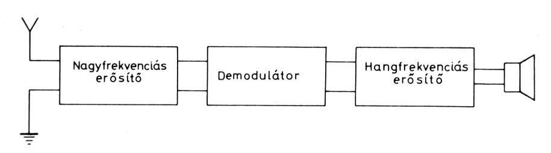

*Block diagram of a simple direct (TRF) receiver: RF amplifier, demodulator, audio amplifier.*

*7.1-2. ábra. Az egyenes vevőkészülékek tömbvázlata*

A fejlődés első szakaszában a vevőkészülékek egyenes vevők voltak. Ezekben a készülékekben a beérkező jelet két vagy három hangolt körös erősítőfokozat az eredeti vivőfrekvencián erősíti. A felerősített jel a demodulátorba kerül. A hangfrekvencia – esetleg még egy hangfrekvenciás előerősítő után – a hangfrekvenciás végerősítőbe jut. Az ilyen rendszerű vevőkészülékek hátránya a kis szelektivitás és a kis érzékenység. Ezek a hibák főleg rövidhullámon jelentkeztek.

## 7.2. Szuperheterodin rendszerek

A szuperheterodin rendszer elve az, hogy a vett jelet csak egy nagy sávszélességű szűrővel szűrik meg. Ez a szűrő mindig a készülék üzemi frekvencia tartományára van hangolva fixen. Ez a szűrő a sávszelektivitásért felel. Ezután a még üzemi frekvenciájú jelet, egy középfrekvenciára keverjük. A keverőben létrejön a főoszcillátor (helyi oszcillátor, VFO), és a bemeneti üzemi frekvencia keverési terméke a KF-frekvencia. (KF = Közép Frekvencia). A KF-frekvencia, és a helyi oszcillátor frekvenciának összege vagy különbsége adja a vételi frekvenciát.

`f v = f h ± f KF`

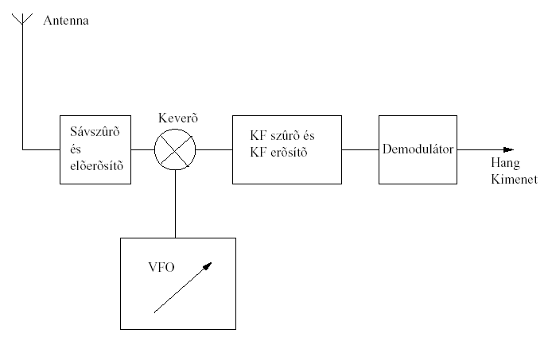

*Block diagram of a single-conversion superheterodyne receiver with VFO/mixer and IF stage.*

*7.2-1. ábra. Szuper rendszerű vevő*

Tehát a helyi oszcillátor frekvenciája 2 különböző vételi frekvenciát határoz meg. Ennek kiküszöbölésére kell a sávszűrő a keverőfokozat elé. A szűrőfokozat beiktatásával jelentősen csökkenthető a másik nem kívánt vételi frekvencia vétele. Ezt a frekvenciát tükörfrekvenciának hívjuk. A tükörfrekvencia elnyomást pedig tükörszelektivitásként deklaráljuk, és dB-ben adjuk meg. 

`at = 10 * lg (Pv / Pt)`

A KF-frekvencia egy konstans frekvencia. Fix frekvenciára sokkal könnyebb nagyszelektivitású szűrőket készíteni. A KF frekvenciára hangolt szűrőt KF szűrőnek nevezzük. A gyakorlatban a KF szűrők kerámia, vagy mechanikus szűrők. Ezeknek kicsi a méretük, és megfelelően jó minőséggel rendelkeznek. Általában a KF frekvencia kisebb, mint az üzemi frekvencia, tehát a jel erősítése is jóval egyszerűbb feladat. A vételi frekvencia beállítását a VFO frekvenciájának változtatásával végezzük, ami egyetlen eszköz hangolásával könnyedén megoldható.

A 7.2.1. ábrán egy egyszeres keverésű, szuperheterodin rendszerű vevőkészülék tömbvázlatát láthatjuk. A KF erősítő a csatornaszelektivitásért felelős. Az így megszűrt jelet a demodulátor demodulálja, és a kimeneten megjelenik a hangfrekvenciás jel, melyet tovább erősítve és hangszóróra vezetve érzékelhetővé válik számunkra.

## 7.3. Többszörös transzponálású rendszerek

Nagyobb szelektivitás, és jobb minőség elérése érdekében 2, de néha 3-szoros keverésű rendszereket is alkalmaznak. Ez még bonyolultabbá teszi a vevőkészüléket, de minősége jelentősen javul. Egy manapság használatos közepes minőségű amatőr rádió is 2-szeres keverésű. A kétszeres keverésű vevőkészülékben a már megismert KF erősítő és szűrőfokozat után egy további keverőfokozatot, oszcillátort, és KF erősítőt/szűrőfokozatot kapcsolnak. Mivel mind a 2 KF frekvencia konstans értékű, a 2. helyi oszcillátor is stabil frekvenciájú, általában kvarc oszcillátor. A demodulátor fokozat a 2. KF fokozatot követi.

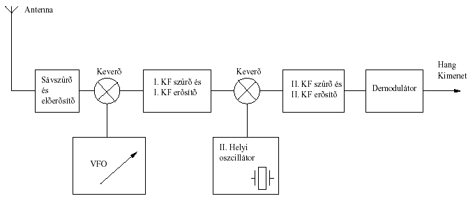

*Block diagram of a double-conversion superheterodyne receiver with two mixer/oscillator stages.*

*7.3-1. ábra. Kétszeres keverésű szupervevő*

A 7.3.1. ábra egy kétszeres keverésű, szuperheterodin rendszerű vevőkészüléket ábrázol. A II. helyi oszcillátor frekvenciája a 2. KF frekvencia összege vagy különbsége. (a keverőfokozatokról, és a keverésről részletesen a keverőfokozatok tárgyalásánál esik szó) Egyszeres és kétszeres transzponálású szuperheterodin vevő.

## 7.4. Tömbvázlatok

Ebben a fejezetben részletesen tárgyaljuk a rádióvevőt felépítő részegységek működéseit, tulajdonságaikat. A fokozatoknál igyekszünk az egyszerűségre, és a könnyebb érthetőségre törekedni, azonban tudni kell, hogy az amatőr tulajdonaikban lévő készülékek jóval bonyolultabbak is lehetnek. A leírások, rajzok elvi jellegűek, a gyakorlat eltérhet ezektől.

### 7.4.1. CW vevő felépítése

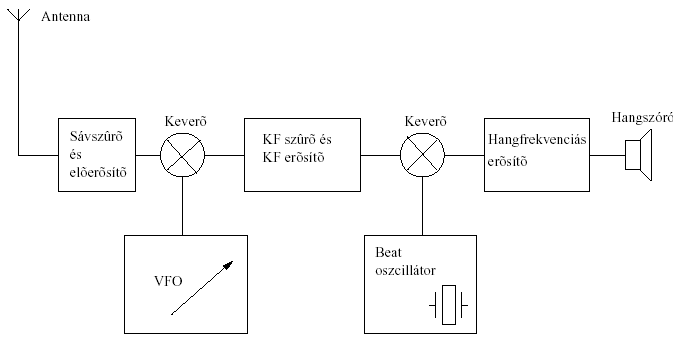

*Superheterodyne receiver for CW reception, including a beat-frequency oscillator (BFO).*

### 7.4.2. AM vevő felépítése

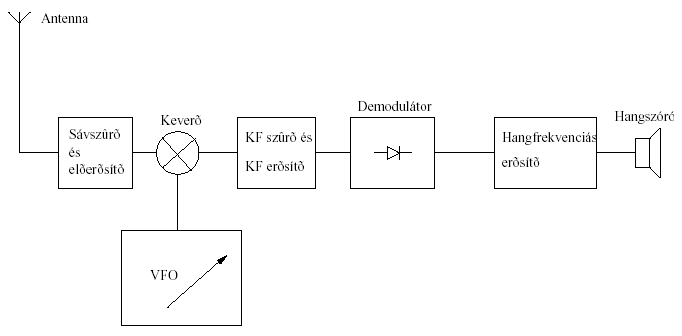

*AM superheterodyne receiver with a simple diode demodulator.*

### 7.4.3. SSB vevő felépítése

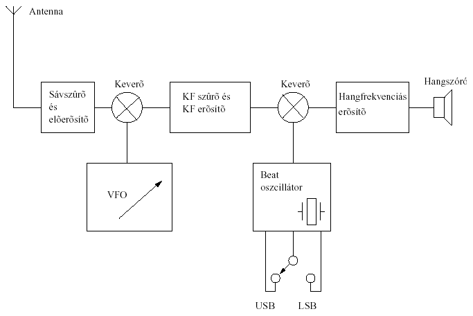

*SSB superheterodyne receiver with product detector/BFO and a USB/LSB switch.*

### 7.4.4. FM vevő felépítése

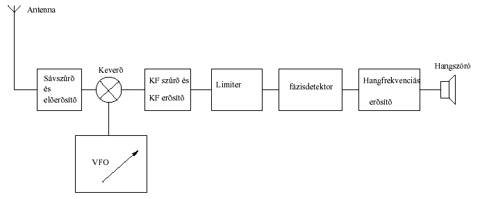

*FM superheterodyne receiver with limiter and discriminator stages.*

## 7.5. Az egymást követő fokozatok működése és funkciója

### 7.5.1. Nagyfrekvenciás egység

A nagyfrekvenciás egység fogadja a nagyfrekvenciás jelet az antennáról, így az első egység az antennaillesztő áramkör. Bármilyen felépítésű is legyen a rádió-vevőkészülék, az antennajelet mindig egy rezonáns körökből felépített hálózaton keresztül kell a nagyfrekvenciás előfokozatra bejuttatni. Az antennacsatoló áramkör feladata:

- az antenna kellő elválasztása a modulátorkörtől,

- a megfelelő sávszelekció biztosítása,

- a tükörszelektivitás növelése,

- a KF elnyomás (szuper rendszerű vevő esetében). Az antennacsatoló áramkört követi a nagyfrekvenciás előerősítő. Vevőkészülékek nagyfrekvenciás előerősítői szelektívek. Megfelelő szűrők alkalmazásával érik el a kellő sávszélességet (sávszelektivitás mértékét). A NF előerősítők modernebb változatai AGC szabályozott erősítők, tehát szabályozható az erősítésük mértéke. Az erősítők stabilitása és a gerjedés megakadályozása érdekében a nagyfrekvenciás erősítőkben negatív visszacsatolást alkalmaznak.

### 7.5.2. Oszcillátor és keverőfokozat

A vevőkészülékek oszcillátora állítja elő az ún. helyi oszcillátorjelet. Ez az oszcillátor lehet egy egyszerű VFO (LC körrel), de lehet bonyolultabb PLL rendszerű kialakítás is. A helyi oszcillátor jelét és az NF előerősítőről érkező jelet a keverőfokozatba vezetik. A keverőfokozat kimenetén megjelenik a két jel összege és különbsége, valamint ezek kombinációs frekvenciái. Tehát a keverőfokozat segítségével állítjuk elő a középfrekvenciát (KFet). A többi kombinációs jelet csillapítjuk (80…90 dB), így azok nem vesznek részt a vételben. A keverés lényege a következő: a modulátorjel vivőfrekvenciáját áttranszponáljuk a KF-re, így a KF lesz az új vivőfrekvencia, amely az eredeti jel teljes modulációját tartalmazza, vagyis a nagyfrekvenciás jel modulációját átvittük az új vivőfrekvenciára (KF-re).

Egyszerű keverőt építhetünk ringmodulátor segítségével, amelyre egy példát az alábbi ábrán láthatunk:

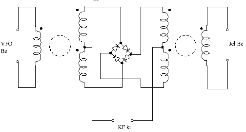

*Balanced (ring) mixer circuit using a diode bridge.*

*7.5-1. ábra. Keverő kialakítása ringmodulátorral*

De gyakoribb megoldás az aktív elemet tartalmazó keverőfokozat használata. Ez aktív elem egy dual-GATE MOSFET, amely segítségével könnyen megvalósítható a keverés elve.

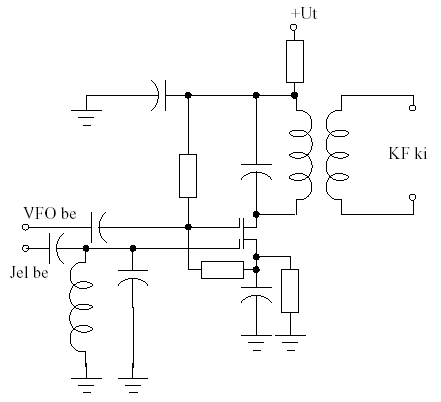

*Mixer stage with local-oscillator (VFO) input and IF output tank circuit.*

*7.5-2. ábra. Keverő kialakítása dual-gate MOSFET-tel.*

### 7.5.3. Középfrekvenciás erősítő

A középfrekvenciás erősítő a keverő- és a demodulátorfokozat között helyezkedik el. A KF erősítőfokozat rendeltetése, hogy megfelelő szintű KF jelet biztosítson a demodulátor számára. Továbbá a megfelelő sávszélesség biztosítása, ami szorosan összefügg a szelektivitás fogalmával. A modern integrált áramkörös KF erősítőkben a szükséges szelektivitásgörbét keramikus szűrőkkel valósítják meg. A minőségi követelményeknek megfelelően a KF erősítők lehetnek:

- LC hangolt körös,

- sávszűrős,

- koncentrált szűrővel a KF erősítő előtt,

- keramikus szűrővel, IC-vel felépített típusok. 

A középfrekvenciás erősítők általában többfokozatúak. A szupervevők jó szelektivitásukat, és nagy érzékenységüket a KF-erősítőknek köszönhetik, tehát ez az erősítő gondoskodik a csatornaszelektivitásról. KF erősítőkben manapság már nem alkalmaznak LC szűrőket, inkább kristályszűrőket, és mechanikus szűrőket, bár az utóbbi is kezd kifutni a gyakorlati alkalmazásból. Amatőr berkekben nagyon elterjedt megoldás a rezgőkvarcokból felépített kristályszűrő.
Ez a megoldás a legolcsóbb, minősége közepes, fizikai helyigénye relatív nagy. Gyakori az erősítőfokozatként alkalmazott integrált áramkör. Manapság külön erre a célra un. cél-IC-ket fejlesztenek, amiknek a minősége is megfelelő. Az erősítőfokozat erősítése általában automatikusan szabályozott. 
Ezt a rendszert AGC-nek (Automatic Gain Control) hívják. Azért szükséges, hogy az ingadozó bemeneti jelet időben kvázi egyenletessé változtassa. Az AGC-t általában át lehet kapcsolni manuális szabályozásra (MGC). A KF erősítőt általában úgy alakítják ki, hogy 2 (vagy több) erősítő fokozat közé egy kristályszűrőt iktatnak. A 7.5.3 ábrán egy nagyon egyszerű KF szűrő rajzát láthatjuk.

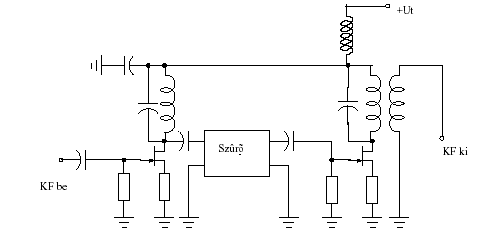

*Mixer/oscillator stage with tuned input and output circuits.*

*7.5-3. ábra. Egyszerű KF erősítő*

Komolyabb berendezésekben a KF frekvenciája, sávszélessége is változtatható. Ez lényegesen megbonyolítja a készüléket, és tetemes árnövekedést is jelent, de nagyon hasznos SSB és CW üzemmódoknál.

### 7.5.4. Demodulátorok

A demodulátorok végzik a KF jelre ültetett jel demodulálását, vagyis az eredeti moduláló jel visszaalakítását, így a kimenetükön hangfrekvenciás jelet szolgáltatnak. A demodulátorok felépítése üzemmódfüggő (AM, FM, SSB és CW), kapcsolási rajzukra példát az előző fejezetben szemléltettünk.

### 7.5.5. Hangfrekvenciás erősítők

Kisfrekvenciás erősítőket a rádiótechnikában a hangfrekvenciás jelek erősítésére használunk. Vételi oldalon ezek a demodulátor után helyezkednek el, általában kétfokozatú (elő és vég) erősítőként, mely a hangszórónak szolgáltatják a megfelelő teljesítményt (max. 1-2 watt). Ezek az erősítők általában tranzisztorból állnak, de elterjedt a FET-ek és a műveleti erősítők alkalmazása is.

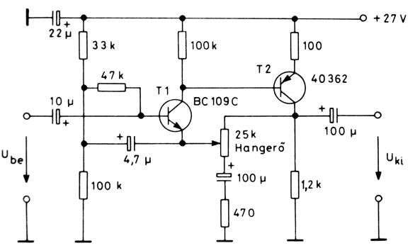

*Complete transistor audio amplifier with biasing, coupling capacitors, and a small speaker.*

*7.5-4. ábra. HF előerősítő hangerő szabályzóval*

### 7.5.6. Zajzár (Squelch) áramkör

Rádiófrekvenciás zajzár arra szolgál, hogyha a rádiófrekvenciás jel erőssége a vevőben egy bizonyos szint alá csökken, akkor a vevő kapcsoljon ki, és ne erősítse a légkörből származó egyéb zajokat „ne kezdjen el sisteregni”. Amennyiben állítható küszöbszintű zajzárral rendelkezik a vevő, akkor a kezelő annak szintjét tudja változtatni: ha hasznos jel vétele közben bekapcsol (elnémítja a vevőt), csökkentsünk a küszöbszintjét, ha viszont a zajzár nem kapcsol be esetleges sistergés esetén, akkor növeljük a küszöbszintjét.

### 7.5.7. Vételi-jelerősség mérő (S mérő)

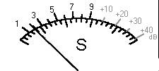

*S-meter analogue scale, showing S-units 1-9 and +10 to +40 dB overrange markings.*

*7.5-5. ábra. S mérő skálája*

A rádióamatőr vevőkészülékeknél a vett jel erősségének kijelzésére szolgál az S mérő. A gyári és az amatőrök által készített készülékek többségén megtalálható ez a műszer, amelyről leolvasható az S értéke. Az S mérők hitelesítésére nincs kötelező előírás így lehet, hogy két készüléken azonos antennával, azonos helyen egy adott állomás esetében más-más értéket olvashatunk le. 
Az S érték 0-9-ig terjedhet. Az S érték alapja a vételi jelfeszültség-érték, amelyet itt decibelben veszünk figyelembe. 1 S érték 6 dB-es értékváltozást jelent, és általánosságban elmondható, hogy a 9-es S érték (S 9) ≈ 50 μV jelfeszültségnek felel meg. Vannak olyan műszerek, ahol a 9-es S éték felett is van skála, azok a dB-es kiegészítésű műszerek. Itt maximálisan +40 dB-t tüntetnek fel, amely jelerősségnél nagyobb a gyakorlatban ritkán fordul elő (normál körülmények között soha), mivel az S9 + 40 dB egyenlő 5000 μV vételi jelszinttel.

## 7.6. Vevők jellemzői

### 7.6.1. Szelektivitás

Alapvetően 2 féle szelektivitásról beszélünk: 

1.     Csatornaszelektivitásról; 

2.     Sávszelektivitásról.

#### 7.6.1.1. A csatornaszelektivitás

Csatornaszelektivitás vagy más néven középszelektivitás az a tulajdonsága a rádiónak, hogy meg tudja különböztetni, azaz ki tudja emelni a forgalmi csatornát az összes többi közül. Ezt a feladatot a KF szűrő végzi.

#### 7.6.1.2. Sávszelektivitás

A sávszelektivitásért, valamint a tükörszelektivitásért a bemeneti sávszűrő felel.
