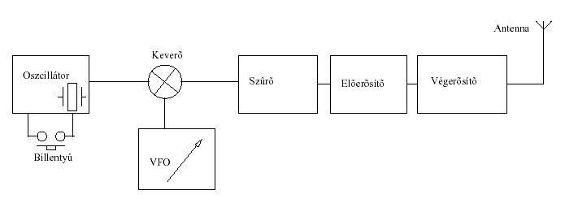
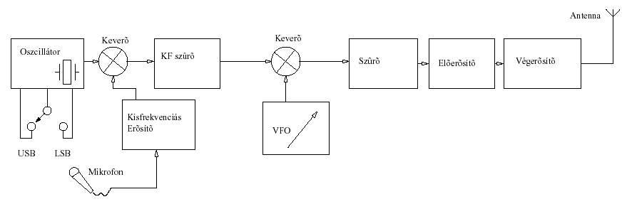
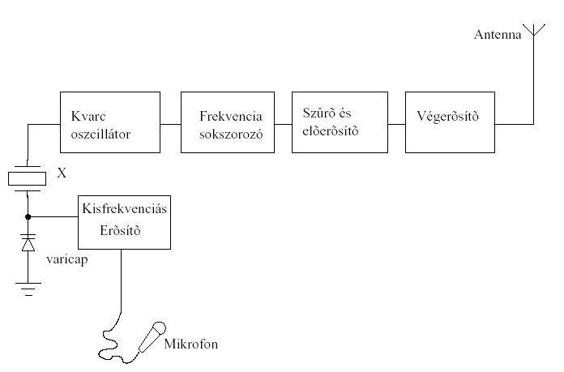
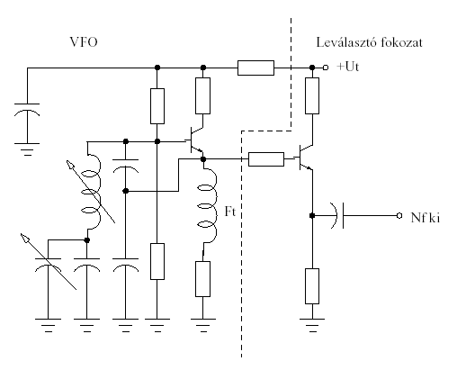
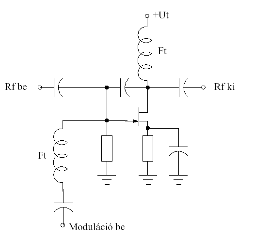
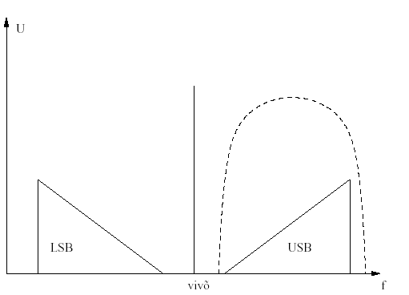

# 8. Adók

Kovács Levente HA5OGL

## 8.1. Adók típusai

Alapvetően 2 féle adótípust különböztetünk meg: 

1.   Az adási frekvenciát keveréssel előállított adók. Ezeket az adókat általában adó-vevőkben alkalmazzák, ahol egy vezéroszcillátor van (VFO), amely vezérli mind az adót, mind a vevőt. Ez biztosítja, hogy az adási, és a vételi frekvencia mindig ugyanaz legyen. (Természetesen néhány kHz-el el kell tudni hangolni az SSB, és a CW üzemű rádiókat.) A manapság használatos rádiók nagy része ilyen rendszerű. 

2.   Frekvenciasokszorozással előállított kimeneti frekvenciájú adók. Ezt a konstrukciót csak FM üzemmódnál alkalmazzák, de manapság már nem gyártanak ilyen rendszerű adókat, azonban még sok ilyen üzemel belőlük.

## 8.2. Tömbvázlatok

A következőkben ismertetjük a különböző adásmódú adókészülékek tömbváltozatait.

### 8.2.1. CW adó

Távíró jelek előállítására többfajta módszert alkalmaznak. Nagyon elterjedt módszer az, hogy egy KF frekvencián rezgő oszcillátor tápfeszültségét billentyűzik. Létezik olyan megoldás is, ahol az oszcillátor folyamatosan működik, és kimeneti jelét billentyűzik. Ennek a módszernek az a hátránya, hogy sohasem lehet teljesen csillapítani ezt a jelet, ezért nagy kimenő teljesítménynél is pár watt folyamatosan kisugárzódik. Természetesen az arányok megmaradnak, tehát jóval nagyobb teljesítmény kerül az antennára, amikor a távírász megnyomja a billentyűt.

*Block diagram of a simple CW transmitter: oscillator, mixer, filter, driver, power amplifier.*

*8.2-1. ábra. CW adó blokkvázlata*

Mint (8.2.1. ábra) látható egy távíró adó nagyon egyszerű. Könnyen lehet adó-vevőt készíteni kommersz, olcsó alkatrészekből Integrált áramkörök alkalmazásával pedig egészen kicsire lehet szerelni a rádiót.

### 8.2.2. SSB adó

SSB adó készítése jóval bonyolultabb feladat, mert biztosítani kell a kisugárzott jel megfelelő spektrumát. Nem lehet szélesebb az előírtnál, mert ezzel zavarokat okozunk, ha pedig keskenyebb a modulált jel szélessége, akkor pedig nem lesz megfelelően jó minőségű az adásunk. Ezeket a feltételeket meredek átvitelű, és megfelelő sávszélességű, un. SSB szűrőkkel valósítjuk meg. Természetesen van más megoldás is. Csak a teljesség kedvéért említjük meg a fázistolós SSB modulátort. Ez az eljárás régen volt használatos, amikor még nem voltak elérhetőek amatőrök számára jó minőségű kristályszűrök. Magyarországon az első SSB üzemű rádióban is ilyen eljárást alkalmazott a konstruktőr! Adó-vevő készülék esetében ugyanazt a szűrőt használjuk a vételi szelektivitás elérésére, és az adó oldalon a megfelelő moduláció és sávszélesség előállítására.

*Block diagram of an AM transmitter with microphone input, modulator, and RF chain.*

*8.2-2. ábra. SSB rendszerű adókészülék tömbvázlata*

### 8.2.3. FM adó

A frekvenciamodulált adástechnika eléggé bonyolult matematikával irható le. A fázis- és frekvenciamoduláció bizonyos szinten ekvivalens (egymás integráljai), tehát egy FM jelet lehet demodulálni egy PM detektorral, és fordítva. Sokszor használatos fázismodulációt (pl. PLL áramkörökben), gond nélkül tudnak demodulálni az FM vevők.

*Block diagram of an SSB transmitter with crystal oscillator, filter, audio amplifier, varicap.*

*8.2-3. ábra. Frekvenciatöbbszörözős FM adó*

A 8.2.3. ábrán látható FM üzemmódú adó működése a következő: A kvarcoszcillátor úgy van megépítve, hogy a kvarc alatt egy varicap dióda van, ami elhangolja egy kicsit a kvarcot. Ez az elhangolás a záróirányú előfeszítéstől függ, tehát a hangfrekvenciás erősítőből jövő jeltől. Így létrejön a frekvenciamoduláció. A kvarcnak a jelét a frekvenciaszorzó áramkör szorozza fel az üzemi frekvenciára. A modulátort úgy kell méretezni, hogy a szorzó áramkör a moduláció mértékét is szorozza.

## 8.3. Az egymást követő fokozatok működése és funkciója

Ebben a fejezetben csak azoknak a fokozatok ismertetése kerül sorra, amelyeket csak az adó tartalmaz. A többi fokozatot a vevőknél már tárgyaltuk (lásd: 7.5)

### 8.3.1. Elválasztó fokozat

Elválasztó fokozatot akkor kell beépíteni két fokozat közé, ha az előző fokozat nem képes meghajtani a következőt. Vannak olyan oszcillátorok, melyeknél a jel kicsatolása rezgőkörből történik, ezért az nagyon érzékeny a terhelésre. Ebben az esetben a következő fokozat el is húzhatja a rezgési frekvenciát. Elválasztó fokozat általában egy tranzisztorból áll, emitter követőként kialakítva.

*RF power-amplifier output stage with a VFO input and tuned tank circuit.*

*8.3-1. ábra. VFO leválasztó fokozattal*

A leválasztó fokozat (8.3.1. ábra) munkapontját a VFO emitter feszültsége szolgáltatja. A kollektor köri ellenállása kis értékű (100Ω körüli).

### 8.3.2. Meghajtó fokozat

Ez a fokozat a végfokozatnak biztosítja a megfelelő bemenő rádiófrekvenciás teljesítményt. Ez általában hasonló kapcsolás, mit a végfokozat, de kisebb félvezetőkkel. Ennek az egységnek mindössze 10-20 mW-ból kell kb. 0.5- 2W-os teljesítményt kell produkálnia.

### 8.3.3. Frekvenciasokszorozó

A vezéroszcillátor modulátor jelét a megfelelő frekvenciára kell sokszoroznunk. Ezt úgy érjük el, hogy az oszcillátor jelét nemlineáris elemre vezetjük, így felharmónikusokban gazdagjelet kapunk, majd ebből kiszűrjük a megfelelő frekvenciájú terméket. A sokszorozó egy többfokozatú áramkör. Egy fokozat maximum 4-5x-esen tud sokszorozni. Fontos, hogy a már modulált jel frekvencialökete is szorzódik, tehát a modulátort ennek megfelelően kell beállítani.

### 8.3.4. Teljesítményerősítő

A teljesítményerősítő szolgáltatja a kívánt rádiófrekvenciás kimenő teljesítményt. Általában egy fokozatú, bár nagyobb teljesítményeknél külön meghajtófokozat szükséges. Néhány száz Watt teljesítményig RH-n, illetve száz wattig URH-n FET vagy tranzisztort alkalmazunk aktív elemként, nagyobb teljesítménynél kizárólag elektroncsövet. Létezik azonban olyan eljárás is, mellyel több kisebb teljesítményű fokozatot tudunk párhuzamosítani, így azok teljesítménye összeadódik. Ezek az erősítők SSB modulációnál AB-osztályúak, CW és FM üzemmódnál C-osztályúak is lehetnek. 2 Watt felett már biztosítani kell az aktív elem hőelvezetését hűtőborda, csöves kivitelnél ventillátorok segítségével.

### 8.3.5. Kimeneti szűrő

Mivel a végfokozat B vagy C osztályban működik, kimenő jele kisebb nagyobb mértékben tartalmaz nem kívánatos felharmónikusokat. Ezeket ki kell szűrni, mert adásunkkal zavarokat okozhatunk! Ezeket a szűrőket általában Collins körökből alakítják ki. Nagyon fontos, hogy a tekercsek kellően vastag vezetékből készüljenek, és a kondenzátorok elég nagy átütési szilárdsággal rendelkezzenek, mert ellenkező esetben nem lesznek képesek a megfelelő teljesítményt átvinni.

### 8.3.6. Frekvenciamodulátor

Kvarcoszcillátoros frekvenciamodulációról már volt szó a 8.2.3. fejezetben. Vannak más lehetőségek is: ilyen a fázismoduláció. Mint ismeretes a fázismodulációt FM rendszerű vevő is tudja venni. Fázismodulációnál a vivő fázisát változtatjuk meg a moduláló jel függvényében.

*Modulator stage with RF input/output transformers and an audio modulation input.*

*8.3-2. ábra. Fázismodulátor kapcsolási rajza*

A modulátor (8.3.2. ábra) felépítését tekintve egy RC tag, melynek az ellenállás része maga a FET. Az ellenállást a változtatjuk a hangfrekvencia ütemében, így a fázistolás is változik. A modulátor és a hangfrekvenciás erősítő közé egy vágó áramkör is szükséges, amely korlátozza a moduláló jelet.

### 8.3.7. SSB modulátor

Ez az áramkör lényegében 3 részből áll: Egy kvarcoszcillátorból, modulátorból, és egy szűrőből. A működése egyszerű. A kvarcoszcillátor jelét hagyományos DSB/SC mudulációval moduláljuk, majd az SSB szűrővel kiszűrjük a kívánt oldalsávot. A kvarcoszcillátor nem a vivő frekvencián rezeg, hanem 1.5 kHz-el feljebb vagy alatta, alsó vagy felső oldalsáv használatának függvényében. A modulátor blokkvázlatát a 8.3.3. ábra mutatja.

*Double-sideband spectrum around a carrier, with LSB and USB regions marked.*

*8.3-3. ábra. SSB modulátor működése*

A 8.3.3. ábrán szaggatott vonallal jeleztük az SSB szűrő átvitelét. Jól látható, hogy a vivőt, és a nem kívánatos oldalsávot nem ereszti át a szűrő. USB és LSB váltásnál nem a szűrőt hangoljuk át, hanem a vivő frekvenciát változtatjuk meg úgy, hogy a másik oldalsáv essen a szűrő átviteli tartományába. SSB szűrőként a KF szűrőt szokták alkalmazni adó-vevőkben.

## 8.4. Adók jellemzői

### 8.4.1. Frekvenciastabilitás

A frekvenciastabilitás fontos jellemzője egy rádiónak. Általában ez megegyezik a VFO stabilitásával. Az oszcillátorok tárgyalásánál tárgyaltuk ezek stabilitását.

### 8.4.2. Rádiófrekvenciás sávszélesség

Ezt a jellemzőt a modulátorok, és az SSB szűrők, valamint FM-nél a hangfrekvenciás frekvenciahatároló fokozatok befolyásolják. Fontos, hogy optimálisan legyen beállítva a készülékünk, mert különben adásunkat ellenállomásunk nehezen tudja venni.

### 8.4.3. Oldalsávok

Jellemző a rádiókra a kisugárzott oldalsávok száma, SSB üzemnél pedig az elnyomott oldalsáv és az üzemi oldalsáv teljesítményeinek aránya. Ezeket általában dB-ben adjuk meg a már megismert elvek szerint.

### 8.4.4. Kimenő teljesítmény

Ez az érték a végerősítőtől függ, és Wattban adjuk meg.

### 8.4.5. Nemkívánatos nagyfrekvenciás kisugárzások

A 8.3.5. fejezetben ismertettük a nemkívánatos nagyfrekvenciás jeleknek az elnyomási módszerét. A kimeneti szűrő csillapítja ezeket a jeleket, de egészen nem tudja elnyomni őket. A kisugárzott üzemi frekvencia, és a felharmónikusok aránya adja meg ezt a paramétert. Nemcsak a végfokozat nonlinearitásából keletkezhetnek nemkívánatos jelek. Az adókban lévő keverők intermodulációs termékeikből, áthallásokból is képződhetnek ilyen fajta jelek. Árnyékolással, valamint helyes beállításokkal megfelelően kiküszöbölhetjük ezeknek a jeleknek a meglétét.

## 8.5. Adókészülékek kezelőszervei

Minden adókészülék vezérelhető, a vezérlés típusa és a vezérelhetőség mértéke függ az adott adókészülék rendeltetésétől, bonyolultságától és adási paramétereitől (pl.: üzemmód). Rádióamatőr adóvevő készülékeken az alábbi általános adó-vezérlőszervek találhatók:

- PTT (Push To Talk): fónia üzemmódoknál (SSB, FM) az adóvevő adóüzemmódba kapcsolása, megnyomásával a készülék adója üzemel (kisugározza az adó az adásunkat).

- KEY (Billentyű): Morzebillentyű, CW azaz távíró üzemmódban az adó vezérlésére és a jelek „billentyűzésére” szolgál.

- PWR control: adóteljesítmény vezérlés, az adó kimeneti teljesítményét tudjuk állítani (típustól függően: lépésenként (pl.: 0.5 W; 5 W) vagy fokozatmentesen.)

- MIC GAIN, RF GAIN: a különböző fokozatok erősítését állíthatjuk (a MIC GAIN tipikusan SSB üzemmódban használatos).

- VOX: moduláció vezérelt adáskapcsolás, ennek segítségével PTT használata nélkül a modulációval adásra kapcsolhatunk. Amennyiben ez nem csak egy kapcsoló, hanem állítható értékű, akkor a modulációs adáskapcsolás érzékenységét is tudjuk változatni.

- TUNE: az adó hangolására szolgál, segítségével tudjuk behangolni az adó köreit a megfelelő frekvenciára (a maximális teljesítmény kisugárzása érdekében).
