# 9. Antennák és tápvonalak

Jónap Gergő HG5OJG

Az antenna a rádióamatőr állomás legfontosabb kelléke. Az antennát ugyanis adásra és vételre is használjuk, tehát ha az rossz minőségű, hatásfokú, akkor mellette a legprofesszionálisabb adóvevő készülék sem ér semmit. Az antennáról szóló minden rádióamatőr könyv, cikk már a bevezetőben idézi a régi amatőr igazságot: „A jó antenna a legjobb erősítő!” Az antenna feladata tehát kettős, mert adásra és vételre is használjuk. Működési elvét a nyitott rezgőkörös magyarázat adja meg a legszemléletesebben (8.5.1. ábra).

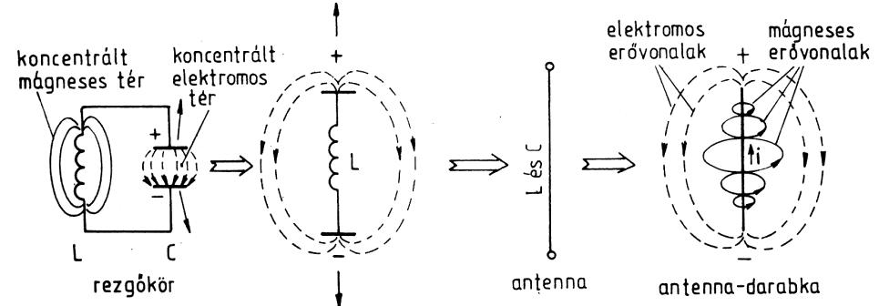

*How an oscillating LC circuit's fields transform into an antenna's radiating fields.*

*9.1-1. ábra. Az antenna működésének szemléltetése*

A rezgőköröknél bemutatásra került, hogy bennük periodikus elektromos-mágneses energiacsere zajlik. Miután az antenna nyitott rezgőkörként fogható fel, így abban igen nagy az elektromos és mágneses terek szórása. Az antenna a bevezetett rádiófrekvenciás teljesítményt elektromágneses erőtér formájában kisugározza. Ez a sugárzás akkor jó hatásfokú, ha az antenna saját rezonanciafrekvenciája megegyezik a tápláló jel frekvenciájával. A vevőantennák illetve az antennák vételi tulajdonságait tekintve az elektromágneses erőtérből energiát vesznek fel és alakítják elektromos jelekké, amely jeleket a tápvonal továbbít a vevő felé.

## 9.1. Félhullámú dipólus

Az antennatechnika legegyszerűbb, ugyanakkor legelterjedtebb rezonanciaképes szerkezete az ún. félhullámú dipólus. Úgyszolván valamennyi antennatípus közös eleme, továbbá a decibelben megadható antennanyereség (lásd később) vonatkozási alapja.

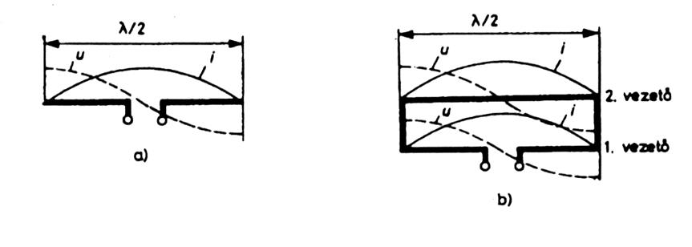

*Current/voltage distribution along a half-wave (λ/2) dipole conductor (two views).*

*9.1-1. ábra. Feszültség- és árameloszlás a dipólus antennán*

Dipólus antennának nevezik az olyan antennát, amely tükörszimmetrikus a tápvonal csatlakozási pontján átmenő síkra. A két darab λ/4 hosszúságú egyenes vezetőből kialakított dipólus az egyenes dipólus. HA ennek a két végét egy vele párhuzamos, azonos hosszúságú vezetővel összekapcsoljuk, akkor hurokdipólusról beszélünk. A dipólusantenna sugárzási jellemzői szoros összefüggésben vannak geometriai méretével és a földfelszín feletti magasságával. Mint minden elektromos vezetőnek a dipólusnak is kapacitása és induktivitása van, amelyek a huzal vagy cső hosszában egyenletesen oszlanak el. A szabad térben elhelyezett, végtelenül vékony egyenes és hajlított dipólusantenna áram- és feszültségeloszlását láthatjuk a 9.1.1. ábrán.

### 9.1.1. A dipólusantenna impedanciája

Az antennáknak is mint a rezgőköröknek kiszámítható az impedanciájuk, ami antennák esetében a talpponti impedanciát jelenti. Ez kiszámítható az áramerősség és a feszültség ismeretében is. A szinuszos árameloszlású, ideális dipólus talpponti impedanciája 73,2 Ω, míg a hurokdipólusé épp a négyszerese, tehát 293 Ω. Véges vastagságú antennáknál elmondható, hogy a dipólus talpponti ellenállása befolyásolható a hullámhossz (λ) és a dipólusátmérő (d) viszonyának megváltoztatásával. A λ/d viszonyt karcsúsági tényezőnek nevezik.

### 9.1.2. Rövidülési tényező

Az antennák elektromos hossza és geometriai hossza csak akkor egyezne meg, ha a szabad térben lévő sugárzó átmérője végtelen kicsi lenne. A valódi sugárzó csak akkor kerül rezonanciába, ha geometriai hosszát csökkentjük a kiszámított elektromos hosszhoz viszonyítva. Az adott hullámhossznál a rezonancia eléréséhez szükséges rövidülési tényező értékét a karcsúsági tényező befolyásolja.

### 9.1.3. Az antenna sávszélessége

Általánosságban elmondható, hogy a sugárzó vastagságának növelésekor a talpponti ellenállás és a rövidülési tényező csökken, viszont növekszik a sugárzó sávszélessége, rezonanciafrekvenciája pedig lecsökken.

### 9.1.4. Sugárzási ellenállás és hatásfok

A sugárzási ellenállás az antenna sugárzási tulajdonságai szempontjából fontos jellemző. Azzal az ellenállással egyenlő, amelyet ha a sugárzó antenna helyére kötnénk, akkor ugyanannyi teljesítményt fogyasztana el. Értéke:

`RS = PS / Imax²`

ahol a PS az antenna által kisugárzott teljesítmény, Imax pedig az antennaáram effektív értékének maximuma. A valóságos dipólust valamilyen vezető anyagból készítik, ennek megfelelően valós („ohmos”) veszteségi ellenállása is van (Rv), így a rezonanciában lévő antenna talpponti ellenállása: `Rbe = RS + RV`. 
Az antenna hatásfoka kiszámítható az alábbi képlettel:

`η = 1 / (1 + Rv/Rs)`

### 9.1.5. Az antennák sugárzási tulajdonságai

Az antennák sugárzási tulajdonságainak elemzésénél be kell vezetnünk egy fiktív, úgynevezett izotróp sugárzó (izotróp antenna) fogalmát: Az izotróp sugárzó a tér minden irányában azonos intenzitással sugárzó, pontszerű energiaforrásként kezelhető antenna. Az izotróp antenna tehát azonos teljesítménysűrűséggel sugároz a tér minden irányába (mint egy gömbfelületet belülről egyenletesen megvilágító fényforrás). Az ideális gömbsugárzó a gyakorlatban nem létezik, tehát minden antenna csupán a tér egy bizonyos hányadát képes besugározni. Ezért az antennáknak irányhatása van. Az irányhatást az E és a H síkbeli sugárzási jelleggörbékkel tudjuk jellemezni. Az iránykarakterisztika megadja a sugárzási irány függvényében a térerősségek relatív értékeit a fő sugárzási irányra vonatkoztatva. Az alábbi ábrán a szabad térben elhelyezett félhullámú dipólus E és H síkbeli sugárzási jelleggörbéit polárkoordináta-rendszerben láthatjuk.

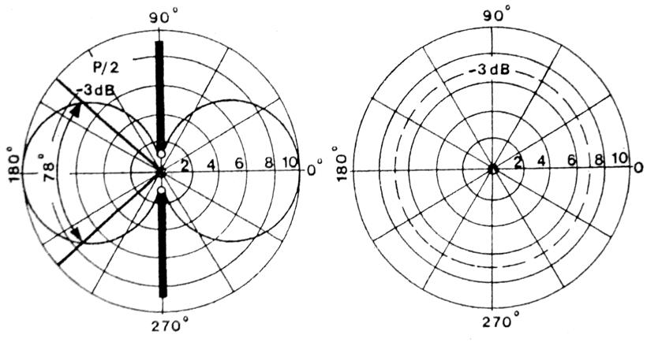

*Polar radiation-pattern plots of a dipole antenna (dB scale, two orientations).*

*9.1-2. ábra. A félhullámú dipólus iránykarakterisztikája a polarizációs síkban (E -síkban és H-síkban)*

Elméleti számítások és mérések egyaránt bizonyítják, hogy a félteljesítményű pontok (-3dB-es pontok)*

távolsága az E síkban ≈ 78°. A H síkban a félhullámú dipólus körsugárzó. Ezért szokták függőleges elhelyezés esetén (függőleges polarizáció) körsugárzóként alkalmazni.

### 9.1.6. Az antennák nyeresége

Az iránykarakterisztika ismertetése után beláthatjuk, hogy változatlan adóteljesítmény mellett, az antenna által az adott irányban kisugárzott teljesítmény csak akkor növelhető, ha a többi irányba kisugárzott teljesítményt csökkentjük. Az antennanyereség az antenna irányítottságának mértékét határozza meg. Ezért a következő összefüggéssel definiálhatjuk:

`G = S1 / SREF` 

Ahol S1 a vizsgált antenna teljesítménysűrűsége, SREF pedig a referencia antenna teljesítménysűrűsége. Az antennanyereséget decibelben szokták megadni:

`G(dB) = 10 * lg(S1 / SREF)`

Amennyiben az elméleti izotróp sugárzóra vonatkoztatjuk a nyereséget (jelölése: G [dBi]), akkor S REF = S0. A gyakorlatban többnyire a félhullámú dipólusra vonatkoztatott nyereséget használjuk, mert a félhullámú dipólussal történő összehasonlító mérés könnyen megvalósítható. A szokásos jelölése: G [dBd]. A félhullámú dipólus nyeresége az izotróp sugárzóhoz képest 2,14 dB.

### 9.1.7. Az antennák hatásos felülete

Az antenna hatásos felülete az illesztetten lezárt, elegendően nagy távolságra elhelyezett vevőantenna által szolgáltatott maximális teljesítmény és a teljesítménysűrűség hányadosa az adott helyen:

`AH = Pv / S1` 

Mivel az antenna által a térből felvett teljesítmény az antenna geometriai méreteivel áll szoros összefüggésben, ezért a kifejezés elnevezése erre a kapcsolatra utal. Az így meghatározott hatásos felület azonban nem azonos az antenna geometriai felületével! A hatásos felület és az antenna nyeresége között az alábbi összefüggés teremt kapcsolatot:

`AH = Gλ² / (4π)`

Az alábbi ábrán a félhullámú dipólus hatásos felületét láthatjuk:

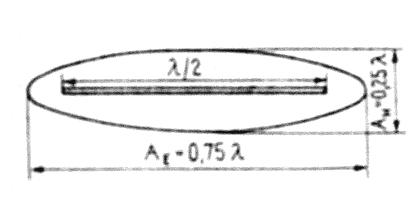

*Half-wave dipole antenna showing physical length (λ/2) and effective aperture area.*

*9.1-3. ábra. A dipólus antenna hatásos felülete*

## 9.2. Függőlegesen polarizált antennák

### 9.2.1. Marconi-antenna

Az eddig tárgyalt antenna a dipólus félhullámú vízszintes sugárzó, azonban ha egy jól vezető talaj felett függőleges irányban állítunk fel egy antennát, akkor elhagyhatjuk az egyik λ/4-es tagot. Ilyenkor elvileg továbbra is félhullámú sugárzóról van szó, mert többé-kevésbé a jó vezetőnek tekinthető talaj tükörképszerűen félhullámú sugárzóvá egészíti ki a negyedhullámú rudat.

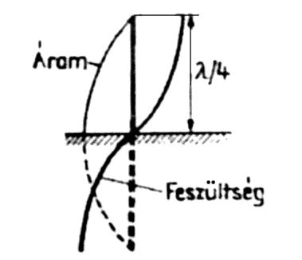

*Current and voltage standing-wave distribution along a quarter-wave (λ/4) vertical antenna above ground.*

*9.2-1. ábra. Marconi-antenna az áram- és feszültségeloszlással*

A föld fölött felállított negyedhullámú rudat aszimmetrikus antennának is nevezzük, mert a vízszintes helyzetű félhullámú dipólussal ellentétben nem földszimmetrikus.

### 9.2.2. Függőleges körsugárzók ellensúllyal

A klasszikus Marconi-antennát ma már az amatőrök nem használják, mert kizárólag rövidhullámon vagy az RH-nál hosszabb hullámon alkalmazhatóak, és a földfelszínre való telepítés sok esetben nem a legjobb megoldás. A függőleges negyedhullámú antennák telepíthetőek magasabbra, is mint a földfelszín, azonban akkor ellensúlyok hálózatával kell helyettesíteni a földfelszínt.

#### 9.2.2.1. Groundplane antenna

A GP antenna felépítését tekintve egy negyedhullámú sugárzó elemből és négy negyedhullám hosszúságú ellensúlyból áll. Az ellensúlyok (radiálok) a sugárzóhoz képest 135°-os szöget zárnak be, egymáshoz képest pedig 90°-ot. Ebben az esetben a talpponti impedanciája pontosan 50 Ω, így aszimmetrikus koaxkábellel közvetlenül táplálható. Az irányhatását tekintve pedig az E síkban (vízszintes irányban) körsugárzó.

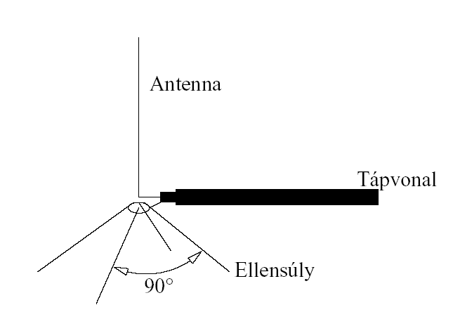

*Ground-plane/vertical antenna with sloping radial ("ellensúly") wires at 90° and a feedline.*

*9.2-2. ábra. Groundplane antenna*

### 9.2.3. Függőleges antennák sugárzási tulajdonságai

A függőleges sugárzók függőleges iránydiagramján nagyon kicsi a függőleges síkban mért emelkedési szög. Vízszintes irányban a függőleges antennák körsugárzók. Az alábbiakban feltüntetünk néhány jellemző antennahosszúságot és azok sugárzási iránydiagramját (függőleges síkban értelmezve).

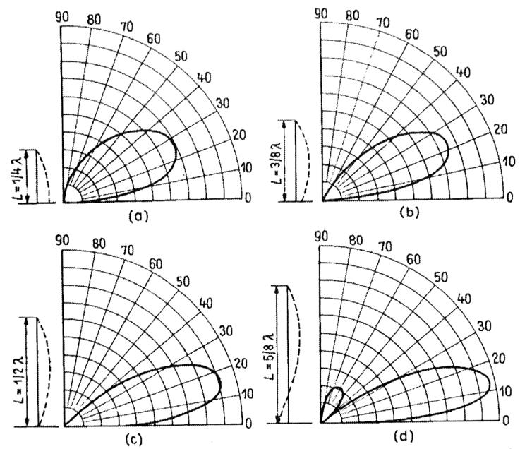

*Four polar radiation-pattern plots for antennas of different lengths (L = 1.1λ to 5λ).*

*9.2-3. ábra. Különböző hosszúságú függőleges sugárzók iránydiagramja*

## 9.3. Rövidhullámú antennák

A RH antennák gazdag fajtaválasztékából nagyon nehéz kiválasztani-megtalálni a számunkra ideálist. A teljesség igénye nélkül megpróbálom az alábbiakban összefoglalni az RH antennák típusait, gyakorlatban megvalósított változatait és azok főbb paramétereit. Az RH antennáknál is az elsődleges szempont, ami szerint csoportosíthatók:

- körsugárzók,

- iránysugárzók. A másodlagos szempont, amely szerint csoportosíthatjuk az RH antennákat:

- egysávos antennák,

- többsávos antennák. 

A legegyszerűbb RH antenna a félhullámú dipólus, amely tulajdonságait már nagyító alá vettük az előzőekben, a félhullámú dipólusra épülő RH antennák családja igen széles, gyakorlatban sok változat ismert. Közös tulajdonságuk: hosszuk λ/2, fő sugárzási irányuk a hossztengelyükre merőleges. Ezek:

- windom antenna,

- Y-antenna,

- sodor huzalú, tápvonalas félhullámú dipólus,

- hurok dipólus,

- koaxiális kábel által táplált dipólus,

- minden széles sávú félhullámú dipólus. 

Teljesítőképesség tekintetében ezek a különféle formák azonosak, a különbség csupán a táplálás módjában van. Az antennák további csoportja az oldalirányú vagy merőleges sugárzók. Ezek az antennák hosszirányukra merőlegesen, élesen nyalábolva sugároznak. Ezek:

- H-antenna,

- W8JK-antenna. 

Kis költségből megépíthetők, hátrányuk, hogy csak egyirányban sugároznak. Közel azonos antennanyereség érhető el az irányantennák használatával. Döntő előnyük, hogy valamennyi égtáj felé azonos nyereséget lehet elérni, és helyben elférnek. Ezek:

- QUAD-antenna 

Végül az előző fejezetrészben bemutatott függőleges sugárzókat említem. Reprezentánsuk a botantenna, amely kis helyen elfér, körsugárzó. RH sávokban is nagyon közkedvelt antenna a GP, a GP-hez hasonló „Triple leg” is. Az alábbiakban részletesen foglalkozunk két különleges antennacsoporttal: 
a huzalantennákkal és 
a többsávos antennákkal.

### 9.3.1. Huzalantennák (long wire)

A huzalantennák (angolul: long wire = hosszú huzal) még az amatőrrádiózás hőskorában terjedtek el, ma azonban csak ritkán és rendszerint valamilyen különleges kivitelű formájával találkozhatunk (általában vételre használt antennák) olyan rádióamatőr állomásokon, ahol van elegendő hely a telepítésükre. A huzalantennák angol elnevezéséből eredő „hosszú” jelző arra utal, hogy a sugárzó minden esetben hosszabb, mint az üzemi frekvenciának megfelelő hullámhossz, vagyis az antenna felharmonikusan van gerjesztve. A huzalantennák legfontosabb erénye olcsóságuk és egyszerű kivitelük, helyigényük viszont igen nagy! Minél hosszabb egy huzalantenna, annál nagyobb lesz az elérhető nyereség és annál élesebb lesz az irányítóhatás. Huzalantennák méretezésére az alábbi képletet használjuk: 150(n - 0,05) l= f ahol l a sugárzó hossza m-ben, n a sugárzón kialakuló félhullámok száma, f az üzemi frekvencia MHz-ben. Az alábbi ábrán szemléltetjük a huzalantenna nyereségének, sugárzási ellenállásának és a fő sugárzási iránynak változását a sugárzó hosszának függvényében.

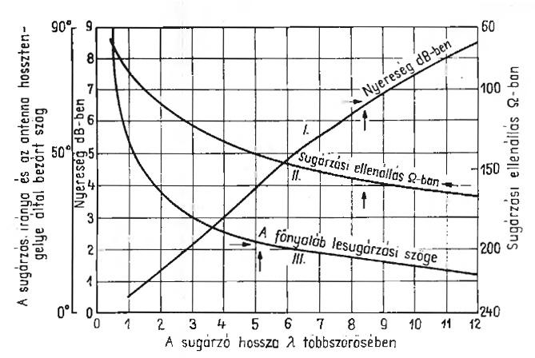

*Radiator length (in wavelengths) vs gain, feed-point resistance and beamwidth for long-wire antennas.*

*9.3-1. ábra. Huzalantenna paraméterei*

A huzalantenna gyakorlati megvalósítását képviselő ismertebb RH antennák:

- V antennák

- rombusz antennák

- Fuchs-antenna

### 9.3.2. Többsávos antennák

A félhullámú sugárzót lehetséges felharmónikusan üzemeltetni, ha elektromos szempontból a kifogástalan táplálás hangolt tápvonal segítségével történik. Az illesztett tápvonalas, többsávos antennák minden esetben csak kompromisszumos megoldást jelentenek, amelyeknél a többsávos üzem csak többé-kevésbé sugárzó tápvonal vagy egyéb hátrányos körülmény révén érhető el. A félhullámú sugárzót tartalmazó többsávos antennákat elsősorban rövidhullámon használjuk, segítségükkel több RH sáv átfogható. Sok változatuk ismert: Windom antenna, W3DZZ stb.

A W3DZZ antenna használható a 10, 15 és 20m-es amatőrsávban egyaránt. Előnye, hogy koaxkábellel táplálható (75 Ω).

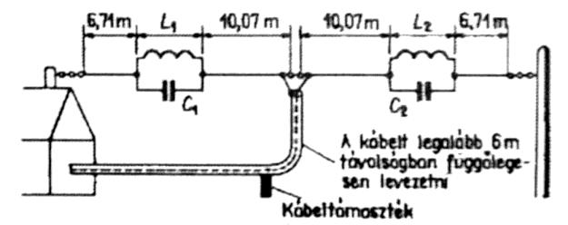

*Folded/loaded long-wire antenna with coils and capacitors, fed via a feedline.*

*9.3-2. ábra. W3DZZ antennája*

## 9.4. Ultrarövidhullámú antennák

Az URH frekvenciákon az antennák mérete (a kisebb hullámhossz miatt) kisebb, mint az RH antennák, így az URH frekvenciákon alkalmazott antennáknál a kezelhető geometriai méretek miatt nagynyereségű antennákat lehet építeni. Az URH antennáknál is az elsődleges szempont, ami szerint csoportosíthatók:

- körsugárzók,

- iránysugárzók. A másodlagos szempont, amely szerint csoportosíthatjuk az URH antennákat:

- egysávos antennák,

- többsávos antennák. 

A fejezet elején tárgyalt antennák közül számos antenna alkalmazható URH frekvenciákon is: dipólusok, függőleges körsugárzók (GP). Az URH frekvenciákon alkalmazott függőleges körsugárzók lehetnek az eddig tárgyalt kialakításúak (pl.: GP, 5/8 λ), de lehetnek bonyolultabb kivitelű, jó nyereségű antennák pl.: kollineáris antennák (legismertebb gyakorlati megfelelője: Trio-Star). Az alábbiakban a legismertebb URH iránysugárzó antennatípust a Yagi-antennákat tárgyaljuk.

### 9.4.1. Yagi-antennák

A félhullámú dipólusokat URH-frekvenciákon önállá antennaként ritkán alkalmazzuk. Ugyanis a félhullámú dipólusokat kiválóan alkalmazhatjuk egy nagyobb nyereségű antenna sugárzó elemeként. Egy dipólus irányhatását irányhatását növelhetjük a fő sugárzási irányban, ha előtte néhány százalékkal rövidebb elemet (direktort), míg mögötte pár százalékkal hosszabb elemet (reflektort) helyezünk el. A sugárzáscsatolt, úgynevezett parazita elemekkel kiegészített dipólust Yagi-antennának nevezzük.

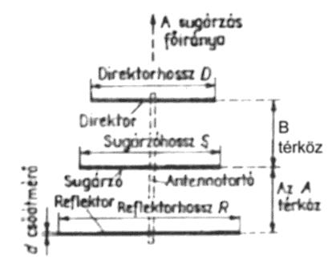

*3-element Yagi antenna showing reflector, driven element, and director with spacing dimensions.*

*9.4-1. ábra. A 3 elemes Yagi antenna geometriai méretei*

A Yagi antennák legegyszerűbb változata a 3 elemes Yagi, amely a 2m-es (144-146 MHz) es amatőrsávra az alábbi adatokkal rendelkezik:

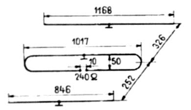

*Mechanical dimension drawing of a Yagi-Uda antenna element/boom, with 240 ohm feed impedance.*

*9.4-2. ábra. 3 elemes Yagi antenna a 2m-es sávra*

A 9.4.2-es ábrán látható antenna tulajdonságai: 
antennaelemek átmérője 5…10 mm; 

az antenna hossza: 580 mm; 

antennanyereség: 5 dB; 

hátrasugárzási csillapítás: 14 dB; 

nyílásszög (E/H): 70°/110°. 

Az irányított antennáknál, a főirányban sugárzott teljesítmény és a hátrasugárzási teljesítmény viszonyát határozza meg az előre-hátra viszony. Ahhoz, hogy a Yagi-antenna minél nagyobb nyereségű és sugárzási karakterisztikája optimális legyen, rendkívül szigorú törvényeket követ az elemek mérete és elhelyezkedése a gerincen. Az antenna alábbi jellemzői függnek a mechanikai adatoktól: talpponti impedancia, nyereség, rezonanciafrekvencia, sávszélesség, előre-hátra viszony, oldalhurkok nagysága, iránykarakterisztika tisztasága, vízszintes és függőleges irányszögek, a hatásos felület, a sugárzási ellenállás az antenna hatásfoka. A Yagi-antennákat      szigorú elvek szerint       tervezik antennaszimulátor        programokkal (számítógépes programokkal). 
Yagi-antennákat az URH frekvenciákon használunk, tipikusan 30 MHz – 3000 MHz-ig. A Yagi-antennáknak két fő típusát különböztetünk meg:

- rövid Yagi: a gerinchossza azonos elemszám mellett rövidebb mint a hosszú Yagi-nál, elsősorban az alacsonyabb frekvenciákon alkalmazzák geometriai mérete miatt (pl.: 28 MHz-144 MHz).

- hosszú Yagi: a gerinc hossza azonos elemszám mellett nagyobb mint a rövid Yagi-nál, felépítését tekintve több zónára osztható: gerjesztési centrum, átmeneti zóna, hullámvezetéses rendszer. 

A hosszú Yagi tervezése más elveket követ, mint a rövid változatnál. Alkalmazása leginkább a magasabb frekvenciákon történik: 144 – 3000 MHz. Tipikus hosszuk: 1 λ - 3 λ. A Yagi-antennák esetében általános elv, hogy a direktorok mérete mindig kisebb mint a sugárzó hossza, és a reflektor (vagy reflektorok) mérete nagyobb mint a sugárzó hossza.

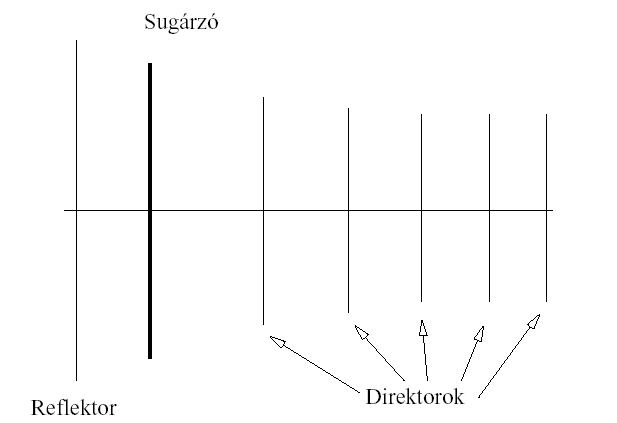

*Multi-element Yagi antenna showing the reflector, radiator, and multiple directors.*

*9.4-3. ábra. Többelemes Yagi felépítése*

A Yagi-antennák nyeresége a gerinchossz és elemszám növelésével nő, nyílásszögük csökken. A nyereség egy bizonyos határon túl már számottevően nem növelhető (3 λ gerinchossz felett), a hosszú Yagi nyereség – gerinchossz összefüggésre az alábbi ábra ad útmutatót.

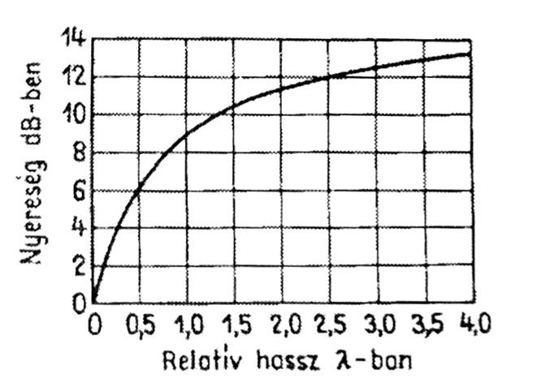

*Yagi antenna gain (dB) versus relative boom length (in wavelengths).*

*9.4-4. ábra. Hosszú Yagi nyeresége a gerinchossz függvényében*

## 9.5. Mikrohullámú antennák

A Yagi-antennák tárgyalásánál felmerült az a probléma, hogy a Yagi nyeresége maximálisan 14-15 dB körüli érték lehet. Ekkora nyereséghez nagy elemszám és hosszú gerinc (4-5 λ) tartozik. Magasabb frekvenciákon (> 1200 MHz) így a Yagi-antennák készítése körülményes (kezd egy fésűhöz hasonlítani a Yagi )és mechanikai tulajdonságaik nem túl jók (nagy elemszám, magas frekvencián a boom átmérője számottevően beleszól az antenna működésébe, ilyenkor nem fémes anyagból kell a boom-ot készíteni). Nem beszélve a maximális 14-15 dB-es nyereségről és a 10° feletti nyílásszögről. Ezért mikrohullámon és a magasabb URH sávokban (> 23 cm) célszerűbb kifejezetten mikrohullámú antennákat használni.

### 9.5.1. Paraboloid-reflektor antenna

Az ismert optikai reflektorhoz hasonlóan ez az antenna parabola vezérgörbéjű reflektorból és a fókuszában elhelyezett primersugárzóból vagy tápfejből áll.

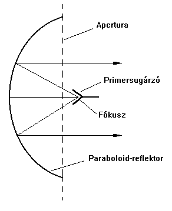

*Parabolic (dish) reflector antenna showing focal point, feed, and aperture.*

*9.5-1. ábra. Paraboid-reflektor antenna*

Ha a parabola vezérgörbét a fókuszon átmenő szimmetriatengely körül megforgatjuk, akkor forgásparaboloid reflektort kapunk. Ha a vezérgörbét egy vonal mentén végighúzzuk, akkor az hengerparaboloid reflektort eredményez. Az előbbit a fókuszpontból az utóbbit fókuszvonalból kell megvilágítani. Mi a forgásparabolid antennát szemléltetjük. (9.5.2. ábra)

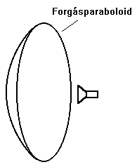

*Parabolic dish antenna with a small feed horn at the focus.*

*9.5-2. ábra. Forgásparaboid antenna*

Az eredmény egy - a reflektor szélei által határolt - nagyméretű nyílásfelület, vagyis apertura, melyen meghatározott térerősségeloszlású síkhullám lép ki. A paraboloid reflektor tehát a fókuszából kilépő gömbhullámot (forgásparaboloid) síkhullámmá alakítja át. Ez a parabolának abból a tulajdonságából következik, hogy a fókuszponttól az apertura síkjáig az egyes sugarak hossza azonos. Gömbhullámon azt értjük, hogy a primersugárzóból kilépő hullám fázisa egy gömb felületén állandó. A paraboloid reflektor antenna máig a legelterjedtebb mikrohullámú antennatípus. Népszerűségét olcsóságának és robosztusságának köszönheti. Nyeresége megfelelő méret esetében (> 6-8 λ) elérheti akár a 24-26 dB-t is. Irányszöge viszont nagyon alacsony, az esetek többségében kevesebb mint 8-10°. Így elsősorban pont-pont összeköttetések létrehozására alkalmas.

## 9.6. Tápvonalak

A tápvonalak feladata, hogy a nagyfrekvenciás energiát lehetőleg veszteségmentesen továbbítsák, anélkül, hogy saját maguk sugároznának. Megkülönböztetünk egyhuzalos és kéthuzalos tápvonalat. A rádiótechnikában leginkább kéthuzalos (szimmetrikus vagy aszimmetrikus) tápvonalat használunk. A tápvonalak egyik legfontosabb jellemzője a Z hullámellenállás: ez a végtelenül hosszú vezetéken kialakuló U feszültség és I áramerősség viszonyaként fogható fel. A nagyfrekvenciás tápvonal lényegében hosszinduktivitások és keresztkapacitások eredőjének is felfogható. Ezen elképzelésnek megfelelően szokás a párhuzamos vezeték egyszerűsített helyettesítési vázlatát az alábbi ábra szerint feltüntetni:

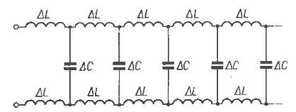

*Helical delay-line/phasing network with repeating inductor (ΔL) and capacitor (ΔC) sections.*

*9.6-1. ábra. Kéthuzalos tápvonal helyettesítő áramköre*

A nagyfrekvenciás tápvonal Z hullámellenállása bizonyos elhanyagolásokkal, de a gyakorlat számára elegendő pontossággal számítható az alábbi összefüggésből:

`Z = √(L / C)` 

Minthogy Z (Ω-ban megadott) rezisztív érték, ezért a hullámellenállás a frekvenciától és a vezeték hosszától független.

### 9.6.1. A hullámterjedés sebessége tápvonalaknál

A fény és az elektromágneses hullámok terjedési sebessége vákuumban: c0 = 3×10^8 m/s, amely érték az összes többi anyagban kisebb. A hullámhossz:

`λ = c / f`

Mivel a frekvencia a jelterjedés során mindig állandó, a sebességváltozás hullámhosszváltozást eredményez. Tápvonalaknál a hullámhossz rövidülési tényező: 0,6-0,9.

### 9.6.2. A tápvonalak veszteségei

A tápvonalak veszteségei több tényező együttes következményei, ideális veszteség nélküli tápvonal a gyakorlatban nem létezik, így általánosságban elmondható, minél hosszának növelésével a tápvonalon elveszett teljesítmény mértéke növekszik. A tápvonal veszteségének összetevői:

- sugárzás: a frekvenciával együtt nő,

- vezetékmelegedés: a tápvonalat alkotó vezetékek ohmos ellenállása következtében a tápvonalon feszültség esik, azaz mint egy ellenállás esetében teljesítmény disszipálódik,

- dielektromos melegedés: a dielektrikumon lévő feszültséggel arányos.

### 9.6.3. Állóhullám-arány és reflektált teljesítmény

Maximális teljesítmény akkor vihető át, ha a generátor (adó végfok) impedanciáját a fogyasztó (antenna) impedanciájához illesztjük. Minthogy az antenna és az adó közé legtöbb esetben energiatovábbító vezetéket (tápvonalat) kell iktatni, ezt úgy kell méretezni, hogy a rezonancia viszonyokat, illetve illesztési viszonyokat ne zavarja meg. Valamely nagyfrekvenciás fogyasztó – antenna, műantenna stb. – illesztetlensége az őt tápláló kábelen állóhullámokat hoz létre, ezért az energiaátvitelre szolgáló tápvonalakat illeszteni kell, tehát Z hullámellenállásnak azonosnak kell lennie Ri -vel, illetve Ra-val. `Ri = Z = Ra`

Illesztett esetben az átviteli veszteségek kizárólag a réz- és dielektromos veszteségekre korlátozódnak. A tápvonalon mindig akkor keletkeznek állóhullámok, ha a visszavert hullámok vannak a tápvonalon. Ilyenkor a tápvonal bármely pontján mérhető feszültség az oda- és visszahaladó hullámok feszültségeinek vektoriális összegével egyenlő. Ez a vektoriális ábrázolás az elektromágneses hullámok terjedésének időbeli lefutásán alapszik. A haladó és a reflektált hullámok haladási sebességtől függő fázisviszonyainak megfelelően az állóhullámokra jellemző áram- és feszültségeloszlás alakul ki. Ilyenkor a tápvonal bármely pontján mérhető impedancia a feszültség és áram hányadosával lesz egyenlő. Valamely tápvonal időhullámos mivolta az állóhullám-aránnyal (angol neve: Standing Wave Ratio = SWR) jellemezhető. Ez a tápvonalon fellépő legnagyobb és legkisebb feszültség hányadosa, vagyis s mindig egyenlő vagy nagyobb mint 1:

`SWR = Umax / Umin`

Illesztés esetén a tápvonalon csak egy irányban haladó hullám van, mivel az Ra lezáró-ellenálláson nem lép fel reflexió.

Az állóhullám-arány a haladó és reflektált teljesítményekkel is kifejezhető, hiszen a teljesítmény, az áram és a feszültség között soros összefüggés van:

`SWR = (1 + √(Pr/Ph)) / (1 - √(Pr/Ph))`

Az SWR értékének és a Pr/Ph arány %-ban kifejezett összefüggését az alábbi skála illetve nomogram mutatja.

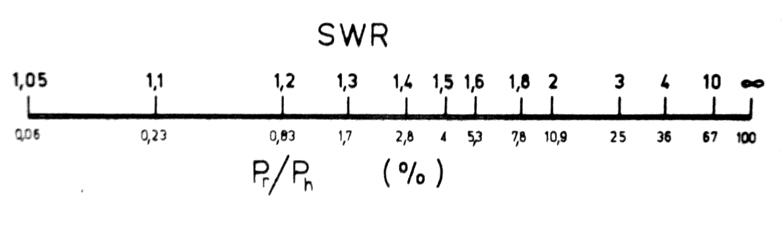

*SWR-to-reflected-power nomogram scale.*

*9.6-2. ábra. SWR skála*

Az ábráról látható, hogy az SWR = 1,5 állóhullám-arány értéknél is csak a haladó teljesítmény 4%-a reflektálódik a fogyasztóról, ez az érték nem túl rossz egy amatőr adóberendezés számára. a kritikus SWR érték az SWR = 2…3 értékeknél kezd fellépni.

### 9.6.4. Szimmetrikus tápvonal

Szimmetrikus tápvonal két egymással párhuzamos vezetékből áll. Közöttük és a vezeték körül szigetelőanyag található, amely megfelelő szigetelést és mechanikai felépítést biztosít.

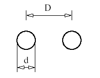

*Two parallel conductors showing diameter (d) and spacing (D), for characteristic-impedance calculations.*

*9.6-3. ábra. Szimmetrikus tápvonal elrendezés*

A szimmetrikus tápvonal hullámimpedanciája függ a vezető átmérője (d) és a két vezető távolságának (D) arányától, valamint a dielektrikum anyagától. A szimmetrikus tápvonalak főbb gyakorlatban használatos fajtái:

- légszigeteléses kéthuzalos tápvonal (amatőr berkekben: „macskalétra”): Z = 500…600 Ω

- műanyag szigetelésbe ágyazott kéthuzalos tápvonal (TV szalagkábel): Z = 240…300 Ω

- árnyékolt kettős tápvonal (hasonló felépítésű, mint a koax, csak 2 belső ér): Z = 120…240 Ω 

A szalagkábelek hátrányai: kedvezőtlen viselkedés esős, ködös időben; nem bírja a nedvességet, pl.: zúzmarát; fémes tárgyak, épületek közelében változik a hullámellenállása.

### 9.6.5. Koaxiális tápvonal

A rádiótechnikában leggyakrabban alkalmazott tápvonal típus a koaxiális kábel. Napjainkban szinte kizárólagos szerepe van a tápvonalak tervezésénél, így a rádióamatőrök is ezt alkalmazzák a tápvonalaknál.

#### 9.6.5.1. Koaxiális tápvonal felépítése

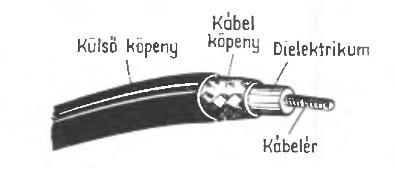

*Cutaway illustration of a coaxial cable: outer jacket, braid, dielectric, center conductor.*

*9.6-4. ábra. Koaxkábel felépítése*

A koaxiális kábelek koncentrikus felépítésűek, ezért a földhöz képest aszimmetrikusnak tekinthetők. A fenti ábra mutatja, a koaxiális kábelek belső vezetéke az ún. ér koncentrikusan van a szigetelő dielektrikumba ágyazva, ezt a külső vezeték, az ún. köpeny veszi körül, majd ezt a védőburkolat követi. A belső ér többnyire tömör rézhuzal, néha többerű sodrott vörösrézhuzal-köteg. A dielektrikum kis veszteségű nagyfrekvenciás szigetelőanyagból (pl. polietilén, polisztirol) készül. Ezen belül megkülönböztetünk tömör szigetelésű és légzárványos, habosított dielektrikummal készített kábeleket. A tömör dielektrikummal készített kábelek elsősorban alaktartóságukkal tűnnek ki, ezért elektromos tulajdonságaikat külső mechanikus behatásra csak kismértékben változatják. A tömör szigetelőréteg következtében átütési szilárdságuk nagy, az esetleges beszivárgó víz kevésbé rontja az elektromos tulajdonságait. A légzárványos dielektrikummal rendelkező kábelek csillapítása kicsi, azonban nedvesség ellen védeni kell őket, továbbá nagyobb a megengedett hajlítási sugaruk is. További hátrányuk, hogy kevésbé viselik jól a külső mechanikai behatásokat is.

#### 9.6.5.2. A koaxiális kábelek főbb típusai, jellemzői

A rádiós távközléstechnikában, így a rádióamatőr berendezéseknél is az esetek többségében 50 ohmos hullámimpedanciájú koaxiális kábeleket használnak. Az adott rendszerhez ajánlott kábel típusát az alábbi paraméterek határozzák meg:

- frekvencia,

- a tápvonal megengedett maximális csillapítása (az adott frekvencián),

- az adott frekvencián használt nagyfrekvenciás teljesítmény,

- mechanikai követelmények: hajlítási sugár, megengedett maximális átmérő stb. 

Az alábbi felsorolásban a leggyakrabban használt koaxiális kábeleket mutatjuk be:

1.     RG 213 U: 10,7 mm átmérőjű, polietilén dielektrikummal rendelkező, 0 - 300 MHz-ig alkalmazható kábel. Előnye: viszonylag olcsó, könnyen hajlítható, könnyen beszerezhető és nagy teljesítmény vihető át rajta. Hátránya: 300 MHz fölött nem ajánlott a használata, a nagy vesztesége miatt.

2.     RG 58 C/U: 5 mm átmérőjű, polietilén dielektrikummal rendelkező, 0-300 MHz-ig alkalmazható kábel. Előnye: viszonylag olcsó, nagyon könnyen hajlítható, könnyen beszerezhető, kis átmérője miatt közkedvelt kábel. Hátránya: 300 MHz fölött nagy vesztesége miatt nem ajánlott a használata. Vesztesége az RG 213 Unak több mint kétszerese!

3.     H 500: 9,8 mm átmérőjű, habosított dielektrikummal rendelkező URH kábel. Tipikusan 144 MHz feletti frekvenciákon alkalmazott kábel. Előnye: a kis csillapítása. Hátránya: merev kivitele miatt nehezen hajlítható (nagy hajlítási sugárral) és drága.

4.     H 155: 5,4 mm átmérőjű, habosított dielektrikummal rendelkező URH kábel. Tipikusan 144 MHz feletti frekvenciákon alkalmazott kábel. Előnye: a kis csillapítása és a kis átmérője, így napjainkban a leggyakrabban alkalmazott URH kábel. Hátránya: drágább, mint az RG58, de csillapítása a fele annak, vagyis az RG 213 U kábellel közel azonos csillapítás-értékkel rendelkezik.

A leggyakrabban használt koaxiális kábelek csillapításértékei (dB/100m):

```
                 Külső     Minimális     Impedancia      10       14       28       50     144     432    1296    2320
    Típus       átmérő      hajlítási
                 (mm)     sugár (mm)        (Ohm)        MHz      MHz      MHz      MHz     MHz     MHz    MHz     MHz
H 1000            10,3        100            50          1,2                        2,8      4,9    8,6   16,0    23,0
AIRCOM PLUS       10,8         55            50          0,9                                 4,5    8,2   14,5    21,5
H 500              9,8         75            50          1,3                        2,9             9,3   16,8    24,5
RG 213 U          10,3         55            50          2,2               3,1      4,4      7,9   15     27,5    47
H 155              5,4         35            50                            4,9      6,5     11,2   20     34,9    53
RG 58 CU           5,0         30            50                   6,2      8,0     11,0     17,8   33     64,5   100
```

#### 9.6.5.3. A koaxiális kábelek csatlakozói

A rádiós távközléstechnikában, az adott felhasználás módjának, típusának megfelelően különböző nagyfrekvenciás csatlakozókat alkalmaznak. A koaxiális csatlakozók jellemzői:

- impedancia (pl. 50 Ohm)

- frekvenciatartomány (pl. URH)

- csatlakoztatható kábel típusa (pl. H500) 

A rádióamatőr berendezéseknél az esetek többségében 50 ohmos hullámimpedanciájú koaxiális kábeleket használnak, így a használt csatlakozók impedanciája is 50 Ohm.

Az alábbiakban ismertetjük a leggyakrabban használt csatlakozókat és azok jellemzőit:

| Típus | Impedancia (Ohm) | Frekvencia tartomány | Jellemzői | Főbb felhasználási terület |
| :---- | :--------------- | :------------------- | :-------- | :------------------------- |
| BNC | 50 | 0 – 4 GHz | Bajonett-záras gyors csatlakoztathatóság, kis teljesítmény átvitele | Hordozható készülékek (saját antennával), mérési célokra (mérőműszereknél) |
| Amphenol UHF | - | 0 – 300 MHz | Rövidhullámon közkedvelt csatlakozó, a legtöbb kábeltípussal használható, nagy teljesítmény vihető át rajta | CB rádiózás, RH amatőr rádiózás |
| N-csatlakozó | 50 | 0 – 11 GHz | 300 MHz feletti frekvenciákon a leggyakrabban ezzel a csatlakozóval találkozhatunk. Stabil, alacsony veszteséggel rendelkező átvitelt biztosít. | 300 MHz feletti telekommunikációs rendszerek csatlakozója |
| SMA | 50 | 0 – 13 GHz | 300 MHz feletti frekvenciákon, a kisméretű csatlakozót megkövetelő rendszereknél találkozhatunk ezzel a csatlakozóval. Kis teljesítmény 
vihető át rajta. | Hordozható készülékek (saját antennával), WLAN rendszerek |


*Photo of a PL-259 (UHF-type) coaxial connector.*


*Photo of another coaxial cable connector (PL-259/UHF style).*

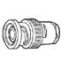

*Photo of a BNC-type coaxial connector.*

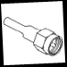

*Small inset photo of an assembled coaxial cable connector.*


*Blank/placeholder graphic.*


### 9.6.6. A táplálás módjai

A hangolt és az illesztett tápvonalon keresztüli antennatáplálási mód terjedt el. Egyes esetekben e kettő kombinációja is alkalmazható, ilyenkor vegyes táplálásról beszélünk. Az illesztett tápvonalon terjedő hullámokat haladóhullámoknak nevezzük. Hangolt tápvonalnak nevezzük az a tápvonalat, amelynek elektromos hossza az üzemi hullámhossz negyede (λ/4) vagy annak egészszámú többszöröse. Egy hangolt tápvonal, amelynek az elektromos hossza az üzemi frekvencia hullámhosszának fele (λ/2) vagy annak egész számú többszöröse, annak mindkét végén azonos áram-feszültség viszony uralkodik. Ezért az antenna talpponti impedanciája 1:1 arányban jelenik meg a tápvonal végén. Hangolt tápvonalakat elsősorban többsávos RH antennák illesztésére szoktunk használni. Az URH és deciméteres hullámtartományban kizárólag illesztett tápvonalak használatosak.

### 9.6.7. Illesztő és transzformáló egységek

Az illesztő, illetve transzformáló egységeket az antennák táplálásához csak akkor kell használni, ha a tápvonal illesztésére szükség van, hangolt tápvonalak esetén maga a tápvonal végzi a transzformálást. Elektromos és mechanikai szempontból mindig a legjobb antenna-megoldás, amely külön illesztést nem tesz szükségessé. A transzformáló egységeknek a hátrányos tulajdonságuk, hogy az antenna sávszélességét csökkentik.

#### 9.6.7.1. Deltaillesztés

Előnyösen használható a 400-600Ω hullám-ellenállású, kéthuzalos tápvonal illesztéséhez. Egyik legfontosabb mechanikai előnye, hogy a sugárzót nem kell elvágni, mint szokás az a félhullámú dipólusnál. A sugárzó középpontja fémesen rögzíthető bármilyen fémes tartószerkezethez, illetve földelhető.

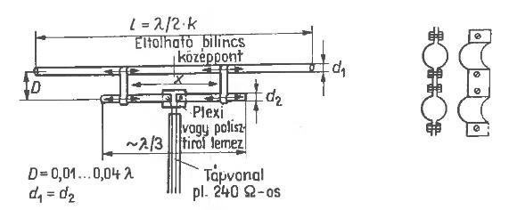

*Folded dipole antenna with adjustable clamp/tap points and connector detail.*

*9.6-5. ábra. Deltaillesztés*

#### 9.6.7.2. T-illesztés

Lényegében a delta illesztés egy mechanikusan merev változata, ezrét főleg csőből készült sugárzók esetében alkalmazhatók előnyösen. Ebből következik, hogy elsősorban az URH tartományban terjedt el.

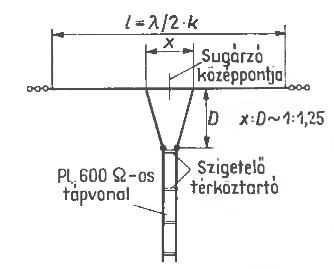

*T-shaped folded dipole antenna with insulated feed section and support point details.*

*9.6-6. ábra. T-illesztés*

#### 9.6.7.3. Gamma és Omega illesztés

A rövidhullámú tartományban akkor célszerű a gamma illesztés használata, amikor szimmetrikus sugárzót külön szimmetrizáló transzformátor nélkül akarunk koaxiális kábellel táplálni. A T-illesztéshez hasonlóan, segítségével impedancia illesztés is megvalósítható: a gamma-tag lényegében egy fél T-tag.

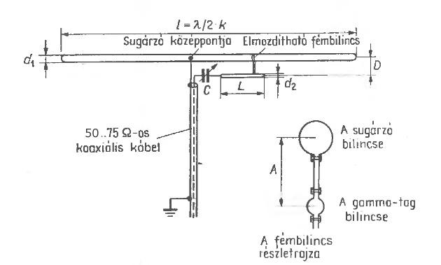

*Folded dipole antenna fed via 50-75 ohm coax at an off-center tap point, with mounting bracket.*

*9.6-7. ábra. Gamma illesztés*

Az Omega illesztés a gamma illesztés elektromosan javított változatát jelenti (kiegészítették +1 kondenzátorral), az omega illesztést elsősorban olyan RH antennákhoz használják, melynél a gamma tag bilincsének tologatása veszélyes lenne.

#### 9.6.7.4. Ballun transzformátor

Ballun transzformátort RH antennák illesztésére használnak, ahol 4:1-es impedancia transzformáció szükséges.

Ballun transzformátor segítségével illeszthetünk 200…240 Ω talpponti impedanciával rendelkező antennához 50…75 Ω-os koaxiális kábelt.

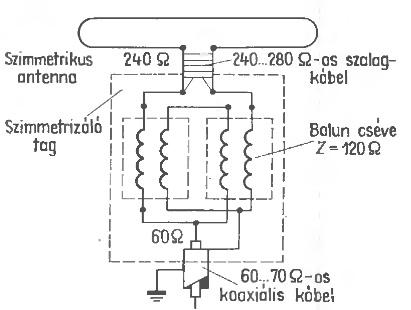

*Balun circuit converting a symmetric 240 ohm antenna feed to an asymmetric ~60-70 ohm coaxial feed.*

*9.6-8. ábra. Ballun traszformátor*

#### 9.6.7.5. Negyedhullámú kerülővezeték

Az URH tartományban már nem alkalmazható a tekercses ballun traszformátor, így a 4:1-es arányú impedancia illesztést más módszerrel, ún. negyedhullámú koaxiális kerülővezetékkel oldjuk meg. Ilyen illesztők szinte minden hurok-dipólust tartalmazó antenna (pl.: YAGI) illesztésére alkalmasak.

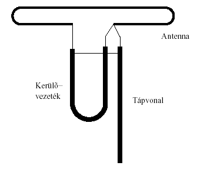

*Folded (bent) dipole antenna with a U-shaped bypass wire and vertical feedline.*

*9.6-9. ábra. Negyedhullámú kerülővezeték*

### 9.6.8. Antennahangoló egységek

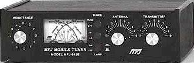

*Photo of an MFJ mobile antenna tuner/matching unit with SWR meter and tuning knobs.*

*9.6-10. ábra MFJ Mobile Tuner*

Az antennahangoló egységek biztosítják az adóvevő egység számára a fix 50 ohmos impedanciájú terhelési illesztést, amikor a használt antenna impedanciája ismeretlen vagy nem 50 Ohm. Az illesztetlenség akkor jön létre, amikor egy nem rezonancia-frekvencián működő antennát használunk (az elektromos hossza nem felel meg a jel hullámhosszával, vagy annak nevezetes törtrészeivel). Az antennahangoló egység segítségével egy antenna több frekvencián (sávon) is használható, illetve a széles sávoknál a rezonanciafrekvenciától való nagyobb eltérésnél jelentkező illesztetlenség és járulékos reflexiók (SWR) okozta veszteségeket lehet kiküszöbölni. Az antennahangoló egység kizárólag a megfelelő illesztést biztosítja, az antenna rezonancia-frekvenciáját nem befolyásolja.

#### 9.6.8.1. Antennahangoló egység felépítése

Felépítését tekintve egyszerű áramköri elemek alkotják: változtatható induktivitású tekercsekből és változtatható kapacitású kondenzátorokból áll. A tekercsek és kondenzátorok értékeinek állításával helyezhető egyensúlyba az induktív és kapacitív reaktancia az adóvevő irányában, így megvalósítva az 50 ohmos illesztést. Mivel az illesztés célja az adóvevő mentesítése a reflektált teljesítmény káros hatásától, így a megfelelő illesztés esetén (miután az antennát lehangoltuk) a reflektált teljesítmény az adóvevőig nem jut el, viszont az antennahangoló egység utáni szakaszon megmarad. Így energiaveszteséggel mindenképp számolni kell, amikor nem rezonancia-frekvenciáján működő antennát vagy nem megfelelő tápvonalat alkalmazunk. 

Klasszikus antennahangoló kialakítások: 

1. T-tagos kivitel

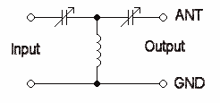

*Antenna tuner (L-network) using two variable capacitors and a coil.*

A T-tagos kialakításnál a tekercs helyzetéből adódóan egyenáramú szempontból nincs kapcsolat az antenna és az adóvevő készülék között. 

2. Pi-tagos kivitel

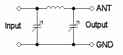

*Antenna tuner (T-network) using a coil and two variable capacitors.*

A Pi-tagos kialakításnál a tekercs helyzetéből adódóan egyenáramú szempontból kapcsolat van az antenna és az adóvevő készülék között.

#### 9.6.8.2. Antennahangoló egység használatával megoldható problémák

1. *Szimmetrikus, szabad-vezetékes tápvonal használata:* a szimmetrikus, szabad-vezetékes tápvonal előnye a roppant kismértékű csillapítás a RH frekvenciákon (sokkal kisebb, mint a koaxiális kábelek esetében). Egyetlen probléma a használatukkal az, hogy szimmetrikus táplálást igényelnek, míg az adóvevők többsége aszimmetrikus kimenettel rendelkezik. Ebben az esetben olyan antennahangoló egységet kell alkalmazni, amely tartalmaz egy beépített ballun-transzformátort, amely az aszimmetrikus kimenetet illeszti a szimmetrikus tápvonalhoz. A beépített ballun-nal rendelkező antennahangolók 4:1-es transzformációt végeznek. 

2. *Antenna más sávon történő használata esetén:* miért ne lehetne használni a 40m-re készült dipólt 10m-en? Lehet, csak nagy SWR értékkel kell számolni. Erre is megoldást nyújt az antennahangoló, amely képes az adóvevő oldalon 1:1-es SWR-t produkálni ebben az esetben. 

3. *Az antenna SWR sávszélessége kisebb, mint az adott sáv szélessége:* vannak olyan többsávos antennák, amelyek bizonyos sávokon nem képesek a teljes sávban 1:1-es SWR értéket produkálni, a sávok végein már problémát okozhat a reflektált teljesítmény. Antennahangoló használata nélkül ilyenkor teljesítményveszteség lépne fel, amely részben a rádiót is veszélyeztethetné, részben kevesebb teljesítményű sugárzást is jelentene. Ilyenkor is ajánlott az antennahangoló használata.

#### 9.6.8.3. Antennahangoló egységgel nem megoldható problémák

4. *Interferencia megszüntetése a TV, telefon és egyéb szolgáltatásokkal:* antennahangoló használata ugyan csökkentheti a rádióból kijutó felharmonikusokat, de nem szüntetheti meg azokat teljesen. Amennyiben az antenna telepítése vagy a tápvonal nem megfelelően lett kialakítva, akkor keletkezhet interferencia más rádiós rendszerekkel, ilyenkor célszerű az interferencia okát megszüntetni (a rádiót kimeneti aluláteresztő szűrővel ellátni stb.) 

5. *Nem hangolható le az antenna 1,5:1 SWR alá:* amennyiben nem hangolható le az antenna 1:1 SWR-re, akkor célszerű a tápvonalon vagy az antennán módosítani, amennyiben ez csak egy adott frekvencián (sávon) jelentkezik, és más sávon nem alkalmazzuk az antennát. Azonban, ha az adott antennát mi más sávon is alkalmazzuk, ahol viszont 1:1 SWR elérhető, akkor a 2:1 SWR érték alatti állapot (1,5:1 SWR is) még használható, csak némi teljesítményveszteségre és a rádióba való reflektált teljesítmény visszajutására kell számítanunk (következmény: a rádió visszaszabályozhat, vagy jobban melegedhet a végfokozata). 

6. *Antennahangoló használata a V/U/SHF frekvenciákon:* léteznek URH sávokon alkalmazható antennahangoló egységek, de célszerű azokat mellőzni (áruk jelentősen magasabb, mint az RH egységek esetében). Amennyiben az URH sávokban jelentkezik illesztetlenség, akkor azt célszerű a tápvonal vagy az antenna megfelelő átalakításával illetve beállításával megszüntetni.

#### 9.6.8.4. Antennahangoló gyakorlati felépítése

Antennahangoló egység a kereskedelemből beszerezhető, de a vállalkozó kedvű amatőr építhet magának egyet. Rajzok fellelhetők mind az Interneten, mind a rádióamatőr folyóiratokban is, viszont az építéshez nem árt a megfelelő szakértelem és műszerezettség. A gyakorlatban az antennaillesztők az alábbiakat tartalmazhatják:

- *Beépített SWR mérő:* amennyiben az antennaillesztő tartalmaz beépített SWR mérőt, akkor nem kell külső mérőt alkalmazni (a rádió és az illesztő között). Azonban, ha az adóvevőnk tartalmaz SWR mérőt is, akkor természetesen azt is használhatjuk. SWR mérő nélkül viszont az antennaillesztés nem megvalósítható, mivel a hangoláshoz folyamatosan figyelni kell a műszer állását!

- *Tekercsállás visszajelző és beszúrási pontok:* a drágább antennahangoló egységek változatható tekercseinél szoktak alkalmazni egy visszajelzőt, amely tájékoztat minket a tekercs aktuális állásáról, így tudjuk, hogy „meddig kell még tekerni”. A beszúrási pontok, pedig előre megadott menetszámra léptetnek, így gyorsabban végezhető el a tekercs beállítása. Amennyiben ezek hiányoznak, akkor is elvégezhető a hangolás, de egy kicsit nehézkesebben.

- *Beépített ballun:* a megoldható problémák pontban már részleteztük előnyét...

- *Több antennacsatlakozó és műterhelés:* vannak olyan antennahangoló egységek, amelyeken több antennacsatlakozó van. Az ilyen egységek előnye az, hogy több antennát is csatlakoztathatunk hozzá és közöttük egy kapcsolóval tudunk váltani, így lerövidítve az antennaváltás idejét. A beépített műterhelés előnyt jelent, de nem követelmény.

- *Automatikus hangolás:* vannak olyan antennahangolók, amelyek az adóvevő készülékekbe kerültek beépítésre. Ezek között vannak olyanok, amelyeknél az antenna hangolása automatikusan „gombnyomásra” elvégezhető, ilyenkor egy automatika tekergeti a kondenzátorokat és tekercseket, próbálja lehangolni velük az antennát. Amennyiben ez sikerül, akkor ezzel csökkenthető a hangolási idő (esetek többségében pár másodperc alatt kész a hangolás). Az automata hangolóknak vannak olyan változatai, amelyek nem az adóvevőbe vannak beépítve, azokhoz csak egy vezérlővezetéken keresztül csatlakoznak. Az automata hangolóknak vannak olyan változatai is, amelyek memóriát is tartalmaznak: letárolható pár hangolási állás, így lecsökkenthető velük a hangolási idő és felgyorsítható a sávváltás.
