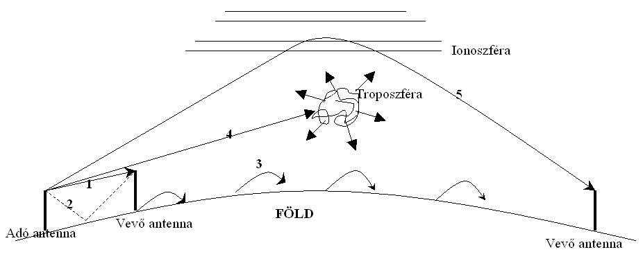
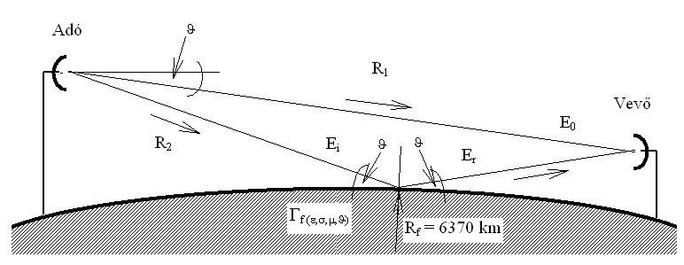
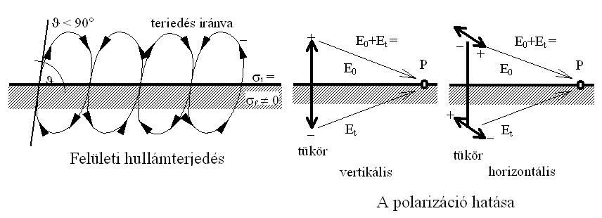
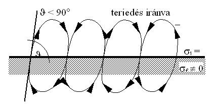
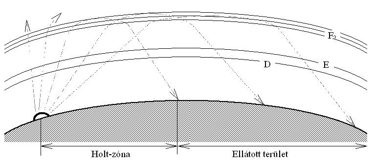
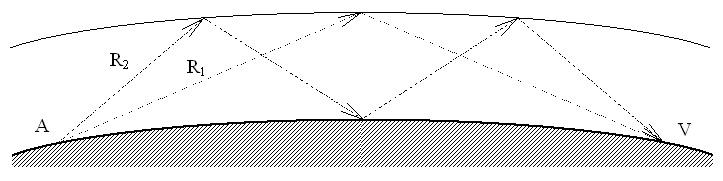

# 10. Hullámterjedés

Czigány Róbert HG5PK

## 10.1. Hullámterjedési módok

*Ground-wave (surface wave) propagation between transmitting and receiving antennas over the Earth's surface.*

*10.1-1. ábra. Hullámterjedési módok*

### 10.1.1. Közvetlen hullámterjedés (LOS)

Az URH és mikrohullámú tartományban domináns terjedési forma. A rádióhullámok közvetlenül a két antenna között terjedve biztosítják az összeköttetést. A hullámterjedés legegyszerűbb esete. A hullámterjedés határa a rádióhorizont amelyet a földsugár és az antenna magassága határoz meg. A Földsugár egy állandó érték, míg az antennamagasság változtatható. Minél magasabban van az antennám annál nagyobb lesz a rádióhorizontom átmérője. Nagyobb távolság esetén ez a terjedési mód csak kivételes esetekben valósul meg, mint például műholdas összeköttetések létesítése során. A rádióhorizont az antenna magasságából és a Föld sugárból számolható. A rádióhullámok URH frekvenciatartományban a levegőrétegek különböző törésmutatói miatt görbülnek emiatt 4/3 R_Föld-del számolunk. URH frekvenciatartományban a teljesítménysűrűség a távolság négyzetével, a térerősség a távolsággal fordított arányban csökken. A kisugárzott teljesítmény mind nagyobb gömbfelületre szóródik szét, és a rádiócsatorna csillapítása a szabadtéri csillapítás lesz (R 1 jelút). Kivételt képeznek a nagyobb frekvenciájú mikrohullámok, melyeknél a légkör abszorpciós vonalai, az eső és a köd jelentős csillapítást okozhatnak. Élesen irányított antennák alkalmazásával, inhomogenitásoktól mentes térrészben.

*Line-of-sight and diffraction-affected radio paths over the curved Earth (Earth radius Re = 6370 km).*

*10.1-2. ábra. Közvetlen hullámterjedés és a talajreflexió*

### 10.1.2. Talajreflexió 

A talajreflexió az URH frekvenciatartományban domináns terjedési forma. Ha nem tekintünk el a föld felületéről való visszaverődés hatásától és az antennákat a föld felszínétől eléggé eltávolítjuk belátható, hogy az adótól a vevőhöz a közvetlen rádió hullámon kívül eljut a föld felszínén való visszaverődés következtében a közvetett (indirekt) hullám is (R2 jelút). A vevőantenna helyén az eredő térerősség függ a direkt és az indirekt hullám relatív amplitúdójától és fázisától. A visszaverődés során bekövetkező amplitúdó- és fázisugrás függ a talaj paramétereitől, a polarizációtól és a beesési szögtől.

### 10.1.3. Felületi hullámterjedés 

A felületi hullámterjedés jellemző terjedési forma a hosszúhullámú frekvenciatartományban. Ideális esetben a talaj vezetőképessége végtelen (ekvipotenciális felület). Ez az antenna közvetlen közelében jó földhálózattal megközelíthető. Ha az adóantenna közvetlen közelétől eltekintve véges vezetőképességűnek tekintjük a talajt, akkor a terjedés veszteséges lesz és az antennától távolabb kisebb térerősséget kapunk. A térerő hatására nemcsak eltolási, hanem a talajban vezetési áram is létrejön, mely áramok zárt hurkot alkotnak. Jó vezetőképességű talaj, vagy hosszabb hullám esetén az eltolási áram elhanyagolható a vezetési áram mellett. A vezetési áramnak köszönhetően jön létre az a hullámterjedési mód, mikor az adótól a vevőig a hullám az egész utat a földfelszín mentén teszi meg. A terjedési csillapítás közép- és hosszúhullámú frekvenciatartományban nem túl nagy.

*Surface-wave propagation and the effect of vertical vs horizontal polarization near the ground.*

*10.1-3. ábra. Felületi hullámterjedés és a polarizáció hatása*

Függőleges antenna esetén a földben pozitív tükörkép keletkezik, ami azonos antennaáram esetén kétszeres térerősséget létesít. Vízszintes antenna alkalmazása esetén negatív tükörkép keletkezik, ami a föld felszínén a térerősséget kioltja. Ezért ez a terjedési mód csak függőleges polarizációs alkalmazásával valósítható meg.

### 10.1.4. Troposzférikus hullámterjedés 

A troposzférikus szórásra alapozott összeköttetések megvalósításának alapját azok a légköri képződmények biztosítják, melyek az adóantenna által kisugárzott rádióhullámot szétszórják a tér valamennyi irányába. A szórt energia egy töredékét a vevőantenna képes venni, ha az adó- és vevőantenna nyalábja közös szórótérfogaton lapolódik át A közös szórótérfogatnak felhőalap alatt kell létrejönnie. A szóródás a törésmutató index véletlenszerű változásából, fluktuációjából, a légkör turbulenciájából adódik. Mivel a szóródás nem egy pontban megy végbe, hanem egy kiterjedt térrészben, ezért igen élesen irányított antennák alkalmazására van szükség. A fentiekből következik, hogy igen nagy a terjedési csillapítás, emiatt nagy teljesítményű adóberendezés szükséges illetve ilyen összeköttetések létesítésére csak 200 MHz feletti frekvenciák alkalmasak. Nem jellemző rádióamatőr alkalmazása.

### 10.1.5. Ionoszférikus hullámterjedés 

A magaslégkör ionizált rétegei lehetőséget adnak látóhatáron túli összeköttetés létesítésére. Az ionoszféra a légkör 40-500 km-es rétege, melyben a gázok egy része ionizált állapotban van. Az ionizáció fő forrása a meteortevékenység, a Nap ibolyántúli és korpuszkuláris sugárzása, valamint a kozmikus sugárzás.

#### 10.1.5.1. Az ionoszférikus hullámterjedés mechanizmusa

Az ionoszférába behatoló rádióhullámok kölcsönhatásba lépnek a szabad elektronokkal, melyek rendezett mozgásba kezdenek. Az elektron rugómozgása (a rétegben keltett áram) és a térfeszültség 90 fok fáziseltérést mutat, tehát a réteg szigetelőként viselkedik. Elegendően nagy hullámhossz esetén egy félperiódus alatt a töltéshordozók ütközéseinek száma jelentős lesz, az elektronok a tértől kapott energiájukat elvesztik. Ezáltal mozgásuk fázisba jut a térfeszültséggel és vezetéses áram létesül. Hosszúhullámok esetén erősen ionizált rétegben a behatoló hullám már kisebb távolság megtétele után elgyengül, de ha a behatolás mélysége a hullámhosszhoz képest kicsi, visszaverődés jön létre. Rövidebb hullámoknál a félperióduson belüli ütközések száma és a réteg vezetőképessége elhanyagolhatóan kicsi. Összességében növekvő frekvenciákkal egyre magasabb rétegről kapunk visszatérő rádióhullámot és a magasság növelésével egyre kisebb a visszaverődés vesztesége. Az ionoszféra állapota sztochasztikusan változik. Ezért a hosszú távú előrejelzések meglévő statisztikák alapján, a rövid távú előrejelzések szondázással, az ionoszféra mérés eredményeinek feldolgozásával készülnek.

#### 10.1.5.2. Az ionoszféra rétegei

D réteg: a legkevésbé ionizált réteg, melynek ionkoncentrációját a nitrogénoxid fotó-ionizációja, valamint a meteortevékenység biztosítja. Naponta 10^10 db meteor hatol be a földi atmoszférába, melyek 80-120 km magasságban átlag 25 km hosszú ionizált csíkot húznak. Ezek a csíkok a diffúzió és az erős turbulens széláramlatok hatására gyorsan kiszélesednek. Rajta történő áthaladáskor a rádióhullám jelentős csillapítást szenved, ezért nappal gyakorlatilag megakadályozza a középhullámú távolsági vételt. A hosszúhullámok reflektálása és az ionszférikus szórásra alapozott összeköttetés megvalósítása végett nagy jelentőségű. E réteg: magassága 100-110 km. Stabil réteg, melynek magassága független az északi szélességtől, napszaktól, évszaktól. A felső frekvenciahatár, amelyet még reflektál hajnaltól kevéssel délutánig nő, majd estére újra visszacsökken. F réteg: a rövidhullámú nagy távolságú összeköttetések szempontjából alapvető jelentőségű. Magassága kb. 250 km. Nappal, évszaktól és földrajzi szélességtől független, kb. 200 km magasságú F1 rétegre, illetve a fentiektől erősen függő 220-400 km magasságú F2 rétegre bomlik. Éjszaka, az F1 réteg és a F2 réteg egybeolvad és az alja felemelkedik 300 km magasra.

### 10.1.6. Rövidhullámú terjedési formák

#### 10.1.6.1. Felületi hullámterjedés

*Ground-wave propagation over a lossy surface at a low elevation angle.*

*10.1-4. ábra. Felületi hullámterjedés*

#### 10.1.6.2. Ionoszférikus hullámterjedés

*Skywave (ionospheric) propagation showing the skip zone and served coverage area.*

*10.1-5. ábra. Rövidhullámok terjedésénél lehetséges hullámpályák (ionoszférikus hullámterjedés)*

Az antenna kisugárzási szögétől függ az áthidalt távolság a fenti ábra szerint. Holt-zóna: Itt nem vehető a kisugárzott frekvencia.

*Multi-hop skywave propagation between two distant stations via ionospheric reflection.*

*10.1-6. ábra. Két pont lehetséges összeköttetése egy vagy több ugrással (ionoszférikus hullámterjedés)*

## 10.2. A fading

A térerősség rövididejű megváltozása. Akkor számolunk vele, ha a közepes térerősség a felére csökken.

### 10.2.1. Ionoszférás terjedési módokra jellemző fading hatások RH tartományban

#### 10.2.1.1. Szelektív fading

Ionoszférás terjedési mód esetén az ionoszféra változása miatt

#### 10.2.1.2. Polarizációs fading

Az ionoszféráról visszaverődő jel forgásszerűen változtatja polarizációját.

#### 10.2.1.3. Abszorciós fading

A D és F rétegről visszaverődés esetén a napsugárzás hatására mind a rétegek vastagsága és sűrűsége is nő vagy csökken így a réteg elnyelő (csillapító) hatása is változik. Ez alapján a visszavert jel is erősödik illetve csökken.

#### 10.2.1.4. Ugrási fading

A visszaverő réteg magasságának változása miatt a visszavert hullám szöge is változik, ami a vétel helyén a térerő erősödését illetve csökkenését eredményezi.

### 10.2.2. Közvetlen hullámterjedési módokra jellemző fading hatások URH, VHF tartományban

#### 10.2.2.1. Interferencia fading

Ugyanaz a jel más és más úton juthat el a vevőantennába (közvetlen hullámterjedés és talajreflexió visszavert hullám) így a két jel által megtett út különböző, amelyek az antennára érkezve erősítik vagy gyengítik egymást.

#### 10.2.2.2. Abszorciós fading

A két antenna közötti légtér szennyeződéseket (por, szmog, füst) valamint csapadékot tartalmaz (pára, köd, eső, hó) ami az URH és VHF frekvenciákat csillapítja mivel ezen molekulák geometriai mérete már összemérhető a hullámhosszal. Minél nagyobb a frekvencia annál nagyobb a légkör csillapító hatása. Az összeköttetések tervezésekor tervezni kell az antenna magasságot, az antenna kilövési szögét, a frekvenciát. Az RH összeköttetések tervezéséhez az ionoszféra állapotát, az év és napszakot, az időjárási viszonyokat, a napfoltaktivitásokat, a meteor tevékenységeket kell figyelembe venni. Az ionoszféra állapotát folyamatosan mérőállomásokról figyelik valamint egy előrejelzést készítenek 11 éves periódusra ami a napfolttevékenység intenzitásán alapul.
