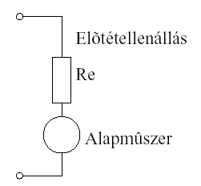
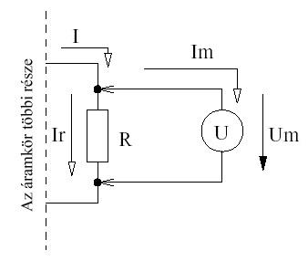
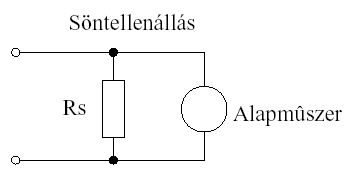
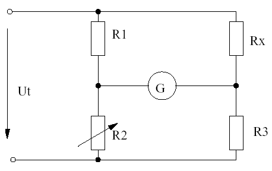
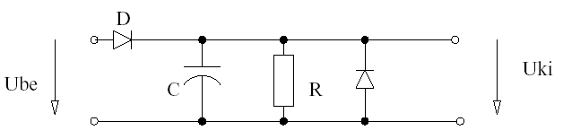
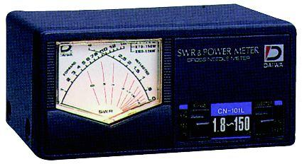
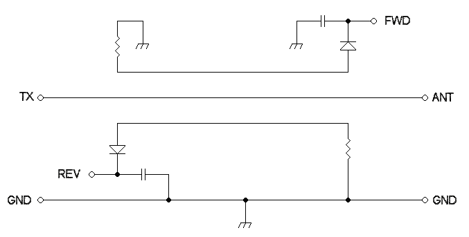
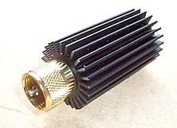

# 11. Mérések

Jónap Gergő HG5OJG, Kovács Levente HA5OGL 

A mérés valamilyen (fizikai, kémiai, gazdasági stb.) folyamatot jellemző mennyiség meghatározása. Számunkra most a fizikai fogalmakhoz, ezen belül pedig az elektromossághoz kapcsolódó mennyiségek meghatározása a feladat. A mérés információk gyűjtése, amelynek célja lehet a mennyiség azonnali megjelenítése, feldolgozása, tárolása. A megjelenítés történhet diszkrét számértékek formájában, ez a digitális kijelzés, vagy más, folytonosan változó fizikai mennyiséggé alakítva. Az utóbbi esetben ún. analóg kijelzésről van szó. Ilyenkor általában a mért mennyiséggel arányos kitérés jellemzi a mennyiség nagyságát. A mérendő jellemzők lehetnek időben állandó értékek és lehetnek változóak. A mérési eredmények: A mérés során közvetlen vagy közvetett összehasonlítás történik. A mért értéket a mennyiség egységével hasonlítjuk össze. A méréssel azt állapítjuk meg, hogy a mért érték hányszorosa a mennyiség egységének. Ezt mennyiségegyenlet formájában adjuk meg: 

Mennyiség = Mérőszám * Mértékegység 

A fenti egyenletre, p1.: `U = 13,8 V`. 
Ahol az egyenlet bal oldalán a mennyiség szerepel (U), jobb oldalon 13,8 a mérőszám, amely negatív előjelű is lehet, majd a mértékegység (V).

## 11.1. Mérési módszerek 

Biztosak lehetünk-e abban, hogy az általunk mért érték a fizikai mennyiség valódi értéke? Erre a kérdésre a választ a mérés módszere és a mérőműszereink adják. A mérési módszer kiválasztását a mérési feladat, a követelmények és a lehetőségek határozzák meg. Pazarlást jelent, ha túl pontos, ezért drága módszereket és eszközöket választunk kisebb pontosságú követelmények teljesítéséhez. Általában a következő mérési módszereket alkalmazzák:

- Közvetlen összehasonlítás: A mérendő mennyiséget azonos mennyiséggel hasonlítják össze.

- Közvetett összehasonlítás: Ennél a módszernél az etalon nincs jelen. Etalonra csak a hitelesítésnél, azaz a skála elkészítésénél van szükség.

- Differenciamérés: itt különbségmennyiséget mérünk, ahol a mérés hibáját az etalon határozza meg.

- A helyettesítés elve: Ennél a módszernél két mérést végzünk egymás után, ahol a mérés hibája nem a műszertől, hanem az etalontól függ.

- Felcseréléses mérés: Ellenálláshíd használatával mérünk, ahol szintén kiküszöbölhető a mérőeszköz hibája.

## 11.2. Mérési hibák 

A méréssel meghatározott érték legtöbbször nem egyezik meg a mennyiség tényleges értékével. A különböző műszerek az azonos mennyiségeket eltérően mutatják. Nincs olyan műszer, amelyik abszolút pontosan mér, ezért mindig az adott feladatnak megfelelően kell a mérőműszert kiválasztani. A műszerek pontosságának a növelése (hibájának csökkentése) növeli a költségeket.

### 11.2.1. Rendszeres hiba 

Olyan jellegű eltérés, amelyeknek nagyságát és előjelét fizikai méréstechnikai alapokon meg tudjuk határozni. Mivel nagysága ismert, ezért a mérési eredményt korrigálni tudjuk és korrigálni is kell.

### 11.2.2. Véletlen hiba 

A hibát okozó tényezők időben változó hatást mutatnak. Az így keletkező véletlen hiba konkrét okait nem ismerjük, nagysága és előjele is változik. A véletlen hibát a mérés többszöri elvégzésével és az eredmények statikus módszereken alapuló kiértékelésével csökkenthetjük.

## 11.3. Mérésekhez alkalmazott mérőműszerek 

### 11.3.1. Mérőműszerek típusai 

A méréshez felhasznált műszerek kijelzésük módja szerint lehetnek:

- analóg műszerek,

- digitális műszerek. 

Az analóg műszer a mérési eredményt a mutatónak egy skála előtti elmozdulásával jelzi ki. A mérést végző személynek kell megállapítania (leolvasnia), hogy a mutató a skála melyik osztásával egy vonalban állt meg (illetve, ha két skálaosztás között állt meg, megbecsülnie, hogy a két skálaosztás között hol áll). Hátránya e műszertípusnak, hogy leolvasása hibalehetőséget rejt magában, e hiba azonban gyakorlott mérést végző személy esetében csekély. A digitális műszerek a mérési eredményt számjegyekkel jelzik ki (digit = számjegy). Ahány „digites” a műszer, annyi számjegyet jelez ki. A számjegyes kijelzésnek köszönhetően leolvasási hiba nem lép fel. Amennyiben a mért jel bizonyos szintek között ingadozik, nehézséget okozhat a minimális és maximális értékek leolvasása, továbbá az aktuális értékek pontos feljegyzése, ezért vannak olyan digitális műszerek, amelyeken megtalálható a pillanatnyi érték tartása (HOLD) és a maximális (PEAK) értékek leolvasására szolgáló gombok illetve funkciók.

### 11.3.2. Több méréshatárú műszerek

#### 11.3.2.1. Több méréshatárú analóg műszerek

- az analóg árammérő méréshatárait az alkalmazott sönt-ellenállások értékei határozzák meg (gyakori méréshatárok: 1mA; 3mA; 10mA; 30mA; 0,1mA; 0,3mA; 1A; 3A; 10A)

- az analóg feszültségmérő méréshatárait az alkalmazott előtét-ellenállások értékei határozzák meg (gyakori méréshatárok: 0,2V; 1V; 3V; 10V; 30V; 100V; 300V; 1000V)

- az analóg ellenállásmérő esetében a méréshatárokat a kiválasztott referencia ellenállás értéke határozza meg (gyakori méréshatárok: 10ohm, 100 ohm, 1kohm, 10kohm, 100kohm, 1Mohm). 

Analóg műszerekkel történő mérés esetében, amennyiben a mérendő jel nagyságát nem ismerjük (nem tudjuk megbecsülni), akkor a legnagyobb méréshatárba állítva kell az első mérést elvégezni. Amennyiben a mért mennyiség nem a skála utolsó 1/3-ba esik, akkor a méréshatárt módosítsuk úgy, hogy ez az állapot teljesüljön. Amennyiben ez nem lehetséges, akkor próbáljunk olyan méréshatárt választani, ahol a mutató a második 2/3-ba esik. Analóg több méréshatárral rendelkező műszerre jó példa a GANZUNIV3 műszer.

#### 11.3.2.2. Digitális műszerek (multiméterek)

A digitális multiméter több méréshatárú feszültségmérőt, árammérőt és ellenállásmérőt tartalmaz (sőt, sok esetben más mennyiségek pl. frekvencia, tranzisztorok áramerősítési tényezője, hőmérséklet stb. mérésére is alkalmas). A digitális multiméter is tartalmaz egy „mérőművet”, amely azonban az analóg műszertől eltérően nem mechanikus, hanem elektronikus berendezés. A digitális „mérőmű” feszültséget mér, és az eredményt digitális kijelzőn jeleníti meg. Az elektronikát úgy készítik, hogy bemenő ellenállása igen nagy legyen, azaz a mérendő áramkört minél kisebb mértékben terhelje. A működtetéshez szükséges energiát minden esetben külön feszültségforrás (telep vagy hálózati tápegység) szolgáltatja.
Digitális műszerek méréshatárai és a mérés menete: A multiméterek méréshatárait a mérendő jel nagyságának megfelelően kell használni. Amennyiben a mérés során a a beállított méréshatárnál kisebb méréshatárba is belefér a mért mennyiség, akkor a kisebb méréshatárt kell használni a megfelelő pontosságú leolvashatóság miatt (illetve mindig a legkisebb méréshatárt kell választani, amibe még a mérendő jel értéke belefér).

Pl.: 2V-ot akarunk mérni, akkor a választható: 0,2V; 3V; 10V; 300V; 750V méréshatárok közül a 3V-os méréshatár használata a megfelelő. A digitális multiméterek rendelkeznek védelemmel így, ha alacsonyabb méréshatárral próbálkozunk, akkor a műszer jelzi, hogy a tartományt túllépte a jel, de nem megy tönkre a készülék. 

Automatikus méréshatárváltás: Digitális multiméterek szokásos szolgáltatása az automatikus méréshatárváltás. Az automatikus méréshatárváltásnál pl. a feszültségmérő műszer a mérés kezdetén a legérzékenyebb állásban várja a bemenetére kapcsolt feszültséget. Ha a feszültség nagyobb, mint a legkisebb méréshatár (ez nem probléma, hiszen az elektronikus védelem miatt a mérőműnek nem árt a túlfeszültség), az automatika észleli a mérőmű túlfeszültségre vonatkozó jelzését, és elektronikusan átkapcsol a következő méréshatárba. Ha a mérendő feszültség még így is túl nagy, a mérőmű túlfeszültség jelzése fennmarad, és az elektronika még nagyobb méréshatárba kapcsol, egészen addig, ameddig a túlfeszültség jelzés meg nem szűnik. Ekkor viszont már a megfelelő méréshatárban van a műszer. Mivel a leírt folyamathoz a műszernek több mérést kell elvégezni, az automatikus méréshatárváltás néhány másodpercet igénybe vehet.

## 11.4. Mérések végzése 

### 11.4.1. Egyen és váltakozó feszültség és áram mérése 

Áram és feszültség mérése nagyon gyakori az amatőr gyakorlatban. Sokszor kell egyen - illetve váltakozófeszültséget mérnünk. Váltakozófeszültséget úgy is mérhetünk, hogy egyenirányítjuk, szűrjük, majd DC műszerrel mérjük. Természetesen más eredményt kapunk, mint ami a tényleges érték, ezért a váltakozó áram és feszültség mérésére alkalmazott műszerskálákat máshogyan kell beskálázni, azonban vannak olyan mechanikus műszerek is, melyek képesek valódi középérték mérésére, tehát alkalmasak egyen, és váltakozófeszültség mérésére is. A továbbiakban egyenáram és egyenfeszültség mérésével foglalkozunk. Az elvek ugyanazok váltakozó áramú hálózatokban is.

#### 11.4.1.1. Feszültség mérés

Ahogy megismertük az alapoknál, feszültség mindig esik, azaz 2 pont között van értelmezve. A mérendő áramkört a műszerünk leterheli, ezért arra törekszenek a műszergyártók, hogy a műszer belső ellenállása a lehető legnagyobb legyen. Az ideális feszültségmérő az áramkör szempontjából szakadásként viselkedik, tehát belső ellenállása végtelen. Természetesen nincs végtelen ellenállású műszer, tehát valamennyi áram a műszeren is folyik, ami hibát okoz a mérés során. Egy digitális multiméter belső ellenállása néhányszor 10MOhm. Ilyen nagy értékek mellett az áramkörünkben számottevő hibát nem okozunk. Persze vannak olyan extrém helyzetek, ahol ez az érték sem megfelelő. A feszültségmérő egy alapműszerből, és egy előtét-ellenállásból áll. Az alapműszer nagyon érzékeny, ezért kell az előtét-ellenállás.

*Basic ammeter/meter movement with added series resistance (Előtétellenállás).*

*11.4-1. ábra. Feszültségmérő kapcsolási rajza, valamint helyettesítő képe*

Ez a kapcsolás (11.4.1. ábra) tulajdonképpen egy feszültségosztó, melynek az alsó tagja az alapműszer. Passzív mechanikus műszereket már egyre ritkábban alkalmazunk, azonban szintmérőknél a mért értéket általában analóg*

műszer jelzi ki. Általános érvényű szabály, hogy a bármilyen mennyiség mérésére szolgáló műszert egy körben lévő mértékegységgel jelölünk.

*Voltmeter connected in a measurement setup, showing currents I, Im, Ir and resistor R.*

*11.4-2. ábra. Feszültség mérése*

A mérés menete során a mérendő pontok közé kapcsoljuk a műszert (11.4.2. ábra). Ezen a műszeren átfolyó áram okozza a mérési hibát, de a feszültség a mérési pont között megegyezik a leolvasott érékkel (természetesen vannak más fajta hibák is p1. leolvasási hiba, stb.).

#### 11.4.1.2. Áram mérése

Mint ismeretes az áram mindig folyik, tehát áramot egy pontban mérhetünk. Ehhez meg kell szakítanunk az áramkórt, és a mérőműszert sorosan kell bekötnünk. Így a mérendő áram átfolyik a műszeren. Mivel a műszer sorosan van bekötve, arra kell törekednünk, hogy minél kisebb legyen a belső ellenállása (minél jobban hasonlítson a megszakított vezetőhöz). Az ideális árammérő az áramkör szempontjából rövidzárként viselkedik, tehát belső ellenállása 0 Ω. Természetesen 0 Ω-os belső ellenállású műszer nincs, tehát mindig fog valamennyi feszültség esni a műszeren, amely hibát okoz majd. Az árammérő egy sönt-ellenállásból, valamint egy alapműszerből áll (11.4.3. ábra). Az alapműszer nagyon érzékeny, ezért a mérendő áramnak csak egy részét vezetjük át a műszeren, tehát a kapcsolás tulajdonképpen egy áramosztó kapcsolás.

*Ammeter with a shunt resistor (Söntellenállás) in parallel with the base meter movement.*

*11.4-3. ábra. Árammérő kapcsolási rajza, illetve helyettesítési képe*

### 11.4.2. Ellenállás mérése 

Ellenállást többféle módon is lehet mérni. 

1. Feszültség, valamint áram méréssel; 

2. Összehasonlító módszerrel; 

3. Hídkapcsolással.

#### 11.4.2.1. Feszültség és áram mérése

Nagyon ritkán alkalmazzuk ezt a mérést. A mérés elve, hogy mérjük az ellenálláson átfolyó áramot, és a rajta eső feszültséget. Ohm törvénye alapján (Lásd: 3.1.6. fejezet) kiszámíthatjuk az ellenállás értékét. A mérés hátránya, hogy 2 műszert kell alkalmazni. Ennél a mérési eljárásnál ügyelnünk kell arra, hogyha kis értékű ellenállást mérünk, akkor a feszültség mérőt közvetlenül az ellenállásra kell raknunk, különben az árammérő feszültségesését is belemérjük az ellenállás feszültségesésébe. Nagy ellenállás mérése esetén a feszültségmérő és a mérendő ellenállás ellenállása összemérhető, tehát egy nagyságrendű áram folyik rajtuk, így az árammérő nem csak az ellenálláson átfolyt áramot méri, hanem a feszültségmérőn átfolyó számottevő áramot is. Tehát ha nagy értékű ellenállást mérünk, akkor célszerű az árammérőt közvetlenül sorba kapcsolni az ellenállással, és a feszültségmérőt a táplálásra rakni.

#### 11.4.2.2. Összehasonlító módszer

Elég pontos, de körülményes módszer, ha dekád ellenállást alkalmazunk. A mérés úgy történik, hogy sorba kapcsolunk egy dekádellenállást valamint a mérendő ellenállást, és mérjük az ellenállásokon eső feszültséget. A dekádellenállás értékét addig változtatjuk, amíg a 2 feszültségérték azonos nem lesz. Ekkor a két ellenállás azonos, a mért értéket leolvashatjuk a dekádellenállá sról.

#### 11.4.2.3. Hídkapcsolás.

Egyszerű, és pontos eljárás. A hídkapcsolás (11.4.4. ábra) előnye, hogy a híd kiegyenlítését úgy kell elvégezni, hogy a G galvanométer 0V feszültséget mutasson, tehát a mérés nem függ a bemeneti feszültségtől. A galvanométer olyan alapműszer, ami nagyon érzékeny. Általában középállású. A híd akkor van kiegyenlítve, ha 0V esik a galvanométeren. Ez a feltétel akkor teljesül, ha R2Rx = R1R3 Általános érvényű szabály a hidaknál, hogy a szembe lévő impedanciák szorzatainak kell egyenlőnek lenniük. Rx a mérendő ellenállás, R2 egy huzalpotméter, ami skálázva van. R1, valamint R2 ismert (és pontos) ellenállások. A hidat R2-vel egyenlítjük ki, és az értéket leolvassuk.

*Wheatstone-bridge-style resistance-measurement circuit with R1, R2 (variable), R3, Rx, and galvanometer G.*

*11.4-4. ábra. Ellenállásmérő híd.*

### 11.4.3. Teljesítmény mérés

#### 11.4.3.1. Egyenáramú teljesítmény mérése

Egyenáramú teljesítményt általában közvetett módon mérünk. Ha ismert a terhelés értéke, akkor elég a feszültséget, vagy az áramerősséget mérnünk. A kapott értékekből könnyen meghatározhatjuk a teljesítmény értékét. (Lásd: 3.1.7) Ha nem ismert a terhelés, akkor le kell mérnünk a feszültséget, valamint az áramot is.

Léteznek olyan Wattmérők is, amelyek közvetlenül mérik a teljesítményt, azonban ez nem terjedt el az amatőr gyakorlatban.

#### 11.4.3.2. Rádiófrekvenciás teljesítmény mérése

Általában mindig ismert a terhelés, mivel minden eszköz a gyakorlatban 50 Ohm impedanciájú. Tehát elég lemérni a feszültséget. Ezt általában csúcs-egyenirányítóval végezzük (11.4.5. ábra). Az áramkör kimenetén DC jel jelenik meg, amit egy feszültségmérővel lehet mérni. Az R ellenállás lehet nagyobb értékű, ha a mérés során van valamilyen terhelésünk (p1. antenna). Ha nincs ilyen terhelés, akkor R = 50 Ohm-ot kell alkalmazni. Ez az ún. műterhelés. Ennek megfelelően nagy teljesítményűnek, és indukciószegény ellenállásnak kell lennie.

*Simple diode-capacitor-resistor peak/rectifier measurement circuit.*

*11.4-5. ábra. Csúcs-egyenirányító*

A pontos teljesítmény értékeket kalibrációval lehet megállapítani. Általában összehasonlításra, teljesítmény csúcs keresésére szoktuk használni ezeket az adaptereket, ekkor nem követelmény a pontos teljesítmény érték megállapítása.

### 11.4.4. Frekvenciamérés 

Egy periodikus jel frekvenciája az alábbiak szerint határozható meg:

- oszcilloszkóp segítségével: megmérjük a jel periódusidejét, abból kiszámítjuk a frekvenciáját. Ennek a módszernek a pontossága függ az oszcilloszkóp időmérési pontosságától.

- abszorpciós frekvenciamérővel meghatározzuk a jel frekvenciáját (lásd az abszorpciós frekvenciamérőnél)

- digitális frekvenciamérő (számláló) segítségével megmérjük a jel frekvenciáját: a digitális frekvenciamérő a bemenetére adott jelet erősíti, négyszögesíti, majd a digitális számláló áramkörére vezeti, ahol pontosan 1 másodpercig számlálja. Az eredményt digitális formában kijelzi, a műszertől függ, hogy Hz-ben, kHz-ben, vagy MHz-ben kapjuk a végeredményt.

### 11.4.5. Rezonanciafrekvencia mérése 

Rezonanciafrekvenciát passzív rezgőköröknél tudjuk meghatározni: ilyenek az oszcillátorok, nagyfrekvenciás erősítők, szűrők rezgőkörei, továbbá az antennák is. A mérésre használható műszer a GDO (grid dip oszcillátor). 
A GDO működési elve: a műszerben hangolható rezgőkörös oszcillátor működik, melynek rezgési amplitúdóját műszerrel mérik. A rezgőkör (méréshatáronként váltandó) tekercse dugaszolhatóan, kívülről csatlakoztatható. Ezt a tekercset a mérendő rezgőkörhöz közelítve (és így azzal induktív csatolásba hozva), forgókondenzátorral változtatják a GDO oszcillációs frekvenciáját. Amikor ez a frekvencia megegyezik a mérendő rezgőkör rezonanciafrekvenciájával, az energiát von el a GDO-tól, aminek hatására rezgési amplitúdója csökken. A feszültség minimumának megkeresése után a rezonanciafrekvencia a forgókondenzátor skálájáról olvasható le.

## 11.5. Különleges mérőműszerek

### 11.5.1. Állóhullámarány-mérő (SWR-mérő) 

Az SWR mérő a tápvonalon lévő állóhullámarány mérésére szolgál. Az SWR mérőt, az adóvevő készüléket és az antennát összekötő (esetleg adóvevőt - erősítővel összekötő vagy hangoló egységgel összekötő) tápvonalba kell becsatlakoztatni. Az SWR mérő műszerek képesek megmérni az előrehaladó (FWR) és a reflektált (REV) teljesítményt is, amelyből meghatározható az SWR értéke, továbbá a legtöbb műszerről leolvasható az előrehaladó és/vagy visszavert teljesítmény pontos, Wattban kifejezett értéke is.

*Photo of an analog SWR & power meter (1.8-150 MHz).*

*11.5-1. ábra kereszműszeres SWR mérő*

Létezik olyan SWR mérő, amelynél a mérni kívánt irány kapcsolható, de létezik olyan ún. keresztműszeres SWR mérő műszer, amelyről kapcsolgatás nélkül, azonnal leolvasható az aktuális SWR (és t eljesítmény) értéke.

#### 11.5.1.1. SWR mérő felépítése

*Directional SWR bridge circuit showing forward (FWD) and reverse (REV) diode detector paths.*

*11.5-2. ábra SWR mérő csatoló-hálózata*

Az SWR mérő lelkét a fenti ábrán látható elektronika alkotja. A teljesítményt úgy mérjük, hogy a tápvonalról csatoló-hálózattal kicsatoljuk a méréshez szükséges energiát. A csatolás úgy van kialakítva, hogy a tápvonalon ne okozzon illesztetlenséget, tehát a műszer a tápvonal impedanciáját ne módosítsa. A csatoló-hálózat működése frekvenciafüggő, így a hálózat működéséhez tartozik egy működési frekvenciatartomány, amely azt jelenti, hogy létezik olyan SWR mérő, amely pl. rövidhullámon használható (1-30 MHz) és olyan, amely pl. a 2m-es rádióamatőr frekvencia közelében (130-170 MHz).A működési elv a következő: a csatolóhálózat segítségével nyert nagyfrekvenciás jelet egyenirányítjuk, és az így kapott feszültséget megmérjük. A kívánt teljesítmény méréséhez a megfelelő csatoló-háló irányt kell kiválasztani: előremenő vagy visszatérő.

#### 11.5.1.2. Az SWR mérés végzése

1. A műszert a tápvonalra csatlakoztatjuk, az alábbi módon:

  - amennyiben csak a tápvonalon fellépő állóhullámarányra vagyunk kíváncsiak, akkor a tápvonal végére egy műterhelést kapcsolunk, nem az antennát, és a műszert a tápvonal bármely pontjára csatlakoztathatjuk.

  - amennyiben az antennán fellépő állóhullámarányra vagyunk kíváncsiak, akkor a mérést a lehető legrövidebb tápvonallal végezzük (lehetőleg 1 λ alatti hosszt alkalmazzunk), és a műszert ezen a rövid tápvonalon belül csatlakoztassuk. (Amennyiben az antenna nem a megfelelő impedanciával rendelkezik, akkor a hosszú tápvonal módosíthat az illesztetlenség értékén, így nem az antenna által okozott illesztetlenséget mérjük az SWR mérővel). 

2. Az adóvevő készüléket a mérésekhez használható legkisebb teljesítményre kapcsoljuk (SWR mérőtől függ, de általában elég 0.5-1W teljesítmény, keresztműszeres esetén esetleg a pontosabb mérés miatt: 10W).

3.   Az SWR mérőt:

  - amennyiben nem keresztműszeres, a FWR (forward) állásba kapcsoljuk. Az adókészüléken kiválasztunk egy vivőt alkalmazó üzemmódot pl.: FM vagy CW. Megnyomjuk a PTT-t vagy a billentyűt (CW esetén) és az SWR mérő potméterét addig állítjuk, míg a skálán a mutató 100%-ot nem mutat (ha azt nem éri el a potméter maximális állása mellett, akkor az adóteljesítményt növeljük, ha viszont a potméter minimális állása közelében a műszer 100%-ra ugrik, akkor csökkentsük az adóteljesítményt). Amennyiben a műszer 100%-ot mutat, akkor kapcsoljuk át REV (reverse) állásba és olvassuk le az SWR értékét.

  - amennyiben keresztműszeres, a méréshez használt teljesítménynek megfelelő állásba kapcsoljuk, de ez lehetőleg a legkisebb állás legyen (pl. 1W). Az adókészüléken kiválasztunk egy vivőt alkalmazó üzemmódot pl.: FM vagy CW. Megnyomjuk a PTT-t vagy a billentyűt (CW esetén) és a műszeren, ahol a két mutató keresztezi egymást, annak megfelelő az SWR értéke. Amennyiben a műszeren a mutatók nem értelmezhető állásban keresztezik egymást (vagy nem keresztezik) akkor használjunk más mérési teljesítményt vagy méréshatárt. 

4.   Amennyiben az SWR mérő sávválasztóval van ellátva, akkor a mérés során ügyeljünk a megfelelő sáv kiválasztására (pl. létezik olyan műszer, amely 2m-es és 70cm-es sávon használható, akkor a 2m-es méréshez a 2m-es állásba kapcsoljuk a sávválasztót). Rossz kapcsolóállás esetén az SWR értéke pontos lehet, de a teljesítmények értékei nem!

### 11.5.2. Abszorpciós frekvenciamérő 

Az abszorpciós (elnyeléses) frekvenciamérő „lelke” egy hangolható párhuzamos rezgőkör, amelynek tekercsét a mérendő jellel induktív csatolásba hozzák (pl. közelítik egy működő oszcillátor rezgőköréhez). A frekvenciamérő rezgőkörén feszültség indukálódik, amelyet egyenirányítanak és egy voltmérővel mérnek. A rezgőkört hangolva, azon akkor mérhető a legnagyobb feszültség, amikor rezonanciafrekvenciája megegyezik a mért frekvenciával. Ez a frekvencia (0,5-1% pontossággal) a forgókondenzátor skálájáról olvasható le. A méréshatárt a műszer rezgőköri tekercsének átkapcsolásával lehet váltani. A műszer érzékenysége és pontossága javítható rezgőköre és a feszültségmérő közé elektronikus erősítőt helyezve.

### 11.5.3. Műterhelés 

A nagyfrekvenciás mérések többsége, pl.: adókészülék vagy erősítő bemérése csak műterheléssel végezhető. Ezzel minimálisra csökkenthető a kisugárzott zavaró jelek nagysága. A műterhelés egy fix induktivitással rendelkező egység, amely a tápvonal lezárására vagyis az antenna helyettesítésére szolgál.

*Photo of a finned aluminium dummy-load resistor with a coaxial connector.*

*11.5-3. ábra Műterhelés*

A műterhelés felépítése a következő: a műterhelés lelke egy indukciószegény ellenállás, amely a rádióamatőr rendszereknél 50 Ohm impedanciájával rendelkezik. Az ellenállás egy hűtőfelülethez csatlakozik, amely a rajta leadott teljesítmény által keltett hőt elvezeti. Így a műterhelésekre jellemző a maximálisan ráadható teljesítmény, amit még károsodás nélkül képesek elviselni (ez függ az ellenállás minőségétől és a hűtőfelület nagyságától). Létezik például: 1W-os, 5W-os, 10W-os műterhelés, de olyan is beszerezhető ami képes rövid ideig 500W-ot elviselni.
