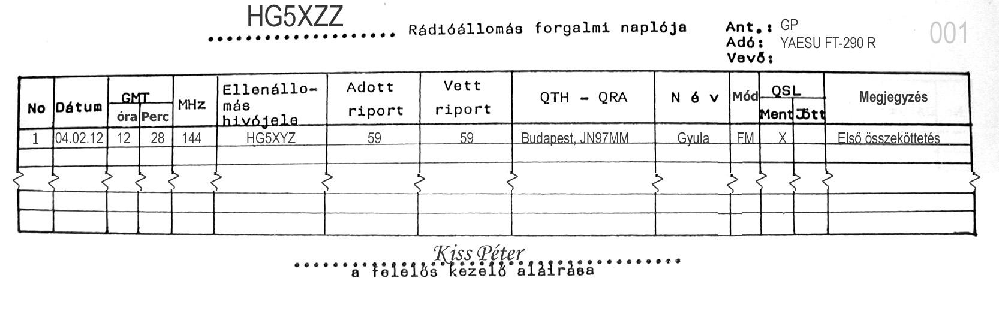
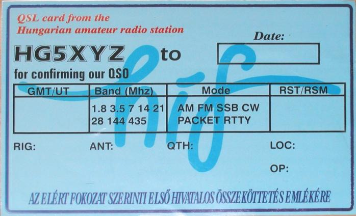
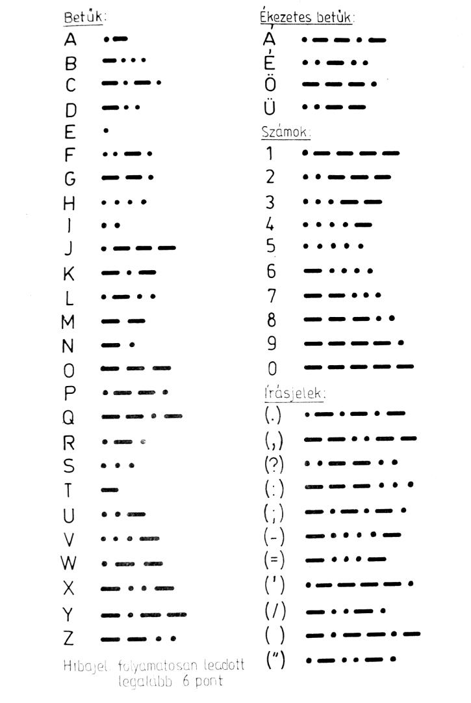

# 14. Forgalmi ismeretek

## 14.1. Forgalmazásnál használt betűk, rövidítések és szavak

### 14.1.1. Betűzési ábécé (HAREC előírás)

|ABC|ICAO      |AF     |Magyar|
|:-:| :------- | :---- | :--- |
| A | Alfa     | ei    |Aladár, Antal|
| B | Bravo    | bi    |Béla|
| C | Charlie  | szi   |Cecil|
| D | Delta    | di    |Dénes|
| E | Echo     | i     |Elemér|
| F | Foxtrot  | ef    |Ferenc|
| G | Golf     | dzsi  |Géza|
| H | Hotel    | ejcs  |Helén|
| I | India    | áj    |Ilona|
| J | Juliet   | dzsej |János|
| K | Kilo     | kej   |Károly|
| L | Lima     | el    |László|
| M | Mike     | em    |Mátyás, Mihály|
| N | November | en    |Nelli|
| O | Oscar    | ou    |Olga|
| P | Papa     | pi    |Péter|
| Q | Quebec   | kju   |Kvelle|
| R | Romeo    | ár    |Róbert|
| S | Sierra   | esz   |Sándor|
| T | Tango    | ti    |Tamás|
| U | Uniform  | ju    |Ubul|
| V | Victor   | vi    |Viktor|
| W | Whiskey  | dábju |dupla-Vilmos|
| X | X-ray    | eksz  |Ikszes|
| Y | Yankee   | váj   |ipszilon|
| Z | Zulu     | zed   |Zoltán|

### 14.1.2. Q-kódok

| Kód | Kérdésben                         | Válaszban                          |
| :-: | :-------------------------------- | :--------------------------------- |
| QRK | Milyen a jeleim olvashatósága?    | Jeleinek olvashatósága … fokozatú. |
| QRM | Idegen adó zavarja?               | Idegen adó zavar.                  |
| QRN | Légköri problémái vannak? (Zavar) | Légköri problémáim vannak. (Zavar) |
| QRO | Növeljem a teljesítményemet?      | Növelje a teljesítményét!          |
| QRP | Csökkentsem a teljesítményem?     | Csökkentse a teljesítményét!       |
| QRS | Lassabban adjak?                  | Adjon lassabban!                   |
| QRT | Szüntessem be az adást?           | Szüntesse be az adást!             |
| QRV | Vételkész?                        | Vételkész vagyok!                  |
| QRX | Várjak?                           | Várjon                             |
| QRZ | Ki hív engem?                     | Önt … hívja.                       |
| QSB | Halkulnak a jeleim?               | Jelei halkulnak (fading).          |
| QSL | Tud adni vételi nyugtázást?       | Adok önnek vételi nyugtázást.      |
| QSO | Tud forgalmazni …-val?            | Közvetlenül tudok forgalmazni …-val. |
| QSY | Váltsak másik frekvenciára?       | Váltson másik frekvenciára!        |
| QTH | Mi a telepítési helye?            | A telepítési helyem…               |
| QTC | -                                 | Közleményem van az Ön számára.     |
| QTR | Pontos idő?                       | Pontos idő …                       |
| QRG | Az állomása pontos frekvenciája?  | Az állomásom pontos frekvenciája…  |
| QRL | El van foglalva?                  | El vagyok foglalva.                |
| QSZ | Adjak minden szót kétszer?        | Adjon minden szót kétszer!         |
| QTA | -                                 | Közleményem érvénytelen.           |
| QSD | -                                 | Billentyűzése hibás!               |

### 14.1.3. Forgalmazási rövidítések (HAREC előírás)

|Kód|Jelentése|Kód|Jelentése|
|:-:|:--|:-:|:--|
| AR  | adás vége                                       | PSE | kérem                                  |
| BK  | folyamatban lévő adás megszakítása              | RST | olvashatóság,jelerősség,hangszín (RST) |
| CQ  | minden állomásnak szóló általános hívás         |  R  | vétel megtörtént (Roger)               |
| CW  | folyamatos hullám(ú)                            | RX  | vevő                                   |
| DE  | -tól; a hívott és hívó hívójelének elválasztása | TX  | adó                                    |
| K   | felszólítás adásra                              | UR  | az Ön… (birtokviszony)                 |
| MSG | Üzenet                                          | VA  | munka vége                             |

### 14.1.4. Egyéb forgalmazási rövidítések

|Kód|Jelentése|Kód|Jelentése|
|:-:|:--|:-:|:--|
| ABT    |  Körülbelül                             |   NR |   szám                                                     |
| AC     | Váltakozóáram                           |   NW |    most                                                    |
| ADR    |  Cím                                    |   OB |   öregfiú, öregem                                          |
| AER    |  Antenna                                |   OC |   kedves barátom                                           |
| AGN    |  Újra                                   |   OK |   rendben van                                              |
| AM     | Délelőtt                                |   OM |   kedves barátom                                           |
| AS     | Várni                                   |   OP |   állomáskezelő                                            |
| BCI    |  rádióvételi zavar                      |   OT |   régóta engedélyes                                        |
| BD     | Rossz                                   |   PA |   teljesítményerősítő adó végfokozata                      |
| BFO    |  lebegtető oszcillátor                  | PART |  részben                                                   |
| BU     | puffer üzem, elválasztó fokozat         |   PM |   délután                                                  |
| BUG    |  fél-automatikus távíró billentyű       |   PP |   ellenütemű végfokozat                                    |
| C      | Igen                                    |  PWR |   teljesítmény, energia                                    |
| CFM    |  Igazolom                               | QSLL |  küldjünk egymásnak QSL lapot                              |
| CL     | üzenetemet beszüntetem                  | QSLN |  ne küldjünk QSL lapot                                     |
| CLG    |  Hívó                                   | RCVR |  vevőkészülék                                              |
| CONDS  |   terjedési viszonyok                   |  RIG |   állomásfelszerelés                                       |
| CONDX  |   távolsági összeköttetés lehetőségei   | RPRT |  tudósítás                                                 |
| CONGRA-|    Szerencsekívánatok                   |  RPT |   kérem ismételje!, ismétlem TS                            |
| CRD    |  Levelezőlap                            | RTTY |  rádió-távgépíró                                           |
| CUAGN  |   Viszontlátásra                        |  SIG |   jel                                                      |
| DC     | Egyenáram                               |   SK |   adás vége                                                |
| DR     | kedves (megszólításban)                 | SKED |  megbeszélt adás, kísérleti adás                           |
| DX     | nagytávolságú összeköttetés             |  SRI |  sajnos, sajnálom                                          |
| ES     | És                                      |  SSB |   egyoldalsávos üzem                                       |
| EX     | korábban, korábbi                       |  STN |   állomás                                                  |
| FB     | remek, nagyszerű                        |  SWL |   megfigyelő                                               |
| FER    |  -nak, -nek, számára, miatt, -ért       |  SWR |   állóhullámarány                                          |
| FM     | -tól, -től                              |  TKS |   köszönöm                                                 |
| FM     | frekvenciamoduláció                     |  TNX |   köszönet                                                 |
| FONE   |  távbeszélőüzem                         | TRUB |  zavarás                                                   |
| FREQ   |  frekvencia                             |   TU |   köszönöm Önnek                                           |
| GB     | viszontlátásra                          |  UFB |   kiváló                                                   |
| GD     | jó napot!                               |  UHF |   mikrohullám                                              |
| GE     | jó estét!                               |UNLIS | nem engedélyezett állomás                                  |
| GLD    |  örülök, örülni                         |  UTC |   pontos idő (GMT helyett)                                 |
| GM     |  jó reggelt!                            |    U |    Ön, Önnek, Önt                                          |
| GN     | jó éjszakát!                            |  VFO |  folyamatosan hangolható vezéroszcillátor                  |
| GUD    | jó, sok                                 |  VHF |   URH                                                      |
| HAM    | rádióamatőr                             |   VY |   sok, nagyon                                              |
| HF     | nagyfrekvenciás                         |  WAC |   valamennyi földrész amatőreivel folytatott rádióforgalom |
| HI     | nevetni, öröm (csak távírón)            |  WID |   -val, -vel                                               |
| HPE    | Remélem                                 |  WKD |   dolgozott                                                |
| HR     | itt                                     |  WPM |   szó/perc                                                 |
| HRD    | hallott                                 |   WX |   időjárás                                                 |
| HW     | hogy hall engem?                        | XCUS |   bocsánat                                                 |
| IF     | Középfrekvencia                         | XMAS |   karácsony                                                |
| INPT   | végfokozat bemenő-teljesítménye         |  XYL |   feleség                                                  |
| KHZ    | Kilohertz                               |   YL |   kisasszony                                               |
| KW     | kilowatt                                |   55 |   sok sikert! (Csak német nyelvű forgalomban!)             |
| KY     | Távíróbillentyű                         |   73 |   üdvözlöm!, minden jót!                                   |
| LIS    | hatóságilag engedélyezett állomás       |   88 |   ölelés és csók!                                          |
| LTR    | Levél                                   |
| MEZ    | közép-európai idő                       |
| MHZ    | megahertz                               |
| MIKE   | mikrofon                                |
| MNI    | Sok                                     |
| MOD    | Moduláció                               |
| NBFM   | keskenysávú frekvenciamoduláció         |
| NITE   | Éjszaka                                 |

### 14.1.5. Egyéb, forgalmazásnál használt angol szavak

|Kód|Jelentése|Kód|Jelentése|
|:-:|:--|:-:|:--|
| ALL     | Minden               | MOST  | legtöbb, többnyire |
| BEAM    | irányított antenna   | MY    | enyém              |
| BEST    | legjobb              | NO    | nem, tagadás       |
| BY      | -tól, -től, által    | NAME  | név                |
| CALL    |  hívás               | NEAR  | közel              |
| CHEERIO | szervusz, búcsúzás   | NIL   | nulla, semmi       |
| CONTEST | verseny              | ONLY  | csak               |
| DATE    | Dátum                | SOLID | kifogástalan       |
| I       | Én                   | SUNNY | napos              |
| IN      | -ba, -be, -ban, -ben | TEST  | kisérlet           |
| IS      | Van                  | TONE  | hangszín           |
| KEY     | távíróbillentyű      | TUBE  | elektroncső        |
| LOG     | forgalmi napló       | VIA   | át, keresztül      |
| LUCK    | szerencse            |

## 14.2. Rádióamatőr összeköttetések alapvető szabályai

### 14.2.1. Rádióamatőr összeköttetések fajtái

A rádióamatőr összeköttetéseknek három típusát különböztetjük meg csatornahasználat szempontjából: szimplex, fél-duplex és duplex összeköttetések.

- Szimplex összeköttetés: mindkét állomás (a kommunikációban) ugyan azt a frekvenciát használja adásra és vételre is (egy időben csak az egyik ad).

- Fél-duplex összeköttetés: a két állomás (a kommunikációban) két frekvenciát használ adásra és vételre, de egy időben csak az egyik ad.

- Duplex összeköttetés: a két állomás (a kommunikációban) két frekvenciát használ adásra és vételre, egy időben mindkettő adhat a saját frekvenciáján. 

Az összeköttetések fajtája szerint megkülönböztetünk analóg és digitális kommunikációt. Az analóg kommunikációra a legjellemzőbb az emberi beszéd átvitele, a digitálisra pl.: RTTY, pakett stb. Különböző üzemmódokban létesíthet két rádióamatőr állomás összeköttetést egymással: FM, AM, SSB, CW stb. 
De csak azokban az üzemmódokban, amelyekre engedélye van, illetve amire az adott sávon és frekvencián lehetőség van.

### 14.2.2. Rádióamatőr összeköttetések tartalma

A rádióamatőr csak más rádióamatőr állomásokkal bonyolíthat le forgalmat. Kivétel a szükség és vészhelyzet, amikor a rádióamatőr a segítségnyújtással kapcsolatos információkat köteles harmadik fél számára továbbítani. Fontos, hogy a rádióamatőrök egymás közötti beszélgetéseit közérthető nyelven kell lefolytatni. A forgalmazás során a rádióamatőrök a rádióamatőr tevékenységükkel kapcsolatos témákat, kísérleteket és a továbbképzésüket szolgáló tárgyköröket beszélhetik meg. A rádióamatőr állomásról történő forgalmazás során nem megengedett: 

a) ipari, gazdasági, kereskedelmi jellegű adatok és tájékoztatások közlése; 

b) a nem amatőrszolgálat célját szolgáló elektronikus hírközlő hálózat igénybevételének helyettesítése; 

c) műsor sugárzása (zene stb); 

d) hamis, vagy megtévesztő jelek adása; 

e) információrejtő módszer alkalmazása; 

f) azonosítás nélküli jelek adása; 

g) moduláció nélküli vivőfrekvencia 2 percen túli sugárzása, kivéve a rádióamatőr jeladó állomás esetét;

### 14.2.3. Szimplex forgalmazás (beszéd)

Ebben az esetben olyan analóg, azaz beszédalapú forgalmazást végez két rádióamatőr állomás, ahol felváltva beszélnek (adnak) egy frekvencián. A rádióamatőr minden összeköttetés kezdetekor és befejezésekor, a forgalmazás során legalább három adásvételi periódus után, illetve a kísérletek során legalább 10 percenként, továbbá másik rádióamatőr vagy a hatóság felkérésére, köteles a hívójelét közölni. Csak akkora teljesítményt szabad használni, amekkora szükséges ahhoz, hogy az összeköttetés érthető formában fennmaradjon a két állomás között. Nem szabad túlságosan hosszú periódusokat tartani, hogy más amatőrök is lehetőséget kapjanak a frekvencia használatára. Periódusok között érdemes kis szünetet tartani. Nem szabad úgy forgalmazni, hogy más azonos frekvencián dolgozó rádióamatőröket zavarjunk adásunkkal ill. az ő adásukat értelmezhetetlenné tegyük.

Minden összeköttetés előtt célszerű meggyőződni arról, hogy használja-e más az adott frekvenciát. „Szabad-e a frekvencia?” Rádióamatőröknél alapszabály az, hogy mindig elsőbbsége van annak, aki az adott frekvenciát már használja – kivéve vészhelyzet esetén. Tehát amennyiben mondandónk ráér, akkor várjuk meg míg a forgalmazó állomások befejezik az összeköttetést. De a frekvenciát kisajátítani sem szabad, minden amatőrnek joga van azt használni.

### 14.2.4. Átjátszók használata (fél-duplex)

Ebben az esetben olyan analóg, azaz beszédalapú forgalmazást végez két rádióamatőr állomás, ahol felváltva beszélnek (adnak) egy átjátszón. Az átjátszók adási és vételi frekvenciája általában nem egyezik meg, így amikor adásra kapcsol a rádióamatőr állomás akkor a rádiója más frekvencián ad, mint amikor veszi az átjátszó jeleit. Ezt az eltért nevezik shift-nek. A shift különböző sávokon más és más lehet: 2m-en (145 MHz) általában –600 kHz-et használnak, ami azt jelenti, hogy az adási frekvencia 600 kHz-el alacsonyabban van, mint a vételi. Ez 70 cm-en (Magyarországon) 7600 kHz (esetlegesen még találhatók 1600 kHz-en működők is). Például (R0-as 2m-es átjátszó):

| Csatorna | Név | Felmenő | Lejövő  | Hívójel |      Hely (QTH)      |
| :------- | :-- | :------ | :------ | :------ | :------------------- |
| RV48     | R0  | 145,000 | 145,600 | HG5RVB  | Sváb-hegy (Budapest) |

Átjátszók használatára vonatkozhatnak helyi szabályok, de ami a legfontosabb, hogy átjátszókon nem szabad hosszú idejű összeköttetéseket lebonyolítani (egy adási periódus sem lehet hosszú, de maga a teljes összeköttetés sem). A periódusok között 1-2 másodperc szünetet kell tartani, és nem szabad „általános hívást” kezdeményezni. Pager (DTMF) hívás esetén is kötelező bemondani szóban a két állomás hívójelét. Beszédalapú (FM) átjátszón csak beszédalapú forgalmazás a megengedett (digitális pl. pakett nem).

### 14.2.5. Vételjellemzés

A rádióamatőr összeköttetésnél kötelező vételjellemzést más szóval „ripotot” adni az ellenállomásnak, minősítenünk kell a vételi jellemzőket. Az amatőr rádiózásnál távíró-üzemmódban háromjegyű számmal, az ún. RST skálával, fónia üzemmódokban (FM, SSB) az RS skálával, átjátszón történő forgalmazásban R skálával minősítjük az adás minőségét.

| R | CW                                              | SSB,FM                                                    |
| - | :---------------------------------------------- | :-------------------------------------------------------- |
| 1 | Olvashatatlan                                   | Értelmezhetetlen                                          |
| 2 | alig hallható, egyes szavak megkülönböztethetők | alig értelmezhető, szófoszlányok kivehetők                |
| 3 | nehezen olvasható                               | nehezen értelmezhető (de az információ nagyrésze érthető) |
| 4 | könnyen olvasható                               | minden szó érthető, (FM-en zajos)                         |
| 5 | kifogástalanul olvasható                        | tökéletesen értelmezhető, (FM-en zajmentes)               |

*14.2-1. ábra. R skála (olvashatóság) értékek*

Az S skála értékei, a vételi jel erősségére vonatkoznak, amelyet a vevőkészülék „S mérő”-jéről leolvashatunk. A távíró üzemmódban használt T-skála a távíró hangminőségre vonatkozik: értéke 1-9 lehet, ahol az 1: rendkívül szűretlen hangra, a 9: tiszta egyenáramú hangra utal.

## 14.3. Forgalmazás gyakorlata

### 14.3.1. Forgalmazás fónia üzemmódban 

Legelső teendőnk – nyilvánvalóan – bekapcsolni a készüléket. Miután a készüléket üzembe helyeztük, kétfél módon létesíthetünk összeköttetést:

1.   Mi adunk az adókészülékünkkel általános hívást (CQ-t) és várjuk a választ;

2.   Vevőkészülékünkkel keresünk egy általános hívást adó (CQ-zó) állomást, és válaszolunk neki.

#### 14.3.1.1. Általános hívás adása

Általános hívás előtt meg kell arról győződni, hogy szabad-e a frekvencia: „Szabad a frekvencia? Itt a HA5KDR. Vétel.” (Is this frequency in use? Here is HA5KDR. Over.) 

Általános hívás minden állomás részére: Általános hívás 2 méteren itt a HA5KDR állomás, minden hívó állomás vételén. CQ, CQ calling CQ two meters band, this is HA5KDR. HA5KDR is standing by for any call. Over. 

Általános DX hívás: Általános DX hívás 2 méteren itt a HA5KDR állomás, minden DX állomás vételén. CQ, CQ calling CQ DX on two meters band, this is HA5KDR. HA5KDR is standing by for any DX call. Over. 

Visszakérdezés: Ki hívott engem? Itt a HA5KDR. Vétel. QRZ, QRZ. This is HA5KDR. Over. QRZ, QRZ DX állomás. Itt a HA5KDR. Kérem ismételje meg a hívást. QRZ, QRZ DX station. Here is HA5KDR. Please repeat your call again. Over.

#### 14.3.1.2. Találkozás

Az első teendőnk a köszönés, ahol napszaknak megfelelően köszöntjük az ellenállomást, pl.: Jó reggelt kívánok kedves barátom. (Good morning, my friend). 
Meg kell köszönni a hívást: Köszönom a hívást. (Thanks for your call). 
Általános hívás esetén: nagyon köszönöm, hogy válaszoltál általános hívásomra. (Thank you very much for replying my CQ call.) 
Amennyiben még nem volt vele összeköttetésünk, akkor ezt is megemlíthetjük: Nagyon örülök az első összeköttetésünknek. (I am very pleased to have this our first QSO). 
Amennyiben már volt régebben összekötettetésünk vele, akkor ezt is megemlíthetjük: Nagyon örülök az ismételt találkozásnak, kedves barátom. (It is very nice to meet you again, my friend.)

#### 14.3.1.3. Riportadás

Az Ön riportja itt 5 és 9. A riportom részedre 5-ös 9-es. (Your riport here is 5 and 9. VAGY Riport is 5,9.) 
Amennyiben rákérdezünk a riportra: Milyen a riportom? Hogyan veszel engem? (What is my report, please?) 
Rossz riport esetén mondhatjuk ezt is: Sajnos nagyon gyengén veszem. (Your signals are very weak). 
Jó riport esetén mondhatjuk ezt is: Kiválóan veszem. (Your signals are very strong.)

QTH és egyéb adatok közlése A QTH-m Budapest (My QTH is Budapest) Az operátor neve Laci (Operator is Laci) 
A QTH lokátorom JN97MM (My QTH locator is JN97MM) 
Egy YAESU FT-250-es készüléket használok egy W3DZZ antennával. (I am using an FT-250 transceiver with a W3DZZ antenna.) 
25 W-tal dolgozom. (I am running about 25 Watts). 
Ma szép idő van. (The weather is fine today.) 25 fok van. (It’s 25 degrees (Celsius) VAGY The temperature is about 25 degrees (Celsius)). 
Esik az eső. (It’s raining.) stb.

#### 14.3.1.4. Búcsúzás

Ha adunk QSL lapot (illik), akkor: El fogom küldeni a QSL lapot az irodán keresztül. (I will send my QSL-card via the bureau). 
Ha nem tudunk adni: Sajnos nem tudok QSL lapot küldeni neked. (I am sorry but I can’t send my QSL card to you.) 
A búcsúzásnál MINDIG köszönjük meg az összeköttetést: Nagyon köszönöm a QSO-t (I thank you very much for this nice QSO.) 
Remélem nemsokára újra találkozunk. (I hope to meet you again soon). 
Szívélyes üdvözletemet küldöm és sok 73 DX-et kívánok neked. (Best seventy-tree and DX, my friend.) 
VAGY Sok 73 DX-el elköszönök tőled. (angul u.a.)

#### 14.3.1.5. Forgalmazásnál használt egyéb mondatok

100 %-osan értettem mindent. VAGY Minden „megjött”. (All one hundred per cent OK). Vettem. (Roger). 
Kérem ismételd meg a….. (Please repeat again your ….) → Itt riport, QTH, név (report, QTH, operator name). 
Kérem betűzd a …. (Please spell your…) → Itt QTH, név (QTH, operator name).

#### 14.3.1.6. Magyar QSO mintaszöveg

Általános hívás 2 méteren itt a HA5KDR, itt a HA5KDR állomás, minden hívóállomás vételén. 

HA5KDR, itt a HA2T hív. Vétel. 

HA2T, itt a HA5KDR. Köszönöm szépen a hívást. Szép jó estét kívánok neked kedves barátom. Riportom részedre 5-ös 9-es, itt operátor Laci, QTH-m Budapest, JN97MM. Jelenleg egy YAESU FT-290 R típusú készülékkel forgalmazok, 5 W kimenő teljesítménnyel és egy Trio-Star antennával. HA2T, itt a HA5KDR. Vétel. 

HA5KDR, itt a HA2T. Jó estét kívánok kedves Laci. Köszönöm szépen a riportot, minden tökéletesen megjött. Riportom részedre 5-ös 9-es. Operátor: Péter, a QTH-m Gerecse, JN97FQ. Én egy YAESU FT-225 RD típusú készülékkel és 10 W kimenő teljesítménnyel dolgozom, az antennám pedig egy 9 elemes YAGI Budapest irányába fordítva. Vissza a szó hozzád HA5KDR, itt a HA2T. Vétel. 

HA2T, itt a HA5KDR. Köszönöm az információkat, mindent vettem. Nagyon köszönöm neked a QSO-t, el fogom küldeni a QSL lapomat részedre az irodán keresztül. Sok jókívánsággal és 73 DX-el elköszönök, HA2T, itt a HA5KDR. Vétel.

HA5KDR, itt a HA2T. Én is köszönöm a QSO-t, QSL lapot én is küldök részedre az irodán keresztül. További jó rádiózást, és sok 73 DX-et kívánok neked Laci. HA5KDR-től a HA2T elköszön, szia Laci. (Vétel.)

### 14.3.2. Forgalmazás távíró üzemmódban

Legelső teendőnk – nyilvánvalóan – bekapcsolni a készüléket. Miután a készüléket üzembe helyeztük, kétfél módon létesíthetünk összeköttetést: 

1.   Mi adunk az adókészülékünkkel általános hívást (CQ-t) és várjuk a választ; 

2.   Vevőkészülékünkkel keresünk egy általános hívást adó (CQ-zó) állomást, és válaszolunk neki. 

Amennyiben mi adunk általános hívást, akkor a vevőn keresünk egy szabad frekvenciát, és a „QRL? DE HA5KDR” vagy a „QRX? DE HA5KDR” adásával győződünk meg arról, hogy valóban szabad-e a frekvencia. Ezt követően megkezdjük az általános hívást.

#### 14.3.2.1. Általános hívás adása

„CQ CQ CQ DE HA5KDR HA5KDR HA5KDR” Európai forgalomban a hívás időtartama kb. 30 mp-től 1 percig terjed. 
A hívás végén adjuk a PSE K üzemi rövidítést. 
Nagytávolságú összeköttetések esetén CQ DX-et adunk a CQ helyett. 
HA valamilyen világrésszel kívánunk összeköttetést teremteni, úgy a „CQ Asia” stb. hívást adunk.

#### 14.3.2.2. QSO szövege távíró üzemmódban

Az alapelvek itt is ugyanazok, mint a fónia esetében: le kell adni a riportot (RST), QTH-t és az operátor nevét. 
De CW üzemmód esetében rövidítéseket használunk. Soha ne adjunk nyílt szöveget (pl.: Please repeat your QTH) helyette alkalmazzuk a rövidített változatát (pl.: PSE RPT UR QTH vagy QTH?).

#### 14.3.2.3. CW QSO mintaszövegek

HA5OGL DE HA5KDR HA5KDR HA5KDR = GE DR OM = TNX FOR CALL = UR RST IS 599 (2-szer) = MY QTH IS BUDAPEST (2-szer) = MY NAME IS GREG (2-szer) = HW? = HA5OGL DE HA5KDR AR K Jelentése: „HA5OGL-nak HA5KDR-től. Jó estét, kedves barátom. Köszönöm a hívást. A Te adásod tökéletesen érthető, nagy hangerejű, tiszta és szép hangszínű. Az én állomáshelyem Budapest, nevem Greg. Hogy hall engem? HA5OGL-nek HA5KDR-től.” A válasz: HA5KDR DE HA5OGL = R DR Greg ES MNI TNX FER RPRT = UR RST IS 579 = MY QTH IS BUDAPEST = MY NAME IS Levente = PWR 10 WATT = ANT W3DZZ = WX COLD = NW QRU = TNX FER UFB QSO = MY QSL IS SURE I HOPE CUAGN = VY 73 ES FB DX = HA5KDR DE HA5OGL AR K Jelentése: „HA5KDR-nek HA5OGL-től. Mindent vettem kedves Greg és sok köszönet a riportért. Az adásod jól érthető, közepes hangerejű és szép hangszínezetű. Állomáshelyem Budapest, nevem Levente. Teljesítményem 10 Watt, antennám W3DZZ típusú. Az időjárás hideg. Most nincs több közleményem számodra. Köszönöm a szép QSOt. QSL lapot küldök és remélem, hogy hamarosan találkozunk! Szívélyes üdvözlet, és nagyszerű DX-eket kívánok. HA5KDR-nek a HA5OGL-től.” Válaszunk az adásra: HA5OGL DE HA5KDR = R DR Levente = MY PWR 50 WATT 7 HR QRU ALSO AND MNI TKS FER NICE QSO = MY QSL IS SURE VIA BURO = HPE CUAGN IN OTHER BANDS = CHEERIO = HA5OGL DE HA5KDR AR SK Jelentése: „HA5OGL-nek HA5KDR-től. Mindent rendben vettem kedves Levente. Az adóm teljesítménye 50 Watt. Nekem szintén nincs közleményem számodra és sok köszönet a nagyszerű összeköttetésért. QSL lapot biztosan küldök az irodán keresztül. Remélem hamarosan találkozunk más sávokon is! Szervusz! HA5OGL-nek HA5KDR-tól. Adás vége.”

### 14.3.3. Forgalmazás bemutatása a vizsgán

#### 14.3.3.1. Fónia üzemmód (gyakorlati vizsga)

A beszéd útján történő forgalmazási bemutatón a jelöltnek a következő cselekvéssort kell megvalósítania az alapfokú vizsgán. A közép és a felsőfokú vizsga esetében a forgalmazási bemutató kibővülhet (idegen nyelv ismeretével).

- készülék üzembe helyezése,

- meggyőződni arról szabad-e a frekvencia,

- általános hívást adni,

- az ellenállomás megjelenésekor rögzíteni a pontos időt UTC-ben és fel kell jegyezni az ellenállomás hívójelét.

- közölni kell az ellenállomással a riportot, nevet, QTH-t és egyéb információt (rádió, antenna).

- a vett adatokat (ellenállomástól kapott adatokat) feljegyezni a logba (RST, QTH, név).

- az összeköttetést befejezni (elköszönni).

- ki kell tölteni a QSL lapot.

*Example of a filled-out amateur radio logbook page with QSO entries.*

*14.3-1. ábra. Állomásnapló minta a bejegyzett összeköttetéssel*

*Example QSL card template with fields for date, band, mode, RST, rig, antenna, QTH, locator.*

*14.3-2. ábra. QSL lap minta*

#### 14.3.3.2. Távíró üzemmód

A jelöltnek be kell mutatnia, hogy képes szöveget, számcsoportokat, írásjeleket és egyéb jeleket tartalmazó morzekódot adni és venni 3 percig kézi úton.

Az előírt adási és vételi sebesség: 6 WPM (=Words Per Minute, ahol egy szó öt karakterből áll) azaz 30 karakter/perc. Az adásban legfeljebb 1 javítatlan és 4 javított, a vételben legfeljebb 4 hiba lehet.

*Reference chart of the Morse code alphabet, numerals, and punctuation.*

*14.3-3. ábra. Távírókódok*

