# 15. Digitális üzemmódok

Jónap Gergő HG5OJG

## 15.1. Csomagrádió

A csomagrádiózás számítógépek ill. terminálok közötti adatátviteli kapcsolatok létrehozása modemek és rádióamatőr állomások segítségével. (A csomagrádió angolul: packet, ennek a szónak a magyarosabb formája a pakett.) A csomagrádió több mint egy adásmód a sok között. A gyors, megbízható információcsere segítségére van valamennyi rádióamatőr területnek. Felgyorsítja a számítástechnika eredményeinek felhasználását nem csak a naprakész információkhoz való hozzáféréssel, hanem azáltal is, hogy számos, a számítástechnikával hobbiból vagy hivatásszerűen foglalkozó embert vont a rádióamatőrködés bűvkörébe. Az első rádióamatőr csomagrádió összeköttetés 1978-ban jött létre Montreálban, miután a Kanadai Távközlési Minisztérium a világon elsőként engedélyezte ennek az üzemmódnak a használatát. Magyarországon a Budapesti Műszaki Egyetem (BME) rádióklubjának kollektívája 1984-ben kezdett el foglalkozni a csomagrádiózással. Ebben meghatározó szerepe volt HA5FN-nek, aki sajnos már nem érhette meg annak hazai elterjedését. A csoport tagjai Mészáros Zoltán (HA5OB), Tölgyesi János (most HG5APZ) és Márkus Béla (HA0DY, most HA5DI) voltak. Laboratóriumi körülmények között -- a 432 MHz-es sávban 1984 őszén megszületett az első csomagrádió összeköttetés. Ebben az időben, az USA-ban mindössze 300 állomás volt vételkész, a nagy fellendülés csak 1986-ban kezdődött el világszerte. Magyarországon is egyre több csomópont (NODE) épült és 1990-re már egész jól használható paketthálózata volt országunknak. Napjainkban a kezdeti kizárólag rádiós linkeket alkalmazó NODE-okat átvették az internetes linkeket (AXIP) alkalmazó gateway-ek. Jelenleg tucatnyi üzemelő gateway van hazánk területén.

### 15.1.1. A pakett működése 

Pakett üzemmódnál a két állomás közötti adatkommunikáció csomagok átvitelével történik, mivel adatátvitel esetén célszerű az információt csomagokra bontani, így nagyobb az átvitel hatékonysága. Minden egyes csomagnak tartalmaznia kell a továbbításhoz szükséges címeket (hívójeleket), valamint olyan járulékos információt, ami alapján eldönthető, hogy a csomag sérült-e vagy sem. Valamilyen módon gondoskodni kell arról is, hogy a sérült, vagy zavarok miatt elveszett csomagok ismételten adásra kerüljenek, valamint arról, hogy megfelelő sorrendben érkezzenek meg a címzetthez. Az ehhez szükséges előírásokat, eljárásokat rögzíti a protokoll. Ilyen protokoll a rádióamatőr csomagrádiózásban az AX.25-ös protokoll. A digitális adatjelek közvetlenül nem alkalmasak rádión keresztüli átvitelre, azokat előbb egy Modem (modulátor - demodulátor) segítségével megfelelő hangfrekvenciás jelekké kell alakítani. A modemek legfontosabb paramétere a modulációs sebesség, aminek mértékegysége a baud. Az általánosan használt FSK modemeknél ez megegyezik az adatátviteli sebességgel, aminek a mértékegysége a bit/s. Az általános rádióamatőr gyakorlatban URH-n az 1200 baud vagy 9600 baud sebességű FSK modemek terjedtek el. Rövidhullámon 300 baud-os sebesség használatos, kivéve a 29 MHz-es sávot, ahol találkozhatunk 1200 baud-os FM állomásokkal is. RH-n a rádiót SSB állásban használjuk. A csomagrádió üzemmód alapköve az AX.25 protokoll, amely az OSI modell szerinti második, adatkapcsolati réteg (Link Layer) feladatait látja el. Ez felel két állomás között a hibamentes átvitelért, az összeköttetés felépítéséért és lebontásáért. Maga a név onnan származik, hogy az AX.25 elveiben a CCITT X.25-ös, csomagkapcsolt adatátviteli hálózatokra kidolgozott ajánlását követi, a rádióamatőr alkalmazásból szükségszerűen következő módosításokkal.

Ez a protokoll az információkat csomagokra szétbontja, a küldőtől a fogadóig csomagok áramlanak. A fogadó a csomagokat értelmezi és összerakja belőle az eredeti információt. A csomagoknak van fejléce, mely tartalmazza a küldő és a fogadó hívójelét. Ez lehetővé teszi azt, hogy több állomás is dolgozhasson egy bizonyos frekvencián, és a csomagok oda érkezzenek, ahova kell. Egy csomag maximális hossza 256 Byte + a fejléc lehet. Ez a protokoll azt is lehetővé teszi, hogy egy pakett állomás több másik állomással legyen kapcsolatba egy időben, sőt két állomás több csatornán (AX.25-ös csatornán, de egy frekvencián) is kapcsolatba lehet egymással (pl. az egyik csatornán "beszélgetnek", a másikon pedig programot küldenek át). A protokoll jelenleg érvényes 2.0-s változatát 1984 októberében tette közzé az ARRL, az amerikai rádióamatőr szervezet.

### 15.1.2. Pakett összeköttetések 

A rádióamatőr csomagrádiózás általában összeköttetés alapú, azaz minden állomás, aki egy másikkal információt akar cserélni, előtte vele kapcsolatot kell létesítenie. Ez a kapcsolat felépülhet közvetlenül a két állomás között (egymás jeleit hallják az éteren keresztül), de felépülhet átjátszók, azaz jeltovábbítók segítségével is. Az átjátszók a rádióamatőr csomagrádiós világhálózat részeit képezik, amelyek segítségével – az Internethez hasonlóan – igen nagy távolságú összeköttetések valósíthatóak meg.

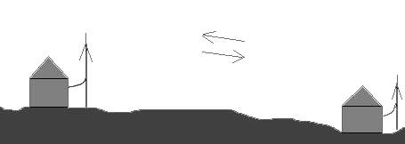

*Two hills blocking direct line-of-sight, illustrating diffraction/multipath propagation over terrain.*

*15.1-1. ábra. Két állomás közvetlen kapcsolata*

Ezeknek az átjátszóknak számtalan előnyei vannak egy FM átjátszóval szemben. Például: FM átjátszót egyidőben csak két állomás használhatja felváltva. De ezen az átjátszón egyszerre többen dolgozhatnak egy frekvencián anélkül, hogy egymást zavarnák a forgalmazásban. Az FM átjátszóknál az információ sebessége a beszéddel egyenlő, ami nem túl jó. Paketton az információ sebessége magas, sokszorosa a beszéddel átvihető információnak. Mivel itt is az a cél, hogy minél több állomás használhassa az átjátszót, és a távolabbi állomások is elérjék, ezért a NODE-ok, gateway-ek (átjátszók) általában magasabb helyeken (hegyeken) üzemelnek.


*Longer multi-hill terrain profile affecting radio line-of-sight.*

*15.1-2. ábra. Két állomás kapcsolata átjátszókon keresztül*

Mivel az átvitel digitális és az információt könnyű tárolni, értelmezni, ezért több átjátszót is össze lehet kapcsolni egymással. Így megvalósítható az, hogy olyan állomással hozzuk létre a kapcsolatot, ami egy távoli NODE által elérhető, azaz egy távolabbi átjátszó közelében üzemel. Egy átjátszó általában több sávon is működik, van olyan ága, amin a felhasználók dolgozhatnak és van olyan ága, amin egy másik átjátszóval kommunikál. Az átjátszók közötti átvitelre a 70 cm-es és a 23 cm-es sávot szokták használni. A nem rádiós alapú összekapcsolásra pedig az Internetet használják (AXIP protokollal). Az átjátszók összekapcsolásával létrejött a paketthálózat. Ez a paketthálózat mára kiválóan használható világhálózattá vált.

### 15.1.3. Az Internet és a rádióamatőr csomagrádiós hálózat kapcsolata 

Az Internet megjelenése lehetővé tette, hogy az átjátszókat (NODE-okat) a világhálón keresztül is összekössék. Így két távoli állomás között az adatforgalom sebessége felgyorsult. Az Internetet csak arra használhatják – a rádióamatőr csomagrádiós hálózatban – hogy két csomópontot (NODE-ot) összekössenek. (Tehát: a pakett hálózatról nem engedélyezett az internetes szolgáltatások (pl. WWW) elérése!) A világhálót és az amatőrhálót

összekötő gép a gateway. A gateway-eken AXIP protokollt alkalmaznak az AX.25 adatok TCP/IP hálózaton való továbbításához. Napjainkban egyre inkább terjed az olyan NODE-k száma, amelyen XNET szoftvert üzemeltetnek. Az XNET segítségével NODE-ok rádiósan és AXIP-n keresztül is összeköthetők.

### 15.1.4. Mire használják a csomagrádiózást? 

A pakett lehetőséget nyújt arra, hogy a NODE-ok segítségével vagy közvetlenül összeköttetést alakítsunk ki két rádióamatőr állomás között. Az ilyen összeköttettetések segítségével lehetőség van: adatátvitelre (fájlok), üzenet küldésére vagy akár valósidejű beszélgetésre (chat). Sokan használják a DX clustereket, ahol aktuális információkat kapnak a DX összeköttetésekről, és ha szerencséjük van, akkor nekik is sikerül elcsípni az állomást valamelyik hullámsávon.
```
 DX Cluster> 
 N6TTD     21277.0 SP8GWI   John 5/8 in Elk Grove, CA.  02/15 1711 
 IK5YJY    50048.0 TR0A/B   s2 >jn53                    02/15 1704 
 G4OBK      7008.4 7M4CDX   Tokyo 589 FB early          02/15 1658
```

*15.1-3. ábra. DX cluster információi 3 összeköttetésről*

Napjainkban egyre több állomás használja az APRS üzemmódot, amely szintén a csomagrádiós hálózat segítségével érhető el. Ezzel más fejezetben részletesebben is foglalkozunk.

### 15.1.5. Kik hozták létre, és kik fejlesztik a pakett hálózatot? 

A hálózatok kialakításában a rádióamatőr szövetségek, de nagyobb számban egyéni rádióamatőrök, rádióklubok jeleskedtek. Hosszú lenne felsorolni mindenkit. Köszönet nekik ezért. Az európai és a magyar hálózat is így épült fel.

### 15.1.6. Rádióamatőr pakett állomás felépítése 

Egy rádióamatőr pakett állomáshoz feltétlenül szükség van egy számítógépre (vagy szélsőséges esetben csak egy TNC-re) és egy rádióra (pl. 144 MHz-re). Amennyiben számítógép segítségével pakettozunk, akkor egy pakett program is, amely az AX.25 protokollt kezeli.

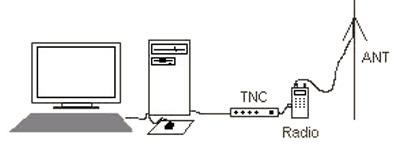

*Packet-radio station setup: computer, TNC, and radio with antenna.*

*15.1-4. ábra. Pakett állomás felépítése*

A TNC (Terminal Node Controller), nem más, mint egy speciális mikroszámítógép, amely valamennyi, az AX.25 protokol által megkövetelt feladatot ellátja. A TNC általában egy Z80 alapú kisszámítógép, melynek van általában 256 kB memóriája és EPROM-ja, melybe egy kisebb pakett program beégethető. A TNC-k általában tartalmazzák a modemet is (egy dobozba építik őket). A TNC-hez legegyszerűbb esetben csatlakoztatható egy "buta" ASCII terminál, nincs feltétlenül szüksége számítógépre. Sőt sok pakett Node-nál csak néhány TNC-t összekapcsolnak, nem használnak hozzájuk számítógépeket, és a rajtuk futó (EPROM-ba égetett) programok elvégzik a szükséges feladatokat. A TNC vezérli, a hozzá csatlakoztatott modemet. Ha a TNC-hez számítógépet csatlakoztatunk, akkor a működése a következő: a rádió leveszi a jelet, azt a modem feldolgozza digitális jelekké, azt a TNC értelmezi, és csomagokra alakítja, majd a csomagokat átküldi a számítógépnek. Visszafelé: a számítógép elküldi a csomagokat a TNC-nek amely digitális jelekké alakítja és elküldi a modemnek, amely analóg jelet küld a rádiónak. A számítógépről küldhetünk parancsokat a TNC-nek, így beállíthatjuk a különböző paramétereit. Ha kis ASCII terminált használunk, akkor a TNC értelmezi a csomagokat az EPROM-ba égetett program segítségével és a nekünk küldött csomagokat megjeleníti az ASCII terminál monitorján. Mi pedig a billentyűzetről parancsokkal vezérelhetjük a TNC-t, állíthatjuk be a paramétereket, illetve információkat küldhetünk.

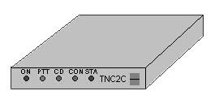

*Photo of a TNC2C-type packet-radio terminal node controller (TNC).*

*15.1-5. ábra. TNC (kinézetre olyan, mint egy külső analóg telefonos modem)*

Lehet TNC nélkül is pakettozni, egy speciális modem vagy hangkártya és egy számítógép segítségével. Vannak olyan modemek, melyek a számítógép soros vagy párhuzamos portjára csatlakoztathatók. Ha ilyen modemet használunk akkor nélkülözhető a TNC, viszont hangkártya segítségével a legegyszerűbb pakettozni: kell hozzá egy számítógép (hangkártyával) és egy interfész kábel (az adásra kapcsolás miatt kell egy soros porti csatlakozó is). De mielőtt örülnénk, és megkérdeznénk, hogy minek akkor a TNC, ha létezik ilyen megoldás is, elárulnám a következőt: a TNC-t ebben az esetben emulálnunk kell egy rezidens DOS-os, LINUX-os vagy WINDOWS-os programmal és kell hozzá egy számítógép, míg egy TNC magában is képes működni…

### 15.1.7. Pakett hangkártyán keresztül 

A legegyszerűbb pakett-állomást egy rádió, egy számítógép (hangkártyával) és egy interfész kábel alkotja. Amennyiben Windows 98/XP operációs rendszert használunk, akkor az alábbi programot kell beszereznünk: AGWPE (SV2AGW's Packet Engine), amely innen letölthető: http://www.elcom.gr/sv2agw/soundcardpacket.htm Az AGWPE program elvégzi az AX.25 protokoll kezelését és az adó-vevő adásvételi kapcsolását, de kell a működéshez (egy BAYCOM modem, TNC vagy) hangkártya esetén csupán egy interfész kábel: http://www.jbgizmo.com/page28.htm Az AGWPE szoftver mellé kell egy felhasználói szoftver is, amely lehet: o    pakett kommunikációs szoftver pl.: Winpack o    APRS szoftver, pl.: ui-view32 Szerencsére sok jól használható pakett szoftver található napjainkban az Interneten, szinte az összes operációs rendszer alá.

## 15.2. APRS

Az APRS kezdete 1984-re tehető. Amerikában Bob Bruninga, WB4APR által kifejlesztett protokol GPS-sel összekapcsolt pakett rádióállomások térképen történő megjelenítését oldotta meg. (Automatic Position Reporting System) Ahogy az APRS fejlődött, újabb szolgáltatások jelentek meg: időjárás jelzések, iránymérés, üzenetküldés. Az APRS rövidítés új értelmezést kapott: Automatic Packet Reporting System. Az APRS segítségével nyomon követhető egy rádióamatőr állomás, amennyiben folyamatosan jelenti pozícióját, azaz jelen van az APRS rendszerben. Az APRS rendszer a rádióamatőr pakett hálózat segítségével működik, úgy hogy az egész világot behálózó APRS átjátszók (digirepeater-ek) továbbítják az adatokat az amatőr állomástól a rendszerbe.

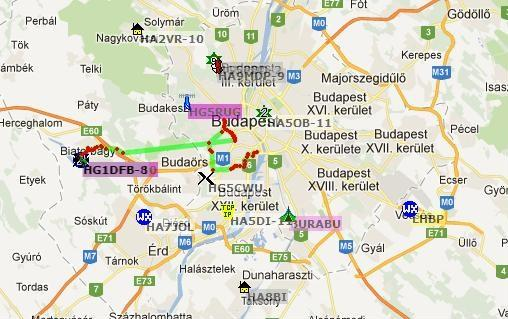

*Map of a repeater/packet-radio link network around Budapest, showing station markers.*

*15.2-1. ábra. Budapest Környéki APRS állomások*

A különböző átjátszóknak a hagyományos csomagrádiós rendszerben más és más a hívójelük, míg az APRS rendszerekben ún. ALIAS hívójeleket használnak, melyek segítségével bármerre is jár a mozgó rádióamatőr állomás, a rendszerben tud maradni. Az APRS rendszer intelligens átjátszókkal rendelkezik, így hívójel helyettesítéssel meg tudja akadályozni a hálózat „elárasztását”. Európában, a legtöbb országban szabványosan (2m-es amatőrsávban) 144,800-on vannak az átjátszók, melyeket 1200 Baud-os átviteli sebességgel lehet elérni. Az APRS rendszer használatához (amennyiben mozgó állomásról van szó), szükség van egy GPS-re, amelyet össze kell kötni egy pakett rádióállomással (TNC + rádió). Így akár autóból is megoldható a rendszer használata. A GPS veszi a műholdak jeleit és másodpercenként kiszámolja a GPS vevő pontos koordinátáit amit kiküld a soros portján. Ez ASCII text formátumú, tartalmazza a szélességi és hosszúsági adatokat is. Ezt egyszerűen rákötve a TNC soros portjára, BEACON-ként ki lehet adni. A vevő állomások mindegyike képes dekódolni ezeket az adatokat, és meg tudja jeleníteni a térképen. A hagyományos AX.25 (pakett) kapcsolat két állomás között zajlik. Először fel kell építeni egy kapcsolatot, utána lehet az adatokat adni/venni. Az APRS használatánál nem kell felépíteni kapcsolatot. Egy állomás által küldött adatok azonnal megjelennek a többi állomásnál. Az APRS programok számos platformon működnek: DOS, WIN 3.x, WIN 95/98/2000/XP. MacOS, Linux és PALM. Az APRS-nél is van lehetőség internetes kapuállomások létesítésére. Ezek a kapuállomások a rádión hallott adatok elérését teszik lehetővé Interneten keresztül. Az adatokhoz nem rádióamatőr is hozzáférhet, megnézheti azokat. Nem regisztrált felhasználó csak Interneten csatlakozó állomásnak tud adatot küldeni. Regisztrált, hívójellel is rendelkező állomás képes csak rádiós állomással adatot cserélni. Az APRS hálózat így védve van nem rádióamatőrtől származó információk ellen. A kapuállomásokat természetesen össze is lehet kötni Interneten keresztül, így egy helyi felhasználónak nem szükséges pl. egy amerikai kapuállomást meghívnia, a helyi kapuállomáson is ugyanazokat az adatokat 'látja'.

### 15.3. EchoLink

Az ECHOLINK „Voice over IP” kategóriába sorolható, azaz az internetes telefónia technológiát alkalmazó szoftver. Azonban ebben a globális rendszerben rádiófrekvenciás kapcsolt állomások (szimplex üzemmódú és átjátszó berendezések) is találhatók. Feladata kétoldalú, félduplex fónia összeköttetések biztosítása közvetlen internet kliensek közötti, továbbá rádiófrekvencia-internet-internet kliens, valamint rádiófrekvencia-internetrádiófrekvencia (és vissza) útvonalon. A program filozófiája a rövidhullámú sajátosságok virtuális leképzése, természetesen kizárva a terjedésből eredő bizonytalanságokat. A hangátvitel minősége kiemelkedőnek és stabilnak mondható, azonban a rendelkezésre álló sávszélesség és a világhaló pillanatnyi leterheltségének függvénye. A tapasztalatok szerint egy 33 kbit/s sebességű analóg telefonmodem már kielégítő adatátvitel érhető el abban az esetben, ha más internetes forgalmat nem bonyolít a kliens számítógép. Az EchoLink program kifejlesztője K1RFD. munkája olyan sikeres volt, hogy kitüntetésben részesítette az ARRL. Természetesen a szerző és más rádióamatőr fejlesztők időszakonként frissített verzióval, illetve segédprogramokkal jelentkeznek. Magyarországon az EchoLink elterjedését adminisztrációs és internetes infrastrukturális okok nehezítették. A 2006-ban megjelent, megreformált rádióamatőr rendelet az adminisztrációs akadályokat véglegesen felszámolta, az infrastruktúra fejlődése és további fejlesztése a szélessávú internet irányába mutat. Érdekességképpen célszerű megemlíteni, hogy az USA-ban a legtöbb internet felhasználó ma is analóg modemes vagy elavult ISDN rendszert használ, ugyanakkor idehaza pontosan fordított a helyzet, noha a felhasználók összlakossághoz viszonyított aránya messze elmarad az USA mögött. Az első két kísérleti átjátszót Viktor, HG2QE helyezte üzembe 2004. február végén, márciusában. Mindkét átjátszó akkor dorogi telepítésű volt, a HG2RVC és a HG2RUB. A sikeres kísérleteknek köszönhetően az EchoLink rendszerbe kötött átjátszók az óta is üzemelnek, a következő változásokkal: A HG2RVC megmaradt regionális átjátszónak Dorogon, a HG2RUB felkerült a HG2RVD mellé az esztergomi Vaskapu-hegyre, s ez a két, nagy területet lefedő átjátszó került beiktatásra véglegesen a globális rendszerbe. Ezen két átjátszón keresztül akár DTMF-es kézirádióval minden földrész online státuszú felhasználója (egyéni kliens, rádiólink, átjátszó, nagy konferencia szerver) elérhető. Nem sokkal később Budapesten is csatlakoztatták a HG5RUG hívójelű átjátszót a rendszerhez, amely fix kapcsolatban együtt működik a Tihanyban telepített HG2RVG hívójelű átjátszóval, biztosítva a Balatoni régió - Budapest és térsége egyidejű lefedését. Jelenleg a hazai rádiólinkes és átjátszós lefedettség dinamikusan növekszik. Amennyiben egy rádiólink vagy kapcsolható átjátszó lefedési körzetében vagyunk, távoli átjátszókra, rádiólinkre, vagy egyedi felhasználó számítógépére tudjuk kapcsolni a közeli rádiórendszert. Ehhez ismerni kell a távoli felhasználó nodeszámát, ami az echolink.org honlapon megtalálható. A kapcsolat létrehozása és lebontása DTMF kódokkal Echolinkes rádióállomásonként eltérő lehet, ezért ismerni kell a használni kívánt rádióállomás beállítását. Általános protokoll: a C betű kiküldése után a nodeszám kiküldése következik. E hívásra a használt rádió a célállomáshoz kapcsolódik. Az összeköttetés befejezése után a kapcsolatot kötelező lebontani, ami a kettőskereszttel lehetséges, illetve a régebbi állomásoknál a D betű is bontja a kapcsolatot. A rádióról történő használathoz regisztráció nem szükséges, minden hívójeles amatőr rendelkezésére áll az Echolinkes globális rendszer.

## 15.4. HAMNET

### 15.4.1. Nagysebességű multimédiás Amatőr Rádiós Hálózat (Highspeed Amateurradio Multimedia Network) 

HAMNET egy zárt hálózat, ami rádióamatőr célú felhasználást biztosít a gyors mikrohullámú kapcsolatot előtérbe helyezve. Ez nem egy új üzemmód, hanem a már meglévő rádióamatőröknek használható magasabb frekvenciáit kihasználva pl.: 13 cm-es rádióamatőr sáv: 2300 - 2450 és 6 cm-es rádióamatőr sáv: 5650 – 5850 MHz en egy nagysebességű TCP/IP protokollt is használó adatátvitelt valósít meg. Ez nagymértékben hasonlít, (részegységekben megegyező eszközökkel) az interneten használatos WI - FI, WLAN rendszerekkel. A valóságos INTERNET rendszerrel való közvetlen összeköttetése nincs! Ezért különféle kísérleti adatátvitelt, bármiféle kísérletezést, terjedési megfigyeléseket kockázatok nélkül végezhetünk a rendszeren. Az eszközök kiválasztásánál fontos követelmény, hogy a frekvencia (csatorna) kiválasztható legyen az engedélyben meghatározott tartományba. Az eszközök egy része a gerinc (backbone) rendszert képzik, amin nemzetközi adatforgalom is továbbításra kerül. Ezeken más átviteli protokoll is jelen van a gerinc hálózatra jellemző BGP (EBG, IBG). Előszeretettel alkalmazzák a MIKROTIK Routerboardot és Ubiquiti eszközöket a hálózat építésénél, (fél-profi eszközök) nagyon jól konfigurálhatóak és az üzemvitelük is jó, megbízható. Antenna tekintetébe a parabola, radom, parabola, grid, tölcsér, és yagi antenna is szóba jöhet. A méretezése nagyon fontos főleg a nagyobb áthidalandó távolságok miatt is. Ne feledkezzünk el a szélterhelésről és a megfelelő villámvédelem is fontos!

A felhasználó rádióamatőröknek már jóval kisebb tudású eszközök is szóba jöhetnek, természetesen az antenna itt is fontos, de már a saját készítésű is megfelel az üzemeltetéshez. Ezek az eszközök lehetnek pl: TP-LINK, Ovislink, linksys, stb., ezeken az eredeti vagy OPEN-WRT kommunikációs linux fut. Németország, Olaszország, Svájc és Ausztriában ezt a rendszer a rádióamatőrök előszeretettel használják.

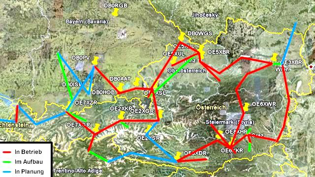

*Terrain relief map showing a wider regional packet-radio/repeater link network, colour-coded by link status.*

*15.4-1. ábra Osztrák HAMNet hálózat kialakítása*

### 15.4.2. A HAMNET rendszer lehetséges alkalmazásai:

- Packet Radio a hagyományos értelemben vett, gyors adatátvitel AX25
- EchoLink
- WinLink2000
- VoIP
- DATV / IP ATV
- APRS
- Rádióamatőr honlapok (kizárólagosan Hamnet)
- Azonnali üzenetküldés (Jabber)
- VoIP (SIP) - Skype?
- Videó archívum (h264)
- HAM-Intranet
- Digitális hozzáférés ATV, webkamera, IP TV stb alkalmazásokhoz

Lehetőség nyílik így modernizálni a már meglévő csomagkapcsolt rádiós hálózatot, amiben eddig is használatos volt az AMPRNet -nél kiosztott IP címek, amit például az www.ampr.org -on lehet megnézni. A rádióamatőrök által használható IP tartomány a 44.x.x.x-be kell esnie, Magyarországon a 44.156x.x es IP címek használhatóak, amit a mindenkori koordinátor oszt ki. Így a HAMNET –en használt IP címek formátuma, használata teljesen megegyeznek a nem amatőr szolgálatokban használt (internet) IP címekkel.

A magyarországi gerinc kapcsolódást a rendszerhez Ausztriából lehet megvalósítani.

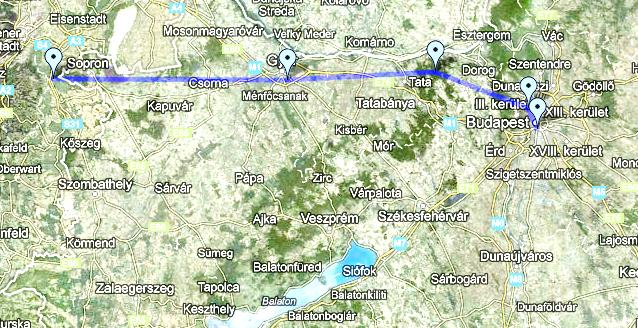

*Map showing a specific radio link path across terrain between two stations.*

*15.4-2. ábra Tervezett gerinc kialakítása Ausztria felé*

## 15.5. RTTY

A kezdeteknél a TTY azaz a géptávíró gépek önálló egységek voltak, amelyek leginkább egy írógéphez hasonlítottak. A 2. világháború előtt már használták őket, a bemeneti periféria egy billentyűzet volt, míg a kimenet egy papírtekercs Az 1970-es évektől jelentek meg a videó monitorral rendelkező változatuk. A géptávíró hagyományos változata vezetékes átvitellel működik, míg a rádiós változata az RTTY, rádiófrekvenciákon keresztül. A modern rádióamatőr géptávírók viszont már nem különálló írógéphez hasonló egységek, hanem multifunkciós gépek vagy PC interfészek, melyek a rövidhullámú rádióhoz vannak kapcsolva.

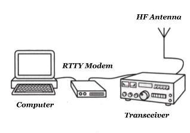

*RTTY station setup: computer, RTTY modem, transceiver, and HF antenna.*

*15.5-1. ábra. RTTY állomás*

A géptávíró nem morze rendszerben ad. Abban különbözik a morze átviteltől, hogy a morzeadásnál a morzejelek adása közben az adó be- és kikapcsolt, így szaggatta az adást, míg ez a géptávíró esetében folyamatos adást jelent, úgy hogy két frekvencia közötti ugrálást végez. Ez az ún. FSK azaz Frekvenciabillentyűzés.
Rádióamatőröknél a két frekvencia távolsága 170 Hz, míg egyéb területen ez más is lehet (425 Hz, 850 Hz). Vannak olyan rendszerek, amelyek nem FSK-t hanem AFSK-t használnak (Audio Frekvenciabillentyűzés), ezeknél a rendszereknél nem az adó végzi a frekvenciaugrásokat, hanem a mikrofonbemeneten elhelyezett hangfrekvenciás egység. A két eljárás vételi oldalon azonos eredményt képez, így azonosan feldolgozható eljárásokról van szó. Az RTTY rendszerekben használt megoldás, hogy az adó az adás elején a vétel megkönnyítése érdekében (a vevő állomások frekvenciára állásának segítése érdekében) R és Y karakterekből álló szöveget ad: RYRYRY. Ez azért fontos, mert itt szimmetrikus jelek vannak, így könnyebb a kalibrálás, még a tényleges üzenetátvitel előtt. Az RTTY nem egy hibamentes átviteli protokoll, tehát erős zajtartalom ill. fading esetén információvesztés léphet fel. Az átvitelhez használt kódrendszer a Baudot kód, amely 5 bit hosszúságú. Egy kódtábla segítségével viszik át az adatokat. Az adatátvitel sebessége 60, 75 és 100 szó/perc lehet. Még napjainkban is elég közkedvelt digitális átviteli forma a rövidhullámú sávokban az RTTY. Bár mára kissé átalakult a technikai háttér, leggyakrabban multifunkciós TNC-vel vagy hangkártya segítségével történik az RTTY kezelése. RTTY üzemmódhoz ajánlott szoftverek: MIXW 2.0 vagy MMRTTY.

## 15.6. SSTV

Az SSTV (Slow Scan Television) olyan képátviteli eljárás, amely állóképek (fotók) átvitelére képes rádióamatőr frekvenciákon keresztül. Lassú letapogatású eljárást használ, amely lényege, hogy pontról-pontra, sorról-sorra minden képpontot egymás után tapogat le és küld át az éteren keresztül. Segítségével nem csak fekete-fehér hanem színes képek is továbbíthatóak, mégpedig viszonylag elfogadható minőségben. Az SSTV nagy előnye, hogy kis sávszélességet igényel, így rövidhullámon is használható, de hátránya más vizuális átvitelekhez képest (pl. ATV) a lassúsága. Egy kép átvitele több másodperctől akár pár percig is eltarthat. Az SSTV használatához szükséges egy számítógép, természetesen egy SSTV program, egy rádióamatőr adóvevő és egy SSTV interfész, amely a rádiót és a számítógépet köti össze.

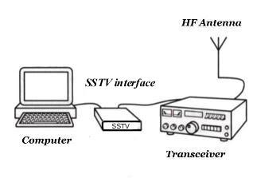

*SSTV station setup: computer, SSTV interface, transceiver, and HF antenna.*

*15.6-1. ábra. SSTV állomás*

Rádióamatőr gyakorlatban általában a következő témájú képeket továbbítják SSTV-n keresztül: képek rádióamatőr berendezésekről, saját magukról, családjukról és mindenről, amit érdekesnek találnak, pl.: űrállomásokról, űrhajókról stb. Nagyon befolyásolja az átviteli időt a továbbítandó kép minősége. Például egy igen kis felbontású fekete-fehér kép (120 sor magas kép) átviteléhez elég akár 8 másodperc, míg egy 640x480-as true color képhez kb. 7 perc kell. A legtöbb kép, amit SSTV-n továbbítanak 320x240-es színes kép, melyhez kb. 2 perc átviteli idő kell.


*SSTV test-image graphic ("W5NOO SSTV") of a sailor at a ship's wheel, of the type transmitted as an SSTV test picture.*

*15.6-2. ábra. W5NOO egyik SSTV képe*

Az SSTV átviteleket általában közismert „SSTV frekvenciákon” végzik, így könnyebb rátalálni az ilyen adásokra. Ilyen frekvencia, pl.: 3.845, 7.171, 14.230, 21.340, 28.680 vagy a 145.500 MHz. Rádióamatőr SSTV aktivitás növelésének érdekében különböző SSTV versenyeket is rendeznek. Különböző képességű SSTV program létezik, vannak ingyenesen használhatóak és vannak olyanok, amelyekért – sajnos – fizetni kell.

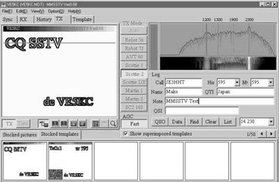

*Screenshot of SSTV software showing a waterfall display and received/queued images.*

*15.6-3. ábra. A leginkább használható SSTV szoftver - az MMSSTV felülete*

Természetesen létezik DOS-os, Windows-os és Linux-os SSTV program. Szerencsére nagy a választék, így mindenki kénye-kedve szerint dönthet, hogy mit használ.

## 15.7. ATV

Sok rádióamatőr használja a lassú letapogatású TV-t, az SSTV-t, amely állóképek átvitelére képes, alacsony sávszélesség mellett. Nagy hátránya a lassúsága valamint mozgóképet nem képes továbbítani. Napjainkban egyre többen használják a gyors letapogatású TV-t (Fast Scan TV), az ATV-t (Amateur Television). Az ATV nagy előnye az SSTV-hez képest, hogy mozgóképek továbbíthatók vele, sőt képet és hangot is képes közvetíteni, ugyan úgy, mint egy normál TV-s átvitel. Az ATV-s átvitel viszont nagyon nagy sávszélességet igényel, így csak magasabb frekvenciákon használható, mégpedig ott, ahol ez a sávszélesség belefér a teljes rádióamatőr sávba. Erre csak 420 MHz felett van lehetőség. Az ATV-zés elég drága hobbi, mivel drága berendezéseket kíván: drága az adóberendezés, mert magas frekvencián üzemel, speciális jelátalakító ill. modulátor kell hozzá, és kell egy képgenerátor (videokamera vagy videó, esetleg PC).

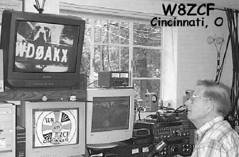

*Photo of an amateur radio operator's station with an SSTV image on a monitor.*

*15.7-1. ábra. W8ZCF ATV állomása*

A legtöbb ATV adás a 23 cm-es rádióamatőr sávban (1265.00 és 1289.25 MHz-en) történik, ott, ahol engedélyezett az ATV a 70 cm-es sávban (439.25, 434.00, 426.25 MHz-en) is lehetséges ATV-zni. Azok a rádióamatőrök, akik megfelelő berendezéssel rendelkeznek, azok dolgozhatnak magasabb frekvenciákon is: 2.4 GHz-en vagy akár 10 GHz-en is. Minél magasabb frekvencián ATV-zünk, annál drágábbak a berendezések (rádió, kébelek, antenna). Az ATV adások különböző szabványok szerint történnek: Európában általában PAL képnormával és FM adásmódban, míg Amerikában NTSC képnormával adnak. Ritkábban, de használják az AM adásmódot is (ebben az esetben csak egy konverter kell, és egy TV készülék). Gyakoribb az FM adásmód, amely adás, ha 23-es rádióamatőr sávban történik, akkor egy normál műholdvevő beltéri egységgel fogható.

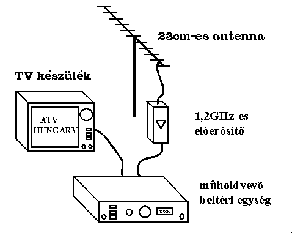

*Amateur TV (ATV) satellite downlink setup: 23cm antenna, 1.2GHz preamplifier, satellite receiver, TV.*

*15.7-2. ábra. 23 cm-es FM ATV adás vétele*

Európában és a tengereken túl számos ATV átjátszó működik, melyek segítségével messzebbre továbbítható az adás, sőt a legtöbb átjátszó jeladóként is működik. Az ATV segítségével nem csak mozgóképek, hanem tesztábrák és teletext is továbbítható. Az ATV rengeteg lehetőséget rejt magában, viszont drágasága miatt nehezen terjed el.


