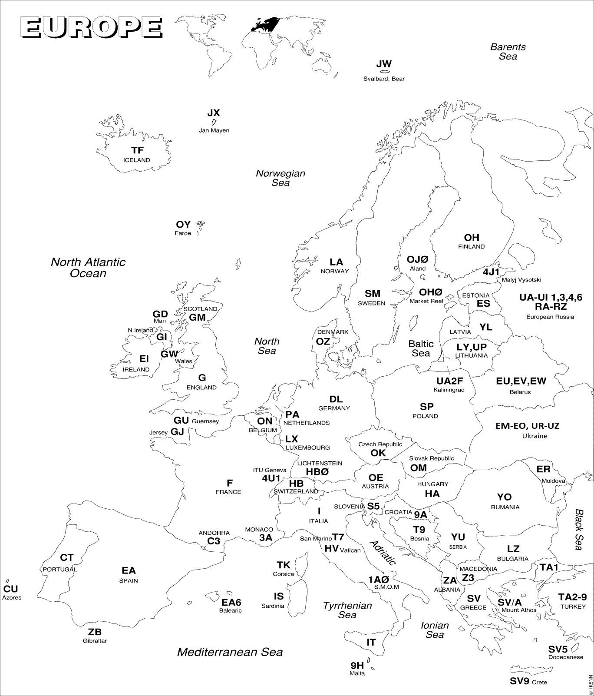
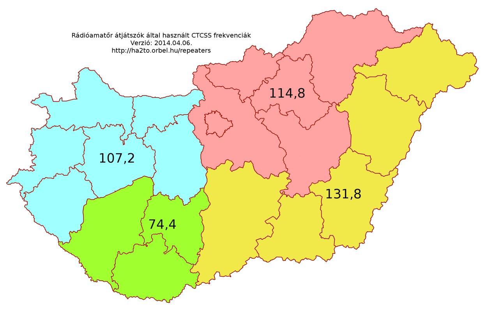

# 16. Mellékletek

## 16.1. Európai országok (prefixek)



*Map of Europe with country abbreviations, used for prefix/country reference.*

## 16.2. Rövidhullámú rádióamatőr sávok felosztása

```
Frekvencia      Sávsz                                     Üzemmód és felhasználás 
   (KHz)         (Hz)
135,7 - 137,8    200    CW, QRSS és keskeny sávú digitális üzemmódok 
1810 - 1838      200    CW, 1836 kHz - QRP aktivitásközép
1838 - 1840      500    keskeny sávú üzemmódok
1840 - 1843     2700 minden üzemmód, digimódok
1843 - 2000     2700 minden üzemmód
3500 - 3510      200    CW, kontinensek közötti összeköttetésekre
3510 - 3560      200    CW, versenyre ajánlott, 3555 kHz - QRS aktivitásközép
3560 - 3580      200    CW, 3560 kHz - QRP aktivitásközép
3580 - 3590      500    keskenysávú üzemmódok - digimódok
3590 - 3600      500    keskenysávú üzemmódok - digimódok, automata állomások (kezelő nélkül)
3600 - 3620     2700 minden üzemmód - digimódok, automata állomások (kezelő nélkül)
3600 - 3650     2700 minden üzemmód, 3630 kHz - DV aktivitásközép, SSB versenyre javasolt
3650 - 3700     2700 minden üzemmód, SSB QRP aktivitás központja 3690 KHz minden üzemmód, SSB versenyre javasolt, 3735 kHz - kép aktivitás központja, 
3700 - 3800     2700 3760 kHz - vészhelyzeti hívó frekvencia
3750 - 3800     2700 minden üzemmód. SSB DX összeköttetések létesítésre
7000 - 7025      200    CW, versenyre javasolt
7025 - 7040      200    CW, 7030 kHz - QRP aktivitás központja
7040 - 7047      500    keskenysávú üzemmódok, digimódok
7047 - 7050      500    keskenysávú üzemmódok - digimódok, automata állomások (kezelő nélküli)
7050 - 7053     2700 minden üzemmód - digimódok, automata állomások (kezelő nélküli)
7053 - 7060     2700 minden üzemmód – digimódok
7060 - 7100     2700 7090 kHz - SSB QRP aktivitásközép, minden üzemmód, SSB versenyre javasolt, 7070 kHz - DV aktivitásközép, 
7100 - 7130     2700 minden üzemmód, 7110 kHz - vészhelyzeti hívó frekvencia
7130 - 7175     2700 minden üzemmód, SSB versenyre javasolt, 7165 kHz - képtovábbítás aktivitásközép
7175 - 7200     2700 minden üzemmód, kontinensek közötti összeköttetésekre
10100 - 10140    200    CW, 10116 kHz - QRP aktivitás központja
10140 - 10150    500    keskeny sávú üzemmódok – digimódok
14000 - 14060    200    CW, versenyre ajánlott, 14055 kHz - QRS aktivitásközép
14060 - 14070    200    CW, 14060 kHz - QRP aktivitás központ
14070 - 14089    500    keskenysávú üzemmódok - digimódok, 14070 USB: PSK31
14089 - 14099    500    keskenysávú üzemmódok - digimódok, automatikus állomások (kezelő nélkül)
14099 - 14101     -     IBP (nemzetközi jeladó projekt), kizárólag jeladók részére
14101 - 14112   2700 minden üzemmód - digimódok, automatikus állomások (kezelő nélkül) 
14112 - 14125   2700 minden üzemmód, minden üzemmód - SSB versenyre javasolt, 14130 kHz: DV aktivitás központ, 
14125 - 14300   2700 kHz+-5 kHz: elsőbbséget élveznek a DX expedíciók 14230 kHz: képátvitel (SSTV) aktivitás központja, 14285 kHz: SSB QRP aktivitás központja 
14300 - 14350   2700 minden üzemmód, 14300 kHz vészhelyzeti hívó frekvencia aktivitás központ 
18068 - 18095 200     CW, 18086 kHz - QRP aktivitás központ 
18095 - 18105 500     keskenysávú üzemmódok – digimódok 
18105 - 18109 500     keskenysávú üzemmódok - digimódok, automatikus állomások (kezelő nélkül) 
18109 – 18111 -       IBP (nemzetközi jeladó projekt): kizárólag jeladók részére 
18111 - 18120 2700    minden üzemmód - digimód, automatikus állomások (kezelő nélkül) 
18120 - 18168 2700    minden üzemmód, 18130 kHz - SSB QRP aktivitás központ, 18150 kHz - DV aktivitás központ, 18160 kHz - vészhelyzeti hívó frekvencia aktivitás központ 
21000 - 21070 200     CW, 21055 kHz - QRS aktivitás közepe, 21060 kHz - QRP aktivitás közepe 
21070 - 21090 500     keskenysávú üzemmód – digimód 
21090 - 21110 500     keskenysávú üzemmód - digimód, automatikus állomások (kezelő nélkül) 
21110 - 21120 2700    minden üzemmód, (kivétve SSB) - digimód, automatikus állomások (kezelő nélkül) 
21120 – 21149 500     keskenysávú üzemmódok 
21149 – 21151 -       IBP (nemzetközi jeladó projekt): jeladók részére fenntartva 
21151 – 21450 2700    minden üzemmód, 21285 kHz - SSB QRP aktivitás központja 21340 kHz - képátvitel aktivitás központja, 21360 kHz - vészhelyzeti hívó ferkvencia 
24890 – 24915 200     CW, 24906 kHz - QRP aktivitás központ 
24915 – 24925 500     keskenysávú üzemmódok – digimódok 
24925 – 24929 500     keskenysávú üzemmódok - digimódok, automatikus állomások (kezelő nélkül) 
24929 – 24931 -       IBP (nemzetközi jeladó projekt) jeladók számára fenntartva 
24931 – 24940 2700    minden üzemmód - digimód, automatikus állomások (kezelő nélkül) 
24940 – 24990 2700    minden üzemmód, 24960 kHz - DV aktivitás közép 
28000 – 28070 200     CW, 28055 kHz - QRS aktivitás közép, 28060 kHz - QRP aktivitás közép 
28070 – 28120 500     keskenysávú üzemmódok – digimódok 
28120 – 28150 500     keskenysávú üzemmódok - digimódok, automatikus állomások (kezelő nélküli) 
28150 – 28190 500     keskenysávú üzemmódok 
28190 – 28199 -       IBP (nemzetközi jeladó projekt) - helyi idő szerint megosztott jeladók 
28199 – 28201 -       IBP (nemzetközi jeladó projekt) - UTC szerint megosztott jeladók 
28201 – 28225 -       IBP (nemzetközi jeladó projekt) - folyamatosan működő jeladók 
28225 – 28300 2700    minden üzemmód - jeladók 
28300 – 28320 2700    minden üzemmód - digimódok, automatikus állomások (kezelő nélkül) 
28320 – 29200 2700    minden üzemmód,     28320 kHz: DV aktivitás közép, 28360 kHz: SSB QRP aktivitás közép,     28680 kHz: képátvitel aktivitás közép 
29200 – 29300 6000    minden üzemmód - digimód, automatikus állomások (kezelő nélkül) 
29300 – 29510 6000    műholdas kommunikáció lejövő ága (felmenő 2 méteres vagy 70 cm-es sávban) 
29510 – 29520 -       védett sáv (műholdas kommunikáció miatt) 
29520 – 29550 6000    minden üzemmód - FM szimplex – 10 kHz-es csatona osztással 
29560 – 29590 6000    minden üzemmód - FM átjátszó felmenő – 10 kHz-es csatona osztással (RH1-RH4) 
29600         6000    FM hívócsatorna 
29610 – 29650 6000    minden üzemmód - FM szimplex – 10 kHz-es csatona osztással 
29660 – 29700 6000    minden üzemmód - FM átjátszó lejövő – 10 kHz-es csatona osztással (RH1-RH4)
```

## 16.3. 2 m-es sáv FM átjátszói

(2015. szeptember, forrás: http://ha2to.orbel.hu)
``` 
Hívójel      QTH/Név           Lejövő     Felmenő    Csat.    Elt.     CTCSS       Echolink   QTH Lokátor 
                                [kHz]      [kHz]      új     [kHz]    DL/UL [Hz] 
HG0RVA        Debrecen         145600.0   145000.0   RV48    -600    131.8/131.8    406293      KN07TN53
HG1RVA      Zalaegerszeg       145662.5   145062.5   RV53    -600       --/--       501567      JN86JT75
HG1RVB         Sopron          145687.5   145087.5   RV55    -600       --/--        7649      JN87GP88ex
HG1RVD    Győr (Nyúl-hegy)     145637.5   145037.5   RV51    -600    107.2/107.2                JN87TN89
             Kőrishegy                                               
HG2RVA       (Bakony)          145712.5   145112.5   RV57    -600       --/--                   JN87VH00
HG2RVC         Dorog           145662.5   145062.5   RV53    -600     --/107.2                  JN97IR73
             Esztergom                                               
HG2RVD     (Vaskapu-hegy)      145787.5   145187.5   RV63    -600     --/107.2      185833      JN97JS28
HG2RVG         Tihany          145750.0   145150.0   RV60    -600     103.5/--      246807     JN86WV66fc
HG3RVA    Pécs (Misina-tető)   145775.0   145175.0   RV62    -600    103.5/103.5    253657      JN96CC63
HG3RVB    Fonyód (Balaton)     145612.5   145012.5   RV49    -600       --/--       202467     JN86SR57df
HG3RVC        Szekszárd        145737.5   145137.5   RV59    -600      74.4/--                  JN96II07
HG3RVF    Kaposvár 2. (Igal)   145700.0   145100.0   RV56    -600     74.4/74.4     58700       JN86XN15
HG5RVA     Budapest HHH        145675.0   145075.0   RV54    -600       --/--                  JN97LN93rh
              Budapest                                               
HG5RVB       (Svábhegy)        145600.0   145000.0   RV48    -600    114.8/114.8               JN97LM60sh
HG6RVA    Galyatető (Mátra)    145625.0   145025.0   RV50    -600     114.8/--                  JN97WV99
HG7RVA           Érd           145650.0   145050.0   RV52    -600       --/--       608207       JN97KK
HG7RVC         Cegléd          145787.5   145187.5   RV63    -600    114.8/114.8                JN97VE52
HG8RVA    Kiskunfélegyháza     145762.5   145162.5   RV61    -600       --/--       448398      JN96VQ95
HG8RVB       Békéscsaba        145700.0   145100.0   RV56    -600       --/--                   KN06MQ45
HG8RVC         Szeged          145662.5   145062.5   RV53    -600     --/131.8      456734      KN06BG75
HG8RVD     Baja (Csávoly)      145687.5   145087.5   RV55    -600       --/--                   JN96NE77
HG8RVE          Gyula          145787.5   145187.5   RV63    -600       --/--                   KN06PP25
HG9RVA    Kis-kőhát (Bükk)     145725.0   145125.0   RV58    -600    114.8/114.8    382993     KN08FB85gw
           Miskolc                                                   
HG9RVB     (Bükkszentkereszt)  145687.5   145087.5   RV55    -600    114.8/114.8    424421     KN08HB84xo
HG9RVC     Sátoraljaújhely     145775.0   145175.0   RV62    -600    114.8/114.8    411830      KN08TJ56
HG9RVD           Ózd           145762.5   145162.5   RV61    -600     114.8/--      428776      KN08DF54
```

## 16.4. 70cm-es sáv FM átjátszói

(2015. szeptember, forrás: http://ha2to.orbel.hu) 
```
Hívójel      QTH/Név              Lejövő     Felmenő Csat.       Elt.     CTCSS         Echo         QTH
                                     [kHz]      [kHz]   új        [kHz]   DL/UL [Hz]    link        Lokátor 
HG0RUA          Debrecen          438625.0   431025.0     RU690  -7600    131.8/131.8              KN07TM55
HG0RUB        Nyíregyháza         438725.0   431125.0     RU698  -7600    131.8/131.8              KN07UX52
HG0RUV    Vészhelyzeti átjátszó   438925.0   431325.0     RU714  -7600       --/--
HG1RUA        Zalaegerszeg        434650.0   433050.0     RU372  -1600       --/--                 JN86JT75
HG1RUB           Sopron           439375.0   431775.0     RU750  -7600       --/--                JN87GP88ex
HG1RUC        Szombathely         439125.0   431525.0     RU730  -7600      107.2/--    567741     JN87HF07
HG1RUD      Győr (Nyúl-hegy)      438987.5   431387.5     RU719  -7600      107.2/--               JN87TN89
HG2RUB         Esztergom          439425.0   431825.0     RU754  -7600      --/107.2    150187     JN97JS28
HG2RUC           Gerecse          439400.0   431800.0     RU752  -7600    107.2/107.2   946110     JN97FQ92
HG2RUD          Kab-hegy          439450.0   431850.0     RU756  -7600    107.2/107.2   932036    JN87TB81tc
HG3RUA       Siófok (Ságvár)      439150.0   431550.0     RU732  -7600       --/--      406612      JN96BT
HG3RUB         Dombóvár           439337.5   431737.5     RU747  -7600    186.2/186.2              JN96BJ40
HG3RUC      Pécs (Misina-tető)    438900.0   431300.0     RU712  -7600    103.5/103.5              JN96CC63
HG3RUF      Kaposvár 2. (Igal)    439250.0   431650.0     RU740  -7600     88.5/88.5               JN86XN15
HG4RUA    Kőszárhegy (Polgárdi)   438700.0   431100.0     RU696  -7600    107.2/107.2              JN97DC71
HG4RUB       Székesfehérvár       438725.0   431125.0     RU698  -7600      107.2/--                JN97FE
HG4RUC       Székesfehérvár       438750.0   431150.0     RU700  -7600    107.2/107.2   247090     JN97FE69
HG5RUG       Budapest HHH         439200.0   431600.0     RU736  -7600    114.8/114.8   225722    JN97MN02ea
HG6RUA      Galyatető (Mátra)     439375.0   431775.0     RU750  -7600    114.8/114.8              JN97WV99
HG7RUA             Érd            438675.0   431075.0     RU694  -7600    114.8/114.8   602241      JN97KK
HG7RUB           Cegléd           438800.0   431200.0     RU704  -7600    114.8/114.8              JN97VE52
HG7RUC         Dobogókő           439350.0   431750.0     RU748  -7600    114.8/114.8   340930     JN97KR82
HG7RUE          Budapest          438775.0   431175.0     RU702  -7600    114.8/114.8   567011    JN97LL78nb
HG8RUA           Szeged           438662.5   431062.5     RU693  -7600    131.8/131.8   456737     KN06BG75
HG8RUB         Békéscsaba         439000.0   431400.0     RU720  -7600       --/--                  KN06NQ
HG8RUC      Kiskunfélegyháza      438950.0   431350.0     RU716  -7600    131.8/131.8              JN96VQ95
HG9RUA      Kis-kőhát (Bükk)      438862.5   431262.5     RU709  -7600    114.8/114.8             KN08FB85gw
HG9RUD            Ózd             438762.5   431162.5     RU701  -7600    114.8/114.8              KN08DF54
```

## 16.5. 2 m-es és 70 cm-es sáv Digitális átjátszói

(2015. szeptember, forrás: http://ha2to.orbel.hu) 
```
Hívójel    QTH/Név           Lejövő     Felmenő   Csat.     Elt. Üzemmmód       QTH
                             [kHz]      [kHz]      új      [kHz]              Lokátor 
HG0RUA       Debrecen        438625.0   431025.0   RU690   -7600   C4FM/FM    KN07TM55
HG2RUE       Kab-hegy        438300.0   430700.0   RU664   -7600     DMR     JN87TB81TE
HG3RUE    Fonyód (Balaton)   438450.0   430850.0   RU676   -7600    D-Star    JN86SR57
HG4RUC     Székesfehérvár    438750.0   431150.0   RU700   -7600   C4FM/FM    JN97FE69
HG5RUC       Budapest        438500.0   430900.0   RU680   -7600     DMR       JN97LL
HG5RUD     Budapest HHH      438475.0   430875.0   RU678   -7600    D-Star    JN97MN02
HG7RUA          Érd          438675.0   431075.0   RU694   -7600   C4FM/FM     JN97KK
HG7RUD     Vác, Naszály      438450.0   430850.0   RU676   -7600    D-Star   JN97NU50ij
HG7RUF          Érd          438425.0   430825.0   RU674   -7600    D-Star   JN97KJ88mu
HG7RUG       Dobogókő        438525.0   430925.0   RU682   -7600     DMR      JN97KR82
HG9RUA    Kis-kőhát (Bükk)   438862.5   431262.5   RU709   -7600   C4FM/FM   KN08FB85gw 
HG9RUE    Kis-kőhát (Bükk)   438550.0   430950.0   RU684   -7600     DMR     KN08FB85gw
```

## 16.6. Magyarországi CTCSS kiosztás



*Map of Hungary divided into radio-amateur call-area regions with population figures per region.*
