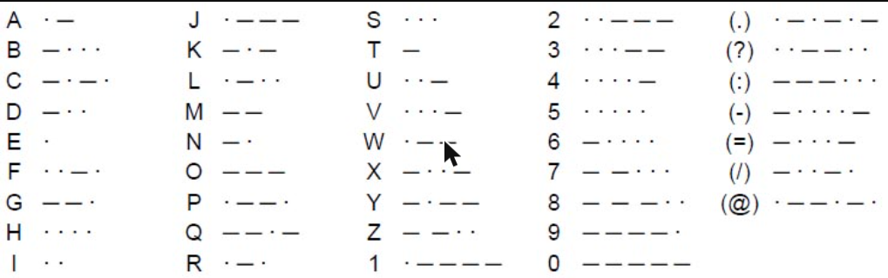
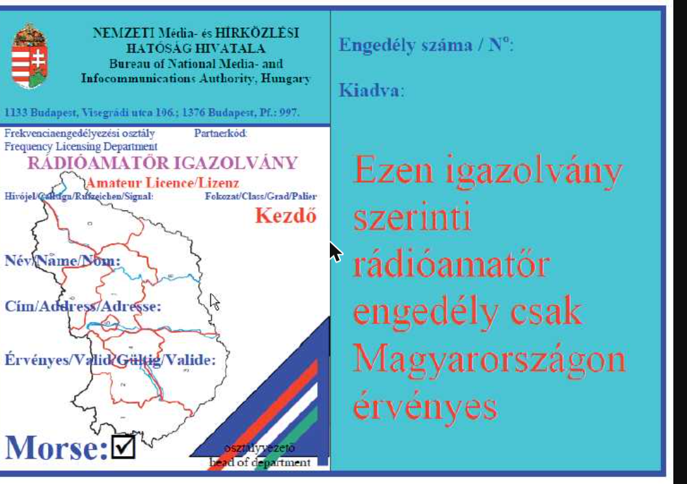
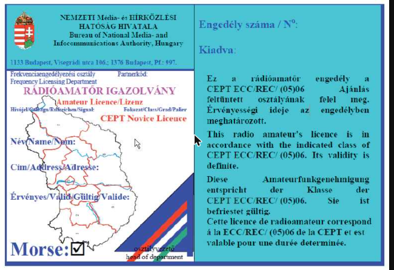
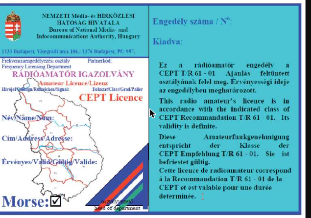

# 15/2013. (IX. 25.) NMHH rendelet

**a rádióamatőr szolgálatról**

Hatályos: 2018. 07. 21. –

Forrás: https://njt.jog.gov.hu/jogszabaly/2013-15-20-3H

---

Az elektronikus hírközlésről szóló 2003. évi C. törvény 182. § (3) bekezdés 3., 6., 7., 8., 9. és 10. pontjában kapott felhatalmazás alapján,
a 22. § tekintetében a médiaszolgáltatásokról és a tömegkommunikációról szóló 2010. évi CLXXXV. törvény 206. § (1) bekezdés c) pontjában kapott felhatalmazás alapján – figyelemmel a médiaszolgáltatásokról és a tömegkommunikációról szóló 2010. évi CLXXXV. törvény 149. § (3) bekezdésében és az elektronikus hírközlésről szóló 2003. évi C. törvény 29. § (3) bekezdésében foglaltakra –,
a médiaszolgáltatásokról és a tömegkommunikációról szóló 2010. évi CLXXXV. törvény 109. § (5) bekezdésében meghatározott feladatkörömben eljárva a következőket rendelem el:

## 1. A rendelet hatálya

**1. §** (1) A rendelet hatálya kiterjed

a) a Nemzeti Média- és Hírközlési Hatóságra (a továbbiakban: hatóság) és

b) arra a természetes személyre, civil szervezetre, valamint oktatási intézményre, aki vagy amely Magyarország területén rádióamatőr tevékenységet folytat.

(2) A rendeletet a műholdas amatőrszolgálat űrállomásai kivételével a nemzeti frekvenciafelosztásról, valamint a frekvenciasávok felhasználási szabályairól szóló NMHH rendeletben (a továbbiakban: NFFF) meghatározott amatőrszolgálat és műholdas amatőrszolgálat (a továbbiakban együtt: amatőrszolgálat) minden állomására alkalmazni kell.

## 2. Értelmező rendelkezések

**2. §** E rendelet alkalmazásában

1. Amatőrállomás üzemben tartása: amatőrállomás üzemeltetésre kész állapotban tartása, üzemeltetése, azon való forgalmazás;

2. Forgalmazás: szabályszerű összeköttetés létesítése, kettő vagy több amatőrállomás vagy rádióállomás között, információcsere céljából;

3. Irányító kezelő: az a nagykorú, cselekvőképességet érintő gondnokság alatt nem álló személy, aki Magyarországon kiállított CEPT fokozatú egyéni rádióamatőr engedéllyel rendelkezik, és az amatőrállomásnak a mindenkor hatályos jogszabályok szerinti üzemben tartásáért, használatáért és a forgalmazásáért felelős, abban az esetben is, ha nem tartózkodik a forgalmazás helyén.

4. Rádióamatőr: az a természetes személy vagy szervezet, aki vagy amely megfelel a rádióamatőr tevékenység folytatásához szükséges feltételeknek,

5. Rádióamatőr közösség: az alapszabálya, alapító okirata vagy társasági szerződése szerint rádióamatőr tevékenységet is folytató civil szervezet, oktatási intézmény, amennyiben amatőrállomásainak minden telepítési helyére kijelöl irányító kezelőt;

6. Rádióamatőr tevékenység: az amatőrszolgálatban személyes érdeklődésből, anyagi érdek nélkül, önképzésre, műszaki fejlődésre és a szakmai információcserére irányuló részvétel rádióamatőr állomás (a továbbiakban: amatőrállomás) üzemeltetése vagy amatőrállomáson való rádióforgalmazás (a továbbiakban: forgalmazás) révén.

## 3. A rádióamatőr tevékenység alapvető szabályai

**3. §** (1) Amatőrállomás üzemben tartásához (a továbbiakban: üzemben tartás) rádióamatőr engedély (a továbbiakban: amatőr engedély) szükséges.

(2) Önállóan az a személy forgalmazhat, aki rendelkezik amatőr engedéllyel.

(3) Amatőr engedéllyel nem, de vizsgabizonyítvánnyal rendelkező személy közösségi amatőrállomáson a Postai és Távközlési Igazgatások Európai Értekezlete (European Conference of Postal and Telecommunications Administrations, a továbbiakban: CEPT) T/R 61-01 Ajánlásának megfelelő (a továbbiakban: CEPT fokozatú) amatőr engedéllyel rendelkező személy felügyelete mellett forgalmazhat.

(4) Vizsgabizonyítvánnyal nem rendelkező, vizsgára készülő személy CEPT fokozatú amatőr engedéllyel rendelkező oktató közvetlen irányítása mellett, az oktató vagy a közösségi amatőrállomás hívójelét használva, tanulási céllal forgalmazhat.

(5) *(hatályon kívül)*

## 4. Az amatőrállomás fajtái

**4. §** (1) A kiadott amatőr engedély szerint az amatőrállomás

a) egyéni,

b) közösségi, vagy

c) különleges amatőrállomás.

(2) Egyéni amatőrállomást egy természetes személy tart üzemben.

(3) Közösségi amatőrállomást rádióamatőr közösség tart üzemben.

(4) Különleges amatőrállomás az egyéni, illetve közösségi üzemben tartástól függetlenül:

a) a rádióamatőr átjátszó állomás, amely alkalmas a különféle adásmódú, rádióamatőr célt szolgáló adás automatikus továbbítására azonos rádióamatőr sávon belül vagy különböző rádióamatőr sávok között;

b) a rádióamatőr jeladó állomás, amely általában folyamatos működésű, felügyelet nélküli amatőrállomás egy adott helyen, és amely meghatározott időnként azonosító információt – a köztes időszakban modulálatlan vivőt – sugároz az elektromágneses hullámok terjedésének tanulmányozására, vizsgálatára, az amatőrállomás berendezéseinek ellenőrzésére vagy egyéb rádióamatőr tevékenység elősegítésére;

c) a rádiós tájfutó versenyen elhelyezett amatőrállomás;

d) a rádióamatőr kapuállomás, amely rádióamatőr átjátszó állomások vagy más rádióamatőr célú rendszer összekapcsolását megvalósító amatőrállomás;

e) a rádióamatőr információt sugárzó amatőrállomás;

f) a rádióforgalmi versenyen működtetett amatőrállomás (a továbbiakban: versenyállomás);

g) a nemzeti ünnep, történelmi évforduló, közismert személyről való megemlékezés, vagy egyéb rendezvény alkalmából működtetett amatőrállomás (a továbbiakban együtt: alkalmi amatőrállomás).

(5) Az amatőrállomás vagy annak fő berendezése

a) a rádióberendezésekről szóló NMHH rendeletnek megfelelően kereskedelmi forgalomba hozott rádióberendezés vagy annak része, vagy

b) CEPT NOVICE vagy CEPT HAREC fokozatú rádióamatőr engedéllyel rendelkező rádióamatőr által vagy rádióamatőr számára épített vagy átalakított berendezés

lehet.

## 5. Rádióamatőr vizsga

**5. §** (1) A rádióamatőr vizsga a hatóság előtt tett vizsga, amelynek az alábbi fokozatai a következő fokozatokban tehető:

a) Kezdőfokozat,

b) Alapfokozat, vagy

c) a harmonizált rádióamatőr vizsgabizonyítványról szóló CEPT T/R 61-02 Ajánlásnak megfelelő (a továbbiakban: HAREC) fokozat.

(2) Minden olyan természetes személy, aki:

a) a 14. évét még nem töltötte be, de vizsgára jelentkezését a rádióamatőrök nemzeti képviseleti és érdekvédelmi szervezete támogatja, Kezdő fokozatú;

b) a 14. évét betöltötte és a 16. évét nem töltötte be, Kezdő, Alap és HAREC fokozatú;

c) a 16. évét betöltötte és a 60. évét nem töltötte be, Alap és HAREC fokozatú;

d) a 60. évét betöltötte, Kezdő, Alap és HAREC fokozatú

rádióamatőr vizsgát tehet.

(3) Önállóan, vagy bármely fokozatú vizsga keretében morze vizsga is tehető.

(4) A rádióamatőr vizsga tárgyköreit az 1. melléklet tartalmazza.

(5) A vizsgázónak a sikeres vizsgához minden tárgykörből a követelmények legalább 75%-át teljesítenie kell. A vizsgabizottság a vizsga végén tájékoztatást ad a vizsgázónak az elért eredményéről.

(6) Aki a vizsgán legfeljebb egy tárgykörből nem felelt meg, abból a tárgykörből pótvizsgát tehet egy éven belül. Morze vizsgából pótvizsga nem, csak ismételt vizsga tehető.

(7) A vizsgabizottság tagjait a hatóság kéri fel.

(8) A vizsgabizottság tagja 25. évét betöltött személy lehet, és legalább egy tagnak CEPT fokozatú amatőr engedéllyel kell rendelkeznie. A vizsgabizottság legalább 3 főből áll, amelyből egy tagot a rádióamatőrök nemzeti képviseleti és érdekvédelmi szervezete delegálhat. Ilyen szervezetnek az a társadalmi szervezet tekintendő, amely tagja a rádióamatőrök nemzetközi képviseleti és érdekvédelmi szervezetének, a Nemzetközi Rádióamatőr Egyesületnek (International Amateur Radio Union, a továbbiakban: IARU).

**6. §** (1) A rádióamatőr vizsgára a 2. melléklet szerinti kitöltött űrlap megküldésével kell jelentkezni a hatóságnál. A kitöltött űrlap a hatóságnak elektronikus úton is megküldhető.

(2) A vizsga idejét és helyét a hatóság a jelentkezések figyelembe vételével határozza meg.

(3) Ha a jelentkező a vele közölt vizsgaidőpont elhalasztását kéri, vagy a vizsgán nem jelent meg, de távolmaradását a vizsga időpontjától számított nyolc napon belül kimentette, egy éven belül, egy alkalommal kérheti újabb vizsgaidőpont kitűzését a vizsgadíj ismételt megfizetésének kötelezettsége nélkül.

(4) A vizsgáztatási eljárásért a hatóság részére a Nemzeti Média- és Hírközlési Hatóság egyes eljárásainak igazgatási szolgáltatási díjairól és a díjfizetés módjáról szóló NMHH rendeletben meghatározott vizsgáztatási igazgatási szolgáltatási díjat kell fizetni.

**7. §** (1) Sikeres vizsga esetén a hatóság a vizsga fajtájától és fokozatától függően a 3., 4., 5. vagy 6. melléklet szerinti vizsgabizonyítványt állítja ki.

(2) Az Alap fokozatú vizsga tekintetében teljesül a CEPT ERC 32. Jelentése a Novice rádióamatőr vizsga tárgyköreiről, valamint a CEPT és nem-CEPT országokban kiadott Novice rádióamatőr vizsgabizonyítványról.

(3) A HAREC fokozatú vizsga tekintetében teljesül a CEPT T/R 61-02 Ajánlása a harmonizált rádióamatőr vizsgabizonyítványról.

## 6. Amatőr engedély

**8. §** (1) Amatőrállomást üzemben tartani amatőr engedély alapján lehet.

(2) Az amatőr engedély egyéni, közösségi vagy különleges engedély lehet.

(3) Egyéni amatőr engedélyt kaphat az a természetes személy, aki

a) Magyarországon kiállított „Kezdő”, „Alap”, „HAREC” fokozatú rádióamatőr vizsgabizonyítvánnyal rendelkezik, vagy

b) „CEPT Novice”, vagy „HAREC” fokozatú vizsgabizonyítvánnyal rendelkezik, vagy

c) olyan külföldön kiállított amatőr engedéllyel rendelkezik, amely nem „Entry Licence”, nem „CEPT Novice Licence” és nem „CEPT Licence” fokozatú.

(4) Közösségi amatőr engedélyt rádióamatőr közösség kaphat.

(5) Különleges amatőr engedélyt kaphat az a CEPT fokozatú Magyarországon kiállított egyéni amatőr engedéllyel rendelkező személy és az a rádióamatőr közösség, aki/amely különleges amatőrállomást kíván üzemben tartani.

(6) A rádióamatőr

a) a 18. évét be nem töltött, vagy 60. évét betöltött személy esetén Magyarországon kiállított Kezdő fokozatú vizsgabizonyítvány alapján Kezdő fokozatú,

b) Alap fokozatú vagy „CEPT Novice” vizsgabizonyítvány alapján CEPT Novice fokozatú,

c) HAREC fokozatú vizsgabizonyítvány alapján CEPT fokozatú

egyéni amatőr engedélyt kaphat.

(7) Az a rádióamatőr, akinek külföldön kiállított amatőr engedélye nem „Entry Licence”, nem „CEPT Novice Licence” és nem „CEPT Licence” fokozatú, évente legfeljebb három hónap időtartamra amatőrállomás üzemben tartására jogosító, CEPT Novice fokozatú egyéni amatőr engedélyt kaphat.

(8) Az amatőr engedély kiadásához frekvenciakijelölés nem szükséges. Az amatőr engedély fokozata alapján használható frekvenciasávokat és adásjellemzőket az NFFF tartalmazza.

(9) A külföldön kiállított, „CEPT Novice Licence” és „CEPT Licence” fokozatú amatőr engedéllyel rendelkező rádióamatőr Magyarországon a CEPT Novice, illetve CEPT fokozatú amatőr engedélyre vonatkozó sugárzási feltételekkel üzemeltetheti amatőrállomását.

(10) A CEPT Novice fokozatú amatőr engedély tekintetében teljesül a CEPT ECC/REC/(05)06 Ajánlása a CEPT Novice rádióamatőr engedélyről.

(11) A CEPT fokozatú amatőr engedély tekintetében teljesül a CEPT T/R 61-01 Ajánlása a CEPT rádióamatőr engedélyről.

(12) A hatóság honlapján közzéteszi, és változás esetén módosítja

a) a CEPT T/R 61-01 Ajánlás „A CEPT engedély és a CEPT országok nemzeti engedélyei közötti megfelelőségi táblázat” című II. függeléke 2. oszlopának tartalmát, valamint „A nem CEPT országok nemzeti engedélyei és a CEPT engedély közötti megfelelőségi táblázat, valamint a CEPT igazgatások által a jelen ajánlásnak megfelelően kibocsátott engedélyek tulajdonosaira érvényes működési jogosultságok nem CEPT országokban” című IV. függeléke 2. és 4. oszlopának tartalmát,

b) a CEPT ECC/REC/(05)06 Ajánlás „A CEPT Novice engedély és a CEPT országok nemzeti Novice engedélyei közötti megfelelőségi táblázat” című II. függeléke 2. oszlopának tartalmát, valamint „A nem CEPT országok nemzeti Novice engedélyei és a CEPT Novice engedély közötti megfelelőségi táblázat, valamint a CEPT igazgatások által a jelen ajánlásnak megfelelően kibocsátott Novice engedélyek tulajdonosaira érvényes működési jogosultságok nem CEPT országokban” című IV. függeléke 2. és 4. oszlopának tartalmát.

## 7. Az amatőr engedély iránti kérelem

**9. §** (1) Az amatőr engedély kiadására irányuló eljárást a hatóság kérelemre folytatja le.

(2) A kérelmet a hatóság honlapján, a rádióamatőr engedélyek kiadásáról szóló eljárási tájékoztató menüpontban elérhető kitöltött űrlap alkalmazásával lehet benyújtani. Különleges amatőr engedély iránti kérelem esetén a természetes személy vagy a rádióamatőr közösség amatőr engedély iránti kérelem űrlapját, továbbá a különleges amatőrállomás adatlapját kell kitölteni.

(3) A kérelemhez csatolni kell:

a) egyéni amatőr engedély iránti kérelem esetén

aa) a vizsgabizonyítvány másolatát, ha azt Magyarországon 2002. január 1. előtt állították ki, vagy külföldön „CEPT Novice”, illetve „HAREC” fokozat megjelöléssel állították ki, vagy

ab) a külföldön kiállított amatőr engedély másolatát, ha az nem „CEPT Novice Licence” és nem „CEPT Licence” fokozatú;

b) közösségi amatőr engedély iránti kérelem esetén

ba) az irányító kezelő Magyarországon kiállított érvényes amatőr engedélyének számát, egyéni hívójelét,

bb) a rádióamatőr közösség képviseletére jogosult személy nevét és meghatalmazását, valamint a közösség adószámát, ennek hiányában a cégjegyzésre jogosult személy adóazonosító jelét,

bc) *(hatályon kívül)*

c) különleges amatőr engedély iránti kérelem esetén

ca) a kitöltött amatőrállomás adatlapot, a versenyállomás, az alkalmi és a rádiós tájfutó versenyen elhelyezett amatőrállomás esetének kivételével,

cb) a rádióamatőrök nemzeti képviseleti és érdekvédelmi szervezetének a hívójelre, adásjellemzőkre, más elektronikus hírközlő hálózathoz való kapcsolódás módjára és érvényességi időre vonatkozó véleményét, a rádiós tájfutó versenyen elhelyezett amatőrállomás esetének kivételével,

cc) *(hatályon kívül)*

cd) rádióamatőr közösség által üzemben tartott amatőrállomás esetén a képviseletre jogosult személy nevét és meghatalmazását, valamint a közösség adószámát, ennek hiánya esetén a cégjegyzésre jogosult személy adóazonosító jelét.

(4) A hatóság kérheti a külföldön kiállított vizsgabizonyítvány, illetve amatőr engedély eredeti példányának bemutatását.

(5) A nem angol nyelven kiállított „CEPT Novice Licence” és „CEPT Licence” fokozatú amatőr engedélyt hiteles fordítással kell a hatósághoz benyújtani.

(6) Korlátozottan cselekvőképes kiskorú és cselekvőképességében bármely ügycsoportban korlátozott nagykorú személy kérelméhez csatolni kell a törvényes képviselő írásbeli hozzájárulását.

(7) Az amatőr engedély kiadása iránti kérelmet a hatóság elutasítja, ha a kérelem teljesítése a 20. § (4) vagy (5) bekezdésében meghatározott okból nem lehetséges.

## 8. Az amatőr engedély tartalma, érvényességi területe és érvényességi ideje

**10. §** (1) Az amatőr engedély tartalmazza:

a) az engedélyes nevét;

b) az engedélyes címét (természetes személy esetén lakcímét, civil szervezet és oktatási intézmény esetén a székhelyét);

c) természetes személy esetén az engedélyes születési idejét;

d) közösségi és – a rádiós tájfutó versenyen elhelyezett amatőrállomás kivételével – különleges amatőr engedély esetén a telepített amatőrállomás telepítési helyét (QTH);

e) rádióamatőr átjátszó állomás, jeladó állomás, kapuállomás és rádióamatőr információt sugárzó amatőrállomás esetén az amatőrállomás sugárzási jellemzőit;

f) az engedély számát;

g) az állomás hívójelét;

h) egyéni amatőr engedély esetén az engedély kiállításául szolgáló vizsgabizonyítvány számát;

i) rádióamatőr közösség részére kiállított engedély esetén az irányító kezelő amatőr engedélyének számát;

j) az engedély fokozatát;

k) a kézi távíró adásmód használatának módját, lehetőségét;

l) az engedély érvényességi idejét;

m) a kiállító hatóság megnevezését;

n) az engedély kiállításának idejét.

(2) Az egyéni amatőr engedély melléklete a 8. melléklet szerinti rádióamatőr igazolvány.

(3) Az engedélyes vagy az amatőrállomás adatainak megváltozása esetén harminc napon belül kérni kell a hatóságtól az amatőr engedély módosítását.

(4) A közösségi, illetve egyéni különleges amatőr engedélyben szereplő telepítési hely (QTH) legfeljebb hatvan napra történő megváltoztatásához nem kell az engedély módosítását kérni, de a megváltoztatást előzetesen be kell jelenteni a hatóságnak.

(5) Az egyéni nem különleges amatőrállomás telepítési helyének (QTH) hatvan napon túli megváltoztatását előzetesen be kell jelenteni a hatóságnak.

**11. §** (1) Az egyéni amatőrállomás és a rádiós tájfutó versenyen elhelyezett amatőrállomás engedélye Magyarország teljes területén, a közösségi és a különleges amatőr engedély – a rádiós tájfutó versenyen elhelyezett amatőrállomás kivételével – az abban feltüntetett telepítési helyen érvényes.

(2) Az egyéni amatőr engedély érvényességi ideje 5 év.

(3) A közösségi amatőr engedély érvényességi ideje 5 év, amely nem lehet hosszabb, mint az irányító kezelő egyéni amatőr engedélyének érvényessége.

(4) A különleges amatőr engedély érvényességi ideje – az alkalmi amatőrállomás esetét kivéve – legfeljebb 5 év, de nem lehet hosszabb, mint az irányító kezelő egyéni amatőr engedélyének érvényessége. Ezen belül az érvényességi időt a hatóság a rádióamatőrök nemzeti képviseleti és érdekvédelmi szervezetének véleménye alapján állapítja meg.

(5) Alkalmi amatőrállomás esetén az érvényességi idő az évfordulóról való megemlékezés, illetve a rendezvény időtartama, de legfeljebb egy év, és nem lehet hosszabb, mint az irányító kezelő egyéni amatőr engedélyének érvényessége.

(6) Az amatőr engedély meghosszabbítását az engedélyes írásban kérheti a hatóságtól az engedély lejárta előtt legfeljebb 60 nappal a 7. melléklet szerinti kitöltött űrlap(ok) megküldésével.

## 9. Hívójel

**12. §** (1) A hívójel az engedélyeshez kötött.

(2) A hívójelet a hatóság jelöli ki az amatőr engedélyben.

(3) A hívójel – az alkalmi amatőrállomás, a versenyállomás és a rádiós tájfutó versenyen elhelyezett amatőrállomás esetének kivételével – legalább 5 és legfeljebb 7 karakterből áll.

(4) Az alkalmi amatőrállomás hívójele legalább 5 és legfeljebb 10 karakterből áll.

(5) A versenyállomás hívójele 4 karakterből áll.

(6) A hívójelben – a rádiós tájfutó versenyen elhelyezett amatőrállomás esetét kivéve – az első két karakter HA vagy HG, a további rész első karaktere számjegy, utolsó karaktere betű.

(7) A rádiós tájfutó versenyen elhelyezett amatőrállomás hívójele csak MO, MOE, MOI, MOS, MOH vagy MO5 lehet.

(8) A hívójelben nem adható ki az SOS betűkombináció.

(9) A természetes személy egyéni amatőr engedély szerint egy hívójellel rendelkezhet, de különleges amatőr engedélyek alapján további hívójelekkel is rendelkezhet.

(10) Közösségi amatőr engedély szerint a rádióamatőr közösség amatőrállomás telepítési helyenként egy-egy hívójellel rendelkezhet. A közösség különleges amatőr engedélyek alapján további hívójelekkel is rendelkezhet.

(11) A megszűnt egyéni amatőr engedélyhez tartozó hívójel más kérelmező számára

a) Kezdő és CEPT Novice fokozatú engedély esetén 10 év,

b) CEPT fokozatú engedély esetén 10 év

elteltével jelölhető ki újra.

(12) A hívójel karakterei az angol abc karakterkészletéből és számokból állnak.

**13. §** (1) Ha az amatőrállomás telepítési helye ideiglenesen megváltozik, az új telepítési helyről történő forgalmazás során a hívójel a következők szerint kiegészíthető:

a) hívójel/M földi mozgó amatőrállomás esetén;

b) hívójel/MM belvízi vagy tengeri mozgó amatőrállomás esetén;

c) hívójel/AM légi mozgó amatőrállomás esetén;

d) hívójel/P kitelepült állomás esetén.

(2) Annak a rádióamatőrnek, aki a külföldön kiállított „CEPT Novice Licence” vagy „CEPT Licence” fokozatú amatőr engedélyében meghatározott hívójelét kívánja használni – a saját hívójele előtt, attól törtvonallal elválasztva – a HA betűpárt is használnia kell.

## 10. Nyilvántartás

**14. §** (1) A hatóság az elektronikus hírközlésről szóló 2003. évi C. törvényben (a továbbiakban: Eht.) meghatározott feladatainak végrehajtása érdekében hatósági nyilvántartást vezet a rádióamatőr vizsgára való jelentkezési lapon, az amatőr engedély iránti kérelemben, a vizsgabizonyítványban és az amatőr engedélyben szereplő adatokról, valamint az állomások telepítési helyéről.

(2) A hatóság az érvényes amatőr engedélyekben kijelölt hívójelekről jegyzéket vezet, amely tartalmazza az engedélyes hívójelét, nevét és címét, az amatőr engedély számát, érvényességi idejét és fokozatát, továbbá a morze vizsga meglétének jelzését.

(3) A hatóság a hívójel jegyzéket internetes honlapján közzéteszi. Amennyiben a rádióamatőr nem járult hozzá személyes adatainak nyilvánosságra hozatalához, teljes neve helyett csak a keresztneve, címeként csak a település neve kerül a közzétett jegyzékbe.

## 11. Forgalmazás

**15. §** (1) A rádióamatőr csak a saját egyéni, közösségi vagy különleges amatőr engedélye szerinti hívójelet használhatja.

(2) A rádióamatőr minden összeköttetés kezdetekor és befejezésekor, a forgalmazás során legalább három adásvételi periódus után, illetve a kísérletek során legalább 10 percenként, továbbá másik rádióamatőr vagy a hatóság kérésére köteles a hívójelét közölni.

(3) Rádióamatőrök csak egymás között forgalmazhatnak. Kivételt jelent a szükség- és vészhelyzet, amikor a rádióamatőr a segítségnyújtással kapcsolatos információkat köteles harmadik fél számára továbbítani.

(4) A rádióamatőrök egymás közötti beszélgetését közérthető nyelven kell lefolytatni. Közérthető nyelvnek számít minden élő nyelv, a rádióamatőrök által használt kódok és rövidítések, valamint a nemzetközileg elfogadott rádiótávközlési rövidítések.

(5) A forgalmazás során a rádióamatőrök a rádióamatőr tevékenységükkel kapcsolatos témákat, kísérleteket és a továbbképzésüket szolgáló tárgyköröket beszélhetik meg.

(6) A forgalmazás során tilos:

a) ipari, gazdasági, kereskedelmi jellegű adat és tájékoztatás közlése;

b) a nem amatőrszolgálat célját szolgáló elektronikus hírközlő hálózat igénybevételének helyettesítése;

c) műsor sugárzása;

d) hamis vagy megtévesztő jel adása;

e) információrejtő módszer alkalmazása;

f) azonosítás nélküli jel adása;

g) moduláció nélküli vivőfrekvencia 2 percen túli sugárzása, kivéve a rádióamatőr jeladó állomás esetét;

h) egyéni, vagy közösségi rádióamatőr állomás más elektronikus hírközlő hálózattal való összekapcsolása;

i) különleges rádióamatőr állomás más elektronikus hírközlő hálózattal való összekapcsolása oly módon, hogy a létrejövő elektronikus hírközlő hálózat:

ia) részben, vagy teljesen a nyilvános elektronikus hírközlő hálózatok kiváltását, vagy

ib) nem a hullámterjedés vagy műszaki kísérletek céljait

szolgálja.

**16. §** (1) Forgalmazás során az amatőrállomás telepítési helyén kell tartani a következő dokumentumokat:

a) amatőr engedély;

b) forgalmi napló;

c) az amatőrállomás műszaki leírása, tömbvázlata, a saját készítésű berendezések kapcsolási rajza.

(2) Közösségi és különleges amatőr engedély alapján üzemeltetett amatőrállomás esetén az állomás telepítési helyén kell tartani az (1) bekezdésben felsoroltakon kívül az állomáson rádióamatőr tevékenységet folytató személyek névjegyzékét.

(3) Az (1) és (2) bekezdésben foglaltaktól eltérően:

a) mozgó amatőrállomás és nem a telepítési helyen történő forgalmazás esetén az amatőr engedélyt, vagy a rádióamatőr igazolványt, továbbá a személyazonosságot igazoló iratot kell kéznél tartani;

b) személyzet nélkül működő amatőrállomás esetén az iratokat az engedélyes címén kell tartani.

## 12. Forgalmi napló

**17. §** (1) A rádióamatőr forgalmi naplót köteles vezetni, és azt az utolsó bejegyzéstől számított legalább 1 évig megőrizni. A forgalmi naplóban összeköttetésenként legalább az alábbi adatokat kell naprakészen feltüntetni:

a) a forgalmazás dátuma;

b) forgalmazás megkezdésének ideje (egyeztetett világidő, UTC szerint);

c) ellenállomás hívójele;

d) frekvencia, adásmód;

e) összeköttetés minőségi jellemzői (R S T).

(2) Átjátszó állomás használata esetén a forgalmi naplóba elegendő az átjátszón való forgalmazás tényét, kezdetét és végét beírni.

(3) Mozgó amatőrállomás és különleges amatőrállomás forgalmáról – a versenyállomás és az alkalmi amatőrállomás esetének kivételével – nem kell forgalmi naplót vezetni.

## 13. Sugárzási korlátok

**18. §** (1) A rádióamatőr köteles betartani a 0 Hz–300 GHz közötti frekvenciatartományú elektromos, mágneses és elektromágneses terek lakosságra vonatkozó egészségügyi határértékeiről szóló jogszabályban foglaltakat.

(2) Forgalmazás során törekedni kell arra, hogy a kisugárzott teljesítmény és a sávszélesség ne lépje túl az összeköttetés biztonságos fenntartásához szükséges értéket.

(3) Az amatőrállomás által okozott, illetve tűrt rádiózavarokra vonatkozóan az Eht. 56. §-a és a polgári frekvenciagazdálkodás egyes hatósági eljárásairól szóló jogszabály rendelkezéseit kell alkalmazni.

(4) Az amatőrállomás adó és adóvevő berendezésein végzendő beállítási, javítási és mérési feladatokat antennakimenetnek műantennával történő lezárása mellett kell végezni.

(5) Zavarokozás esetén a hatóság jogosult az állomás sugárzási paramétereit, az állomás üzemidejét korlátozni.

## 14. Hatósági ellenőrzés

**19. §** (1) A hatóság – ha az előzetes értesítés az ellenőrzés eredményességét veszélyeztetné – előzetes értesítés nélkül helyszíni ellenőrzés során, vagy térben vehető jelek alapján ellenőrizheti a rádióamatőr tevékenységét és amatőrállomásának sugárzási paramétereit.

(2) Amennyiben a hatósági ellenőrzés során a hatóság hatósági laboratóriumi vizsgálat lefolytatását tartja szükségesnek, annak időtartama legfeljebb tizenöt munkanap lehet.

(3) Az elektromágneses összeférhetőséggel és a frekvenciahasználattal kapcsolatos kérdések tisztázása érdekében a hatóság kötelezheti a rádióamatőrt, hogy a vizsgálati időszakban naplószerűen rögzítse, és a hatóságnak bemutassa az amatőrállomás működésének a hatóság által meghatározott adatait.

(4) A hatóság a sugárzott jelek vételével és rögzítésével az amatőrállomást azonosíthatja, és forgalmi jellemzőit ellenőrizheti.

(5) Az amatőrállomás elektronikus hírközlésre vonatkozó szabályt sértő használatának jogkövetkezményeire az Eht. 48–50. §-ában és a polgári frekvenciagazdálkodás egyes hatósági eljárásairól szóló jogszabályban foglaltakat kell alkalmazni.

## 15. Az amatőr engedély visszavonása

**20. §** (1) Amennyiben a hatóság tudomást szerez arról, hogy az engedélyes a 10. § (3), (4) vagy (5) bekezdésében foglalt bejelentési kötelezettségének nem tett eleget, az engedélyest határidő kitűzésével felszólítja a bejelentés pótlására. Amennyiben az engedélyes a felszólításnak a kitűzött határidőn belül nem tesz eleget, a hatóság az amatőr engedélyt határozatban visszavonja.

(2) A hatóság az amatőr engedélyt visszavonja,

a) bíróság jogerős döntése alapján,

b) elektronikus hírközlésre vonatkozó szabályban foglalt előírások súlyos vagy ismételt megsértése esetében.

(3) Ha a közösségi amatőr engedély vagy különleges amatőr engedély visszavonására a (2) bekezdés b) pontja alapján került sor, akkor a hatóság a felelős kezelő részére kiadott engedélyeket is visszavonja.

(4) Ha az amatőr engedély visszavonására a (2) bekezdés a) pontja alapján került sor, akkor új rádióamatőr engedély a bíróság döntése szerint – kérelemre – adható ki újra.

(5) Ha az amatőr engedély visszavonására a (2) bekezdés b) pontja alapján került sor, akkor a hatóság az engedélyestől visszavonja valamennyi rádióamatőr engedélyét, és a visszavonó határozat véglegessé válásának napjától számított 180 nap letelte után adható újra ki – kérelemre – rádióamatőr engedély az engedélyes részére.

(6) A rádióamatőr engedély megszűnik az engedélyes halálával vagy jogutód nélküli megszűnésével.

## 16. Záró és átmeneti rendelkezések

**21. §** (1) Ez a rendelet a kihirdetését követő 30. napon lép hatályba.

(2) E rendelet hatályba lépése előtt kiadott

a) „RA” jelölésű, vagy a CEPT A szintű, Alapfokú vizsgabizonyítvány az e rendelet szerinti, morze vizsgával kiegészített Alap fokozatú,

b) „RB”, „RC” jelölésű, vagy a CEPT A szintű, közép- és felsőfokú vizsgabizonyítvány az e rendelet szerinti, morze vizsgával kiegészített HAREC fokozatú,

c) „URH”, vagy „UA” jelölésű, vagy a CEPT B szintű, Alapfokú vizsgabizonyítvány az e rendelet szerinti Alap fokozatú,

d) „UB” vagy „UC” jelölésű, vagy a CEPT B szintű, közép- és felsőfokú vizsgabizonyítvány az e rendelet szerinti HAREC fokozatú

vizsgabizonyítványnak felel meg.

(3) Kérelemre a hatóság a rendelet hatálybalépése előtt sikeresen letett rádióamatőr vizsgáról az e rendelet szerinti vizsgabizonyítványt, vagy vizsgabizonyítvány másolatot állít ki.

**22. §** *(hatályon kívül)*

---

## 1. melléklet a 15/2013. (IX. 25.) NMHH rendelethez

### Rádióamatőr vizsga tárgykörök

A vizsga anyaga csak az amatőrállomásokon végzett forgalmazások, kísérletek és vizsgálatok szempontjából jelentős tárgykörökre terjed ki. Ebbe beletartoznak az áramkörök és diagramjaik. A kérdések vonatkozhatnak integrált vagy diszkrét alkatrészekből épült áramkörökre.

A vizsgázónak az elméleti tárgykörök ismeretén kívül gyakorlati vizsgát is kell tennie forgalmazási készségből.

Az egyes tárgykörök ismerete a vizsga fokozatától függően kötelező. 
Jelölés: **`A`** = Alap fokozat, **`B`** = HAREC fokozat. 
Ahol egy tétel után csak "(`B`)" szerepel, az kizárólag a HAREC fokozatnál követelmény; ahol "(`A`, `B`)" szerepel, az mindkét fokozatnál követelmény.

A tárgykörök ismeretének megkívánt mélysége az egyes vizsgafokozatoknál:
- **Kezdő**: alapfokú elméleti tájékozottság, elemi ismeretek az elektromosság és a rádiótechnika területén. Az amatőrállomás berendezéseinek beállításának, ellenőrzésének készség szintű ismerete.
- **Alap**: az alapfokú elméleti tájékozottságon kívül az eszközök gyakorlati ismerete. Ismerni kell az amatőr állomás fő részeit, azok rendeltetését és felépítését tömbvázlat szinten.
- **HAREC**: az alap fokozatnál megkívánt mélységen felül az áramkörök felismerő, elemző ismerete, műszaki jellemzőik meghatározása és összekapcsolása, a működés ismertetése. Az amatőrállomás fő részeinek ismerete kapcsolási rajz szinten.

A vizsga fokozatától függetlenül készség szintű vizsga tehető morze ismeretekből.

**Kezdő vizsga témakörei:**
1. Rádióamatőr tevékenység
2. A rádióamatőr állomás eszközei
3. Modern adó-vevők szolgáltatásai
4. Frekvencia, moduláció, demoduláció, hullámhossz, teljesítmény
5. Antenna, földelés szerepe
6. SWR fogalma, mérése
7. Villámvédelem
8. Üzemmódok és jelölésük
9. Hullámsávok
10. Hívójelek
11. Forgalmi rövidítések
12. Q-kódok
13. Betűzési ÁBC
14. Az RST skála
15. QSL-lap
16. Forgalometika
17. Logvezetés

**Alap és HAREC fokozat általános követelményei:**

1. A hivatkozott mennyiségek mértékegységei, valamint azok általánosan használt többszörösei és törtrészei (`A`, `B`)
2. Az összetett szimbólumok használata (`A`, `B`)
3. Matematikai fogalmak és műveletek:
   - számtani alapműveletek (összeadás, kivonás, szorzás, osztás) (`A`, `B`)
   - törtek (`B`)
   - tíz hatványai, kitevős mennyiségek, logaritmusok (`B`)
   - négyzetre emelés, négyzetgyökvonás (`B`)
   - inverz értékek (`B`)
   - lineáris és nemlineáris diagramok értelmezése (`B`)
   - bináris számrendszer (`B`)
4. A képletek alkalmazása és azok átalakítása (`B`)

### I. Műszaki tárgykör

**1. Villamosság-, elektromágnesség- és rádió-elmélet**

1.1. Vezetőképesség:
   - vezető, félvezető, szigetelő (`B`)
   - áram, feszültség, ellenállás (`B`)
   - áramerősség, feszültség és ellenállás mértékegységei (`A`, `B`)
   - Ohm-törvény (`A`, `B`)
   - Kirchhoff-törvények (`B`)
   - villamos teljesítmény (`A`, `B`)
   - teljesítmény mértékegységei (`A`, `B`)
   - villamos energia (`B`)

1.2. Áramforrások:
   - telepek és tápegységek (`B`)
   - feszültségforrás, forrásfeszültség, rövidzárási áram, belső ellenállás, kapocsfeszültség (`B`)
   - feszültségforrások soros és párhuzamos kapcsolása (`B`)

1.3. Villamos tér:
   - villamos térerősség (`B`)
   - térerősség mértékegysége (Volt/méter) (`B`)
   - villamos terek árnyékolása (`B`)

1.4. Mágneses tér:
   - áramvezető körül kialakuló mágneses tér (`B`)
   - mágneses terek árnyékolása (`B`)

1.5. Elektromágneses tér:
   - rádióhullámok mint elektromágneses hullámok (`B`)
   - terjedési sebesség, frekvencia, hullámhossz összefüggése (`A`, `B`)
   - polarizáció (`B`)

1.6. Szinuszos jelek:
   - grafikus ábrázolása az idő függvényében (`A`, `B`)
   - pillanatérték, amplitúdó, effektív érték, átlagérték (`B`)
   - periódus, periódusidő (`B`)
   - frekvencia (`B`)
   - frekvencia mértékegysége (`A`, `B`)
   - fázis, fáziskülönbség (`B`)

1.7. Nem-szinuszos jelek:
   - hangfrekvenciás jelek (`B`)
   - digitális jelek, négyszögjel (`B`)
   - grafikus ábrázolás az idő függvényében (`A`, `B`)
   - egyenfeszültségű komponens, alaphullám, magasabb harmonikusok (`B`)
   - zajok (vevő termikus zaja, sávzaj, zajsűrűség, vevő hasznos sávszélességébe eső zajteljesítmény) (`B`)

1.8. Modulált jelek:
   - modulációk típusai, előnyeik, hátrányaik (`A`, `B`)
   - modulálatlan vivőhullám (CW) (`A`, `B`)
   - amplitúdómoduláció (AM) (`A`, `B`)
   - frekvenciamoduláció (FM) és egyoldalsávos amplitúdómoduláció (SSB) (`A`, `B`)
   - fázismoduláció (`A`, `B`)
   - modulációs löket és modulációs index (`B`)
   - vivő, oldalsávok, sávszélesség (`A`, `B`)
   - CW, AM, SSB és FM jelek hullámalakjai (`B`)
   - CW, AM és SSB jelek spektruma (`B`)
   - digitális modulációk: FSK, BPSK, QPSK, QAM (`B`)
   - digitális modulációk: bit sebesség, karakter sebesség (Baud-rate) és sávszélesség (`B`)

1.9. Teljesítmény és energia:
   - szinuszos jelek teljesítménye (`A`, `B`)
   - a következő dB értékekhez tartozó teljesítményarányok: 0 dB, 3 dB, 6 dB, 10 dB, 20 dB (mind pozitív, mind negatív értékeik esetén) (`B`)
   - egymás után kapcsolt erősítők vagy csillapítók bemeneti és kimeneti teljesítmény arányai dB-ben (`B`)
   - illesztés és annak fajtái (`B`)
   - be- és kimeneti teljesítmény és a hatásfok közötti összefüggés (`A`, `B`)
   - csúcs burkoló teljesítmény (PEP) (`B`)

1.10. Digitális jelfeldolgozás:
   - mintavételezés és kvantálás (`B`)
   - legkisebb mintavételi frekvencia (Nyquist frekvencia) (`B`)
   - kiegyenlítő (anti aliasing) szűrés, visszaállító szűrés (`B`)
   - analóg-digitális/digitál-analóg konvertálás (ADC/DAC) (`B`)

**2. Alkatrészek**

2.1. Ellenállás:
   - ellenállás fogalma (`B`)
   - ellenállás mértékegysége (`A`, `B`)
   - áram-feszültség karakterisztika (`B`)
   - teljesítmény-disszipáció (`B`)
   - ellenállások soros és párhuzamos kapcsolása (`A`, `B`)

2.2. Kondenzátor:
   - kapacitás fogalma (`B`)
   - kapacitás mértékegysége (`A`, `B`)
   - kapacitás összefüggése a méretekkel és a dielektrikummal (`B`)
   - reaktancia (`B`)
   - feszültség és áram közötti fázisviszonyok (`B`)
   - kondenzátorok jellemzői, fix és változtatható kapacitású kondenzátor (lég-, csillám-, kerámia-, műanyag szigetelésű- és elektrolitikus kondenzátorok) (`B`)
   - kondenzátorok soros és párhuzamos kapcsolása (`A`, `B`)

2.3. Induktivitás:
   - önindukciós tényező (`B`)
   - induktivitás mértékegysége (`A`, `B`)
   - menetszám, az átmérő, a hossz és a mag anyagának hatása az induktivitásra (`B`)
   - reaktancia (`B`)
   - feszültség és áram közötti fázisviszonyok (`B`)
   - jósági tényező (`B`)

2.4. Transzformátor:
   - ideális transzformátor (`B`)
   - összefüggések a menetszám-arány és a feszültség-, áram-, és impedancia arány között (`B`)
   - transzformátor típusok, alkalmazások (`B`)

2.5. Dióda:
   - diódák használata és alkalmazása (`A`, `B`)
   - egyenirányító dióda (`A`, `B`)
   - Zener-dióda (`A`, `B`)
   - fényemittáló dióda (LED) (`B`)
   - kapacitásdióda (varicap) (`B`)
   - záróirányú feszültség, áram és teljesítmény (`B`)

2.6. Tranzisztor:
   - a tranzisztor mint erősítő és oszcillátor (`A`, `B`)
   - pnp és npn tranzisztorok (`B`)
   - erősítési tényező (`B`)
   - térvezérlésű tranzisztor (n- és p-csatornás, j-FET) és bipoláris tranzisztor összehasonlítása (`B`)
   - gate (vezérlőelektróda) és a source (forráselektróda) közötti ellenállás (`B`)
   - drain (nyelő) árama és feszültsége közötti viszony (`B`)
   - tranzisztor földelt-emitteres, -bázisú és -kollektoros kapcsolásban: a kapcsolások be- és kimeneti impedanciája, az előfeszítés módszerei (`B`)

2.7. Egyéb:
   - egyszerű termikus eszközök, elektroncsövek (`B`)
   - feszültségek és impedanciák a nagyteljesítményű elektroncsöves fokozatokban, impedancia transzformálás (`B`)
   - egyszerű integrált áramkörök (beleértve a műveleti erősítőket) (`A`, `B`)
   - hőviszonyok egyszerű áramkörökben (`B`)

**3. Áramkörök**

3.1. Alkatrészek kombinálása:
   - ellenállások, kondenzátorok, tekercsek, diódák és transzformátorok soros és párhuzamos kapcsolása (`A`, `B`)
   - áramok és feszültségek a fenti áramkörökben (`B`)
   - nem ideális ellenállás, kondenzátor és tekercs nagyfrekvenciás viselkedése (`B`)

3.2. Hangolt körök és szűrők:
   - soros és párhuzamos rezgőkörök impedanciája és frekvenciamenete (`A`, `B`)
   - rezonanciafrekvencia (`A`, `B`)
   - hangolt rezgőkör jósági tényezője (`A`, `B`)
   - sávszélesség (`A`, `B`)
   - sáváteresztő szűrő (`A`, `B`)
   - aluláteresztő, felüláteresztő, sáváteresztő és sávzáró szűrők passzív elemekből (`B`)
   - szűrők frekvenciamenete (`B`)
   - Pí-szűrő és T-szűrő (`B`)
   - kvarckristály, kvarcszűrő (`B`)
   - nem ideális elemek hatásai (`B`)

3.3. Tápegység:
   - félhullámú és teljeshullámú egyenirányító áramkörök, hídkapcsolású egyenirányító (`A`, `B`)
   - simító áramkörök (`A`, `B`)
   - kisfeszültségű tápegységek stabilizátor áramkörei (`B`)
   - kapcsolóüzemű tápegységek, elválasztás, EMC (`B`)

3.4. Erősítő:
   - kisfrekvenciás erősítők (`A`, `B`)
   - nagyfrekvenciás erősítők (`A`, `B`)
   - erősítési tényező, erősítés szabályozása (`B`)
   - amplitúdó-frekvencia jelleggörbe és sávszélesség (`A`, `B`)
   - A, AB, B és C osztályú erősítők (`A`, `B`)
   - erősítők nemlineáris torzításai, túlvezérlés (`B`)

3.5. Detektor:
   - AM detektor (burkoló detektor) (`A`, `B`)
   - diódás detektor (`B`)
   - produkt detektor és beat oszcillátor (BFO) (`B`)
   - FM detektor (`A`, `B`)

3.6. Oszcillátor:
   - visszacsatolás (szándékos és nem szándékos rezgések) (`A`, `B`)
   - frekvenciát és a stabil rezgési feltételeket befolyásoló tényezők (`A`, `B`)
   - LC oszcillátor (`B`)
   - kristályoszcillátor, harmonikus (overtone) oszcillátor (`B`)
   - feszültségvezérelt oszcillátor (VCO) (`B`)
   - fáziszaj (`B`)

3.7. Fáziszárt hurok (PLL):
   - szabályozó hurok, komparátor áramkörök (`B`)
   - frekvencia szintézis programozható osztóval a visszacsatoló hurokban (`B`)

**4. Vevők**

4.1. Típusai:
   - egyenes vevő (`A`, `B`)
   - egyszer- és kétszertranszponált szuperheterodin vevő (`A`, `B`)

4.2. Tömbvázlatok:
   - CW vevő (A1A) (`A`, `B`)
   - AM vevő (A3E) (`A`, `B`)
   - SSB vevő (J3E) (`A`, `B`)
   - FM vevő (F3E) (`A`, `B`)

4.3. Az egymást követő fokozatok működése és funkciója (tömbvázlat szintű ismertetés):
   - nagyfrekvenciás erősítő (hangolható vagy fix átvitelű) (`A`, `B`)
   - oszcillátor (fix és szabályozható) (`A`, `B`)
   - keverő (`A`, `B`)
   - középfrekvenciás erősítő (`A`, `B`)
   - határoló (`B`)
   - detektor, beleértve a produkt detektort (`A`, `B`)
   - hangfrekvenciás erősítő (`A`, `B`)
   - automatikus erősítésszabályozás (AGC) (`B`)
   - S-mérő (`B`)
   - zajzár (`A`, `B`)
   - tápegység (`B`)

4.4. Vevők jellemzői (egyszerű leírásban tárgyalva):
   - szomszédos csatorna (`B`)
   - szelektivitás (`A`, `B`)
   - érzékenység (`A`, `B`)
   - vevőzaj, zajtényező (`B`)
   - stabilitás (`B`)
   - tükörfrekvencia (`B`)
   - lefulladás, vevő blokkolás (`B`)
   - intermoduláció, keresztmoduláció (`B`)
   - visszakeverés (fáziszaj) (`B`)

**5. Adók**

5.1. Típusai:
   - frekvenciaáttevéses (keveréses) és anélküli adók (`A`, `B`)

5.2. Tömbvázlatok:
   - CW adó (A1A) (`A`, `B`)
   - SSB adó (J3E) (`A`, `B`)
   - FM adó (F3E) (`A`, `B`)

5.3. Az egymást követő fokozatok működése és funkciója (tömbvázlat szintű ismertetés):
   - keverő (`A`, `B`)
   - oszcillátor (kristályoszcillátor, VFO) (`A`, `B`)
   - elválasztó fokozat (`A`, `B`)
   - meghajtó (`A`, `B`)
   - frekvenciatöbbszöröző (`A`, `B`)
   - teljesítményerősítő (`A`, `B`)
   - kimeneti illesztés (`A`, `B`)
   - kimeneti szűrő (Pí-szűrő) (`A`, `B`)
   - frekvenciamodulátor (`A`, `B`)
   - fázismodulátor (`A`, `B`)
   - SSB modulátor (`A`, `B`)
   - kristályszűrő (`B`)
   - tápegység (`B`)

5.4. Adók jellemzői (egyszerű leírásban tárgyalva):
   - frekvenciastabilitás (`A`, `B`)
   - rádiófrekvenciás sávszélesség (`A`, `B`)
   - oldalsávok (`A`, `B`)
   - hangfrekvenciás tartomány (`B`)
   - nemlinearitás (harmonikus és intermodulációs torzítás) (`B`)
   - kimeneti impedancia (`B`)
   - kimenő teljesítmény (`A`, `B`)
   - hatásfok (`B`)
   - frekvencialöket (`B`)
   - modulációs index (`B`)
   - CW billentyűzési kattogás, csipogás (`B`)
   - SSB túlvezérlés és fröcskölés (Splattering) (`B`)
   - zavaró nagyfrekvenciás kisugárzások (`A`, `B`)
   - készüléksugárzások (`B`)
   - fáziszaj (`B`)

**6. Antennák és tápvonalak**

6.1. Antennák típusai:
   - középen táplált félhullámú antenna (`A`, `B`)
   - végén táplált félhullámú antenna (`A`, `B`)
   - hajlított dipól (`B`)
   - negyedhullámú függőleges antenna (földelt alap) (`A`, `B`)
   - parazitaelemes antenna (Yagi) (`A`, `B`)
   - apertúra antenna (parabolikus reflektor, tölcsérantenna) (`B`)
   - többsávos antennák (trap dipól) (`B`)

6.2. Antennák jellemzői:
   - feszültség és áram eloszlása az antennán (`B`)
   - impedancia a betáplálási ponton (`A`, `B`)
   - nem rezonáns antenna kapacitív vagy induktív impedanciája (`B`)
   - polarizáció (`A`, `B`)
   - antenna irányítottsága, hatásfoka nyeresége (`A`, `B`)
   - besugárzott terület (`B`)
   - effektív kisugárzott teljesítmény (ERP, EIRP) (`A`, `B`)
   - előre-hátra viszony (`A`, `B`)
   - vízszintes és függőleges sugárzási diagramok (`A`, `B`)

6.3. Tápvonalak:
   - párhuzamos vezetőkből álló tápvonal (`B`)
   - koaxiális kábel, csatlakozók (`A`, `B`)
   - hullámvezető (`B`)
   - hullámimpedancia (Z0) (`B`)
   - állóhullámarány (`A`, `B`)
   - veszteségek (`A`, `B`)
   - balun (`A`, `B`)
   - antennaillesztés (`A`, `B`)
   - antennahangoló egységek szerepe (Pí-tag, T-tag) (`A`, `B`)

**7. Hullámterjedés**

   - szakasz-csillapítás, jel-zaj viszony (`B`)
   - közvetlen átlátás (szabadtéri terjedés, a távolság négyzetével fordított arányú törvényszerűség) (`B`)
   - ionoszféra rétegek és hatásuk (`A`, `B`)
   - ionoszféra rétegeinek hatása a rövidhullámok terjedésére (`A`, `B`)
   - a Nap hatása az ionoszférára (`B`)
   - többutas terjedés az ionoszférában (`B`)
   - kritikus frekvencia (`B`)
   - maximális használható frekvencia (MUF) (`B`)
   - felületihullám, térhullám, kisugárzási szög és áthidalt távolság (`A`, `B`)
   - fading (`A`, `B`)
   - troposzférikus terjedés (Duct-jelenség, szóródás) (`A`, `B`)
   - antenna magasságának hatása az áthidalható távolságra (rádió horizont) (`A`, `B`)
   - szórt (sporadikus) E-visszaverődés (`B`)
   - meteor-nyomvonalas terjedés (`B`)
   - Hold-visszaverődés (`B`)
   - galaktikus zajok (`B`)
   - földi eredetű zajok (termikus zaj) (`B`)
   - atmoszférikus zajok (távoli villámlás) (`B`)
   - időjárási viszonyok hatása a VHF és UHF terjedésre (`A`, `B`)
   - RH, URH és a mikrohullámú terjedés sajátosságai (`A`, `B`)
   - Napfolt-ciklus és hatása a rádiótávközlésre (`A`, `B`)
   - terjedési előrejelzésekhez szükséges ismeretek: domináns zajforrások, jel-zaj viszony, legkisebb vehető jelszint, szakasz, antennanyereség, tápvonal csillapítás, legkisebb adóteljesítmény (`B`)

**8. Mérések**

8.1. Mérések végzése:
   - egyen és váltakozó feszültség és áram mérése (`A`, `B`)
   - mérési hibák: frekvencia, hullámalak és a műszerek belső ellenállásának hatása a mérés pontosságára (`B`)
   - ellenállás mérése (`A`, `B`)
   - egyenáramú és rádiófrekvenciás teljesítmény mérése: átlagos teljesítmény, csúcs burkoló teljesítmény (PEP) (`A`, `B`)
   - feszültség- állóhullámarány (VSWR) mérése (`A`, `B`)
   - rádiófrekvenciás jel és burkolójának hullámalak-mérése (`B`)
   - frekvenciamérés (`A`, `B`)
   - rezonanciafrekvencia mérése (`B`)

8.2. Mérőműszerek:
   - rádiófrekvenciás teljesítménymérő (`A`, `B`)
   - reflektométer híd, állóhullámarány-mérő (SWR-mérő) (`A`, `B`)
   - abszorbciós frekvenciamérő (`B`)
   - jelgenerátor (`B`)
   - oszcilloszkóp (`B`)
   - spektrumanalizátor (`B`)
   - műterhelés (`A`, `B`)

**9. Zavarkibocsátás és zavartűrés**

9.1. Zavarok elektronikus berendezésekben:
   - blokkolás (`B`)
   - intermoduláció (`A`, `B`)
   - zavarok a hasznos jelben (TV, rádió) (`A`, `B`)
   - zavarok a hangfrekvenciás áramkörökben (`A`, `B`)

9.2. Zavarok oka elektronikus berendezésekben:
   - adó térerőssége (`A`, `B`)
   - adó zavaró sugárzásai (`A`, `B`)
   - nemkívánatos hatás a berendezésre: az antennabemenet felől, más csatolt vonalak felől (hálózat, hangszóró, csatlakoztatott kivezetés) és a közvetlen sugárzásból (`B`)

9.3. A zavarok elleni védekezés módjai, a zavarok megelőzésére és elhárítására tett intézkedések:
   - szűrés (`A`, `B`)
   - csatolásmentesítés (`A`, `B`)
   - árnyékolás (`A`, `B`)
   - jó RF földelés (`B`)
   - teljesítmény csökkentés (`A`, `B`)
   - adó- és TV-antenna eltávolítása egymástól (`A`, `B`)
   - egyik végén táplált félhullámú antenna elkerülése (`A`, `B`)
   - jó viszony a szomszédokkal (`A`, `B`)

### II. Biztonságtechnikai tárgykör

**10. Villamos biztonságtechnika**

10.1. Életvédelem:
   - villamos áram hatása az emberi szervezetre (`A`, `B`)
   - áramütés elleni megelőző intézkedések, eljárás balesetek esetén (`A`, `B`)
   - az elektromágneses tér egészségügyi hatása (`B`)

10.2. Hálózati táplálás és veszélyei:
   - hálózati táplálás veszélyei (`A`, `B`)
   - az elektromos hálózatok vezetékeinek – a nullavezető, a fázisvezető és a földelő vezető – színjelzései (`A`, `B`)
   - védőföldelés (`A`, `B`)
   - túláram és zárlat elleni védelem, gyors- és lassú biztosítók (`A`, `B`)
   - a kettős szigetelés (`A`, `B`)

10.3. Nagyfeszültség veszélyei:
   - egyenfeszültségek, kis- és nagyfrekvenciás váltófeszültségek veszélyei (`A`, `B`)
   - a feltöltött kondenzátor veszélye (`A`, `B`)

10.4. Villámcsapás:
   - a védekezés fajtái (antenna elhelyezés, villámáram felfogó-, levezető kialakítása) (`A`, `B`)
   - berendezések földelése (`A`, `B`)

### III. Forgalmazási tárgykör

**Nemzeti és nemzetközi forgalmazási szabályok és eljárások**

1. Forgalmazásnál használt betűk (`A`, `B`)

1.1. Nemzetközi betűzési ábécé:

| Betű | Kód | | Betű | Kód | | Betű | Kód |
|---|---|---|---|---|---|---|---|
| A | Alfa | | J | Juliet | | S | Sierra |
| B | Bravo | | K | Kilo | | T | Tango |
| C | Charlie | | L | Lima | | U | Uniform |
| D | Delta | | M | Mike | | V | Victor |
| E | Echo | | N | November | | W | Whiskey |
| F | Foxtrot | | O | Oscar | | X | X-ray |
| G | Golf | | P | Papa | | Y | Yankee |
| H | Hotel | | Q | Quebec | | Z | Zulu |
| I | India | | R | Romeo | | | |

1.2. Magyar betűzési ábécé:

| Betű | Kód | | Betű | Kód | | Betű | Kód |
|---|---|---|---|---|---|---|---|
| A | Aladár, Antal | | J | János | | S | Sándor |
| B | Béla | | K | Károly | | T | Tamás |
| C | Cecil | | L | László | | U | Ubul |
| D | Dénes | | M | Mátyás, Mihály | | V | Viktor |
| E | Elemér | | N | Nelli | | W | dupla-Vilmos |
| F | Ferenc | | O | Olga | | X | ikszes |
| G | Géza | | P | Péter | | Y | ipszilon |
| H | Helén | | Q | Kvelle | | Z | Zoltán |
| I | Ilona | | R | Róbert | | | |

2. Q-kódok (`A`, `B`)

3. Forgalmazási rövidítések (`A`, `B`)

4. Nemzetközi vészjelek, veszélyhelyzeti forgalom, kommunikáció természeti csapás esetén (`A`, `B`)
   - vészjelek: a rádiótávíró adásmódban: " · · · ─ ─ ─ · · · " (SOS), a rádiótávbeszélő adásmódban: „MAYDAY" (`A`, `B`)
   - amatőrállomás nemzetközi használata országos méretű természeti csapás esetén (`A`, `B`)
   - amatőrállomás vészhelyzeti kommunikációja (`A`, `B`)
   - amatőrszolgálatok számára felosztott frekvenciasávok (`A`, `B`)

5. Hívójelek (`A`, `B`)
   - amatőrállomás azonosítása (`A`, `B`)
   - hívójelek használata (`A`, `B`)
   - hívójelek felépítése (`A`, `B`)
   - szomszédos országok nemzeti azonosító jelei (prefixek) (`A`, `B`)
   - európai országok nemzeti azonosító jelei (prefixek) (`A`, `B`)
   - a világ országainak nemzeti azonosító jelei (prefixek) (`B`)

6. Sávtervek
   - IARU sávtervek elvei (`A`, `B`)
   - IARU sávtervek céljai (`A`, `B`)

7. Társadalmi felelősség
   - Amatőrök társadalmi kódexe (`A`, `B`)
   - Önszabályozás és önképzés (`A`, `B`)

### IV. Jogi tárgykör

**Az amatőrszolgálatokra vonatkozó nemzeti és nemzetközi szabályok**

1. Nemzetközi Távközlési Egyesület (ITU) Rádiótávközlési Szabályzata
   - amatőrszolgálat és műholdas amatőrszolgálat definíciója (`A`, `B`)
   - az amatőrállomás meghatározása (`A`, `B`)
   - a Nemzetközi Rádiószabályzat 25. cikke (rádióadások azonosítása) (`A`, `B`)
   - rádióamatőr-frekvenciasávok (`A`, `B`)
   - az amatőrszolgálatok szolgálati kategóriája (`A`, `B`)
   - az ITU rádiós körzetei (`A`, `B`)
   - adások jelölése (`A`, `B`)

2. Postai és Távközlési Igazgatások Európai Értekezlete (CEPT) által kiadott szabályozások
   - amatőrállomások ideiglenes használata CEPT tagországokban (`A`, `B`)

3. Nemzeti jogszabályok engedélyezési feltételek
   - rádióamatőrökre vonatkozó nemzeti jogszabályok (`A`, `B`)
   - engedélyezési feltételek (`A`, `B`)
   - naplózási ismeretek bemutatása: naplóvezetés, annak célja és a rögzített adatok (`A`, `B`)

### V. Gyakorlat

Valós rádióforgalom bemutatása, amely során a jelöltnek be kell mutatnia a rádiótávbeszélő forgalom készség szintű ismeretét, az elméleti forgalmazási ismeretek gyakorlati használatát.

### Morze vizsga követelményei

A vizsgázónak be kell mutatnia, hogy képes betű- és számcsoportokat, írásjeleket tartalmazó morzekódokat adni, illetve venni 3 percig, 6 WPM (=Words Per Minute, ahol egy szó öt karakterből áll), azaz 30 karakter/perc sebességgel kézi úton.

Az adásban legfeljebb 1 javítatlan és 4 javított, a vételben 4 hiba lehet.

**Morzekódok:**

| Betűk | Morze kód |
| :- |:- |
|A|.-|
|B|-...|
|C|-.-.|
|D|-..|
|E|.|
|F|..-.|
|G|--.|
|H|....|
|I|..|
|J|.---|
|K|-.-|
|L|.-..|
|M|--|
|N|-.|
|O|---|
|P|.--.|
|Q|--.-|
|R|.-.|
|S|...|
|T|-|
|U|..-|
|V|...-|
|W|.--|
|X|-..-|
|Y|-.--|
|Z|--..|

| Számok | Morze kód |
| :- |:- |
|1|.----|
|2|..---|
|3|...--|
|4|....-|
|5|.....|
|6|-....|
|7|--...|
|8|---..|
|9|----.|
|0|-----|

| Jelek | Morze kód |
| :- |:- |
|.|.-.-.-|
|?|..--..|
|:|---...
|-|-....-|
|=|-...-|
|/|-..-.|
|@|.--.-.|

Hibajel: folyamatosan leadott legalább 6 pont

---

## 2. melléklet a 15/2013. (IX. 25.) NMHH rendelethez

### Jelentkezési lap rádióamatőr vizsgára

*(Kérjük nyomtatott nagybetűvel kitölteni!)*

- Iktatási szám: __________
- NÉV: __________
- Születési név: __________
- ANYJA NEVE: __________
- SZÜLETÉSI IDŐ: __________
- SZÜLETÉS HELYE: __________
- Ország, ha nem Magyarország: __________
- LAKCÍM (ir.sz., helység): __________
- (utca, házszám): __________
- Értesítési cím¹ (ir.sz., helység, Pf.): __________
- (utca, házszám): __________
- A személy azonosítására használt okirat: személyi/jogosítvány/útlevél
- Az okirat száma: __________

**Kérjük X-szel jelölje meg, hogy melyik vizsgá(k)ra kíván jelentkezni!**

Kezdő ☐  Alap ☐  HAREC ☐  Morze ☐

Pótvizsgára jelentkezés esetén mely tárgykörből: 
Műszaki ☐  Biztonságtechnikai ☐  Forgalmazási ☐  Jogi ☐  Gyakorlat ☐

Pótvizsga esetén a sikertelen teljes vizsga időpontja: 20........

Díjkedvezményre jogosult, mert: 
NYUGELLÁTÁSBAN RÉSZESÜLŐ ☐  FOGYATÉKOSSÁGGAL ÉLŐ ☐  NAPPALI TAGOZATOS DIÁK ☐

*(A jogosultságot igazoló dokumentum másolatát csatolni kell, eredetijét a vizsgán be kell mutatni.)*

Kelt: ________________, 20________

Kérelmező aláírása: ________________

Telefon: +__________
Partner kód: __________
Email cím: __________

¹ Értesítési címet csak abban az esetben kell megadni, ha az okiratokat a lakcímtől eltérő címen kívánja átvenni.

---

## 3. melléklet a 15/2013. (IX. 25.) NMHH rendelethez

### A sikeres Kezdő fokozatú vizsga esetén kiadásra kerülő rádióamatőr vizsgabizonyítvány

**KEZDŐ FOKOZATÚ RÁDIÓAMATŐR VIZSGABIZONYÍTVÁNY**

A Nemzeti Média- és Hírközlési Hatóság Hivatala ezennel tanúsítja, hogy jelen bizonyítvány tulajdonosa sikeres Kezdő fokozatú rádióamatőr vizsgát tett, amely megfelel a Nemzetközi Távközlési Egyesület (ITU) által támasztott követelményeknek.

Jelen bizonyítvány morze vizsga sikeres letételét is tanúsítja / nem tanúsítja.

- A bizonyítvány tulajdonosa: __________
- Születési neve: __________
- Születésének ideje / helye: __________
- Anyja neve: __________
- A bizonyítvány kiállításának dátuma: __________

A bizonyítványt kiállította:
Nemzeti Média- és Hírközlési Hatóság Hivatala
1133 Budapest XIII., Visegrádi utca 106.
Levélcím: 1376 Budapest, Pf. 997.
Telefon: + 36 1 4680 500
Email: feo@nmhh.hu

Aláírás ____________ Bélyegző

---

## 4. melléklet a 15/2013. (IX. 25.) NMHH rendelethez

### A sikeres Alap fokozatú vizsga esetén kiadásra kerülő rádióamatőr vizsgabizonyítvány

**ALAP FOKOZATÚ (CEPT NOVICE) RÁDIÓAMATŐR VIZSGABIZONYÍTVÁNY**

*AMATEUR RADIO NOVICE EXAMINATION CERTIFICATE / CERTIFICAT D'EXAMEN DE RADIOAMATEUR (NOVICE) / AMATEURFUNK NOVICE PRÜFUNGSBESCHEINIGUNG*

A Nemzeti Média- és Hírközlési Hatóság Hivatala ezennel tanúsítja, hogy a jelen bizonyítvány tulajdonosa sikeres Alap fokozatú (CEPT Novice) rádióamatőr vizsgát tett, amely megfelel a Nemzetközi Távközlési Egyesület (ITU) által támasztott követelményeknek. A letett vizsga megfelel a CEPT ERC 32. Jelentés szerinti vizsgának. Jelen bizonyítvány morze vizsga sikeres letételét is tanúsítja / nem tanúsítja.

*(A bizonyítvány négynyelvű – magyar, angol, francia, német – szövege azonos tartalommal.)*

- A bizonyítvány tulajdonosa: __________
- Születési neve: __________
- Anyja neve: __________
- Születésének ideje / helye: __________
- A bizonyítvány kiállításának dátuma: __________

Address/Adresse/Anschrift: Nemzeti Média- és Hírközlési Hatóság Hivatala, 1133 Budapest XIII., Visegrádi utca 106.
Postal address/Adresse postale/Anschrift: H-1376 Budapest, Pf. 997. HUNGARY
Telephone/Téléphone/Telefon: + 36 1 4680 500
E-mail: feo@nmhh.hu

Aláírás/Signature ____________ Bélyegző/Official stamp

---

## 5. melléklet a 15/2013. (IX. 25.) NMHH rendelethez

### A sikeres HAREC fokozatú vizsga esetén kiadásra kerülő rádióamatőr vizsgabizonyítvány

**HARMONIZÁLT RÁDIÓAMATŐR VIZSGABIZONYÍTVÁNY (HAREC)**

*HARMONIZED AMATEUR RADIO EXAMINATION CERTIFICATE (HAREC) / CERTIFICAT D'EXAMEN DE RADIOAMATEUR HARMONISE (HAREC) / HARMONISIERTE AMATEURFUNK-PRÜFUNGSBESCHEINIGUNG (HAREC)*

A Nemzeti Média- és Hírközlési Hatóság Hivatala ezennel tanúsítja, hogy a jelen bizonyítvány tulajdonosa sikeres HAREC fokozatú rádióamatőr vizsgát tett, amely megfelel a Nemzetközi Távközlési Egyesület (ITU) által támasztott követelményeknek. A letett vizsga megfelel a CEPT T/R 61-02 (HAREC) Ajánlás szerinti vizsgának. Jelen bizonyítvány morze vizsga sikeres letételét is tanúsítja / nem tanúsítja.

*(A bizonyítvány négynyelvű – magyar, angol, francia, német – szövege azonos tartalommal.)*

- A bizonyítvány tulajdonosa: __________
- Születési neve: __________
- Anyja neve: __________
- Születésének ideje / helye: __________
- A bizonyítvány kiállításának dátuma: __________

Address/Adresse/Anschrift: Nemzeti Média- és Hírközlési Hatóság Hivatala, 1133 Budapest XIII., Visegrádi utca 106.
Postal address/Adresse postale/Anschrift: H-1376 Budapest, Pf. 997. HUNGARY
Telephone/Téléphone/Telefon: + 36 1 4680 500
E-mail: feo@nmhh.hu

Aláírás/Signature ____________ Bélyegző/Official stamp

---

## 6. melléklet a 15/2013. (IX. 25.) NMHH rendelethez

### Morze vizsgabizonyítvány

**MORZE VIZSGABIZONYÍTVÁNY**

A Nemzeti Média- és Hírközlési Hatóság Hivatala ezennel tanúsítja, hogy jelen bizonyítvány tulajdonosa sikeres morze vizsgát tett.

Jelen bizonyítvány a rádióamatőr vizsgabizonyítvány kiegészítésére szolgál.

- A bizonyítvány tulajdonosa: __________
- Születési neve: __________
- Anyja neve: __________
- Születésének ideje / helye: __________
- A bizonyítvány kiállításának dátuma: __________

A bizonyítványt kiállította:
Nemzeti Média- és Hírközlési Hatóság Hivatala
1133 Budapest XIII., Visegrádi utca 106.
Levélcím: 1376 Budapest, Pf. 997.
Telefon: + 36 1 4680 500
E-mail: feo@nmhh.hu

Aláírás ____________ Bélyegző

---

## 7. melléklet a 15/2013. (IX. 25.) NMHH rendelethez

*(hatályon kívül – a kérelemre nyomtatvány a hatóság honlapján elérhető)*

---

## 8. melléklet a 15/2013. (IX. 25.) NMHH rendelethez

### Rádióamatőr igazolvány

Az egyéni amatőr engedély melléklete a rádióamatőr igazolvány, amelyet a hatóság a megadott engedélyfokozat (Kezdő, CEPT Novice, CEPT Licence) szerint állít ki. Az igazolvány tartalmazza az engedélyes nevét, címét, a hívójelet, a fokozatot, az érvényességet és – ha releváns – a morze vizsga meglétét.

**Kezdő fokozatú rádióamatőr igazolvány:**

**Alap fokozatú (CEPT Novice) rádióamatőr igazolvány:**

**HAREC fokozatú (CEPT Licence) rádióamatőr igazolvány:**

